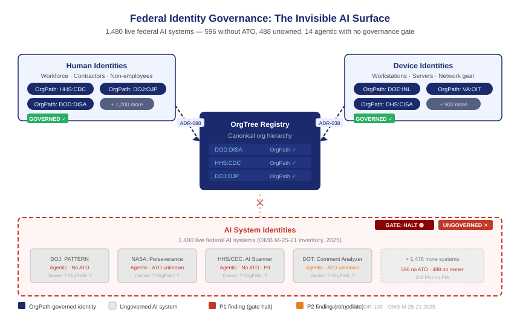

::: {.callout-note}
Active Directory governed human identities for thirty years. Every reorganization, every new employee, every service account lived somewhere in the directory — imperfectly, but somewhere. Federal agencies are now deploying AI systems at the same rate they once deployed servers, and almost none of those systems have an equivalent governance layer. No organizational placement. No owned credential. No lifecycle process. No authority record. This chapter makes the problem concrete: what does an ungoverned AI identity surface look like, what goes wrong when it is invisible, and why OrgPath is the right substrate to make it visible.
:::

{#fig-invisible-surface fig-alt="Three horizontal layers labeled Human Identities, Device Identities, and AI System Identities. The top two layers are shown with colored OrgPath labels connected by governance lines to a central OrgTree registry. The bottom AI layer is shown as grey silhouettes with no labels, no connections, and a large red question mark. White background, navy and red palette." width="100%"}

## The inventory that revealed the gap

In 2025, the Office of Management and Budget published the Federal Agency AI Use Case Inventory — 3,611 AI use cases reported by 56 agencies under the mandate of Executive Order 13960 and OMB M-25-21. Of those, **1,480 are live: deployed or in active pilot**. The numbers are striking, but the structure of the data is more so.

The inventory records what an AI system does, what agency deployed it, whether it handles personally identifiable information, and whether it has an Authorization to Operate. What it does not record — what it has no field for — is who owns the identity the system operates under. No service account. No credential tier. No organizational placement in the hierarchy the system serves. No lifecycle state that tells you whether the credential was provisioned when the system was deployed, whether it has ever been rotated, or what happens to it when the system is retired.

This is not a criticism of the inventory. The inventory is a transparency instrument, and it does that job well. The absence of IAM fields reflects a genuine gap in how federal agencies currently think about AI governance: they classify AI systems as technology deployments, not as identity subjects. A new server gets added to Active Directory. A new AI system gets a ticket in the project management tool.

The governance regime that applies to the server — OrgPath assignment, credential lifecycle, audit logging, drift detection — does not follow the AI system. It stops at the boundary of what the identity substrate was built to govern.

## What an ungoverned AI identity looks like

Consider a representative entry from the 2025 inventory: a deployed natural-language processing system at a large federal health agency, in production since 2023, handling PII, classified as high-impact under M-25-21. The inventory records its use case ID, the bureau that runs it, the vendor, and a one-line description of what problem it solves. The `have_ato` field says yes.

What the inventory does not contain — what no federal system currently contains — is the answer to five identity governance questions:

**Who owns the service account?** The system queries a database and calls an external API. Each of those calls runs under a credential. The credential was created at deployment time by a systems administrator who may have left the agency. There is no owner record in any identity management system.

**When was the credential last rotated?** Federal policy requires periodic credential rotation for service accounts. There is no mechanism that knows this system's credentials exist, let alone whether they comply with rotation policy.

**What is the blast radius if the credential is compromised?** The credential has access to PII. How much PII, across how many records, in how many systems, is a question that requires tracing the credential's permissions through every system it can reach. Without an identity record that connects the credential to the system to the bureau, that trace is a manual investigation.

**What happens when the system is retired?** The inventory's `development_stage` field will eventually show "retired." But retirement in the inventory is a reporting action, not a deprovisioning action. The credential persists until someone remembers to delete it — if anyone ever does.

**Is this system the only one of its kind?** The inventory records what agencies choose to report. A system that was deployed without following the reporting process — a shadow AI system — has no entry at all. Its credentials are invisible to the inventory, invisible to the identity management system, and invisible to anyone looking for ungoverned access in the environment.

## The numbers behind the gap

Applying the UIAO AI identity governance scanner (UIAO_196) to the full 2025 OMB inventory against the six M-25-21 identity governance obligations produces this result across all 1,480 live federal AI systems:

| Finding | Systems | Share of live |
|---|---|---|
| No Authorization to Operate (`have_ato ≠ Yes`) | **596** | 40% |
| No owner identity anchor (`contact_email` blank) | **488** | 33% |
| PII-bearing system with no Privacy Impact Assessment | **248** | 17% |
| Agentic AI without ATO — P1, gate halt | **14** | < 1% |

The gate halts immediately: 14 agentic AI systems — systems that act autonomously inside the federal identity substrate — are deployed without an ATO. Among them: a DOJ prisoner risk-assessment tool, two NASA autonomous mission planners (including the Mars Perseverance rover's autonomy layer), a HHS/CDC web scanner, and a DOT public comment analysis system. Each is running continuously, making decisions, under credentials that are ungoverned in the identity layer.

**The scanner produces 1,346 findings. The gate decision is HALT.**

## The loss the gap creates

The governance loss is the same loss that Active Directory's drifted OU estate created for human identities, applied to a faster-moving and higher-blast-radius population.

When Active Directory's organizational structure drifted from reality — when people moved between bureaus but their OU placement stayed where it was at the time of hire — the cost was misapplied policy, excess permissions, and an audit trail that connected no one to anything meaningful. Investigations took weeks because there was no reliable map from a person to the organizational unit they actually belonged to.

An AI system without an OrgPath record creates the same problem with worse consequences. An AI system can query databases at machine speed, make API calls across trust boundaries, and produce outputs that feed other automated systems. When its identity is ungoverned, a compromised credential does not sit idle between login attempts the way a compromised human account might. It runs continuously, at the rate the system was designed to run, until someone notices something is wrong.

The 90 agentic AI systems in the 2025 inventory — systems that act autonomously with minimal human intervention — are the highest-risk class. An agentic system with an unowned credential, no OrgPath, no rotation policy, and no lifecycle process is not a theoretical risk. It is an ungoverned actor inside the identity substrate, with access determined by whoever provisioned it at deployment time and never reviewed since.

## Why OrgPath is the right foundation

The solution to an ungoverned AI identity is not a new system. It is the same substrate that already governs human and device identities, applied consistently.

OrgPath's fifteen-facet model assigns every identity object — human, device, or AI system — a position in the organizational hierarchy. That position is the anchor for policy, credential lifecycle, access review, and drift detection. When the position is known, every downstream governance process can find the object. When it is unknown, every downstream process is blind to it.

For human identities, OrgPath is derived from the HR system of record (ADR-088). The hire event creates the placement; the mover event updates it; the separation event triggers deprovisioning. The governance chain is deterministic because the source of organizational truth is deterministic.

For AI systems, the source of organizational truth is the bureau that deployed the system. That information exists — it is in the OMB inventory, in the procurement record, in the project documentation. The gap is not that the information does not exist; the gap is that it is not bound to the identity record. The bureau name sits in a spreadsheet. The credential sits in a secrets manager. Nothing connects them.

OrgPath closes that gap by the same mechanism it closes the gap for devices (ADR-038): the scanner reads the authoritative source, derives the organizational placement, and stamps the identity record. For AI systems, the authoritative source is the OMB inventory. The bureau field maps to the OrgTree node. The system name becomes the leaf. The credential is now an identity subject with a known owner, a known organizational position, and a known lifecycle policy.

## What governance looks like when the surface is visible

When an AI system has an OrgPath record, five things become possible that were impossible before.

**Owner assignment.** The bureau owns the system. The bureau's designated identity governance contact — the same contact who reviews human identity access certifications — receives credential rotation notices, access review prompts, and deprovisioning alerts. The system is no longer owned by whoever created the service account two years ago.

**Credential rotation.** Rotation policy follows OrgPath position. A system in a high-sensitivity bureau applies the same rotation cadence as the privileged service accounts in that bureau. The rotation is not manual; it is scheduled, tracked, and evidenced.

**Access review.** The credential's permissions are reviewed on the same cycle as the human and service accounts in the same OrgPath tier. An AI system that acquired unnecessary access during development does not retain it indefinitely; the access review surfaces it.

**Deprovisioning on retirement.** When the system moves to `development_stage = retired` in the OMB inventory, the lifecycle event triggers the same deprovisioning workflow as a human separation. The credential is revoked. The OrgPath record is archived. The audit trail is closed.

**Drift detection.** Any deviation from the expected identity state — a credential that has not been rotated on schedule, an OrgPath assignment that does not match the current bureau structure, a permission that exceeds the authorized tier — produces a drift finding. The finding is routed to the bureau governance contact for disposition. The system is no longer invisible.

This is not a new architecture. It is the existing OrgPath architecture applied to a population that has been excluded from it. The chapters that follow show how each piece works: how the OMB inventory becomes the discovery feed, how OrgPath assignment is derived and stamped, how the ATO record links to the credential lifecycle, and how agentic AI systems are governed at the highest priority tier the substrate supports.

The invisible identity surface becomes visible by the same mechanism that made the device surface visible before it: an authoritative source, a consistent schema, and a drift engine that does not allow governance to depend on anyone remembering to check.

::: {.callout-tip}
## Continue reading

[Chapter 2 — What M-25-21 Actually Requires →](Book_21_CPT_02.qmd)
:::
