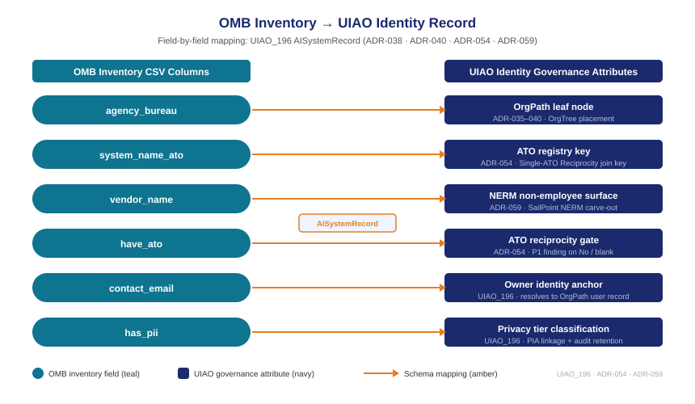

::: {.callout-note}
A device gets added to Active Directory. A service account gets a lifecycle policy. A contractor gets a non-employee record in the identity management system. An AI system gets a project ticket. This chapter makes the case that the project ticket is the wrong frame — that an AI system meets every definition of an identity subject, and that the OMB inventory already contains the raw material to treat it as one. The AISystemRecord schema (UIAO_196) is the mechanism that converts inventory data into a governed identity record, field by field, using the same governance chain that already applies to devices and service accounts.
:::

{#fig-schema-mapping fig-alt="Schema mapping diagram. Left side shows OMB inventory CSV column name chips in teal: id, agency_bureau, system_name_ato, vendor_name, have_ato, contact_email, has_pii. Right side shows UIAO identity governance attribute boxes in navy: OrgPath leaf, ATO registry key, NERM surface, ATO reciprocity, Owner anchor, Privacy tier. Arrows connect each left chip to its corresponding right box. Title reads OMB Inventory to UIAO Identity Record. White background, navy and teal palette." width="100%"}

## What makes something an identity subject

The question of what qualifies as an identity subject sounds abstract until you examine the four properties every identity management system already uses to make the determination.

**A credential.** An identity subject operates under a credential — a service account, a certificate, an API key, an OAuth client identity — that grants it access to resources. The credential is the governance handle. Without it, there is nothing to rotate, nothing to audit, nothing to revoke when the subject is retired or compromised.

**The capacity to take actions.** An identity subject acts in the environment. It queries databases, calls APIs, writes records, triggers workflows. The actions it can take are determined by the permissions attached to its credential. The governance obligation is to bound those permissions to what the subject legitimately needs and to detect when the actual permissions exceed that bound.

**An owner.** An identity subject is owned by someone with authority to make governance decisions about it — to approve its access, to certify that its permissions remain appropriate, to direct its deprovisioning when it is no longer needed. Ownership is not a formality. It is the mechanism by which accountability is preserved when the subject acts.

**A lifecycle.** An identity subject enters the environment at a known point, operates in a known state, and eventually leaves. The lifecycle creates the governance events: provisioning on entry, access review during operation, deprovisioning on exit. Without a lifecycle, governance can only react; with one, it can be scheduled.

A human employee has all four properties. So does a device. So does a service account. And an AI system — any AI system that calls an API, queries a database, or produces outputs that feed other systems — has all four as well. It operates under a credential (often a service account or API key provisioned at deployment). It takes actions at the rate of its inference cycle, not at the rate of a human working day. It has an agency and a bureau responsible for it. And it was deployed at some point and will eventually be retired.

The difference between an AI system and a service account, from an identity governance perspective, is not architectural. It is the absence of a governance record. The service account has an entry in the identity management system because the provisioning workflow created one. The AI system does not have an entry because no provisioning workflow was built to create one. The AISystemRecord closes that gap.

## The field-by-field mapping

The OMB M-25-21 inventory is not primarily an identity governance instrument. It was designed as a transparency and accountability tool — a way for the public and oversight bodies to understand what AI systems federal agencies are deploying. But the schema it defines contains exactly the fields that identity governance needs, mapped almost one-to-one to the UIAO identity record model.

| OMB inventory field | UIAO identity attribute | ADR / mechanism |
|---|---|---|
| `agency_bureau` | OrgPath leaf node | ADR-035 through ADR-040 |
| `system_name_ato` | ATO registry key | ADR-054 Single-ATO Reciprocity |
| `vendor_name` | NERM non-employee surface | ADR-059 SailPoint NERM carve-out |
| `have_ato` | ATO reciprocity gate | ADR-054 |
| `contact_email` | Owner identity anchor | UIAO_196 AISystemRecord |
| `has_pii` | Privacy tier classification | UIAO_196 + PIA linkage |
| `development_stage` | Lifecycle state | ADR-040 drift engine |
| `agent_class` | Actuation tier | UIAO_196 agent\_class field |

**`agency_bureau` → OrgPath leaf.** The bureau field is the organizational placement of the AI system. It tells you which node in the OrgTree owns this system, which means it tells you which governance policies apply, which identity governance contact is responsible, and which access review cycle the system participates in. This is exactly what OrgPath was designed to record. The scanner reads `agency_bureau`, resolves it against the OrgTree, and stamps the AISystemRecord with the leaf node. An AI system at HHS:CDC gets the same OrgPath treatment as a device or service account at HHS:CDC.

**`system_name_ato` → ATO registry key.** The Authorization to Operate is the federal government's formal mechanism for certifying that an information system meets the security requirements for its operational environment. ADR-054 established Single-ATO Reciprocity: a system that holds an ATO in one UIAO registry context does not need to obtain a second ATO for the same security posture. `system_name_ato` is the join key that links the AI system to the ATO registry. When that field is populated and resolves to a valid ATO record, the reciprocity gate passes. When it is blank or does not resolve, the reciprocity gate halts.

**`vendor_name` → NERM non-employee surface.** Commercial AI systems are built and often operated by vendors. The vendor relationship is a non-employee identity relationship — the vendor's engineers, support staff, and operational processes have access to the environment the system operates in. ADR-059 established the SailPoint NERM carve-out for exactly this surface. When `vendor_name` is populated, the AISystemRecord flags the vendor identity as a NERM surface requiring governance. A vendor-operated AI system that has no non-employee identity record is a gap in the same governance chain as a contractor with no NERM entry.

**`have_ato` → ATO reciprocity gate.** This is the binary gate. `have_ato = Yes` does not automatically pass the gate — the reciprocity check requires that `system_name_ato` resolves to a valid entry in the ATO registry. But `have_ato ≠ Yes` immediately produces a P1 finding for non-agentic systems and a gate halt for agentic systems. The OMB inventory records 596 live AI systems without an ATO. Each of those is a credential operating in the federal environment without a formal security authorization.

**`contact_email` → owner identity anchor.** The contact email is the closest thing the OMB inventory has to an owner field. The AISystemRecord uses it as the owner identity anchor — the link between the AI system and the human who is accountable for its governance. The contact email resolves to a user record in the identity management system, which means the owner has an OrgPath position, a bureau, and a governance role. When the contact email is blank — 488 live systems in the 2025 inventory — there is no owner, and every downstream governance process has no one to route to.

**`has_pii` → privacy tier.** Personal information handled by an AI system requires additional governance: a Privacy Impact Assessment, enhanced credential controls, and audit logging at a higher retention tier. `has_pii = Yes` stamps the AISystemRecord as privacy-sensitive and links it to the PIA URL if one exists. The 248 live systems in the 2025 inventory that report PII handling but have no PIA on record are not just a compliance gap; they are AI systems making decisions about individuals without the oversight process that federal privacy law requires.

## The AISystemRecord dataclass

The AISystemRecord (UIAO_196) is a structured Python dataclass that the UIAO AI governance scanner produces by reading the OMB inventory CSV and applying the field mapping described above. It is not a new schema invented for AI governance — it is the application of the existing UIAO identity record model to the population of AI systems.

The record is built in two passes. The first pass is a direct transcription: each OMB inventory field is read and assigned to the corresponding AISystemRecord attribute. The second pass is derivation: the scanner applies the mapping logic — resolving `agency_bureau` against the OrgTree to produce an `omg_id` and an `orgpath` value, querying the ATO registry with `system_name_ato` to determine reciprocity status, and evaluating the combination of `have_ato`, `agent_class`, and `contact_email` to produce the finding set.

The result is a record that looks like any other identity record in the UIAO system: an `omg_id` (the canonical UIAO identifier), an `orgpath` (the organizational position), a `lifecycle_state` (derived from `development_stage`), an `actuation_tier` (derived from `agent_class`), a set of governance findings, and a gate decision. The record is then fed to the drift engine (ADR-040), which compares the current state of the record against the desired state and produces drift findings when they diverge.

The key design decision is that the AISystemRecord is a first-class identity record, not a separate AI-specific data structure. It enters the same governance pipeline as a device record or a service account record. The drift engine does not distinguish between them. The access review workflow does not distinguish between them. The audit trail does not distinguish between them. An AI system that has an AISystemRecord is governed by the same mechanisms that govern everything else in the UIAO estate.

## Lifecycle states and the governance events they drive

The OMB inventory's `development_stage` field records where an AI system is in its operational life. The AISystemRecord maps this field to a formal lifecycle state, and each state transition drives a defined governance event.

| `development_stage` value | AISystemRecord lifecycle state | Governance event |
|---|---|---|
| Initiated / Acquisition | `pre-deployment` | OrgPath assignment, owner notification, ATO gate queued |
| Development / Testing | `pre-deployment` | Credential pre-provisioning review |
| Pilot | `pilot` | ATO reciprocity check, NERM surface enumeration, PIA gate |
| Deployed | `deployed` | Full drift monitoring, rotation schedule active, access review enrolled |
| Retired | `retired` | Credential revocation, OrgPath archive, audit trail closure |
| Paused / Other | `suspended` | Credential suspension, drift monitoring held |

The transition from `pre-deployment` to `pilot` is where the most governance work happens. At this stage the system is real enough to have credentials but may not yet have completed the ATO process. The gate at pilot is the last point before the system operates in a production environment. If the ATO gate fails at pilot, the system does not move to deployed — it is held in the `pilot` state with an open P1 finding until the ATO is obtained.

The transition from `deployed` to `retired` is where the most governance risk concentrates in the current ungoverned estate. In the absence of a lifecycle record, retirement is a reporting action, not a deprovisioning action. The entry in the OMB inventory is updated to show the system is retired, but the credential that the system operated under persists in the secrets manager. It is not rotated, not revoked, not archived. It remains a valid credential, owned by no one, connected to a system that is no longer monitored. The AISystemRecord makes retirement a governance event, not a reporting event: the lifecycle transition triggers a deprovisioning workflow that revokes the credential, closes the OrgPath record, and produces an audit entry confirming that the deprovisioning completed.

## Why this matters: the same governance chain

The argument of this chapter is not that AI systems are special cases that require new governance infrastructure. It is the opposite. AI systems that are treated as technology deployments rather than identity subjects are excluded from governance infrastructure that already exists and already works. The cost of that exclusion is not theoretical.

A credential that belongs to a retired AI system and has never been revoked is indistinguishable, from the identity management system's perspective, from a credential that belongs to a human who separated without deprovisioning. Both represent an orphaned access path. Both are found by the same drift detection mechanism when that mechanism knows to look for them. The AISystemRecord makes the drift engine aware that AI system credentials exist and require monitoring, using exactly the same mechanism — the desired state comparison — that the drift engine already applies to every other identity class.

The same logic applies to access reviews. An AI system enrolled in the AISystemRecord participates in the same access review cycle as the service accounts in its OrgPath tier. The bureau identity governance contact who reviews human and device access also reviews AI system access. The review prompt includes the same information: what credential, what permissions, when last rotated, what the authorizing documentation says the permissions should be. The reviewer makes the same determination: certify or remediate.

The evidence bundle that the drift engine produces for an AI system is identical in structure to the evidence bundle it produces for a device. It contains the OrgPath position, the lifecycle state, the ATO status, the credential metadata, the access review history, and the finding record. That evidence bundle is the audit artifact that demonstrates compliance with M-25-21's identity governance obligations. It is produced automatically, on schedule, without requiring anyone to remember to check.

This is the governance architecture that OrgPath was built to provide. It was built for human identities first, then extended to devices (ADR-038). The extension to AI systems (UIAO_196, ADR-112) follows the same pattern: identify the authoritative source of organizational truth, map it to the OrgTree, stamp the identity record, and let the drift engine do the rest. The invisible surface becomes visible not by building a new system, but by enrolling a new population in the system that already exists.

::: {.callout-tip}
## Continue reading

[Chapter 4 — How the Scanner Works →](Book_21_CPT_04.qmd)
:::
