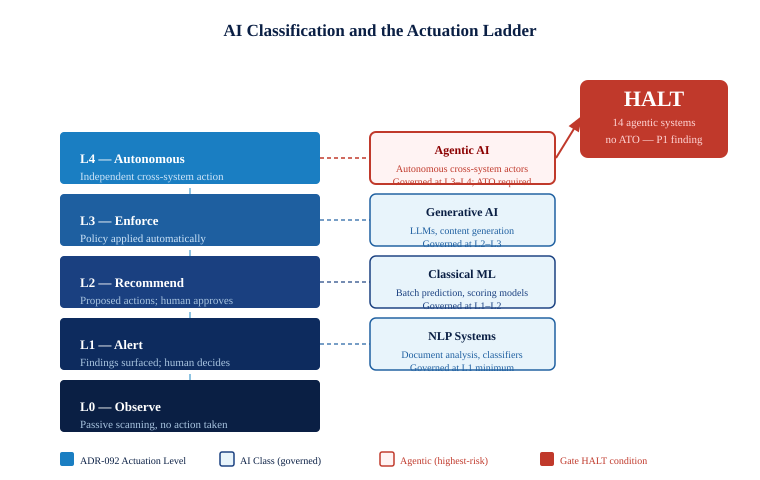

::: {.callout-note}
Not all AI systems carry the same identity governance risk. A classical machine-learning model that runs batch predictions overnight sits at the far end of the risk spectrum from an agentic system that submits forms, queries HR databases, and triggers downstream workflows in real time. Classification matters because it determines governance tier. This chapter explains the agent class taxonomy, maps every class to the L0–L4 actuation ladder from ADR-092, and shows why an agentic AI system without an Authorization to Operate is a P1 finding — not a paperwork gap, but an ungoverned autonomous actor operating inside the federal identity substrate.
:::

{#fig-actuation-ladder fig-alt="A vertical staircase on the left shows five navy steps labeled L0 Observe through L4 Autonomous. On the right, four AI classification badges connect to their corresponding rungs: NLP at L1, Classical ML at L1-L2, Generative AI at L2-L3, and Agentic AI at L3-L4 in red. A red HALT badge in the upper right calls out 14 agentic systems with no ATO. White background, navy, teal, and red palette." width="100%"}

## The classification spectrum

The 2025 OMB inventory records 3,611 AI use cases under five broad capability categories, but those categories were designed for transparency reporting, not identity governance. For governance purposes, the relevant question is not what an AI system produces — it is what it does inside the identity substrate while producing it. That question produces a different taxonomy.

The UIAO AI identity governance schema defines six agent classes through the `AgentClass` enumeration. Listed from lowest to highest governance priority:

| Agent class | Enum value | Typical behavior | Identity footprint |
|---|---|---|---|
| NLP | `nlp` | Document classification, entity extraction, sentiment analysis | Reads data; rarely holds active credentials |
| Computer Vision | `computer-vision` | Image recognition, video analysis | Reads media; minimal API surface |
| Classical ML | `classical-ml` | Batch scoring, predictive models, recommendation engines | Scheduled execution; service account active during run window |
| Generative AI | `generative-ai` | Large language model inference, content synthesis | API key to model provider; may log to audit systems |
| Reinforcement Learning | `reinforcement-learning` | Policy optimization, adaptive control | Active feedback loop; credential used continuously |
| Agentic AI | `agentic-ai` | Autonomous multi-step workflows, form submission, cross-system orchestration | Multiple credentials; operates continuously; highest blast radius |

The classification is not a description of sophistication. A classical ML model can be technically complex. The classification is a description of what the system does to the identity substrate: how many credentials it holds, how continuously it uses them, and how many downstream systems it can reach in a single execution cycle.

An NLP classifier that reads a document and returns a confidence score touches one data source, holds one read credential, and produces one output. If that credential is compromised, the blast radius is bounded by the document corpus. An agentic system that queries an HR database, calls a workflow API, submits a ServiceNow ticket, and logs the result to a compliance system touches four systems, holds four credentials or a federated identity capable of reaching all four, and runs continuously without human intervention between steps. If any one of those credentials is compromised — or if the system itself is tampered with — the blast radius is every system the agent was authorized to reach, at the rate the agent was designed to operate.

That is the difference classification is meant to capture. The question is not how smart the system is. The question is how much of the identity substrate it can move at once.

## The L0–L4 actuation ladder applied to AI governance

ADR-092 defines UIAO's Active Governance posture through a five-level actuation ladder. The ladder describes how a governed control plane responds when it detects a condition worth acting on. Understanding where AI systems sit on this ladder — both as governed objects and as actors — is essential to understanding why agentic AI receives P1 priority.

As governed objects, all AI systems must be observable at L0 minimum: the identity substrate must be able to see them, enumerate their credentials, and detect when their state deviates from policy. Observability alone is the floor, not the ceiling. ADR-109 §4 sets the minimum governance mode for any AI system at L1 — findings must be surfaced to a human decision-maker. A system that is deployed but not discoverable by the governance layer fails below L0 and represents an unconditional gap.

As actors in the environment, AI systems are themselves positioned on the ladder by their behavior:

**L0 — Observe.** A system that reads data and produces a report or score without writing back to any system of record. It consumes the identity substrate; it does not modify it. An NLP document classifier or a computer vision anomaly detector typically operates here. Governance risk is bounded by the read access the system holds.

**L1 — Alert.** A system that reads data and produces findings that a human reviews before any action is taken. A classical ML model that flags high-risk loan applications for human review operates here. The system's output affects decisions but does not execute them. Governance risk extends to the quality and bias of the findings.

**L2 — Recommend.** A system that drafts actions — a proposed policy change, a pre-filled form, a recommended access certification decision — that a human approves before submission. Generative AI systems used as drafting assistants typically operate here. Governance risk includes the downstream effects of systematically biased recommendations that approvers rarely override.

**L3 — Enforce.** A system that applies policy automatically within a bounded scope, subject to human override. An adaptive access control system that downgrades a session's privilege tier when anomalous behavior is detected operates here. Governance risk includes false positives that deny legitimate access and the blast radius of an incorrectly scoped enforcement rule.

**L4 — Autonomous.** A system that executes multi-step workflows across system boundaries without a human approval step in the loop. Agentic AI is the defining population at this level. The system queries, decides, submits, and logs — and then repeats the cycle. Governance risk is the full scope of what the system is authorized to reach, executing at machine speed, for as long as the credential is valid.

The L4 designation is not a criticism of agentic AI. Autonomous action is the point. The problem arises when an L4 actor operates without the governance infrastructure that L4 action requires: an ATO that scopes the authorized action envelope, a credential lifecycle that bounds the operating window, an OrgPath record that anchors the system to an accountable owner, and a drift engine that detects when the system's behavior deviates from its authorized envelope.

## What makes agentic AI different

Three properties distinguish agentic AI from every other class in ways that are directly relevant to identity governance.

**Continuous operation.** A batch ML scoring model runs on a schedule — nightly, weekly, on trigger. Between runs, its credentials are dormant. A compromised credential is dangerous only when the system executes. An agentic system, by design, operates continuously or near-continuously. The credential is always active. The window of exposure is not measured in minutes per execution cycle; it is measured in the uptime of the system.

**Cross-system action.** An agentic system's defining capability is the ability to take actions across system boundaries — to read from one system, write to another, trigger a workflow in a third, and log the result in a fourth. Each boundary crossing requires a credential or a delegated permission. The total identity footprint of an agentic system is not one service account; it is the graph of every system the agent is authorized to reach, connected by the identity delegation chain the agent traverses to get there. That graph is rarely documented. It is almost never reviewed as a unit.

**Machine-speed credential use.** A human who logs in with a compromised credential generates a pattern of access that anomaly detection can recognize: login at an unusual hour, access to data the account rarely touches, a burst of activity that does not match the user's behavioral baseline. An agentic system that operates under a compromised credential generates access that looks exactly like the system's normal operation, at exactly the system's normal rate, because the attacker is using the system's own execution path. Behavioral anomaly detection designed for human accounts does not have a baseline to compare against.

These three properties compound. A continuously operating system with a wide cross-system footprint whose compromise is indistinguishable from normal operation is the worst-case credential risk profile in the federal identity estate. That is not a hypothetical profile. It is the governance profile of every agentic AI system that operates without an ATO and without an OrgPath record.

## The 14 P1 systems from the 2025 scan

The 2025 OMB inventory contains 90 agentic AI systems across 56 reporting agencies. Of those 90, the UIAO AI identity governance scanner identified 14 deployed or in active pilot operation without an Authorization to Operate. Each is a P1 finding under ADR-109 §4. Each halts the gate.

The named examples from the inventory are representative of the range:

**DOJ PATTERN** (Prisoner Assessment Tool Targeting Estimated Risk and Needs) is a risk-scoring system used to inform federal prison placement, programming assignments, and early release recommendations. The system processes PII for the incarcerated population in BOP custody. As an agentic system, it does not merely score — it feeds downstream decisions that change the conditions of confinement for specific individuals. The credential that writes its outputs has write access to records that affect liberty interests. It operated at the time of the scan without a current ATO.

**NASA Perseverance autonomy layer** is the onboard executive that enables the Mars rover to plan and execute surface operations without real-time ground control, including hazard avoidance, target selection, and instrument deployment. The governance question is not whether an autonomous system should operate on Mars — it manifestly should. The governance question is whether the identity record for the ground systems that command, receive telemetry from, and are authorized to update the autonomy layer's operating parameters has been reviewed, scoped, and lifecycle-managed to the same standard as any other federal system with privileged access to mission-critical infrastructure.

**HHS/CDC web scanner** is an agentic system that continuously crawls public-facing federal health websites to identify outdated, inaccurate, or inaccessible content. It operates under service credentials that have write access to content management systems used to publish public health information. An ungoverned write credential to a public health content system is an ungoverned write credential to public health information.

**DOT public comment analyzer** ingests public comments submitted to DOT rulemaking dockets, classifies them by topic and sentiment, and routes summaries to the relevant policy offices. The system handles PII submitted by members of the public who believed they were participating in a regulatory process governed by APA requirements. The credential chain from comment ingestion to policy office routing was not scoped or documented at the time of the scan.

These four examples span the operational range of the 14 P1 systems: a system that affects individual liberty, a system that controls mission-critical infrastructure, a system with write access to public information, and a system that handles public PII under regulatory process obligations. The common thread is not the domain. The common thread is that each system operates autonomously, holds credentials that reach consequential data, and has no identity governance record that anchors it to an accountable owner.

## DRIFT-COMPLIANCE::ai-agentic-ungoverned — the P1 finding

The scanner finding code `DRIFT-COMPLIANCE::ai-agentic-ungoverned` is raised when a system meets all three of the following conditions: its `agent_class` is `agentic-ai`; its `have_ato` field is not `Yes`; and its `development_stage` is `Deployed` or `Pilot`. The finding is classified P1 under ADR-109 §4.

P1 is the highest severity in the UIAO finding taxonomy. It means the finding is not queued for the next review cycle; it halts the gate immediately. A gate halt does not mean the system must be shut down. It means that no new identity governance changes — no credential provisioning, no access expansion, no OrgPath assignments in the affected bureau — proceed through the automated pipeline until the finding is resolved or formally accepted with a written risk decision by an accountable authority.

The remediation path for an `ai-agentic-ungoverned` finding requires three actions in sequence. First, the system's identity record must be created in UIAO with a complete OrgPath assignment: bureau, division, branch, and a named individual as the identity governance contact. Second, an ATO must be initiated or an existing ATO must be identified and linked to the system's identity record. Third, the credential lifecycle for all service accounts and API keys the system operates under must be documented, assigned rotation schedules, and enrolled in the UIAO credential lifecycle tracker. Until all three are complete, the finding remains open and the gate remains halted.

The gate halt is the point. A finding that can be deferred indefinitely is not a finding; it is a note. P1 findings that do not halt automation can accumulate without consequence until a compromise makes the gap visible. The audit community learned this from the human identity surface: when findings about orphaned accounts, excessive permissions, and unreviewed service accounts were advisory, they stayed open for years. When they became blocking, they got resolved.

## The governance mode concept

Every AI system governed under ADR-109 must declare a governance mode as part of its identity record. The governance mode is not a description of what the system does; it is a declaration of where in the actuation ladder the system's autonomous authority ends and human oversight begins.

A system with governance mode `L1` operates autonomously below the alert threshold — it scans, it collects, it classifies — but every finding it surfaces goes to a human queue before any action is taken. The system cannot act on its own findings.

A system with governance mode `L3` applies policy automatically within its authorized scope — it can enforce a credential rotation, revoke an expired certificate, or downgrade a session — but it cannot expand its own authorized scope, and any action outside its policy envelope requires human approval before execution.

A system without a declared governance mode has no defined boundary between autonomous authority and human oversight. That is not a configuration choice; it is an ungoverned state. An agentic system without a governance mode declaration is, by definition, operating at an undefined level on the actuation ladder — which in practice means it is operating at whatever level its current workload requires, with no mechanism for the identity substrate to know when it has exceeded its authorized scope.

ADR-109 §4 sets L1 as the minimum declared governance mode for any AI system. For agentic systems, the declared mode must be L3 or higher, with explicit documentation of the policy envelope — the specific actions the system is authorized to take autonomously — and the escalation path for actions outside that envelope. That documentation is not a compliance artifact. It is the specification that makes the ATO meaningful: it defines what "authorized" means for a system that acts at machine speed without a human in the loop.

The governance mode, the ATO, the OrgPath record, and the credential lifecycle are not four separate compliance requirements. They are four facets of a single answer to a single question: if this system's credential is misused — by the system itself behaving unexpectedly, by an external actor who has obtained the credential, or by a configuration error that expands the system's authorized scope — who knows, how fast do they know, and what can they do about it?

For the 14 P1 systems in the 2025 scan, the answer to all three parts of that question is: no one, never, and nothing. That is what a P1 finding means. The next chapter shows how the OrgPath record is constructed for an AI system and what the ATO linkage looks like when it is done correctly.

::: {.callout-tip}
## Continue reading

[Chapter 5 — Building the OrgPath Record for an AI System →](Book_21_CPT_05.qmd)
:::
