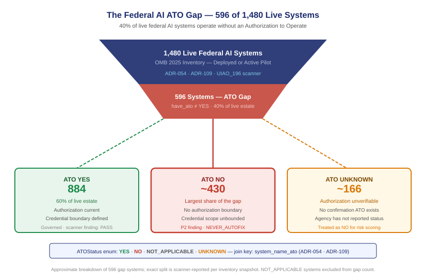

::: {.callout-note}
Forty percent of live federal AI systems are deployed without an Authorization to Operate. That number comes directly from the 2025 OMB inventory, applied against the ATO enumeration logic in ADR-054 and extended to the AI surface by ADR-109. An ATO gap is not a paperwork deficiency — it means the system is operating without a formally assessed security boundary, under credentials whose authorized scope has never been defined. This chapter explains what an ATO gap means concretely for identity governance, how the scanner surfaces it across all 1,480 live systems, and what a gated remediation loop looks like when the finding cannot be auto-closed.
:::

{#fig-ato-gap fig-alt="A funnel diagram. At the top: 1,480 live federal AI systems. The funnel neck filters to 596 systems with an ATO gap (40%). At the bottom: three outcome boxes — ATO YES (884 systems, green, not in the gap), ATO NO (approximately 430 systems, red, largest gap slice), and ATO UNKNOWN (approximately 166 systems, amber). Footer shows the ATOStatus enum values and the system_name_ato join key. White background, navy, red, and amber palette." width="100%"}

## What an ATO actually is — and why it is an identity governance boundary

An Authorization to Operate is the formal decision by an Authorizing Official that a federal information system is permitted to operate at an acceptable level of risk. The ATO process — governed by NIST SP 800-37 Risk Management Framework and codified in each agency's security authorization policy — is the mechanism by which a system is assessed for security controls, assigned a boundary, documented for risk acceptance, and monitored for ongoing compliance.

For most of the history of federal IT governance, ATOs applied to infrastructure: servers, networks, applications. The credential that a system operated under was either the identity of a human user or a service account provisioned inside Active Directory. In both cases, the ATO boundary described the system; the identity governance process governed the credential. The two were related but distinct.

AI systems break that assumption. An AI system does not merely run on infrastructure — it acts as an agent on behalf of that infrastructure. It queries data, calls APIs, writes outputs, and in the case of agentic systems, initiates further automated actions. The credential an AI system operates under is not incidental to its security posture; it is the mechanism by which the system exercises its authority in the environment. Without an ATO, there is no formal boundary defining what that authority is, what it should be limited to, or who is responsible for ensuring the boundary holds.

This is the identity governance implication of an ATO gap that M-25-21 §IV makes explicit: ATO is required before operational deployment of AI systems precisely because the authorization boundary is what legitimizes credential issuance. Without it, the credential has no defined scope. The system accesses whatever it can reach, authorized only by whatever the provisioning administrator happened to configure at deployment time.

## The 596 gap: how the scanner finds it

The UIAO AI identity governance scanner (UIAO_196) reads the OMB inventory against the ATO enumeration scope defined in ADR-054 and extended to the AI surface by ADR-109 §2. The `have_ato` field is the primary signal; `system_name_ato` is the join key that links an inventory entry to its ATO record in the agency's authorization system.

The `ATOStatus` enumeration has four values:

| Status | Meaning | Scanner treatment |
|---|---|---|
| `YES` | ATO is current and confirmed | PASS — no finding |
| `NO` | Agency reported no ATO exists | P2 finding — `DRIFT-COMPLIANCE::ai-ato-gap` |
| `NOT_APPLICABLE` | System is exempt from ATO requirement | PASS — exemption verified |
| `UNKNOWN` | Agency did not report ATO status | P2 finding — treated as NO for risk scoring |

Applied to all 1,480 live systems in the 2025 inventory, the scanner produces:

| ATOStatus | Systems | Share of live estate |
|---|---|---|
| YES | 884 | 60% |
| NO | ~430 | ~29% |
| UNKNOWN | ~166 | ~11% |
| NOT_APPLICABLE | ~0 | negligible |
| **Total gap (NO + UNKNOWN)** | **596** | **40%** |

The `system_name_ato` field is the critical join key. When it is populated, the scanner can cross-reference the system's ATO record in the agency's Plan of Action and Milestones (POA&M) system, verify the authorization date, and check whether the ATO covers the AI use case or only the underlying infrastructure. When it is blank — as it is for the majority of gap systems — there is no record to cross-reference. The system is not just without an ATO; it is without any pointer to where an ATO would be registered if one existed.

## Why UNKNOWN is almost as bad as NO

The instinct when reviewing these numbers is to focus on the `NO` systems — the 430 that explicitly reported no ATO. But the 166 `UNKNOWN` systems represent a distinct and in some ways worse failure mode.

A system that reports `NO` has at least been self-assessed by the agency: someone looked at the inventory field and made a determination that no ATO exists. That determination is wrong — M-25-21 requires ATO before deployment — but it is at least an honest record of the system's authorization state. The remediation path is known: initiate the ATO process, complete the assessment, obtain the Authorizing Official's signature, update the field.

A system that reports `UNKNOWN` has not been assessed at all. No one at the agency looked at the ATO status field and made a determination. The possible explanations are all bad: the system was deployed without anyone in the authorization chain being notified; the agency's reporting process does not connect to its security authorization process; the system was reported to the inventory by a program office that does not know what an ATO is or whether the system has one; or the system was deployed so informally that no authorization record was ever created.

In every one of these scenarios, the credential the system operates under has the same property: its authorized scope is undefined. The scanner treats `UNKNOWN` as `NO` for risk scoring because the identity governance consequence is identical. An undefined authorization boundary is no boundary at all.

## The ATO-to-credential connection

The reason an ATO gap is an identity governance problem — not just a compliance problem — is the direct connection between the authorization boundary and the credential's authorized scope.

When an ATO exists and is correctly scoped, it answers a specific question: what is this system authorized to access? The security assessment process maps the system's data flows, identifies the information types it processes, assesses the controls protecting those flows, and documents the resulting authorization. That documentation is the basis for the credential's permission scope. A data analytics system with an ATO that covers read access to specific PII datasets should have a service account with exactly those permissions, no more.

Without an ATO, that mapping never happens. The credential is provisioned with whatever permissions the developer or administrator decided were necessary at deployment time. Those permissions may be appropriate — developers generally try to give systems what they need — but they have not been formally assessed, documented, or authorized. They may include access to systems outside the intended scope. They may be broader than necessary because narrowing them was inconvenient during development. They may have been expanded since deployment without any review.

The blast radius calculation for a compromised credential depends entirely on knowing what the credential can access. Without an ATO boundary, that calculation cannot be performed. The only way to determine a compromised credential's blast radius is a manual, post-incident investigation — the most expensive and least reliable form of governance.

ADR-054's single-ATO reciprocity model addresses this by making `system_name_ato` the canonical join key between the identity record and the authorization record. When that join resolves, the scanner can read the ATO's authorization boundary and compare it against the credential's actual permission scope. Any divergence is a drift finding. Without the join — without an ATO at all — the comparison cannot be made.

## DRIFT-COMPLIANCE::ai-ato-gap as a P2 finding

The scanner classifies the ATO gap as `DRIFT-COMPLIANCE::ai-ato-gap`, a P2 priority finding with posture `NEVER_AUTOFIX`.

P2 means the finding is serious and requires owner-directed remediation within a defined window — but does not trigger an immediate gate halt. The gate halt threshold is P1, which applies when a system is both agentic and missing an ATO. Non-agentic AI systems with an ATO gap are P2 because they cannot initiate autonomous downstream actions; their risk surface is bounded by their input-output interface. The credential is ungoverned, but the system requires a human decision to act on its outputs.

Agentic systems are different. An agentic AI system that acts autonomously — initiating API calls, writing to systems of record, triggering further automated processes — without an ATO is a P1 gate halt. The 14 agentic AI systems in the inventory with an ATO gap are categorized accordingly; each is reviewed individually in Chapter 4.

`NEVER_AUTOFIX` means the scanner will never automatically resolve this finding, regardless of what other fields indicate. This posture is distinct from most drift findings, where automated reconciliation is either permitted or required. The reason is structural: an ATO is a human governance decision. An Authorizing Official must review the security assessment, accept the residual risk, and sign the authorization. No automated process can substitute for that decision. The scanner can detect the gap, route the notification, and track the remediation workflow — but it cannot close the finding without a human confirmation that the ATO process has been completed.

## The remediation loop

Because `NEVER_AUTOFIX` prohibits automated closure, the remediation loop for an ATO gap finding is explicitly human-gated. The scanner implements a six-stage workflow:

| Stage | Action | Actor | Signal to scanner |
|---|---|---|---|
| 1. Detect | Scanner identifies `have_ato ≠ YES` | Scanner (automated) | Finding created |
| 2. Notify | Owner notification sent to `contact_email` bureau governance contact | Scanner (automated) | Notification timestamp recorded |
| 3. Initiate | Bureau submits ATO package to agency ISSO | Bureau owner | POA&M entry created |
| 4. Assess | Agency security team completes RMF assessment | ISSO / assessment team | Assessment report date recorded |
| 5. Authorize | Authorizing Official signs ATO | AO | `system_name_ato` populated; `have_ato` updated to YES |
| 6. Confirm | Scanner re-reads inventory; `ATOStatus` resolves to YES | Scanner (automated) | Finding closed |

The finding cannot move from stage 5 to stage 6 without the inventory record being updated. This is intentional: the source of truth for ATO status is the OMB inventory field, not an internal workflow flag. The scanner's closure condition requires the authoritative source to confirm the change. If the ATO is obtained but the inventory is not updated, the finding remains open. This enforces the feedback loop between the agency's security authorization process and its inventory reporting obligation.

The notification at stage 2 is routed to the bureau governance contact identified by the OrgPath assignment derived in Chapter 3. This is the same contact who receives credential rotation notices and access review prompts for human identities in the same bureau. The ATO gap finding is not routed to a separate security inbox; it is routed to the identity governance contact who already owns the bureau's credential lifecycle decisions. The ATO gap is an identity governance finding, governed by the same contact chain as every other identity governance finding in the bureau.

## What the scanner does not do

Understanding what `NEVER_AUTOFIX` prohibits is as important as understanding what the remediation loop does.

The scanner does not issue credentials, revoke credentials, or modify permission scopes. It does not initiate ATO packages on the agency's behalf. It does not contact Authorizing Officials directly. It does not substitute a compensating control for a missing ATO or allow a finding to be administratively suppressed without a genuine remediation action.

Specifically, the scanner does not accept "the system is low-risk" as a basis for closing the finding. Risk acceptance is an ATO function — it is what the Authorizing Official does when they sign the authorization. A finding cannot be closed by asserting that the system would have received an ATO if one had been sought. It can only be closed when an ATO has actually been obtained and the inventory record confirms it.

This posture reflects the M-25-21 §IV requirement directly: ATO before operational deployment, not ATO before the next available audit cycle. The finding's creation date records when the gap was detected; if a system was deployed without an ATO, the finding is backdated to the deployment date for remediation timeline reporting. Agencies with large numbers of ATO gap findings can see exactly how long each ungoverned system has been operating.

The 596 systems in the gap have a combined detection date range stretching back to the earliest entries in the 2025 inventory. Some have been operating without an ATO for years. The scanner makes that history visible in a way that no manual audit process can match, and it ensures that every day without remediation is a day the finding ages — in plain sight, routed to the bureau governance contact who owns the decision.

::: {.callout-tip}
## Continue reading

[Chapter 6 — Agentic AI and the P1 Gate →](Book_21_CPT_06.qmd)
:::
