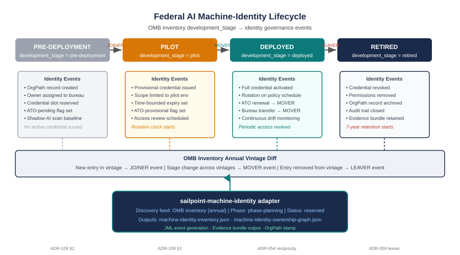

::: {.callout-note}
Federal identity governance has a well-understood model for human identities: someone joins the agency, moves between roles, and eventually leaves. Every step triggers a defined set of credential operations. Federal AI systems need exactly the same model — but driven by entirely different sources. The hire event is an ATO grant. The job change is a re-authorization or bureau transfer. The resignation is a retirement entry in the OMB inventory. This chapter shows how that model works, why the annual OMB inventory vintage cycle is the engine that drives it, and how the SailPoint machine-identity adapter makes the whole thing automated rather than manual.
:::

{#fig-machine-identity-lifecycle fig-alt="Horizontal swimlane diagram showing four lifecycle stages left to right: PRE-DEPLOYMENT (grey), PILOT (amber), DEPLOYED (teal), RETIRED (navy). Below each stage are the identity governance events triggered. An OMB inventory vintage diff row spans all four stages showing how new entries become joiners, stage changes become movers, and removed entries become leavers. A SailPoint machine-identity adapter box at the bottom feeds up into the vintage diff row with arrows. White background, navy and teal palette." width="100%"}

## The joiner/mover/leaver model for machines

Every identity governance system built in the last two decades is structured around three lifecycle events: someone joins, someone moves, someone leaves. Joiner/mover/leaver — JML — is the spine of every provisioning workflow, every access review cycle, and every deprovisioning automation. The model is so embedded in human identity management that most practitioners encounter it without recognizing it as a model at all. It is simply how identity governance works.

The model works because human identity has deterministic event sources. HR systems record when an employee is hired, when they transfer between departments, and when they separate from the agency. Those events are authoritative, timestamped, and machine-readable. The identity platform reads them, generates the corresponding provisioning actions, and maintains the lifecycle record. The governance is only as good as the source — but the source exists, it is reliable, and it has been integrated into identity platforms for decades.

AI systems have no equivalent source — or rather, they had no equivalent source until OMB began publishing the Federal AI Use Case Inventory. The inventory records `development_stage` for every reported AI system: `pre-deployment`, `pilot`, `deployed`, or `retired`. Those four states are not arbitrary labels. They map directly onto the JML model, with a translation layer that substitutes the correct federal AI governance events for the human-identity equivalents.

| JML Event | Human Identity Source | AI System Equivalent | Inventory Trigger |
|---|---|---|---|
| Joiner | HR hire record | ATO grant or pilot authorization | `development_stage` first appears as `pilot` or `deployed` |
| Mover | HR transfer or role change | ATO re-authorization or bureau transfer | Stage change across inventory vintages, or `agency_bureau` change |
| Leaver | HR separation | System retirement or decommission | `development_stage` changes to `retired`, or entry removed |

The translation is not metaphorical. ADR-112 §2 formally binds `development_stage` values to JML events: `pre-deployment` through `pilot` maps to joiner; transitions within `deployed` (re-authorization, bureau transfer) map to mover; transition to `retired` maps to leaver. The governance model for AI system identities is not a new invention — it is the existing model applied to a new identity population, with the OMB inventory as the source of truth that makes it work.

## The annual inventory as lifecycle driver

The OMB Federal AI Use Case Inventory is published annually, typically in the spring. The publication is not merely a transparency exercise; for UIAO's machine-identity surface, it is the event that drives an entire class of identity governance operations for the federal AI population.

When a new vintage is published, the `ai-inventory-governance` scanner (UIAO_196, phase-3) runs against it. The scanner's first operation is a diff against the prior vintage: which systems are new, which systems changed stage, which systems changed bureau, and which systems have disappeared from the inventory entirely. That diff produces a structured set of identity events:

**New entries (joiner events).** A system that appears in the new vintage but was absent from the prior vintage is a joiner. Its OrgPath record does not yet exist in UIAO's machine-identity surface. The scanner creates an onboarding finding: the system needs an OrgPath assignment, an owner record, and — once the `sailpoint-machine-identity` adapter activates — a credential lifecycle entry.

**Stage changes (mover events).** A system that was `pre-deployment` in the prior vintage and is now `pilot` in the new vintage has crossed a governance threshold: it is now an active system under a provisional authorization, not a planned future deployment. A system that moves from `pilot` to `deployed` has crossed an even more significant threshold: it is fully operational, with a live ATO, and its credential lifecycle must reflect that. Each of these transitions is a mover event. The credential scope, rotation schedule, and access review cycle all change when the stage changes.

**Removed entries (leaver events).** A system that was present in the prior vintage and is absent from the new one has either been retired and removed from the inventory or was a reporting error. Either way, the machine-identity surface must process a leaver event: the credential must be revoked, the OrgPath record must be archived, and the audit trail must be closed. The scanner flags removed entries as candidate leaver events pending human confirmation, because removal from the inventory does not always mean the system has actually been decommissioned — it may mean the agency stopped reporting it.

**Stage changes to `retired`.** A system that appears in the new vintage with `development_stage = retired` is a leaver by declaration. The agency has reported the retirement. The deprovisioning workflow must begin.

The annual cadence means the machine-identity surface is not real-time — it is updated when OMB publishes, not when an agency deploys a system. This is a known limitation of the inventory as a discovery feed (ADR-112 §2). Between vintages, the `sailpoint-machine-identity` adapter's continuous telemetry capability fills the gap for agencies that can provide it; for others, the annual vintage is the authoritative update.

## Pre-deployment to pilot: the provisional credential

Before a federal AI system reaches deployment, it passes through a pre-deployment phase in which the system exists in development but has no live authorization. During this phase, the machine-identity surface creates the system's identity record — the OrgPath assignment, the bureau ownership record, the governance tier classification — but does not issue an active credential. The credential slot is reserved; the governance scaffolding is built; the ATO-pending flag is set. The system is a known identity subject, but not yet an authorized actor.

When the system moves from `pre-deployment` to `pilot`, the joiner event fires. The pilot phase is governed by a provisional authorization: the system is authorized to operate in a limited scope, for a defined period, under controlled conditions. The provisional credential reflects this:

- **Scope is limited to the pilot environment.** The credential has access only to the systems and data necessary for the pilot. Production access is not granted. The scope limitation is enforced at the credential level, not just at the policy level.
- **The credential carries a time-bounded expiry.** A pilot credential that does not expire when the pilot concludes creates exactly the kind of ungoverned access path that identity governance exists to eliminate. The expiry is set at issuance; extension requires a documented authorization action.
- **The rotation clock starts at pilot.** Credential rotation policy begins at first issuance, not at full deployment. A credential that is not rotated during the pilot phase is already drifting from policy before the system reaches production.
- **The `have_ato` field is checked against the inventory.** If the system is in `pilot` status in the inventory and `have_ato = No`, that is an ATO gap finding. Per ADR-112 §3, this is classified as `DRIFT-COMPLIANCE::ato-gap` at L1 (observed). The finding routes to the bureau governance contact.

The provisional credential is not a lesser credential — it is a scoped credential. The security controls that apply to it (rotation, access review, ownership tracking) are the same controls that apply to the full deployment credential. The difference is scope, not rigor.

## Deployed: the full credential lifecycle

When a system moves from `pilot` to `deployed`, the mover event fires. This is the most operationally significant transition in the AI identity lifecycle. The system is now fully authorized, operating in production, handling live data — potentially including PII at scale — and its credential surface is at full blast radius.

The full deployment credential activates with a complete lifecycle management profile:

**Rotation on schedule.** Credential rotation follows the bureau's service account rotation policy. For high-sensitivity bureaus — those handling PII or classified data — the rotation cadence matches the privileged service account schedule. The rotation is not manual; it is scheduled, tracked, and evidenced by the `sailpoint-machine-identity` adapter once it activates. Between vintages, the adapter's continuous telemetry detects rotation failures and generates drift findings.

**ATO renewal as mover event.** Federal ATOs are not indefinite. When a system's ATO comes up for re-authorization, ADR-054 (Single-ATO Reciprocity) is engaged. For systems within the OPM HRIT single-ATO boundary, the re-authorization is handled under the controlling SSP; for systems outside that boundary, the re-authorization is an individual ATO action. Either way, the re-authorization event is a mover event for the credential: the authorization scope may change, the credential's permission set is re-reviewed, and the access review cycle resets.

**Bureau transfer as mover event.** If the `agency_bureau` field changes between inventory vintages — the system transfers to a different bureau, or the bureau is reorganized — the mover event triggers an OrgPath reassignment. The credential's governance contacts change, the applicable policy tier may change, and the access review cycle restarts from the new bureau's baseline.

**Continuous drift monitoring.** The drift engine (ADR-040) monitors the deployed credential against its expected state on every scan cycle. Deviations — a credential that has not been rotated on schedule, an OrgPath assignment that does not match the current bureau structure, a permission that exceeds the authorized tier — produce drift findings routed to the bureau governance contact. The deployed credential is never in a "set and forget" state.

**Periodic access reviews.** The system's credential permissions are reviewed on the same cycle as the human and service accounts in the same OrgPath tier. An AI system that acquired broader access during development or during the pilot does not retain it indefinitely. The access review surfaces any permissions that exceed the current authorization scope.

## Retired: deprovisioning and the ghost credential problem

When a system moves to `development_stage = retired` in the OMB inventory, the leaver event fires. The deprovisioning workflow is deterministic: the credential is revoked, permissions are removed, the OrgPath record is archived, and the audit trail is closed. The evidence bundle is retained for the statutory seven-year period. The identity object transitions from active to archived — still queryable for audit and forensic purposes, but no longer a live access path.

In practice, the leaver event is also the failure mode that reveals the most about the quality of identity governance in a given agency. The gap between "retired in the inventory" and "credential actually revoked" is where the ghost credential problem lives.

A ghost credential is a service account, API key, or workload identity that was created for a system that no longer exists — or no longer should exist — but whose credential was never revoked because no one was notified that the system retired, because the system retired informally without an inventory update, or because the deprovisioning process required a manual action that was never taken. Ghost credentials are not hypothetical. They are the predictable output of a governance process that depends on humans remembering to deprovision rather than on an automated lifecycle trigger.

| Retirement Scenario | Ghost Credential Risk | UIAO Response |
|---|---|---|
| System removed from OMB inventory | High — may indicate unreported retirement | Scanner flags as candidate leaver event; routes to bureau for confirmation |
| `development_stage = retired` in new vintage | Moderate — agency has reported retirement | Automated leaver event; deprovisioning finding generated |
| System still `deployed` but operationally inactive | High — no inventory signal | Detected only via continuous telemetry or access review; not visible to vintage diff alone |
| System retired but credential not revoked | Critical — ghost credential | Drift finding `DRIFT-LIFECYCLE::orphan-credential`; P1 escalation |

The vintage diff is the most reliable source for leaver events because it is authoritative: if the agency reported retirement to OMB, the machine-identity surface receives a structured trigger. The gap is when agencies retire systems without updating the inventory — a compliance failure under M-25-21's reporting obligations, and a governance failure that the continuous telemetry layer is designed to catch between vintages.

## The SailPoint machine-identity adapter

The governance model described in this chapter is doctrine: ADR-112 §2 binds the lifecycle states, ADR-059 allocates the adapter slot, ADR-054 governs the ATO re-authorization event. But doctrine without automation is a policy document. The automation that makes the lifecycle machine-driven rather than manual-dependent is the `sailpoint-machine-identity` adapter.

The adapter occupies a reserved slot in the UIAO adapter registry (phase-planning status). Its scope covers the full machine-identity surface: service accounts, bots, RPA agents, and AI agents. For the federal AI vertical, the OMB inventory is its primary discovery feed. Its operational profile:

**Discovery feed.** At each annual inventory publication, the adapter ingests the new vintage, runs the diff against the prior vintage, and generates the structured JML event set. New entries become onboarding findings; stage changes become mover-event findings; removed entries become leaver-event findings. The discovery is not passive — it produces actionable governance events, not just an updated list.

**Joiner/mover/leaver event generation.** For each event in the diff, the adapter produces a machine-identity governance event record: the system identity, the owning bureau, the prior state, the new state, the triggering inventory field, and the required governance actions. The event record feeds the UIAO evidence fabric (ADR-006, ADR-014) and the drift engine (ADR-040) simultaneously.

**Evidence bundle output.** For each governed AI system, the adapter maintains an evidence bundle: `machine-identity-inventory.json` (the full inventory of governed machine identities and their current lifecycle state) and `machine-identity-ownership-graph.json` (the ownership graph connecting each identity to its bureau, its governance contact, and its credential surface). The evidence bundle is the artifact that closes audit findings and satisfies the M-25-21 governance checklist for identity governance obligations.

**Activation gate.** The `sailpoint-machine-identity` adapter is currently reserved (phase-planning). Activation requires the Option-B boundary-expansion decision from ADR-059 §Notes — the commercial-exception expansion that allows SailPoint's non-GCC-High tooling to connect to the federal identity substrate — or a narrower activation ADR that limits the adapter to the OMB-inventory discovery feed without full SailPoint ISC connectivity. The annual inventory itself is openly licensed and requires no SailPoint connection; the gap is the credential lifecycle management and ownership-graph capabilities that require the ISC platform.

The adapter is phase-3 on the adoption roadmap. Agencies that reach phase-3 have already completed OrgPath deployment (phase-1), ATO reciprocity integration (phase-2), and are ready to close the machine-identity lifecycle loop with automated credential management. The OMB inventory discovery feed can be activated earlier — at phase-1, using the `ai-inventory-governance` scanner — to build the OrgPath records and ownership assignments that the full adapter will subsequently manage.

## Why lifecycle automation matters for federal AI

The argument for automating the machine-identity lifecycle for federal AI is the same argument that justified automating it for human identities: manual governance does not scale, and the failure mode of manual governance is not partial compliance — it is systematic non-compliance punctuated by incidents.

When human identity lifecycle management was manual, access reviews were annual events that took weeks, joiner provisioning waited for someone to submit a ticket, and leaver deprovisioning depended on whether the manager remembered to notify IT. The resulting credential debt — excess permissions, orphaned accounts, credentials that should have been revoked months earlier — was the substrate for most significant breaches in the federal IT environment over the past two decades. The automation of human identity lifecycle management reduced that debt systematically, not by changing what the governance requirements were, but by making compliance the path of least resistance.

Federal AI systems are starting from the position that human identity governance occupied thirty years ago: manual, informal, dependent on institutional memory and individual action. The OMB inventory provides the source of truth. ADR-112 provides the lifecycle binding. ADR-059 provides the adapter slot. The automation layer — the `sailpoint-machine-identity` adapter, the `ai-inventory-governance` scanner, the drift engine integration — makes the path of least resistance the governed path.

The 90 agentic AI systems in the current OMB inventory act autonomously inside the federal identity substrate. They provision, query, transfer, and log without a human in the loop for each action. A governance model that depends on humans manually tracking their lifecycle is not a governance model for that population — it is an absence of governance with documentation. The machine-identity lifecycle model closes that absence the same way OrgPath closed the absence of organizational placement for devices: by making the authoritative source machine-readable, the lifecycle events deterministic, and the credential operations automated.

::: {.callout-tip}
## Book complete

You have reached the end of Book 21 — *The Invisible Identity Surface: Federal AI and the OrgPath Governance Model*. This chapter closed the lifecycle arc: from the ungoverned AI identity surface exposed in Chapter 1, through the governance requirements of M-25-21 (Chapter 2), the OrgPath assignment and scanner mechanics (Chapters 3–6), the agentic AI tier (Chapter 7), and the automated lifecycle model that makes governance durable (this chapter).

[← Back to Book 21 index](Book_21.qmd)

[→ OrgPath Narrative series index](../index.qmd)
:::
