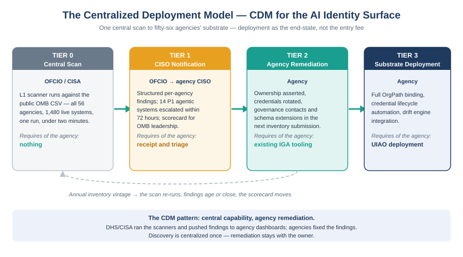

::: {.callout-note}
Everything in this book so far has described governance from the agency's point of view: the agency adopts the schema extensions, assigns the OrgPath records, runs the scanner, automates the lifecycle. That framing quietly assumes fifty-six separate adoption decisions, fifty-six separate deployments, and fifty-six separate timelines — and it is not how the most successful federal cybersecurity programs have actually achieved coverage. CDM did not ask every agency to build its own diagnostics stack; DHS ran the capability centrally and pushed findings outward. This chapter applies the same pattern to the AI identity surface: OFCIO runs the L1 scan once, against the public inventory, for every agency at once — and agency-level UIAO deployment becomes the Tier 3 end-state of a graduated model, not the entry fee for governance.
:::

{#fig-centralized-deployment fig-alt="Horizontal four-tier diagram left to right: TIER 0 Central Scan (grey) — OFCIO runs the L1 scanner against the public OMB CSV for all 56 agencies and 1,480 live systems; TIER 1 CISO Notification (amber) — structured per-agency findings, 14 P1 agentic systems flagged for immediate action; TIER 2 Agency Remediation (teal) — ownership asserted, credentials rotated, governance contacts recorded in existing IGA tooling; TIER 3 Substrate Deployment (navy) — full OrgPath binding, credential lifecycle automation, drift engine integration. Arrows join the tiers left to right. A band beneath spans all four tiers labeled 'The CDM pattern: central capability, agency remediation — DHS/CISA ran the scanners, agencies fixed the findings.' White background, navy and teal palette." width="100%"}

## The pattern federal cybersecurity already proved

The Continuous Diagnostics and Mitigation program is the closest structural precedent for what the AI identity surface needs, and its central lesson is easy to state: CDM did not require each agency to build its own scanner. DHS and CISA procured and operated the diagnostic capability centrally, established a common data schema, and delivered findings to each agency's dashboard. Agencies were responsible for remediation — asserting ownership, patching, reconfiguring — but never for building the discovery machinery. The division of labor was deliberate. Discovery is cheap to centralize and expensive to duplicate; remediation is impossible to centralize because only the agency owns its systems.

The AI identity surface has exactly the same shape, with one advantage CDM never had: the discovery input is already public. The OMB Federal AI Use Case Inventory is a published CSV. The L1 scanner described in Chapter 5 requires no agency credentials, no network access, and no agency-side deployment — it reads the inventory, applies the ADR-112 governance rules, and produces structured findings in under two minutes for the full 1,480-system population. A capability with those properties should not be deployed fifty-six times. It should be run once, centrally, by the office that already owns the inventory: OFCIO.

## Tier 0 — the OFCIO central scan

The entry point of the model is a scan nobody has to adopt. OFCIO — or CISA acting in its CDM role — runs the L1 scanner against the public OMB CSV on a monthly cadence and on every inventory vintage publication. One run produces findings for all fifty-six reporting agencies and all 1,480 live systems: which systems lack an ATO record, which lack an accountable owner, which agentic systems are operating without authorization, and which entries have disappeared since the prior vintage without a corresponding retirement event.

Tier 0 requires no agency participation at all, and that is the point. The most common failure mode of federal governance initiatives is the adoption cliff: a model that delivers nothing until an agency invests in deployment delivers nothing to most agencies. Tier 0 inverts the cliff. Governance findings exist for every agency from the first central run, before any agency has installed anything, signed anything, or attended a single working group.

## Tier 1 — the agency CISO notification

A finding that never reaches an accountable person is a report, not governance. Tier 1 is the delivery mechanism: each agency CISO receives the structured findings for their agency — the same JSON the scanner emits, filtered to their systems, with the ADR-112 priority tiers applied. The fourteen P1 agentic systems identified in the 2025 scan illustrate the escalation contract: a P1 finding — an agentic system deployed or in active pilot without an ATO — reaches the agency CISO within seventy-two hours of the scan, because a system that acts autonomously under ungoverned credentials is not a documentation gap, it is an active credential risk. The 596 ATO gaps and 488 ownership gaps are delivered prioritized per agency on the standard cadence.

The CDM analogy holds at this tier too. CDM findings flowed to agency dashboards whether or not the agency had asked for them; the federal dashboard aggregated posture across agencies for OMB and CISA leadership. The same aggregation applies here: a per-agency scorecard — systems inventoried, findings open, findings closed, P1 count — published on the same cadence as the scan gives OFCIO the compliance picture that today does not exist anywhere.

## Tier 2 — agency remediation with existing tooling

Tier 2 is where the agency starts doing work, and the model is deliberate about how little new machinery that work requires. Remediating an ownership gap means recording a governance contact; remediating an ATO gap means either completing the authorization or halting the system; remediating a credential finding means rotating a service-account credential and documenting its owner. Every one of those actions is within reach of the identity governance tooling agencies already operate. What Tier 2 adds is the recording surface: the schema extensions from Chapter 3 — the governance-contact field, the identity-system-of-record field, the credential-lifecycle attestation — adopted in the agency's own inventory submission so that next year's vintage carries the evidence and next year's scan shows the gap closed.

Tier 2 is also where the annual inventory cycle becomes the enforcement loop. The scan is not a one-time audit; it re-runs on every vintage. An agency that records ownership and lifecycle evidence sees its findings count fall. An agency that does not sees the same findings re-issued, aged, and aggregated on the scorecard. That is the CDM dynamic transplanted: nobody ordered agencies to patch, but the dashboard made not-patching visible, and visibility did most of the enforcement work.

## Tier 3 — the agency substrate deployment

Tier 3 is the end-state this book has described from the beginning: UIAO deployed at the agency, the OMB inventory bound as a discovery feed, OrgPath records stamped for every AI system, credential lifecycle automation driven by the vintage-diff JML events of Chapter 8, and the drift engine routing `DRIFT-COMPLIANCE::ato-gap` and shadow-AI findings through the six-phase remediation loop. Everything Chapters 3 through 8 specify lives at this tier.

What the centralized model changes is the framing: Tier 3 is where the governance offer culminates, not where it begins. An agency reaches Tier 3 because Tiers 0 through 2 already demonstrated value on its own systems — the scan found real ungoverned credentials, the notifications reached the right people, the remediation closed real findings — and because automation is cheaper than repeating Tier 2 by hand every year. The deployment decision becomes an efficiency argument backed by a year of evidence, not a leap of faith backed by a briefing deck.

| Tier | Who acts | What happens | What it requires of the agency |
|---|---|---|---|
| **0 — Central scan** | OFCIO / CISA | L1 scanner runs against the public OMB CSV for all 56 agencies, 1,480 live systems | Nothing |
| **1 — CISO notification** | OFCIO → agency CISO | Structured per-agency findings; P1 agentic systems escalated within 72 hours; scorecard aggregated | Receipt and triage |
| **2 — Agency remediation** | Agency | Ownership asserted, credentials rotated, governance contacts and schema extensions recorded in the next inventory submission | Existing IGA tooling |
| **3 — Substrate deployment** | Agency | Full OrgPath binding, credential lifecycle automation, drift engine integration | UIAO deployment |

## The gap no directive closes

The honest limit of this model must be stated plainly: no Binding Operational Directive currently compels any of it. M-25-21 obligates agencies to inventory their AI systems — a transparency obligation — but creates no enforcement mechanism for what the inventory reveals. A system reported without an ATO has satisfied M-25-21 by the act of reporting. CISA BOD 23-01 compels enumeration of internet-facing assets and services, but its scope is devices and services; it says nothing about AI system service accounts, credential rotation for AI identities, or deprovisioning obligations when an AI system retires from the inventory.

Between those two authorities sits an unclosed gap: the inventory creates the visibility surface, and nothing creates the credential-lifecycle obligation. The centralized model in this chapter is designed to function inside that gap — Tiers 0 and 1 require no new authority because scanning a public CSV and notifying CISOs is within OFCIO's existing coordination role, and Tier 2 rides the existing annual submission requirement. But the model would be materially stronger under a directive that made the fourteen P1 findings compulsory to remediate rather than merely visible. Whether such a directive is ever issued is a policy decision outside this book's scope; the architecture documented here works without it and improves with it.

## Book complete

You have reached the end of Book 21 — *OrgPath and Federal AI Governance*. This chapter closed the deployment arc: from the ungoverned AI identity surface exposed in Chapter 1, through the governance requirements of M-25-21 (Chapter 2), the identity-subject model and the agentic tier (Chapters 3–4), the ATO and shadow-AI gaps (Chapters 5–6), the authorization spine (Chapter 7), the automated lifecycle model (Chapter 8), and the centralized CDM-pattern deployment model that takes the whole of it from one office's scan to fifty-six agencies' substrate (this chapter). The appendix that follows defines every term, finding code, and citation the book uses.

::: {.callout-tip}
## Continue reading

[Appendix — Glossary and References →](Book_21_CPT_09.qmd)
:::

[← Back to Book 21 index](Book_21.qmd)

[→ OrgPath reading-sequence index](index.qmd)
