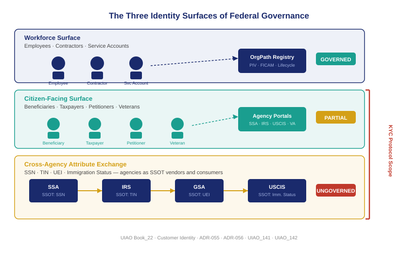

::: {.content-visible when-format="docx"}
::: {.callout-note}
## Reading this document as a standalone bundle

This book uses notation from the UIAO identity governance platform. If you received this document independently — outside the UIAO customer portal — the following conventions apply throughout:

**ADR-NNN** refers to an Architecture Decision Record: UIAO's numbered, binding governance specification. Each ADR governs a specific aspect of the platform. This book cites ADR-035 (OrgPath Codebook), ADR-040 (Drift Engine), ADR-054 (Single-ATO Reciprocity), ADR-055 (Customer Identity Canon Block), ADR-056 (Login.gov Activation), ADR-059 (SailPoint Adapter Family), ADR-062 (OrgPath Leaf Naming), and ADR-092 (Active Governance). Full titles and one-paragraph descriptions for each cited ADR appear in the **Glossary and References** appendix at the end of this document.

**UIAO_NNN** refers to a UIAO Specification document — an operational schema, field mapping, or scanner interface specification. UIAO_141 and UIAO_142 (cited in later chapters) are the KYC protocol specifications defining the two scopes of customer identity governance: agency-to-citizen and inter-agency attribute exchange.

**DRIFT-CLASS::subtype** is a drift finding code identifying the governance-gap category and specific condition. Examples: `DRIFT-IDENTITY::kyc-assurance-gap` (IAL declaration missing from an OrgPath node owning a citizen-facing workflow) and `DRIFT-IDENTITY::attribute-exchange-ungoverned` (inter-agency attribute dependency not surfaced as a governed contract). A complete table of drift codes appears in the Glossary.

**OrgPath** is UIAO's organizational placement model — a colon-separated namespace path that anchors every identity object (human, device, or external identity subject) to its position in the federal bureau hierarchy (e.g., `SSA:BENEFITS` for the Benefits Administration within the Social Security Administration). OrgPath is the substrate on which assurance level declarations, attribute exchange contracts, and KYC governance obligations are stamped.

**IAL / LOA** refers to Identity Assurance Level (NIST SP 800-63-3) or the older Level of Assurance framework. IAL1 through IAL3 describe the rigor with which an agency has verified the real-world identity of an enrollee. Chapter 2 covers the full assurance framework.

**Login.gov** is GSA's shared identity proofing service, activated per ADR-056, that provides IAL1 and IAL2 identity proofing for citizen-facing federal services without requiring each agency to build its own proofing infrastructure.

A complete **Glossary and References** section, including all defined terms, cited federal mandates, NIST controls, and cited ADRs, appears as the final chapter of this bundle.
:::
:::

::: {.callout-note}
Federal identity governance has always been oriented inward. The workforce surface — employees, contractors, and service accounts — has been the center of every IAM investment since Active Directory was first deployed. The citizen-facing surface, which is larger by two orders of magnitude, has been treated as someone else's problem. This chapter names that surface, counts what lives on it, and establishes the two scopes of the KYC protocol that UIAO uses to govern it.
:::

{#fig-book-22-cpt-01-fig1 fig-alt="Three horizontal bands on a white background. Top band labeled Workforce Surface shows employee and contractor icons connected to an OrgPath registry node in navy. Middle band labeled Citizen-Facing Surface shows icons for beneficiary, taxpayer, petitioner, and veteran with arrows to agency portals in teal. Bottom band labeled Cross-Agency Attribute Exchange shows arrows between SSA, IRS, USCIS, and GSA icons with SSOT labels in amber. A vertical red bracket on the right spans the bottom two bands labeled KYC Protocol Scope." width="100%"}

## The surface nobody governs

Every federal employee hired since 2002 has an Active Directory account. Every contractor onboarded under PIV requirements has a credential tied to a certificate authority. Every service account provisioned in a federal environment is, in theory, subject to FICAM policy and the lifecycle controls that OrgPath enforces. The workforce identity surface is imperfect, but it is governed: there is a schema, a registry, an authoritative source, and a drift engine.

The citizen-facing surface has none of those things. When a Social Security Administration beneficiary logs in to check a payment, when an IRS taxpayer files a return, when a USCIS petitioner submits a naturalization application, when a VA veteran requests records — each of those interactions involves a federal agency managing an identity for an external person. That person is an identity subject in the technical sense: they have an identifier, one or more credentials, attributes that the agency has collected or verified, and a lifecycle that begins with enrollment and ends with some form of offboarding or expiration.

But those identity subjects do not appear in any of the governance systems that cover the workforce surface. They are not in Active Directory. They are not in the PIV management system. They are not in the OrgPath registry. Each agency maintains its own identity store for its own constituents, often in isolation, with different schemas, different assurance standards, and no cross-agency visibility. The IRS identity for a taxpayer is invisible to SSA. The USCIS identity for a petitioner is invisible to the Department of Labor. The VA identity for a veteran is invisible to the Department of Defense except through manually negotiated data sharing agreements.

This is not a data sharing problem. It is a governance problem. The citizen-facing surface is ungoverned not because the information does not exist, but because no layer connects the identity subjects to a common schema, a common set of assurance standards, or a common authority structure.

## Two scopes of the KYC protocol

UIAO's customer identity governance operates at two distinct scopes, both captured in the KYC protocol established in UIAO_142.

**Scope 1 — Agency-to-citizen:** This is the surface most people recognize. A federal agency interacts with an external person — a citizen, a business, a beneficiary, an applicant — who must establish their identity to receive a service or fulfill an obligation. SSA must verify that a beneficiary is who they claim to be before paying benefits. IRS must establish that a taxpayer's identity is consistent with the tax record before allowing account access. USCIS must verify the identity of a petitioner before adjudicating an immigration benefit. VA must verify a veteran's identity before releasing protected health information.

The governance question at this scope is: what level of identity assurance does the agency require for this transaction, does the identity infrastructure the agency is using meet that level, and is the assurance requirement recorded as a governed attribute of the OrgPath node that owns the workflow?

**Scope 2 — Inter-agency attribute exchange:** This scope is less visible but operationally larger. Federal agencies do not govern only the citizens they serve directly. They also govern the identity attributes they produce that other agencies consume. SSA is the authoritative source for Social Security Numbers — the SSN that a taxpayer provides to IRS, that an employer reports on payroll records, and that a state DMV records on a driver's license. GSA is the authoritative source for Unique Entity Identifiers — the UEI that a contractor provides to every contracting agency. USCIS is the authoritative source for immigration status — the status that an employer verifies through E-Verify when onboarding a non-citizen worker.

Each of these authoritative attributes creates a governed dependency. When IRS consumes SSA's SSN as the basis for taxpayer identification, IRS is relying on SSA's identity proofing for a population it never proofed itself. When an employer relies on USCIS's E-Verify determination for employment eligibility, the employer is extending trust to a proofing process it did not perform. Those dependencies are real, legally consequential, and currently invisible in the governance layer.

## Why workforce governance did not extend to citizens

The historical explanation for the gap is straightforward: FICAM, the Federal Identity, Credential, and Access Management framework, was designed for employees. PIV credentials require in-person proofing and a background investigation — requirements that are appropriate for federal workers and entirely inappropriate for 300 million members of the public. When agencies stood up citizen-facing systems, they built identity infrastructure outside the FICAM perimeter because there was no alternative that fit.

The result was a proliferation of agency-specific identity silos. Each agency built what it needed when it needed it. Some built strong systems; some built weak ones. Some built systems that are federated with each other through bilateral agreements; most did not. The surface grew, the silos multiplied, and the governance gap widened.

NIST SP 800-63, first published in 2017 and substantially revised through 2024, provided the missing framework. It defined a tiered assurance model — Identity Assurance Level, Authenticator Assurance Level, and Federation Assurance Level — that applies to any digital identity system, workforce or public-facing. Chapter 2 covers that framework in detail. The key point for this chapter is that 800-63 gave agencies a common language for describing the assurance properties of their citizen-facing identity systems — but it did not give them a governance layer that would make those properties visible, enforced, and subject to drift detection.

That is what UIAO adds.

## What OrgPath brings to the customer surface

OrgPath's role in customer identity governance is not to replace the agency-specific identity systems that serve citizens. Those systems perform specialized functions — SSA's credentialing system, IRS's Secure Access, VA's DS Logon, and increasingly Login.gov — and they exist for good reasons. OrgPath's role is to make the identity surface visible at the governance layer.

That means three specific things. First, the bureau that owns a citizen-facing identity workflow must declare that ownership in its OrgPath node, including the assurance level the workflow operates at. Second, when a bureau relies on an external authoritative source — SSA's SSN, GSA's UEI, USCIS's immigration status — that dependency must be surfaced as a governed attribute exchange contract in the UIAO registry. Third, drift detection must be able to compare the declared assurance requirement against the actual proofing infrastructure in use, and surface a finding when they do not match.

| Identity Surface | Scale | Current Governance | UIAO Addition |
|---|---|---|---|
| Workforce (employees, contractors) | ~4M federal workers | OrgPath, PIV, FICAM | Already governed |
| Citizen-facing (beneficiaries, taxpayers, petitioners) | ~300M public interactions | Agency-specific silos | OrgPath scope declaration, assurance level stamping |
| Cross-agency attribute exchange (SSN, UEI, immigration status) | Billions of transactions annually | Bilateral agreements, no SSOT registry | Attribute exchange contracts, dependency governance |

The governance layer that has always been available to the workforce surface is available to the citizen surface through the same substrate. The chapters that follow show how each piece works: the assurance framework (Chapter 2), the Login.gov activation contract (Chapter 3), the cross-agency attribute exchange doctrine (Chapter 4), the KYC reciprocity protocol (Chapter 5), and what the governed surface looks like when all of it is in place (Chapter 6).

::: {.callout-tip}
## Continue reading

[Chapter 2 — NIST 800-63 and the Three Assurance Levels →](Book_22_CPT_02.qmd)
:::
