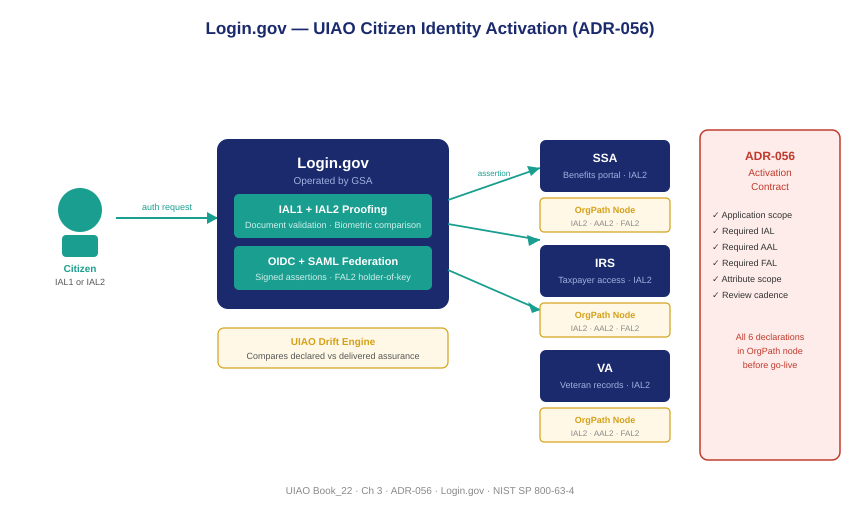

::: {.callout-note}
Login.gov is the shared citizen-facing identity platform operated by GSA — the first per-adapter activation in the UIAO customer identity surface. Rather than every federal agency building its own proofing infrastructure, Login.gov provides IAL1 and IAL2 proofing, OIDC and SAML federation, and a standardized relying-party integration contract. ADR-056 defines what an agency must declare before activating Login.gov as a relying party, and why that declaration belongs in the OrgPath node that scopes the application.
:::

{#fig-book-22-cpt-03-fig1 fig-alt="Architecture diagram on a white background. Center box labeled Login.gov in navy shows two internal layers: IAL1 and IAL2 Proofing in teal, and OIDC and SAML Federation in teal. Left side shows a citizen icon with an arrow labeled authentication request pointing right to Login.gov. Right side shows three agency boxes labeled SSA, IRS, and VA each with an arrow labeled relying party assertion pointing left from Login.gov. Below each agency box is a smaller amber box labeled OrgPath Node with declared IAL/AAL/FAL. A red box at the bottom labeled ADR-056 Activation Contract spans the agency column with a checklist icon." width="100%"}

## Shared infrastructure for a fragmented problem

Before Login.gov existed, the citizen-facing identity problem was solved — to the extent it was solved at all — by each agency independently. SSA built its my Social Security credentialing system. IRS built Secure Access. VA built DS Logon. Each system made different technology choices, implemented different assurance levels, enforced different password policies, and offered a different user experience. A veteran who also received Social Security benefits and filed federal taxes maintained three separate credentials for three separate agencies with three separate proofing events.

The duplication was expensive for agencies and burdensome for citizens. More importantly, it produced an ungoverned mosaic: the assurance levels across these systems were inconsistently implemented, independently audited, and incomparable. There was no way to ask, across the federal government, whether the identity proofing that IRS did for a taxpayer met the same standard as the identity proofing SSA did for a beneficiary — because the two systems were built differently and evaluated by different auditors against different interpretations of the same NIST guidance.

GSA's Login.gov, launched in 2017 and expanded substantially through 2024, addresses this by providing a single shared platform that agencies can use instead of building their own. The platform handles identity proofing (up to IAL2), credential issuance, multi-factor authentication (up to AAL2), and federation to relying-party agency applications via OIDC and SAML. An agency that integrates with Login.gov does not need to build proofing infrastructure; it needs only to integrate with Login.gov's APIs, configure its relying-party registration, and declare — in its OrgPath governance record — what assurance level it requires from the platform.

## What Login.gov provides

Login.gov operates two proofing tiers and two federation protocols, each with specific capabilities and limitations.

**IAL1 proofing** at Login.gov requires only a verified email address and a confirmed phone number. The person is not required to submit identity documents. The email address and phone number are validated (email link confirmation, SMS or voice confirmation), which provides confidence that the credential is reachable at those contact points — but provides no confidence that the account holder is who they claim to be. IAL1 is appropriate for public-facing interactions that require continuity (so the citizen can return to a session) without requiring identity verification.

**IAL2 proofing** at Login.gov requires the citizen to submit a photo of a government-issued identity document (driver's license, state ID, or passport), complete a biometric liveness check, and pass validation against the issuing authority's records. As of 2024, Login.gov performs document validation through integration with the American Association of Motor Vehicle Administrators (AAMVA) for driver's licenses and NIST-approved automated biometric comparison tools. The result of a successful IAL2 proofing event is a verified identity record tied to a real-world document — an identity that can serve as the proofing basis for consequential federal transactions.

**OIDC federation** (OpenID Connect) is Login.gov's primary integration protocol for modern web applications. Relying parties redirect citizens to Login.gov for authentication, receive an authorization code, exchange it for an ID token containing the asserted attributes, and use the token to establish a session. The token is signed by Login.gov's keys, which relying parties validate against Login.gov's published JWKS endpoint.

**SAML federation** is available for agencies whose applications require the SAML 2.0 profile — typically legacy enterprise applications that predate OIDC. Login.gov issues signed SAML assertions carrying the same identity attributes available through OIDC.

## The activation contract — ADR-056

ADR-056 establishes what any agency must declare before activating Login.gov as a relying party for a citizen-facing application. The activation contract is not a technical integration checklist; it is a governance declaration that belongs in the OrgPath node of the bureau that owns the application.

The contract requires the bureau to declare six things.

**Application scope:** The OrgPath node that owns the application — which bureau, which sub-bureau, which mission function. This establishes the organizational anchor for all downstream governance.

**Required IAL:** The minimum Identity Assurance Level the application requires citizens to achieve before accessing the service. If the application holds verified personal information or enables financial transactions, this must be IAL2. If it is a low-stakes inquiry or notification service, IAL1 may be appropriate.

**Required AAL:** The minimum Authenticator Assurance Level. Any application that requires IAL2 identity must require at minimum AAL2 authentication — the proofed identity must be protected by a second factor to prevent credential theft from undermining the proofing investment.

**Required FAL:** The minimum Federation Assurance Level for Login.gov assertions accepted by the application. Applications operating at IAL2/AAL2 must require FAL2 (holder-of-key) assertions, ensuring that Login.gov's assertions cannot be replayed by an attacker who intercepts them in transit.

**Attribute consumption declaration:** Which attributes the application will request from Login.gov — email, phone, verified name, date of birth, SSN (available at IAL2), address — and the legal authority under which those attributes are requested and stored.

**Drift review cadence:** The OrgPath node must specify how frequently the declared assurance levels will be reviewed against Login.gov's actual delivery configuration. Quarterly is the minimum; annually is the maximum.

Once these six declarations are recorded in the OrgPath node, the UIAO drift engine can monitor for deviations: Login.gov's actual delivered IAL changing, the application's configuration drifting from the declared assurance level, or the attribute consumption expanding beyond what was declared.

## OrgPath-scoped relying party registration

The OrgPath node is the authoritative record of an agency's Login.gov relying party registration. This matters because Login.gov can serve multiple applications across a single agency — SSA may have three separate Login.gov relying parties for three separate benefit portals — and each has a distinct assurance profile. Without OrgPath scoping, the governance record for each application would live only in Login.gov's internal configuration, invisible to the agency's own governance layer.

With OrgPath scoping, each Login.gov relying party maps to exactly one OrgPath node. The node records the declared assurance levels. The drift engine compares those declarations against Login.gov's configuration API. Any mismatch — an application declaring IAL2 that Login.gov is configured to deliver at IAL1, or an application accepting FAL1 assertions when its own declared requirement is FAL2 — becomes a finding routed to the bureau governance contact.

| Activation Contract Requirement | OrgPath Location | Drift Signal |
|---|---|---|
| Application scope | Bureau OrgPath node | Node assignment drift |
| Required IAL | `customer_ial` attribute | Login.gov delivered IAL mismatch |
| Required AAL | `customer_aal` attribute | MFA configuration mismatch |
| Required FAL | `customer_fal` attribute | Assertion binding type mismatch |
| Attribute consumption | `customer_attributes` list | Scope expansion beyond declared |
| Drift review cadence | `customer_review_cadence` | Overdue review finding |

Login.gov as the first UIAO customer-identity adapter establishes the pattern for every subsequent citizen-facing IdP that an agency might activate. The pattern is: declare the assurance requirement in OrgPath, activate the adapter against those declared requirements, and allow the drift engine to surface deviations continuously. The adapter itself — Login.gov, or any future equivalent — is not the governance layer. The OrgPath node is.

::: {.callout-tip}
## Continue reading

[Chapter 4 — Agencies as Vendors and Customers of Each Other →](Book_22_CPT_04.qmd)
:::
