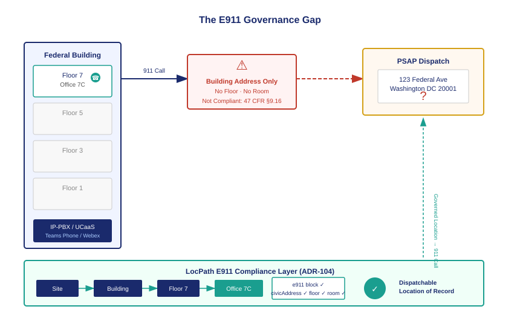

::: {.callout-note}
Every year, employees in federal office buildings dial 911. The call connects — but the Public Safety Answering Point cannot locate the caller. The building address is in the system. The floor, the room, and the wing are not. First responders search. Time passes. Kari's Law and RAY BAUM's Act §506 were written because this failure pattern is not rare; it is structural. Federal agencies run multi-line telephone systems and cloud UCaaS platforms that do not produce the sub-address precision the law now requires. LocPath is already the right substrate to fix this — but only if the E911 compliance obligation is stamped on every node that owns it.
:::

{#fig-e911-gap fig-alt="Architectural diagram on a white background. Left side: a federal office tower with three floors labeled Floor 3 (caller icon), Floor 5, Floor 7. An IP-PBX/UCaaS box sits at the base. A 911 call arrow flows right. Center: a red warning symbol labeled Building Address Only — No Floor, No Room. Right side: a PSAP dispatch console with a question mark. Below the gap: a LocPath governance layer in navy showing Site, Building, Floor, Space nodes with a green check mark labeled Dispatchable Location of Record. Navy and teal palette, white background." width="100%"}

## The call that could not be answered

On a Tuesday afternoon in a twelve-story federal building in Washington, an employee collapsed in a third-floor conference room. A colleague dialed 911 from the conference room phone. The call connected immediately — the agency's IP-PBX routed it through the hosted UCaaS platform to the local PSAP within seconds.

The PSAP dispatcher asked the standard question: what is your location? The caller said the room number. The dispatcher could not find it. The system displayed the building's civic address — the street address, the city, the zip code — and nothing more. No floor. No room number. No wing designation.

First responders arrived at the building's main entrance five minutes after the call. They searched for the caller. They found the right floor six minutes later. The event lasted longer than it needed to, not because the technology failed in any conventional sense — the call connected, the audio was clear — but because the location information the system transmitted was incomplete in exactly the way the law now prohibits.

This scenario is not a hypothetical. It is the documented failure pattern that produced Kari's Law and the RAY BAUM's Act E911 mandate. It occurs in federal buildings specifically because the telephone systems federal agencies operate — IP-PBXs, key systems, hosted UCaaS platforms — are multi-line telephone systems, and multi-line telephone systems have a structural characteristic that ordinary residential phones do not: they aggregate many extensions under a single outbound trunk, and that trunk carries a single civic address regardless of which extension placed the call.

## What Kari's Law and RAY BAUM's Act require

Kari's Law became federal law in 2018. It takes its name from Kari Hunt, who was killed in a hotel room in Texas in 2013. Her daughter dialed 911 from the room phone. The hotel's PBX required the caller to dial 9 for an outside line first. The nine-year-old did not know that. The call never connected.

Kari's Law addressed the outbound routing problem: it eliminated the requirement to dial a prefix digit before 911 on any multi-line telephone system manufactured, imported, or installed after the law's effective date. Every MLTS must allow direct 911 dialing from any extension, and it must notify a central on-site location when a 911 call is placed.

RAY BAUM's Act §506 addressed the location problem. The Federal Communications Commission implemented it through 47 CFR Part 9, §9.16. The rule requires that any MLTS or hosted UCaaS that transmits a 911 call must also transmit a **dispatchable location** — defined as a civic address including additional information such as floor, suite, room, or other data to adequately describe the specific location of the caller.

The rule is precise about what "adequately describe" means. A street address alone is not adequate. For multi-story buildings, a floor number is required. For large floor plates or campuses, additional sub-address precision — suite, room, wing, bay — is required to the extent that such information is technically feasible and reasonably sufficient for first responders to locate the caller without additional assistance.

The compliance deadline for MLTS installations and hosted UCaaS platforms already passed. Federal agencies are required to comply now.

## The federal MLTS estate

The scale of the problem in the federal context is significant. A large cabinet-level agency may operate dozens of office buildings across a metropolitan area, each with its own IP-PBX or connected to a shared hosted UCaaS platform. A regional presence with a campus of three buildings and a floor plate of twenty thousand square feet per floor may have five hundred extensions distributed across fifteen floors and two hundred offices.

The telephone system knows which extension placed the call. It does not necessarily know where that extension is physically located — or more precisely, it knows where the extension was registered at provisioning time, but that registration is a configuration record in the PBX, not a governed location record in a physical-address system. When an employee is reassigned to a different floor, or when hot-desking means that no extension belongs to a fixed location at all, the PBX's location record becomes stale. The civic address in the system reflects the building. The floor does not update automatically. The room may never have been recorded.

This is a data governance problem, not a telecommunications problem. The telephony layer is working correctly. The location data layer is ungoverned.

## Why LocPath is already the right substrate

LocPath (ADR-102) was designed as the physical-location addressing dimension of the UIAO identity substrate. It models a location hierarchy — Site, Building, Floor, Space — with civic address fields at the Site and Building levels and sub-address precision at the Floor and Space levels. It was designed to serve any use case that requires governed physical-location data: physical access control, asset tracking, facilities management, and emergency communications.

The E911 compliance obligation slots into LocPath because LocPath already has the structure the obligation requires. A Floor node in LocPath carries a `floorDesignation` field. A Space node carries a `locationDescription`. A Site node carries a full `civicAddress` schema that maps directly to the format PSAP databases accept. What LocPath does not carry by default is the obligation signal — the flag that says "this node has an MLTS or UCaaS presence, and it therefore has a legal duty to produce a validated dispatchable location."

The E911 compliance layer (ADR-104) adds that flag. It defines the `e911` block in the LocPath schema, stamps the obligation on every node where a multi-line telephone system is present, and runs a continuous completeness check against three error codes. The result is a governed dispatchable location of record — not a PBX configuration record that may or may not reflect where phones actually are, but a location assertion backed by the same drift engine and organizational inheritance model that governs every other UIAO data surface.

## What compliance looks like in practice

A federal agency implementing the E911 compliance layer starts with its LocPath inventory. Every Site is already in LocPath; every Building and Floor derives from it. The compliance layer asks three questions for each node where an MLTS or UCaaS extension is registered:

Does this node have a civic address? If not, finding GOV-LOCPATH-012 is raised at Priority 1 — the highest severity the completeness check produces. No dispatchable location is possible without a civic address.

Does this node have sub-address precision — a floor designation, a room or suite label, a `locationDescription` that localizes the caller within the building? If not, finding GOV-LOCPATH-013 is raised at Priority 2. The address is partially complete but not adequate under §9.16.

Has this civic address been validated against the PSAP database that serves this location? If not, finding GOV-LOCPATH-014 is raised at Priority 2. The address may be correct, but it has not been confirmed as routable to the right PSAP, which means the 911 call may go to the wrong answering point.

Each finding routes through OrgPath to the responsible organizational unit. The bureau that owns the LocPath node owns the remediation. The compliance check runs continuously, not as a point-in-time audit.

The goal is not a perfect data model. The goal is that when an employee collapses in a conference room and dials 911, the PSAP dispatcher knows which floor. The chapters that follow show exactly how each piece of that works.

::: {.callout-tip}
## Continue reading

[Chapter 2 — The Dispatchable Location of Record →](Book_23_CPT_02.qmd)
:::
