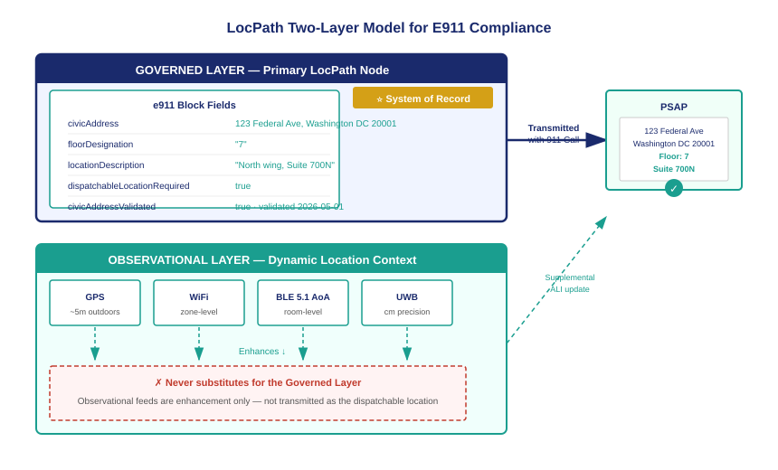

::: {.callout-note}
"Dispatchable location" is a term of art under 47 CFR §9.16. It means more than a civic address. It means a location description precise enough for a first responder who has never been in the building to find the caller without asking anyone for directions. That precision requires sub-address data — floor, suite, room, wing — that building addresses do not carry. LocPath provides the two-layer model that satisfies the obligation: a governed layer that holds the authoritative dispatchable location of record, and an observational layer that enhances it with dynamic sensor data. Only the governed layer is the system of record. Only the governed layer appears in the 911 call.
:::

{#fig-two-layer fig-alt="Diagram on white background. Two horizontal layers stacked vertically. Top layer labeled Governed Layer in navy: a Primary LocPath Node box containing civicAddress, floorDesignation, locationDescription, and e911.dispatchableLocationRequired flag shown in teal. A gold badge reads System of Record. An arrow labeled Transmitted with 911 Call points right to a PSAP icon. Bottom layer labeled Observational Layer in teal: four source boxes labeled GPS, WiFi Positioning, BLE 5.1 AoA, UWB with arrows pointing up labeled Enhances. A red X label reads Never Substitutes. White background, navy, teal, amber, red palette." width="100%"}

## What 47 CFR §9.16 actually requires

The Federal Communications Commission's E911 dispatchable location rule — 47 CFR §9.16 — defines a dispatchable location as "a location delivered to the PSAP with a 911 call that consists of the street address of the calling party, and may include additional information such as suite, apartment or similar information necessary to adequately describe the specific location of the caller."

The phrase "necessary to adequately describe" carries significant weight. The FCC's orders implementing RAY BAUM's Act §506 are explicit: for calls originating from multi-story buildings or large campuses, a street address alone does not adequately describe the caller's location. A first responder dispatched to a federal building with twelve floors, three elevator banks, and a north and south wing cannot find a caller in distress without knowing which floor and which wing. The law requires that information to travel with the call.

The FCC established a three-part hierarchy for what constitutes adequate sub-address precision:

A floor or level designation, expressed as a floor number, level identifier, or equivalent descriptor. This is the minimum sub-address element required for any multi-story building.

A suite, room, bay, or office designation when the floor plate is large enough that floor alone is insufficient to locate the caller within a reasonable search time. The standard is practical: can a first responder, arriving at the floor, find the caller within sixty seconds without asking for assistance?

A `locationDescription` — a free-text field that captures any additional spatial context needed when structured fields do not fully characterize the location. A server room behind a badge-controlled door. A courtyard between two wings. A basement level that is not served by the main elevator bank. These are locations that structured address fields were not designed to capture.

LocPath carries all three elements as first-class fields in the Floor and Space node types.

## The two-layer model

LocPath's architecture for E911 compliance is a two-layer model. Understanding why two layers are necessary — and why they must remain distinct — is the central insight of this chapter.

The **governed layer** is the Primary LocPath node. It carries the civic address, the floor designation, the suite or room, and the `locationDescription`. It is populated through a governed data process: facilities management records, PSAP database validation, and a UIAO completeness check that runs continuously. It is the authoritative dispatchable location of record. It is the location that travels with the 911 call.

The **observational layer** is the Dynamic Location Context. It carries sensor readings from GPS receivers, WiFi positioning systems, Bluetooth Low Energy beacons, Ultra-Wideband tags, and RFID readers. These sources produce location estimates in real time, and those estimates can be highly precise — UWB can locate a device to within a few centimeters under favorable conditions. But they are estimates, not authoritative records. They depend on infrastructure that may be unavailable, degraded, or absent in exactly the environments — underground floors, shielded server rooms, stairwells — where precision matters most in an emergency.

The governance principle that separates these layers is not a technical preference. It is a liability principle. A PSAP that receives a location from a governed, validated, continuously maintained address record is receiving a location that a human being with organizational responsibility certified and that a drift engine monitors for staleness. A PSAP that receives a location from a WiFi positioning estimate is receiving an artifact of RF propagation physics at a moment in time, calibrated against a site survey that may be months old. The FCC's dispatchable location rule envisions the former.

## Inheritance and the civic address

One of LocPath's most important architectural features for E911 compliance is the inheritance model for civic addresses. A Floor node inherits the `civicAddress` from its parent Building or Site node. The floor does not need to repeat the street address, city, or zip code — it inherits them automatically. What the Floor node must carry that the Site node cannot provide is the floor-specific sub-address data: the floor designation, and any suite or room information specific to that floor.

This means that the compliance footprint for a well-structured LocPath hierarchy is minimal. An agency with a single-building site stamps the civic address once at the Site level. Every Floor node beneath it inherits the civic address automatically. The Floor node records only the `floorDesignation`. Space nodes beneath the Floor record the `locationDescription` or suite label. The completeness check can verify the entire hierarchy by examining the inherited address plus the local sub-address fields.

The inheritance model also means that errors propagate clearly. If a Site's civic address is wrong or missing, every Floor and Space beneath it will fail the GOV-LOCPATH-012 check. The finding routes to the Site owner, who is the correct responsible party for the building address. Floor-level findings route to the Floor's organizational owner. The responsibility model follows the data model.

## Why the governed layer is the system of record

There is a temptation, in an environment with sophisticated RTLS infrastructure, to let sensor data substitute for a maintained address record. If a UWB system can locate a device to within a meter, why maintain a floor-level governed record at all?

The answer has three parts.

First, RTLS infrastructure is not universally available. The federal estate includes buildings built in the 1930s, bunkers, classified vaults, SCIF spaces, and underground facilities where GPS is unavailable and where UWB or BLE beacons may not be deployed. The governed dispatchable location is available regardless of sensor infrastructure.

Second, RTLS location is a device location, not a person location. A UWB tag attached to a laptop reports where the laptop is. If the employee in distress does not have a tagged device, or if the tag is across the room, the sensor data does not describe the caller's location. The floor-level governed record is at least as precise as the sensor data in most emergency scenarios, and it requires no worn or carried device.

Third, the FCC's dispatchable location rule requires a location that the MLTS transmits with the 911 call at the moment of call initiation. A PSAP cannot poll a RTLS database after the call arrives. The governed layer is pre-populated and available instantaneously. Sensor data enhancement is valuable, but it is a supplemental signal delivered through a separate channel — it does not replace the requirement to transmit a governed dispatchable location with the call itself.

## The e911 obligation block

The e911 block in a LocPath node is a structured sub-object that carries the compliance metadata for that node:

| Field | Type | Purpose |
|---|---|---|
| `dispatchableLocationRequired` | boolean | `true` when the node has MLTS or UCaaS presence |
| `civicAddressValidated` | boolean | `true` after PSAP database validation |
| `validationSource` | string | Identifier of the PSAP database used for validation |
| `validationDate` | date | Date of most recent validation |
| `subAddressPrecision` | string | `floor`, `suite`, `room`, or `locationDescription` |
| `dynamicLocationEnabled` | boolean | `true` when observational feeds are active |

When `dispatchableLocationRequired` is true, the completeness check evaluates the node against all three error codes. When it is false, the node is excluded from the E911 compliance scan. The flag is set by the adapter that discovers MLTS or UCaaS registrations at each location — the same adapter that populates the telephony surface of the LocPath node.

The two-layer model, the inheritance rules, and the e911 block together produce a governed dispatchable location of record that satisfies 47 CFR §9.16 from data that LocPath already captures as part of its core function. No separate E911 database is required. No parallel location system is maintained. The 911 system reads from the same location record that governs physical access, asset tracking, and facilities management — because dispatchable location is a property of a physical space, not of a telephone system.

::: {.callout-tip}
## Continue reading

[Chapter 3 — MLTS and UCaaS in the Federal Estate →](Book_23_CPT_03.qmd)
:::
