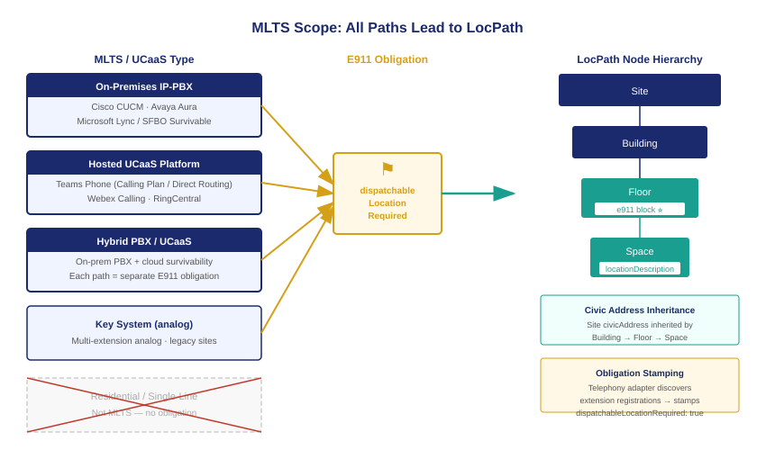

::: {.callout-note}
The E911 obligation does not apply to every telephone. It applies to multi-line telephone systems — a statutory category that is broader than most IT organizations expect. Every IP-PBX, hosted UCaaS platform, and key system that serves more than one extension is an MLTS. Microsoft Teams Phone, Cisco Webex Calling, and RingCentral are MLTS platforms under 47 CFR §9.16. Federal agencies that have migrated to cloud telephony have not escaped the obligation — they have moved it to a hosted provider who must comply, and they retain the obligation to ensure their LocPath records provide the governed dispatchable location the platform needs to fulfill it.
:::

{#fig-mlts-scope fig-alt="Diagram on white background. Center column: three system type boxes labeled IP-PBX (on-premises), Hosted UCaaS (Teams Phone, Webex, RingCentral), and Hybrid PBX/UCaaS. Each box has an arrow pointing right to an e911 Obligation flag in amber. All three obligation flags converge on a LocPath hierarchy diagram at the right: Site, Building, Floor, Space nodes in navy with a teal e911 block icon on each Floor node. A red X labeled No Obligation sits below a box labeled Residential/Single-Line — not MLTS. White background." width="100%"}

## What counts as an MLTS

The statutory definition of a multi-line telephone system in the FCC's implementing rules is deliberately broad. An MLTS is any system that serves multiple end users through shared facilities — shared trunks, shared switching, shared routing. The definition covers:

**On-premises IP-PBX systems.** Any IP-based private branch exchange installed in a federal facility, regardless of whether it is vendor-managed or agency-managed, is an MLTS. This includes legacy Cisco Unified Communications Manager deployments, Avaya Aura systems, and Microsoft Lync survivable branch appliances. Age does not confer exemption — a fifteen-year-old PBX installed before the law's effective date is required to comply with the dispatchable location requirement, though the compliance path may involve configuration changes rather than hardware replacement.

**Hosted UCaaS platforms.** Any cloud-delivered telephony service that routes 911 calls on behalf of agency users is an MLTS. This is the category that most modernizing agencies encounter. Microsoft Teams Phone, Cisco Webex Calling, and RingCentral all operate as MLTS providers under the statute. The FCC has classified direct routing configurations — where the agency brings its own SIP trunk to a Teams Phone deployment — as MLTS deployments that impose dispatchable location obligations on the agency, because the agency controls the location data that the platform transmits.

**Hybrid systems.** Many agencies operate in a hybrid state: a legacy on-premises PBX for some locations, a hosted UCaaS platform for others, and a survivable branch configuration that routes calls through the on-premises system when the cloud is unreachable. Each path is a separate MLTS that carries its own dispatchable location obligation. The LocPath node for a floor that is served by a hybrid system must carry the obligation flag for both paths.

**Key systems.** Traditional key telephone systems — analog multi-button desk sets connected to a key service unit — are technically MLTS if they serve more than one extension. Most federal facilities have replaced these with IP-PBX or UCaaS, but older satellite offices and courthouses may still operate them. The dispatchable location obligation applies.

The one category that is explicitly excluded is a single-line residential-style connection. A federal employee working from home on a personal residential phone line is not covered by the MLTS rule for that line. If they are using a softphone client connected to the agency's UCaaS platform, the UCaaS platform's MLTS obligation applies.

## The obligation inheritance model

The e911 obligation in LocPath follows a governed inheritance model that mirrors the civic address inheritance model. The obligation is set at the node where the MLTS or UCaaS registration is discovered — typically a Floor or Space node — and it propagates up the hierarchy to the owning Site.

The inheritance rule is directional: obligation flows upward for reporting purposes, but the dispatchable location is resolved downward. A Site that contains any obligated Floor node is itself an obligated site for compliance reporting. But when the 911 call arrives from a Floor-level extension, the dispatchable location delivered to the PSAP is the Floor node's governed record, not the Site record.

This directional inheritance matters for compliance management. An agency that has three floors of a six-floor building does not need to stamp the e911 obligation on floors it does not occupy. The obligation scanner reads the telephony adapter's extension registration feed and stamps only the nodes where extensions are registered. The remaining floors are invisible to the E911 compliance check.

The inheritance model also handles the case where a UCaaS platform manages extensions that are not permanently assigned to a physical location. Hot-desk configurations — where an employee picks up any available desk on arrival — pose a particular challenge. The LocPath model handles this through the Space node: the hot-desk pool on a given floor is a named Space node with its own floor designation and locationDescription. Extensions registered to the hot-desk pool inherit the Space node's governed location. The PSAP receives the floor and the zone designation, which may not be as precise as a named office but is substantially more useful than the building address.

## Teams Phone in the LocPath pattern

Microsoft Teams Phone is the dominant UCaaS platform in the federal government. Most agencies in the Microsoft 365 GCC or GCC High environment have access to Teams Phone as the successor to legacy on-premises PBX systems. Teams Phone supports two deployment patterns that affect the E911 obligation:

**Microsoft Calling Plans.** In this configuration, Microsoft is the carrier. Microsoft is also the MLTS operator for §9.16 purposes. The obligation to provide dispatchable location falls on Microsoft, and Microsoft satisfies it through the location information service that agency tenants configure in the Teams Admin Center. The agency's obligation is to populate that location information — which maps directly to the LocPath node hierarchy.

**Direct Routing.** In this configuration, the agency brings its own SIP trunk from a Session Border Controller to the Teams platform. The agency is the MLTS operator. The obligation to provide dispatchable location falls on the agency. The agency's SBC must transmit the dispatchable location in the SIP INVITE or PIDF-LO body that accompanies each 911 call. That location data must come from somewhere — and that somewhere should be the governed LocPath record for the node where the extension is registered.

Both configurations converge on the same requirement: the LocPath node for each floor or space where Teams Phone extensions are registered must carry a validated civic address and sub-address precision. The platform is the delivery vehicle. LocPath is the source of truth.

## Webex Calling and RingCentral

Cisco Webex Calling and RingCentral follow the same MLTS pattern. Both platforms support E911 via their own emergency services integrations — Cisco through its Emergency Responder product and integration with Intrado/West Safety Services; RingCentral through its native E911 integration with the same PSAP database providers. In both cases, the platform requires the agency to supply location data for each registered extension. That location data is the dispatchable location of record.

The agency's obligation under ADR-104 is to ensure that the location data fed to each platform matches the governed LocPath record. When a LocPath node is updated — a floor is renumbered, a wing is reorganized, a building is vacated — the change must propagate to the UCaaS platform's location database. The drift engine monitors this synchronization: if the LocPath record changes and the platform record does not, a drift finding is raised and routed to the platform owner.

| Platform | E911 Model | Location Source | Obligation Owner |
|---|---|---|---|
| Teams Phone (Calling Plan) | Microsoft-hosted | Teams Admin Center LIS | Agency (data) / Microsoft (delivery) |
| Teams Phone (Direct Routing) | Agency SBC | SIP INVITE / PIDF-LO | Agency |
| Webex Calling | Cisco Emergency Responder | Webex Control Hub | Agency |
| RingCentral | Intrado integration | RingCentral Admin Portal | Agency |
| On-premises IP-PBX | PBX-native | PBX location database | Agency |

In every row, the agency owns the accuracy of the location data. In every row, the authoritative source for that location data is the LocPath node.

## What the obligation flag means operationally

When the e911 adapter stamps `dispatchableLocationRequired: true` on a LocPath node, three things change immediately.

The completeness check begins running against that node. Any missing civic address, missing sub-address precision, or unvalidated address is surfaced as a finding with the appropriate priority code. The finding does not wait for the next scheduled audit; it is raised in the same scan cycle as the stamp event.

The node becomes visible in the E911 compliance dashboard. The compliance dashboard is a LocPath view filtered to obligated nodes, showing completeness status, validation currency, and finding history. Bureau compliance officers can see at a glance how many of their nodes are fully compliant, partially compliant, or in finding state.

The node enters the PSAP validation workflow. Validation against the PSAP database is not instantaneous — it requires a query to the MSAG or NG911 database that the relevant PSAP uses. The validation workflow queues the node for validation and tracks the validation date. Nodes that have not been revalidated within the configured refresh interval (default: ninety days) move to a pending-revalidation state that raises GOV-LOCPATH-014.

The obligation flag is not permanent. When the telephony adapter reports that all extensions registered to a node have been decommissioned, the flag is retracted and the node exits the E911 compliance scan. The governed location record remains — LocPath does not delete nodes on decommission — but it is no longer subject to the E911 completeness obligation.

::: {.callout-tip}
## Continue reading

[Chapter 4 — The E911 Compliance Check: Three Codes →](Book_23_CPT_04.qmd)
:::
