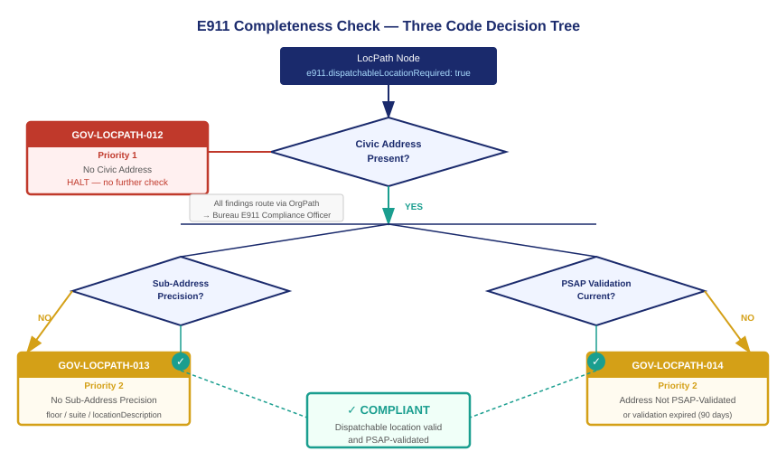

::: {.callout-note}
The E911 completeness check is deterministic. Three questions, three error codes, two priority levels. GOV-LOCPATH-012 asks whether a civic address exists at all — a Priority 1 finding that halts the check immediately, because no dispatchable location is possible without a civic address. GOV-LOCPATH-013 asks whether sub-address precision exists at the required depth. GOV-LOCPATH-014 asks whether the address has been validated against the PSAP database that serves this location. Together, the three codes cover every failure mode between a LocPath node and a compliant 911 transmission. Findings route through OrgPath to the responsible bureau. Remediation is tracked to closure.
:::

{#fig-three-codes fig-alt="Flowchart on white background. A LocPath Node box with e911.dispatchableLocationRequired equals true feeds into a diamond labeled Civic Address Present? A No branch leads to a red box labeled GOV-LOCPATH-012 Priority 1 No Civic Address — Halt. A Yes branch leads to two parallel diamonds: Sub-Address Precision Present? and PSAP Validation Current? The No branches from each lead to amber boxes labeled GOV-LOCPATH-013 Priority 2 and GOV-LOCPATH-014 Priority 2 respectively. Both Yes branches converge on a green box labeled Compliant. OrgPath routing arrows from each finding box point to a Bureau Governance Contact box in navy. White background." width="100%"}

## The check architecture

The E911 completeness check defined in ADR-104 is a three-stage sequential evaluation. It runs against every LocPath node that carries the `e911.dispatchableLocationRequired: true` flag. It runs on a continuous basis — not on a scheduled audit cadence, but as part of the drift engine's standard evaluation loop. Any change to a LocPath node that might affect dispatchable location completeness — a civic address update, a floor designation change, a PSAP validation record expiration — triggers a re-evaluation.

The check is sequential for a reason. Stage one evaluates whether a civic address exists. If it does not, stages two and three are meaningless — there is no location record to evaluate for precision or validation. A P1 finding halts further evaluation of that node and routes to the bureau for immediate remediation. Only nodes that clear stage one proceed to stages two and three, which run in parallel.

The three codes are distinct from LocPath's other governance findings — they carry the GOV-LOCPATH prefix, not the generic DRIFT prefix — because they are compliance findings under a federal statute, not operational drift findings. The distinction matters for routing and reporting: GOV-LOCPATH findings appear in the E911 compliance report that agency officials certify; DRIFT findings appear in the operational drift dashboard. The same finding engine produces both categories; the prefix determines which report surface each finding populates.

## GOV-LOCPATH-012: No civic address (P1)

**Condition:** The LocPath node has `e911.dispatchableLocationRequired: true` but carries no civic address in either the node's own `civicAddress` field or any ancestor node from which it would inherit.

**Severity:** Priority 1. This is the only E911 completeness finding at P1. A node with no civic address cannot produce any dispatchable location, compliant or otherwise. Every 911 call from an extension registered to this node transmits nothing more useful than the SIP trunk identifier — which may correspond to a state or even a cloud region, not to a physical location.

**What causes it:** The most common cause is incomplete LocPath population. A floor or building node was created as a skeleton entry when the telephony adapter discovered extensions registered to it, but no one completed the address fields. Other causes include site relocations where the new address was not entered, or inherited address records that were deleted at the parent node without a replacement being recorded.

**Remediation:** Enter the civic address at the Site or Building node that is the appropriate level for the address. The floor and space nodes beneath it will inherit it automatically. The completeness check re-evaluates within the next scan cycle after the address is saved. The GOV-LOCPATH-012 finding closes when the civic address is present and the node passes stage one.

**Escalation:** If a P1 finding is not acknowledged within twenty-four hours, ADR-104 requires escalation to the bureau's designated E911 compliance officer. If it is not remediated within seventy-two hours, the finding is escalated to the CISO. The escalation path follows the OrgPath hierarchy for the node's owning bureau.

## GOV-LOCPATH-013: No sub-address precision (P2)

**Condition:** The LocPath node has a civic address (or inherits one) but carries no sub-address precision at the depth required for the node type. For a Floor node, the required sub-address element is a `floorDesignation`. For a Space node, the required element is a `locationDescription` or suite/room label. For a Building node with ground-floor-only occupancy, a `locationDescription` indicating the ground floor is sufficient.

**Severity:** Priority 2. The node can produce a partial dispatchable location — the civic address will transmit with the 911 call — but that location is not adequate under §9.16 for a multi-story building or large floor plate. A first responder dispatched to a twelve-story building based on the street address alone will search.

**What causes it:** Sub-address precision is the field most commonly omitted during initial LocPath population. Floor designations require coordination with facilities management — official floor numbering may differ from colloquial usage (a building with a lobby level, a mezzanine, and floors labeled 1 through 10 has twelve occupiable levels, not ten). Space-level location descriptions require someone who knows the physical layout of each floor to provide accurate descriptions.

**Depth evaluation:** The check evaluates sub-address precision at the depth of the registered extension. An extension registered to a Floor node requires floor-level precision. An extension registered to a Space node requires space-level precision. An extension registered to a Building node that has no Floor sub-structure requires at minimum a ground-floor indicator. The check does not require Space-level precision for extensions registered at Floor level — it requires precision adequate for the registration depth.

**Remediation:** Add the required sub-address elements to the LocPath node. For Floor nodes, the `floorDesignation` field accepts a string — "3", "M" for mezzanine, "B2" for the second basement level. For Space nodes, the `locationDescription` field accepts a free-text string that describes the space in terms a first responder can use: "North wing, suite 3B, past the elevator lobby" is a valid locationDescription.

## GOV-LOCPATH-014: Address not validated against PSAP database (P2)

**Condition:** The LocPath node has a civic address and sub-address precision (or they are inherited from an ancestor) but the civic address has not been validated against the PSAP database that serves this location, or the most recent validation is older than the configured revalidation interval.

**Severity:** Priority 2. An unvalidated address may be correct — but it has not been confirmed as routable to the right PSAP. A federal building that straddles a municipal boundary may be served by two different PSAPs depending on which entrance the address is associated with. An address that was entered with a common abbreviation rather than the canonical form in the MSAG database may fail to match during 911 routing and go to the wrong answering point.

**Validation process:** Validation queries the Master Street Address Guide (MSAG) database or NG911 GIS database that the local PSAP uses. The query submits the civic address and receives either a match confirmation and a PSAP identifier, or a non-match response with error details. A successful match confirms that this address routes to a specific PSAP and that the PSAP's database recognizes the address as valid. The validation result is stamped on the LocPath node with the validation date and the PSAP identifier.

**Revalidation:** PSAP databases are not static. PSAPs upgrade from MSAG to NG911 GIS databases, change jurisdictional boundaries, and update their address formats. ADR-104 requires revalidation on a ninety-day cycle for all obligated nodes. A node whose validation date is more than ninety days old raises GOV-LOCPATH-014 until revalidated. The revalidation workflow is automated — the drift engine submits the address to the validation service on the scheduled cycle.

**When validation fails:** If validation returns a non-match, the finding includes the error detail from the PSAP database. Common failure modes include address format mismatches ("Street" vs "St"), incorrect zip codes that span PSAP boundaries, and building addresses that are in the MSAG under a different civic number than the address recorded in LocPath. The remediation is to correct the address to match the MSAG canonical form, which sometimes requires contacting the local PSAP's addressing coordinator.

## How findings route through OrgPath

Every GOV-LOCPATH finding is stamped with the OrgPath identifier of the bureau that owns the LocPath node where the finding was raised. Routing follows the bureau's governance contact hierarchy — the same contact hierarchy that receives access certification requests, drift findings, and lifecycle events for other UIAO surfaces.

The routing model for E911 compliance findings has one additional tier: the designated E911 compliance officer. ADR-104 requires each bureau that operates an obligated LocPath node to designate an E911 compliance officer in the LocPath node's governance metadata. This officer receives all GOV-LOCPATH findings for that bureau and is responsible for tracking remediation to closure. The E911 compliance officer designation is itself a governed field in the bureau's OrgPath record — it is not a informal assignment but a recorded organizational role with a documented owner.

For P1 findings, the routing is immediate. The finding appears in the E911 compliance dashboard and an alert is sent to the E911 compliance officer within the same scan cycle that raised the finding. For P2 findings, the routing follows the standard finding acknowledgment workflow: the finding appears in the dashboard, and the compliance officer has a configurable window (default: five business days) to acknowledge and assign remediation before the finding escalates.

Remediation tracking is recorded on the finding record. Each finding carries a created timestamp, an acknowledged timestamp, an assigned-to field, and a closed timestamp. The closed timestamp is set automatically when the completeness check re-evaluates the node and finds it compliant. Findings cannot be manually closed — they close when the condition that raised them is resolved.

::: {.callout-tip}
## Continue reading

[Chapter 5 — RTLS and the Observational Layer →](Book_23_CPT_05.qmd)
:::
