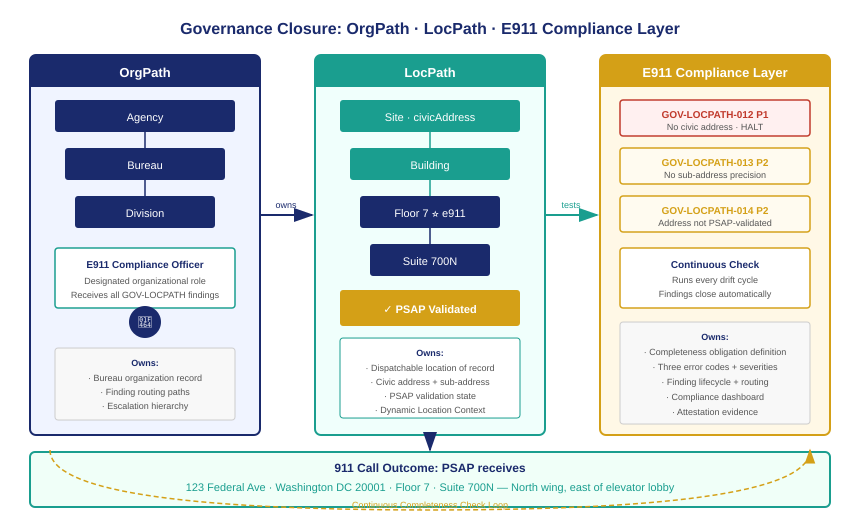

::: {.callout-note}
What does compliant federal E911 look like when the LocPath E911 layer is fully implemented? Every obligated node has a validated dispatchable location of record. The completeness check runs continuously and routes findings to accountable bureaus. RTLS feeds enhance the observational layer without replacing the governed anchor. A 911 call from any extension in the federal estate can tell the PSAP exactly where to send help — floor, room, wing — in the time it takes to establish the call. This chapter closes the governance loop: OrgPath owns the bureau, LocPath owns the location, and the E911 compliance layer owns the completeness obligation that connects them to federal law.
:::

{#fig-governance-closure fig-alt="Three-column diagram on white background. Left column in navy labeled OrgPath: a bureau hierarchy with Agency, Bureau, Division nodes connected by lines, with a Person icon at bottom labeled Bureau Compliance Officer. Center column in teal labeled LocPath: Site, Building, Floor, Space nodes with e911 block icons and a green Validated badge. A call arrow from a Phone icon at Space level points right. Right column labeled PSAP Dispatch: a dispatcher console icon receiving the call arrow, with a location card showing Street Address, Floor 7, Suite 700N, and a green checkmark labeled Dispatchable Location Confirmed. A red compliance loop arrow at the bottom connects all three columns labeled Continuous Completeness Check. White background." width="100%"}

## What the governed state looks like

A federal agency that has fully implemented the LocPath E911 compliance layer operates in a governed state that has five observable properties.

Every obligated LocPath node has a validated civic address inherited from or recorded at the Site or Building level. The address is in the canonical form that the local PSAP's MSAG or NG911 database recognizes. The validation date is current — within the ninety-day revalidation window. GOV-LOCPATH-014 findings are absent.

Every obligated Floor node has a `floorDesignation` field populated with the official floor identifier recognized by the building's facilities records and the fire department's pre-incident plan. Every obligated Space node has a `locationDescription` that a first responder can follow. GOV-LOCPATH-013 findings are absent.

Every obligated node has a designated E911 compliance officer recorded in the LocPath governance metadata. That officer receives findings within the scan cycle that raises them. The officer's bureau is identifiable in the OrgPath hierarchy. Escalation paths are documented and tested.

The Dynamic Location Context for each obligated node carries current observational records from the RTLS sources deployed in that location. The records are within their configured staleness window. Where RTLS is not deployed — ground-floor single-story spaces, outdoor facilities, remote sites — the `dynamicLocationEnabled` flag is false and the absence is documented rather than assumed.

The completeness check runs continuously. There are zero open GOV-LOCPATH-012 findings. P2 findings are acknowledged within five business days and remediated on a tracked timeline.

## The 911 call in the governed state

When an employee dials 911 from a Teams Phone extension registered to Floor 7 of a federal building in the governed state, the following sequence occurs.

The MLTS platform — Teams Direct Routing in this case — initiates a 911 call to the PSAP. Before transmitting the call, the platform queries the Location Information Service (LIS) for the dispatchable location associated with this extension. The LIS returns the governed LocPath record for the Floor 7 node: the civic address, the floor designation "7", the suite label "Suite 700N" from the Space node, and the locationDescription "North wing, suite cluster 700N through 720N, east of the elevator lobby."

The MLTS embeds this location in the SIP INVITE as a PIDF-LO body. The call arrives at the PSAP with the complete dispatchable location in the location header. The PSAP's call-handling system displays the street address, the floor number, and the suite designation on the dispatcher's screen before the dispatcher speaks.

The dispatcher asks the standard question: what is your location? The caller confirms they are on the seventh floor, north wing. The dispatcher has floor 7, suite 700N already displayed. First responders are dispatched with a specific destination.

If the agency has deployed BLE 5.1 beacons on floor 7, the Dynamic Location Context carries a room-level observation accurate to within a few meters. This observation is transmitted as a secondary location update through the ALI database within seconds of the call being established. The PSAP dispatcher's screen refreshes to show a map overlay with the BLE-estimated room position. First responders can narrow their search from the suite cluster to the specific room.

The call takes four minutes and thirty seconds from initiation to first responder arrival on the correct floor. In the ungoverned state — building address only, no floor — the same building required eleven minutes for first responders to reach the correct floor.

## The governance closure

The governance closure that makes this work is three-part, and each part is owned by a distinct UIAO layer.

**OrgPath owns the bureau.** The bureau that operates the federal building is an OrgPath node. The bureau's E911 compliance officer is a recorded organizational role in that node. When a completeness finding is raised on a LocPath node that belongs to this bureau, the routing is deterministic: the finding goes to the compliance officer, whose contact record is in OrgPath. The escalation path — from compliance officer to CISO on P1 timeout — follows the OrgPath hierarchy. If the bureau reorganizes and the compliance officer changes, the OrgPath update propagates automatically to the finding routing configuration.

**LocPath owns the location.** The physical location of every extension is a LocPath node. The node carries the governed dispatchable location of record: civic address inherited from the Site, floor designation at the Floor node, locationDescription at the Space node. The e911 block stamps the obligation, records the validation state, and carries the Dynamic Location Context reference. The LocPath node is the single source of truth for where a 911 call originates. No separate E911 database is maintained. No parallel location system requires synchronization. Every UCaaS platform's LIS is populated from LocPath.

**The E911 compliance layer owns the completeness obligation.** ADR-104 defines the obligation, the three error codes, the check algorithm, and the finding lifecycle. It runs continuously against every obligated node. It closes findings automatically when the condition is resolved. It reports finding history to the E911 compliance dashboard, which provides the evidence base for the agency's compliance attestation under 47 CFR §9.16.

The three layers are complementary and non-overlapping. OrgPath does not attempt to record physical locations; it records organizational structure and ownership. LocPath does not attempt to resolve ownership questions; it records physical locations and their governance state. The compliance layer does not attempt to maintain location records; it checks existing records against defined completeness criteria and routes the results through the organizational hierarchy.

## What remains outside the boundary

The LocPath E911 layer does not own or operate RTLS infrastructure. It reads from it. An agency that wants room-level observational enhancement must deploy UWB anchors, BLE 5.1 beacons, or active RFID readers — that is a facilities and IT infrastructure decision that UIAO does not make on the agency's behalf. UIAO provides the adapter pattern and the Dynamic Location Context schema. The infrastructure is the agency's.

The LocPath E911 layer does not operate the PSAP database. It validates against it. The PSAP database is a public-safety infrastructure resource operated by local, state, or regional emergency services agencies. UIAO queries it for validation; it does not update it. An agency that discovers a civic address is not in the PSAP database must work with the local addressing authority to have the address added — that coordination is outside UIAO's boundary.

The LocPath E911 layer does not replace the UCaaS platform's E911 configuration. Teams Phone, Webex Calling, and RingCentral each have their own E911 configuration workflows in their administrative portals. UIAO's role is to provide the authoritative location data that those workflows consume. The synchronization from LocPath to the platform's LIS is managed by the telephony adapter. If the adapter is not deployed, the platform's E911 configuration may drift from the governed LocPath record — and the drift engine will surface that divergence as a finding.

## The program outcome

Federal agencies that implement the LocPath E911 compliance layer achieve a compliance posture that satisfies 47 CFR §9.16 through governed data rather than manual maintenance. Every 911 call from an obligated MLTS or UCaaS extension transmits a dispatchable location that has been validated against the PSAP database, reviewed for sub-address precision, and tested continuously by the completeness check.

The compliance officer knows, at any moment, how many of the bureau's obligated nodes are in compliant state, how many have open findings, and what the remediation status of each finding is. The evidence for a compliance attestation is in the system — not assembled from disconnected spreadsheets and PBX configuration exports, but produced by the same drift engine that governs every other UIAO surface.

When an employee dials 911 from a federal building in this governed state, the PSAP knows where to send help. That is the outcome the law requires. That is what the governance closure produces.

::: {.callout-tip}
## Return to book index

[← Book_23 Index](Book_23.qmd) · [Series Index](index.qmd)
:::
