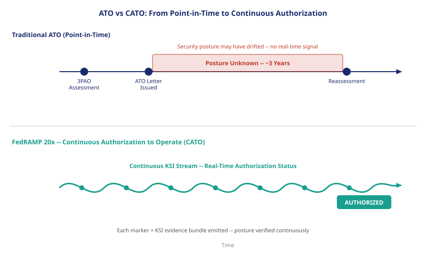

::: {.callout-note}
The traditional FedRAMP process produced a document — a System Security Plan, a 3PAO assessment report, and an ATO letter with a date on it. That date was already history by the time the letter was signed. FedRAMP 20x replaces the letter with a signal: a continuous stream of machine-readable Key Security Indicators that reflect the system's current security posture, not its posture at the last assessment. This chapter explains why the old model failed and what the new one proposes.
:::

{#fig-ato-vs-cato fig-alt="Two horizontal timelines side by side. Left timeline labeled Traditional ATO: assessment event, ATO letter, three-year gap, reassessment event — points connected by a flat line with a red gap zone labeled posture unknown. Right timeline labeled FedRAMP 20x CATO: continuous KSI emission shown as a flowing green signal line with real-time posture markers. White background, navy and teal palette." width="100%"}

## What the traditional process actually produced

The System Security Plan was not a record of what a cloud service actually did. It was a narrative of what the service provider intended to do, written in the vocabulary of NIST SP 800-53 controls and reviewed by a Third Party Assessment Organization hired to validate that intent against observable evidence at a moment in time. The ATO letter that followed was a judgment call: the authorizing official, reviewing the 3PAO's assessment report, decided whether the residual risk was acceptable. If it was, the letter issued.

That letter was the authorization. Not the posture. Not the current state of the system. The letter.

The consequence of treating the letter as the authorization is that the authorization persists even when the posture it described has changed. A CSP could rotate a key team member, deploy a new microservice with different network access patterns, change a database configuration, or onboard a new data type — and none of those changes would touch the ATO letter. The authorizing official had no mechanism to learn that the posture had shifted. The letter remained valid because no one had revoked it.

Annual reviews were supposed to catch this. FISMA requires annual security reviews, and FedRAMP added continuous monitoring requirements to its authorization packages. In practice, those continuous monitoring artifacts — monthly vulnerability scan reports, plan of action and milestones updates, change notifications — were reviewed by already-stretched authorizing officials who had dozens of ATO packages to manage. The continuous monitoring requirement existed on paper. What it produced in practice was a stack of unread scan reports filed against an ATO letter that no one had time to invalidate.

## The pace problem

Cloud environments do not respect assessment schedules. A major cloud service provider makes thousands of configuration changes per day across its infrastructure. The IaaS layer that an agency's application runs on can change its network topology, update its container runtime, rotate its internal service credentials, or patch a kernel vulnerability between the day the 3PAO assessment was conducted and the day the ATO letter was signed — let alone over the three years the letter remained valid.

The pace problem is not unique to cloud infrastructure. It applies equally to the identity estate that the cloud systems serve. A federal bureau's privileged account population changes continuously: accounts are created, credentials are shared, access is expanded for project work and never retracted, accounts are abandoned when employees depart. The MFA coverage that was 100% on the day of the assessment is 97% six months later and 89% a year after that, as new privileged accounts are provisioned without completing the MFA enrollment that the SSP said was required.

The traditional process had no mechanism to surface this drift. The ATO letter said MFA was required. The annual continuous monitoring report might flag that three accounts lacked MFA. Those three accounts might or might not be remediated before the next report. The authorizing official's authorization decision remained unchanged throughout.

The gap between what the authorizing official believed they had authorized — a system with 100% MFA coverage on privileged accounts — and what the system actually had — a drifting identity estate with declining MFA coverage — is the problem that FedRAMP 20x is designed to close.

## What FedRAMP 20x proposes

FedRAMP 20x's central proposition is that authorization should be a function of current security posture, not of the date on a past judgment. To achieve this, the program replaces the assessment-and-letter model with a continuous emission model.

Instead of a 3PAO conducting an assessment, the cloud service provider's own systems emit Key Security Indicators continuously. A KSI is a specific, measurable security outcome — not a narrative of intent, but a measurement of current state. "MFA is required for all privileged accounts" is a control narrative. "Privileged account MFA coverage: 100%, 847/847 accounts, as of 2026-06-18T14:22Z, measured by Entra ID Conditional Access policy evaluation" is a KSI.

The KSIs are machine-readable. They are formatted in OSCAL — the Open Security Controls Assessment Language — and emitted on a continuous schedule defined by the FedRAMP 20x program. Authorizing officials subscribe to the KSI stream. They do not read an SSP once and file the letter. They observe a live feed.

The authorization decision becomes a continuous calculation: if the KSI stream shows all required KSIs passing for a given organizational boundary, that boundary is authorized. If a KSI fails, the authorization for the affected boundary narrows until the KSI is restored. The authorizing official receives a real-time signal, not a periodic report.

## The Minimum Assessment Scope

Continuous demonstration of every NIST SP 800-53 control is not operationally feasible. FedRAMP 20x does not require it. RFC-0006, the Minimum Assessment Scope specification, defines the subset of controls that must be continuously evidenced under the 20x model.

The Minimum Assessment Scope is not a reduction in security requirements. It is a recognition that some controls — the ones that matter most, the ones that are most frequently the vector for security incidents, the ones that are most amenable to automated measurement — can be continuously monitored, while other controls are better governed through periodic review and manual attestation.

The MAS includes the identity and access management controls (MFA coverage, privilege account hygiene, access certification currency), the data protection controls (encryption at rest and in transit, key rotation), and the vulnerability management controls (scan freshness, patch currency for critical CVEs). These are the controls where drift is most consequential and most detectable. They are the controls where a continuous measurement is more valuable than a periodic narrative.

## From letter to signal

The outcome of FedRAMP 20x is a Continuous Authorization to Operate — CATO. The agency does not hold an ATO letter that was issued on a date and expires in three years. It maintains a KSI stream that either passes or fails, and the authorization status is a live function of that stream.

For a federal agency deploying UIAO as its identity governance platform, the CATO is not a new compliance burden. UIAO's drift engine already produces the measurements that KSIs require. The privileged account MFA coverage that UIAO tracks for identity governance purposes is the same measurement that the FedRAMP 20x MFA KSI requires. The difference is the output format: UIAO emits that measurement as a KSI assertion in an OSCAL evidence bundle, and the authorizing official's dashboard reads it as a live authorization signal rather than a line in a quarterly report.

The chapters that follow explain each layer of this pipeline: what KSIs measure and how they are defined, how OSCAL structures the evidence bundle, why OrgPath is what makes KSI assertions precise rather than aggregate, and what a live CATO looks like for a federal agency that has instrumented its identity estate through UIAO.

The ATO letter was a document. The CATO is a signal. The difference is not procedural — it is the difference between knowing what the security posture was at a point in the past and knowing what it is now.

::: {.callout-tip}
## Continue reading

[Chapter 2 — Key Security Indicators — What Gets Measured →](Book_24_CPT_02.qmd)
:::
