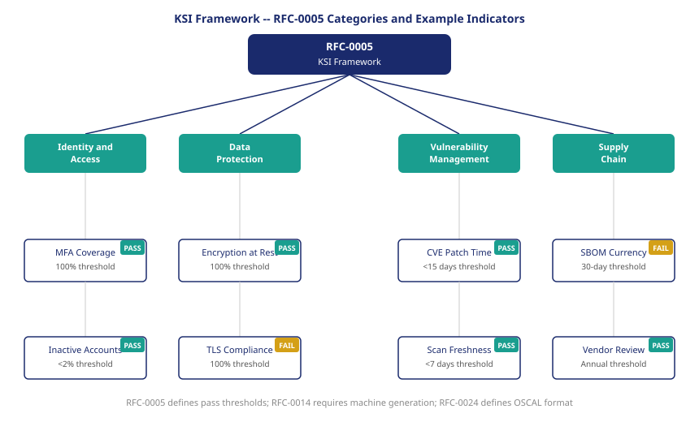

::: {.callout-note}
A control narrative says "the organization has implemented a process for managing privileged account credentials." A Key Security Indicator says "privileged account MFA coverage: 97.3%, as of 14:22 UTC." The difference is the difference between a promise and a measurement. FedRAMP 20x is built on measurements.
:::

{#fig-ksi-hierarchy fig-alt="Hierarchical diagram showing RFC-0005 at top, branching to four KSI categories: Identity and Access, Data Protection, Vulnerability Management, and Supply Chain. Each category shows two example KSIs as labeled boxes with a binary pass/fail indicator. White background, navy and teal palette." width="100%"}

## Why control narratives are not enough

NIST SP 800-53 contains more than one thousand control statements. Each one describes a security practice that an organization should implement. The statements are written in natural language, at a level of abstraction that accommodates the full range of federal agency technology environments — from mainframes to mobile devices, from air-gapped classified networks to public-facing web services.

That abstraction is a feature for the purposes of a control framework. It allows a single document to apply across an enormous range of contexts. It becomes a liability when the goal is continuous, machine-comparable authorization.

Consider control AC-2(2), which requires that organizations automatically disable or remove temporary and emergency accounts after an organization-defined time period. An SSP narrative for this control might read: "The organization disables temporary accounts within 24 hours of the defined period's expiration using automated account management features in Active Directory." That narrative is unverifiable without examining the Active Directory configuration and the account management policies. It says nothing about whether any temporary accounts are currently active beyond their authorized period. It says nothing about how many such accounts exist, or when the last one was reviewed.

A KSI for the same underlying security outcome reads differently: "Temporary accounts active beyond authorized period: 0, as of scan timestamp, total temporary account population: 47." That is a measurement. It can be compared against the threshold (0). It can be trended over time. It can be compared across organizational boundaries. It can be consumed by a machine without interpretation.

## The KSI concept

A Key Security Indicator has three defining properties that distinguish it from a control narrative.

The first is specificity. A KSI measures one thing. It does not describe a program or a process; it measures a current state. "MFA coverage on privileged accounts" is not a program description — it is a count of privileged accounts divided by the count of privileged accounts with MFA enforced. The measurement is computable from observable system state.

The second property is machine generation. RFC-0014, the FedRAMP 20x automation requirements specification, requires that KSIs be generated by automated systems, not manually attested. A KSI that is produced by running a query against an identity management system is a KSI. A KSI that is produced by a security officer filling out a form is not — it is a manual attestation, and it carries the same reliability limitations as the SSP narrative it replaces.

The third property is a binary pass threshold. Each KSI has a defined threshold that it either meets or does not. There is no partial credit. A KSI for MFA coverage on privileged accounts with a threshold of 100% either passes (all privileged accounts have MFA) or fails (at least one does not). This binary structure is what makes KSIs machine-comparable: an authorizing official's dashboard does not need to interpret the measurement — it reads pass or fail.

## The RFC-0005 framework

RFC-0005, the FedRAMP 20x KSI framework specification, organizes KSIs into four categories that together cover the Minimum Assessment Scope defined in RFC-0006.

The Identity and Access category covers the controls most directly relevant to who can access what. MFA coverage on privileged accounts, inactive privileged account rates, service account rotation compliance, and access review currency all fall here. These are the KSIs that UIAO's identity governance engine is most directly positioned to emit.

The Data Protection category covers encryption at rest and in transit, key rotation, and data classification compliance. These KSIs are emitted by the cloud service provider's infrastructure layer, but the scope of what must be encrypted is determined by the OrgPath boundaries that define what data belongs to which bureau.

The Vulnerability Management category covers the speed and completeness of the organization's response to known vulnerabilities. Scan freshness — how recently the environment was fully scanned — and patch currency — how quickly critical CVEs are remediated — are the primary KSIs here. These are areas where drift is fast and the consequences of falling behind are well-documented.

The Supply Chain category covers the organization's awareness and management of its software dependencies. Software Bill of Materials currency and vendor authorization review currency are the primary KSIs. These are newer additions to the continuous authorization surface, reflecting the lessons of supply chain compromises in the federal environment over the past several years.

## KSI examples across the Minimum Assessment Scope

The following table illustrates representative KSIs from each category, with the measurement methodology and pass threshold:

| Category | KSI | Measurement | Pass Threshold |
|---|---|---|---|
| Identity and Access | Privileged account MFA coverage | % of privileged accounts with MFA enforced | 100% |
| Identity and Access | Inactive privileged account rate | % of privileged accounts with no activity in 30 days | < 2% |
| Data Protection | Encryption at rest coverage | % of data stores with encryption enabled | 100% |
| Data Protection | TLS version compliance | % of endpoints enforcing TLS 1.2+ | 100% |
| Vulnerability Management | Critical CVE mean time to patch | Days from CVE publication to patch deployment | < 15 days |
| Vulnerability Management | Scan freshness | Days since last full vulnerability scan | < 7 days |

The threshold values in this table are illustrative. The actual thresholds for a given authorization package are defined in the authorization agreement between the authorizing official and the cloud service provider. The structure — one measurement, one threshold, one binary outcome — is fixed by RFC-0005 regardless of the specific threshold values.

## Why KSIs are better than control narratives

The advantages of KSIs over control narratives for continuous authorization are structural, not incidental.

A control narrative is a claim about a process. A KSI is a measurement of an outcome. Processes can be correctly described and incorrectly executed. Outcomes either exist or they do not. The ATO process required authorizing officials to trust that the process described in the SSP was actually running as described. The KSI process requires only that the measurement be verified — that the system queried to produce the KSI is the actual production system, not a test environment, and that the query logic correctly reflects the control intent.

RFC-0014's machine-generation requirement addresses the second concern: a KSI produced by a system query is directly tied to the production environment's current state. It cannot be optimistic. It cannot describe a goal rather than a reality. If the query returns 847 privileged accounts with MFA enforced and 0 without, the KSI passes. If it returns 846 and 1, it fails. The measurement is the authorization signal.

The binary pass threshold addresses the comparability problem. An authorizing official managing a portfolio of cloud service authorizations does not need to exercise judgment about whether 97% MFA coverage is acceptable given the mitigating controls described in section 6.3 of the SSP. The threshold is defined. The measurement is taken. The result is pass or fail. The authorizing official's attention is directed toward the failures — the KSIs that are not passing — rather than toward interpreting a stack of narratives.

This is not a reduction in the authorizing official's role. It is a redirection of that role toward the decisions that require human judgment: what remediation timeline is acceptable for a failing KSI, whether a conditional authorization is appropriate given a partial KSI failure, and when a critical KSI failure requires suspending operations in the affected boundary. Those are judgment calls. The measurement that surfaces the need for those judgment calls is a machine function.

::: {.callout-tip}
## Continue reading

[Chapter 3 — OSCAL and the Evidence Bundle ->](Book_24_CPT_03.qmd)
:::
