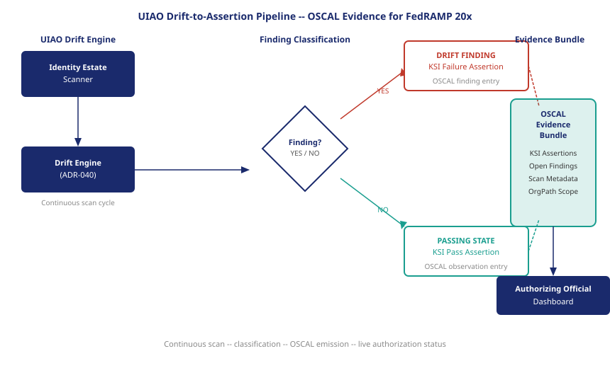

::: {.callout-note}
UIAO already generates OSCAL artifacts from drift findings. Every time the drift engine resolves a finding, it produces a remediation event. Every time the drift engine finds a passing state, it produces a KSI assertion. The FedRAMP 20x evidence bundle is not a new output format — it is the existing UIAO output, read through the lens of continuous authorization.
:::

{#fig-drift-to-bundle fig-alt="Flow diagram: left side shows UIAO drift engine scanning identity estate, producing findings. Middle shows findings routing to two paths: FAIL findings become drift-finding OSCAL entries; PASS states become KSI assertion OSCAL entries. Right side shows both paths merging into an evidence bundle consumed by an Authorizing Official dashboard. White background, navy and teal palette." width="100%"}

## OSCAL as the machine-readable authorization language

The Open Security Controls Assessment Language is a NIST-defined set of machine-readable document formats for security documentation. Before OSCAL, the primary artifact of a federal security authorization was a Word document — the System Security Plan — supplemented by spreadsheets, PDF assessment reports, and email attachments. None of those formats were machine-readable in any useful sense. A human could read them; a compliance management system could store them; but no automated process could extract the authorization-relevant content and act on it without custom parsing logic built for each SSP template.

OSCAL provides six structured document models that cover the full authorization lifecycle: the System Security Plan, the Security Assessment Plan, the Security Assessment Results, the Plan of Action and Milestones, the Component Definition, and the Profile. Each model is available in JSON, XML, and YAML. Each has a defined schema with validation rules. A system that consumes an OSCAL assessment results document can extract every finding, every KSI assertion, and every remediation event without writing a parser for a particular SSP author's formatting preferences.

RFC-0024, the FedRAMP 20x evidence format specification, requires that all KSI evidence be submitted in OSCAL format — specifically as Assessment Results documents. This is not a new requirement invented for 20x; NIST and FedRAMP have been building toward OSCAL as the authorization standard for several years. The 20x program makes it mandatory rather than optional, and it specifies the cadence: KSI evidence bundles must be emitted continuously, not on an annual schedule.

## How UIAO already generates OSCAL

UIAO's drift engine, specified in ADR-040, produces structured finding records as its primary output. A finding record contains the finding type, the affected identity subjects (identified by OrgPath), the severity, the detection timestamp, the expected state, and the actual state. These fields map directly to the OSCAL assessment-results finding schema.

When the drift engine detects that a privileged account in the HHS:CMS OrgPath boundary lacks MFA enforcement, it produces a finding record: finding type DRIFT-IDENTITY::mfa-not-enforced, affected subject the specific account, severity P2, detection timestamp, expected state MFA-enforced, actual state MFA-not-enforced. That record, translated into OSCAL, is an assessment-results observation with a finding entry linked to a specific control reference.

UIAO already performs this translation for its existing compliance reporting outputs. The ADR-106 FedRAMP 20x integration extends that translation to produce KSI assertions alongside the existing finding records. The extension does not change the drift engine's core logic; it adds an output path that formats the engine's results as OSCAL evidence for the FedRAMP 20x evidence bundle.

## From drift finding to KSI assertion

The key insight of the ADR-106 integration is that a drift scan produces two types of output, both of which are evidence.

The first type is a finding: the drift engine identified a deviation from expected state. A finding in the UIAO schema is a drift event. In the OSCAL schema, it is an assessment-results finding with an open status. In the FedRAMP 20x model, it is a KSI failure — the KSI that corresponds to the finding's control coverage fails for the organizational boundary that contains the affected subject.

The second type is a passing assertion: the drift engine scanned a population and found no deviations. This is not the absence of a finding; it is a positive assertion. When the drift engine scans all privileged accounts in the DOD:DISA OrgPath boundary and finds that all 847 carry valid MFA enforcement, the scan produces an assertion: "MFA KSI — DOD:DISA boundary — 847/847 — PASS — 2026-06-18T14:22Z." In OSCAL, this is an assessment-results observation with a satisfied status. In the FedRAMP 20x model, it is a passing KSI assertion for the DOD:DISA authorization scope.

Traditional compliance reporting only generates output on findings — things that are wrong. Continuous authorization requires output on passing states as well, because the authorizing official needs to know not just what is failing but what is currently passing and when it was last verified. A KSI that passed six weeks ago and has not been reasserted since is not a current authorization signal; it is stale evidence. RFC-0014 requires that KSI assertions be current within defined windows, typically 24 to 72 hours depending on the KSI category.

## The evidence bundle structure

An OSCAL evidence bundle for FedRAMP 20x contains four categories of content.

The assessment scope defines which organizational boundaries were covered by the scan that produced this bundle. In UIAO's implementation, the scope is expressed as a set of OrgPath boundaries: the specific bureau or bureau-cluster that the scan covered, the population size within that boundary, and the scan mechanism that was used. The scope is what allows an authorizing official to verify that the evidence covers the boundaries they need to authorize.

The KSI assertions are the passing findings — the positive statements that specific KSIs are currently met within specific OrgPath boundaries. Each assertion includes the KSI identifier, the OrgPath scope, the measurement value, the pass threshold, the pass/fail result, and the timestamp. These are the primary authorization signals for boundaries where all KSIs pass.

The open findings are the failing KSIs — the current deviations from expected state that are preventing full KSI coverage. Each finding includes the same structural elements as the assertion, plus the expected remediation timeline and the current status of any remediation activity. These drive the CATO status for affected boundaries.

The evidence metadata records when the bundle was generated, by what version of the UIAO drift engine, against what version of the OrgPath schema, and covering what scan period. This metadata is what allows an authorizing official's platform to determine whether a bundle is current or stale, and to detect gaps in the continuous emission schedule.

## What the authorizing official sees

When an authorizing official subscribes to a UIAO-generated FedRAMP 20x evidence bundle stream, they receive a continuously updated view of the authorization surface they are responsible for. They do not receive a document to read; they receive a structured data feed that their authorization management platform consumes and presents as a dashboard.

The dashboard presents authorization status at the OrgPath boundary level: each bureau boundary is either AUTHORIZED (all KSIs passing), CONDITIONAL (some non-critical KSIs failing, remediation in progress), or SUSPENDED (a critical KSI is failing). The dashboard shows the current KSI state for each category within each boundary, the trend over the past review period, and the open findings with their remediation timelines.

The authorizing official's role shifts from reading a document to monitoring a signal and acting on exceptions. When a boundary moves from AUTHORIZED to CONDITIONAL, the authorizing official receives an alert with the specific KSI failure, the affected population, and the remediation deadline. Their decision is not "is this system authorized" — that determination is made continuously by the KSI engine — but "is the remediation plan adequate, and does the conditional status require any operational restrictions while remediation proceeds."

The evidence bundle is the FedRAMP 20x authorization artifact. It replaces the SSP, the 3PAO report, and the ATO letter as the primary record of authorization status. It is more current, more precise, and more actionable than any of those documents — not because it is more thorough, but because it measures the present rather than describing the past.

::: {.callout-tip}
## Continue reading

[Chapter 4 — OrgPath as the Authorization Scope ->](Book_24_CPT_04.qmd)
:::
