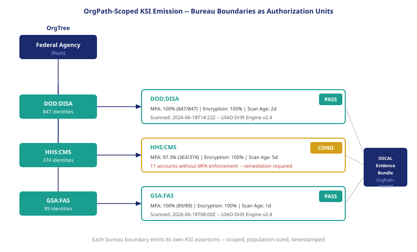

::: {.callout-note}
A Key Security Indicator without an organizational scope is a statistic about an undefined population. "All privileged accounts use MFA" is a claim about every privileged account in a cloud service provider's environment — but an authorizing official needs to know whether the privileged accounts in their agency's boundary use MFA. OrgPath is what makes the difference between a claim and a scoped assertion.
:::

{#fig-orgpath-scope fig-alt="Diagram showing an OrgTree with three bureau nodes: DOD:DISA, HHS:CMS, and GSA:FAS. Each bureau node has an arrow pointing to a KSI assertion box labeled with the bureau name and a pass/fail status. The three assertion boxes merge into a single evidence bundle on the right. White background, navy and teal palette." width="100%"}

## The scoping problem with unscoped KSIs

A cloud service provider that hosts workloads for multiple federal agencies has a single identity estate — one Entra ID tenant, one set of conditional access policies, one Privileged Identity Management configuration. When that CSP emits a KSI for MFA coverage on privileged accounts, the measurement covers the entire tenant. It does not distinguish between the accounts that belong to Agency A's boundary and the accounts that belong to Agency B's.

This creates a scoping problem that is worse than it first appears. Suppose the CSP's MFA KSI reads 99.1% — just short of the 100% threshold, one account without MFA in a population of 112. That one account might be in Agency A's boundary or it might be in Agency B's. From the CSP's aggregate KSI, neither authorizing official can tell. Agency A's authorizing official does not know whether the failing account is in their scope. Agency B's authorizing official has the same uncertainty.

The aggregate KSI is not useless — it tells the CSP that something needs fixing. But for the purpose of an authorizing official making an authorization decision about a specific agency boundary, it is insufficient. Authorization is not a judgment about the whole CSP environment. It is a judgment about whether the environment within the agency's boundary meets the required security posture. Without a scope, the KSI does not answer that question.

## How OrgPath defines the authorization boundary

OrgPath's fifteen-facet model (ADR-035) assigns every identity object a position in the organizational hierarchy. The OrgPath label for a privileged account in the Defense Information Systems Agency includes the agency identifier (DOD), the bureau identifier (DISA), and the organizational position within DISA. The label is deterministic — it is derived from the authoritative HR and organizational data sources (ADR-088), not from the account's directory OU placement, which is known to drift.

When UIAO scans for MFA compliance, it scans by OrgPath boundary. The scan for the DOD:DISA boundary evaluates every identity object whose OrgPath label contains DOD:DISA. The scan for the HHS:CMS boundary evaluates every identity object whose OrgPath label contains HHS:CMS. These scans are logically separate even if the underlying identity objects live in the same directory tenant.

The OrgPath label is the authorization scope boundary. It is not an approximation of the boundary; it is the boundary. Every identity object that should be in scope for the DOD:DISA authorization is labeled DOD:DISA. Every identity object that should be in scope for the HHS:CMS authorization is labeled HHS:CMS. If an object lacks an OrgPath label, it is a governance gap — a DRIFT-IDENTITY::no-orgpath finding — and the lack of a label itself becomes a KSI failure for identity coverage.

## Bureau boundaries as the unit of authorization

The bureau is the right unit of authorization not because of how the identity system works, but because of how federal accountability works.

Bureau boundaries in the federal government correspond to FISMA reporting boundaries. Each bureau files its own FISMA annual report. Each bureau has a designated Chief Information Security Officer who is accountable for that bureau's security posture. Each bureau has its own budget authority and its own risk appetite, within the constraints set by department-level policy. The lines of accountability that the authorization process is designed to reflect are bureau lines.

When OrgPath defines bureau boundaries deterministically — when every identity object in DISA is labeled DOD:DISA and no identity object that is not in DISA carries that label — the authorization scope is the accountability scope. The authorizing official for the DOD:DISA boundary is making an authorization decision about exactly the population they are accountable for. They are not making a judgment about a broader environment and trying to infer what it means for their piece of it.

This alignment between authorization scope and accountability scope is what makes FedRAMP 20x actionable for agencies rather than just operationally convenient for CSPs. The agency's authorizing official does not need to reason about the CSP's full identity estate. They need to know whether the identity objects in their bureau's OrgPath scope are meeting the KSI thresholds. UIAO produces that answer directly.

## KSI assertion precision — from claim to evidence

The difference between a claim and an OrgPath-scoped KSI assertion is the difference between a sentence that cannot be verified and a record that can be audited.

Consider the contrast:

| KSI | Unscoped Assertion | OrgPath-Scoped Assertion |
|---|---|---|
| Privileged MFA coverage | "All privileged accounts use MFA" | "DOD:DISA privileged accounts: 100% MFA, 847/847 accounts, cycle N, 2026-06-18T14:22Z" |
| Inactive account rate | "Inactive privileged accounts < 2%" | "HHS:CMS inactive privileged accounts: 0.8%, 3/374, evidenced by OrgPath access review cycle 2026-Q2" |
| Encryption at rest | "All data stores encrypted" | "GSA:FAS data stores: 100% encrypted, 23/23, last scanned 2026-06-17T08:00Z" |

An OrgPath-scoped KSI assertion includes five elements: the OrgPath boundary (what was in scope), the population size (how many subjects were evaluated), the pass count (how many met the threshold), the scan timestamp (when the measurement was taken), and the scan mechanism (what system produced the measurement). All five elements are necessary for the assertion to be evidence rather than a claim.

The population size matters because a KSI can only be meaningful if the scope is known. A 100% MFA KSI for a boundary with 847 accounts is a different assertion from a 100% MFA KSI for a boundary with 2 accounts — the second might reflect that only 2 privileged accounts were discovered, not that the boundary has a small and well-governed privileged account population. The population size is what allows the authorizing official to verify that the scan covered the accounts they expected to be in scope.

The scan mechanism matters because RFC-0014 requires machine generation. The assertion must name the system that produced the measurement — in UIAO's case, the specific collector module and version, the identity provider it queried, and the OrgPath schema version against which the boundary was defined. This chain of custody is what allows the authorizing official to verify that the assertion is a current machine measurement rather than a manual attestation.

## Cross-boundary aggregation

A department-level authorization — covering all bureaus within a department — is an aggregation of bureau-level KSI assertions. UIAO supports cross-boundary aggregation by treating the department OrgPath node as a container: the department's KSI status is the worst-case status across all its bureau children.

This means that a critical KSI failure in one bureau does not automatically fail the entire department authorization. The department's aggregate CATO status reflects the failure, but the bureaus that are fully authorized remain authorized at their level. An authorizing official with department-wide scope sees both the aggregate status and the per-bureau breakdown.

Cross-boundary aggregation also enables anomaly detection that is not possible with unscoped KSIs. When DOD:DISA passes its MFA KSI at 100% and DOD:DARPA fails at 91%, the discrepancy is visible at the department level. The aggregation does not hide the failure behind the passing bureaus — it surfaces it. The department-level dashboard shows which bureau is failing and by how much, directing the authorizing official's attention to the right place.

This is the structural argument for OrgPath as the authorization scope: it makes the right comparisons possible. Not "is the CSP's overall environment acceptable" but "is this bureau's security posture meeting its KSI thresholds, and how does it compare to the other bureaus in the same department with the same baseline requirements." OrgPath makes both the precision and the comparison possible.

::: {.callout-tip}
## Continue reading

[Chapter 5 — CATO — Continuous Authorization in Practice ->](Book_24_CPT_05.qmd)
:::
