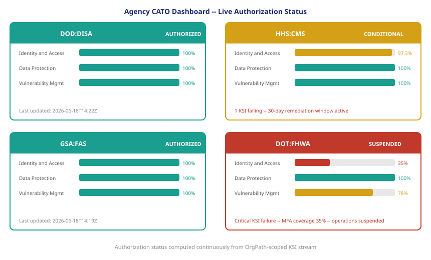

::: {.callout-note}
A Continuous Authorization to Operate is not an ATO letter with a shorter expiration date. It is a live authorization status that reflects the current state of the KSI stream. When a KSI passes, the authorization is affirmed. When a KSI fails, the authorization narrows — the scope of what is authorized contracts to the boundaries where KSIs still pass. The agency does not wait for an assessment to know its posture; it watches its own KSI stream.
:::

{#fig-cato-dashboard fig-alt="Dashboard mockup showing four bureau panels: DOD:DISA (green, AUTHORIZED), HHS:CMS (amber, CONDITIONAL — 2 KSIs failing), GSA:FAS (green, AUTHORIZED), DOT:FHWA (red, SUSPENDED — MFA KSI critical failure). Each panel shows KSI category bars. White background, navy, teal, amber, red palette." width="100%"}

## What CATO replaces

The traditional ATO was binary and static. A system either held an ATO or it did not. Once issued, the ATO remained valid until it was revoked, expired, or the system went through a significant change that required a new assessment. In practice, ATOs were rarely revoked proactively — the process for revocation was as resource-intensive as the process for issuance, and under-resourced authorizing officials deferred revocation decisions in the absence of a specific incident that forced the question.

The resource constraint was not a failure of intent. It was a structural consequence of the process design. An authorizing official responsible for fifty ATO packages, each supported by thousands of pages of SSP documentation, cannot actively monitor all fifty systems for posture changes. The ATO letter was the artifact that allowed the authorizing official to delegate ongoing monitoring to the continuous monitoring requirement and trust that findings would be reported up the chain.

The continuous monitoring requirement did not work as designed because it produced the same artifacts — scan reports, POAM updates, quarterly reports — that required the same human interpretation as the original assessment. The volume of continuous monitoring output exceeded the capacity to read it. Security teams learned to produce the artifacts; authorizing officials learned to file them. Neither action improved the security posture signal.

CATO replaces this cycle with a different structure. The monitoring output is not a report to be read; it is a KSI stream to be subscribed to. The authorizing official does not review the stream manually — their authorization management platform reads the OSCAL evidence bundles and computes the authorization status automatically. The authorizing official receives alerts when the status changes, not stacks of reports to review on a schedule.

## The live authorization status

The CATO status for an OrgPath boundary has four levels, defined by the KSI state of that boundary:

| Status | Condition | Agency Action |
|---|---|---|
| AUTHORIZED | All KSIs passing within scope | Normal operations |
| CONDITIONAL | 1-2 non-critical KSIs failing; remediation plan in place | Restricted operations; 30-day remediation window |
| SUSPENDED | Critical KSI failure (e.g., MFA KSI < 95% coverage) | Operations suspended in affected boundary pending remediation |
| REVOKED | Critical KSI failure unresolved > 72 hours | Authorization revoked; incident response required |

The status levels are not judgments made by the authorizing official in real time. They are pre-negotiated thresholds, defined in the authorization agreement between the authorizing official and the cloud service provider, that are applied automatically by the authorization management platform when the KSI evidence bundle is processed. The authorizing official pre-approved the logic at authorization time; the platform executes it continuously.

This pre-negotiation is what makes CATO operationally feasible for authorizing officials with large portfolios. They do not need to review each KSI failure individually and decide what it means for the authorization. They need to make the policy decision once — at what KSI threshold level does the authorization become CONDITIONAL, SUSPENDED, or REVOKED — and then receive alerts when that threshold is crossed.

## Drift findings as KSI failures

UIAO's drift engine produces findings when it detects a deviation from expected identity state. In the UIAO governance model, a finding is a governance event that requires disposition: the bureau's identity governance contact receives the finding, evaluates it, and either remediates the deviation or accepts the risk through the waiver process.

In the FedRAMP 20x model, a finding is also a KSI failure. The mapping is direct: each UIAO finding type corresponds to one or more KSIs in the RFC-0005 catalog. A DRIFT-IDENTITY::mfa-not-enforced finding is a failure for the Identity and Access — MFA Coverage KSI. A DRIFT-LIFECYCLE::rotation-overdue finding is a failure for the Identity and Access — Service Account Rotation KSI. The finding type determines which KSI fails; the OrgPath boundary of the affected subjects determines which authorization boundary is affected.

This mapping means that UIAO's existing finding classification system is already a KSI classification system. When UIAO produces a finding for a privileged account in the HHS:CMS boundary, it simultaneously degrades the HHS:CMS CATO status for the corresponding KSI. The governance event and the authorization event are the same event, represented in two vocabularies: the UIAO drift finding schema and the FedRAMP 20x KSI assertion schema.

For the bureau's identity governance team, this means that the remediation they were already doing for governance purposes is also remediation for CATO purposes. They do not have a separate compliance activity to manage alongside their governance work. The governance work is the compliance work. Fixing the finding fixes the KSI failure and restores the authorization status.

## Remediation as KSI recovery

When a drift finding is remediated — when the affected identity subjects are brought back into the expected state — the drift engine detects the change on its next scan cycle and clears the finding. The cleared finding produces a remediation event in the UIAO schema, which maps to an OSCAL assessment-results remediation record.

The remediation record includes the finding that was resolved, the OrgPath boundary, the before-state, the after-state, and the timestamp of the clearing scan. This record is included in the next KSI evidence bundle as a remediation entry associated with the corresponding KSI failure record. The authorizing official's platform reads the bundle, processes the remediation entry, and updates the CATO status for the affected boundary.

If the remediated finding was the only KSI failure in the boundary, the boundary's CATO status moves from CONDITIONAL back to AUTHORIZED. If other failures remain, the status reflects the worst remaining failure. The status update is automatic; the authorizing official is notified but does not need to take an action to restore the authorization.

The full evidentiary chain — from the original finding, through the remediation activity, to the clearing scan, to the KSI recovery assertion, to the CATO status update — is preserved in the OSCAL evidence bundle. An inspector general or oversight body reviewing the authorization record for a given period can trace exactly which KSIs failed, when they failed, what remediation was performed, and when the KSI was restored. The authorization is not just continuous; it is continuously auditable.

## The bureau-level authorization contract

The operational consequence of bureau-level CATO is that the authorization is as precise as the organizational boundary. A critical KSI failure in one bureau does not suspend the entire agency. It suspends the affected bureau's authorization while the other bureaus continue operating under their own CATO status.

This precision changes the operational calculus for identity governance teams. Under the traditional ATO model, a finding that could theoretically affect the agency's authorization was often deprioritized because the connection between a specific finding and the ATO status was not clear. The ATO would remain valid until the annual reassessment regardless of whether the finding was remediated.

Under CATO, the connection is direct and immediate. A finding in the HHS:CMS boundary that triggers a critical KSI failure suspends the HHS:CMS authorization. The bureau's governance team has a 72-hour window to remediate before the status moves to REVOKED. The operational consequences of failing to remediate are immediate and bureau-specific. The finding is no longer an item on a compliance backlog; it is an authorization timer.

This is the intended effect of FedRAMP 20x. The authorization process should create real incentives for maintaining the security posture that the authorization is based on. When the ATO letter persists regardless of posture changes, the incentive structure is wrong. When the CATO status degrades in real time as KSIs fail and restores as they are remediated, the incentive to maintain the posture is direct and continuous.

::: {.callout-tip}
## Continue reading

[Chapter 6 — FedRAMP 20x and the AI Surface ->](Book_24_CPT_06.qmd)
:::
