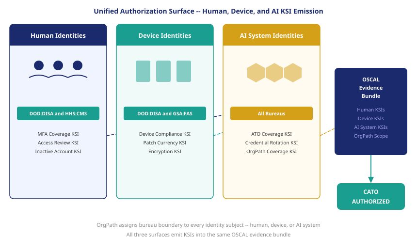

::: {.callout-note}
Book_21 established that AI systems in the federal identity estate are governed by the same OrgPath substrate as human and device identities. FedRAMP 20x establishes that AI systems in scope for FedRAMP must emit Key Security Indicators, not just hold an ATO letter. These two facts converge: the DRIFT-COMPLIANCE::ai-ato-gap finding from Book_21 is a KSI failure in the 20x model, and OrgPath scopes the AI system KSI the same way it scopes the human-identity KSI.
:::

{#fig-unified-surface fig-alt="Three vertical swim lanes: Human Identities, Device Identities, AI System Identities. Each swim lane shows OrgPath-labeled identity objects emitting KSI signals (shown as colored pulses). All three signal streams converge into a single OSCAL evidence bundle flowing to a CATO authorization dashboard. White background, navy and teal palette." width="100%"}

## The AI surface in FedRAMP scope

The traditional FedRAMP authorization model treated AI systems as workloads running on an authorized cloud platform. If the platform held an ATO, the workloads on it were covered by the platform's authorization — or, more precisely, they were expected to inherit the platform's security controls and not introduce new risks that were outside the platform's authorization boundary. In practice, this meant that AI systems were authorized by association, not by direct assessment.

This coverage-by-association model was already strained before FedRAMP 20x. An AI system that processes federal PII, makes decisions that affect federal benefit eligibility, or operates autonomously within the federal network is not simply a workload consuming platform resources. It has its own identity surface: it runs under service accounts, it calls APIs with credentials, it stores outputs in data stores, it may call external services. Each of those interactions is an authorization surface that the platform ATO does not cover in any meaningful sense.

FedRAMP 20x closes this gap structurally. Under the 20x model, the authorization subject is not the platform — it is every system that processes federal data within the platform boundary, and each system must emit KSIs that demonstrate its specific security posture. An AI system cannot be authorized by the platform's MFA KSI assertion; it must emit its own KSI assertions for the credentials it operates under, the data it processes, and the access it exercises.

This is a significant change from the traditional model, and it applies to the full population of federal AI systems. The OMB 2025 AI Use Case Inventory records 1,480 live federal AI systems. Each of those systems that runs within a FedRAMP-authorized cloud boundary is now an authorization subject, not just a workload.

## DRIFT-COMPLIANCE::ai-ato-gap as a KSI failure

Book_21 introduced the DRIFT-COMPLIANCE::ai-ato-gap finding type for AI systems in the federal identity estate that lack a current Authorization to Operate. Under the traditional model, this finding was a governance gap — a compliance item that required resolution through the authorization process, but one that did not have an immediate operational consequence for the platform's ATO status.

Under FedRAMP 20x, the ai-ato-gap finding is a KSI failure. The AI system ATO coverage KSI — the percentage of in-scope AI systems with a current authorization — fails for every system that carries an ai-ato-gap finding. If a bureau has twelve deployed AI systems and three lack a current authorization, the AI ATO coverage KSI for that bureau's OrgPath boundary reads 75%, well below the 100% pass threshold. The bureau's CATO status for the Identity and Access category becomes CONDITIONAL.

This transition from governance gap to authorization consequence changes the operational priority of the ai-ato-gap finding. Under the traditional model, the finding competed with other compliance items for remediation resources. Under 20x, the finding has a direct effect on the bureau's live authorization status. The identity governance team and the authorizing official are both motivated to remediate it, and the CATO system provides a countdown: if the finding is not cleared within the conditional authorization window, the bureau's authorization moves to SUSPENDED.

The ai-ato-gap finding is not the only AI governance finding with CATO consequences. A DRIFT-IDENTITY::no-orgpath finding for an AI system — the system has no OrgPath label and therefore cannot be assigned to any authorization boundary — is a KSI failure for the AI system OrgPath coverage KSI. A DRIFT-LIFECYCLE::rotation-overdue finding for an AI service account is a KSI failure for AI credential rotation compliance. Every AI governance finding in the UIAO finding taxonomy maps to a KSI failure in the FedRAMP 20x catalog.

## AI-specific KSIs under FedRAMP 20x

The RFC-0005 KSI framework applies to AI systems through the same four categories that apply to human and device identities — Identity and Access, Data Protection, Vulnerability Management, and Supply Chain. The specific KSIs within those categories have AI-specific expressions:

| KSI | Measurement | Pass Threshold | Finding Type if Failing |
|---|---|---|---|
| AI system ATO coverage | % of in-scope AI systems with current authorization | 100% | DRIFT-COMPLIANCE::ai-ato-gap |
| AI credential rotation compliance | % of AI service accounts meeting rotation policy | 100% | DRIFT-LIFECYCLE::rotation-overdue |
| AI system OrgPath coverage | % of AI systems with valid OrgPath assignment | 100% | DRIFT-IDENTITY::no-orgpath |
| Agentic AI access review currency | % of agentic AI systems with access review < 90 days | 100% | DRIFT-ACCESS::review-overdue |
| AI system owner assignment | % of AI systems with a named owner record | 100% | DRIFT-IDENTITY::no-owner |

The agentic AI access review KSI deserves particular attention. Agentic AI systems — systems that act autonomously with minimal human intervention, including the 90 agentic systems in the 2025 OMB inventory — have the highest blast radius in the federal AI population. A compromised agentic system runs continuously, at machine speed, until detected. The access review KSI requires that every agentic AI system's permissions be reviewed on a 90-day cycle. If an agentic system's review is overdue, the KSI fails and the bureau's CATO status for that system's boundary degrades.

The 90-day review cadence for agentic AI is more stringent than the standard access review cadence for non-agentic AI systems. This reflects the risk differential: an agentic system with stale access permissions represents a larger and faster-moving risk than a human account with the same staleness. The KSI threshold encodes that risk judgment in a measurable, enforceable form.

## OrgPath unifies the authorization surface

The reason OrgPath is the right foundation for the FedRAMP 20x AI surface is the same reason it is the right foundation for the human and device surfaces: it is substrate-agnostic. OrgPath does not distinguish between an identity object that represents a human employee, a managed laptop, or an AI system. It assigns organizational placement to any identity object that carries an OrgPath label.

When UIAO's discovery feed ingests an AI system from the OMB inventory, it derives the OrgPath label from the bureau field in the inventory record — the same derivation mechanism it uses for devices discovered through Intune or Defender (ADR-038). The AI system gets a label: DOD:DISA:AISystems:NLP-Mission-Planner-01. That label places the system in the DOD:DISA authorization boundary. Its KSI assertions are scoped to DOD:DISA. Its governance findings are routed to the DOD:DISA identity governance contact. Its deprovisioning workflow follows the DOD:DISA lifecycle policy.

This substrate-agnosticism is what enables the unified authorization surface. The CATO dashboard for DOD:DISA shows a single authorization status that reflects the KSI state of all identity objects in the DOD:DISA boundary: human accounts, device identities, and AI system identities. A failure in any surface degrades the overall status. A clean state in all surfaces produces a unified AUTHORIZED status.

The alternative — a separate authorization track for AI systems, with separate KSI categories, a separate evidence bundle, and a separate CATO status — would recreate the visibility problem that UIAO is designed to solve. If the AI authorization surface is separate from the human and device surfaces, the authorizing official sees three partial pictures rather than one complete one. OrgPath enables the complete picture by using the same organizational boundary as the scope for all three surfaces.

## The authorization surface is complete

The end state of FedRAMP 20x, implemented through UIAO with OrgPath-scoped KSI emission, is an authorization surface where no identity population is invisible.

Under the traditional model, the authorization surface covered the systems listed in the SSP — the systems the CSP chose to enumerate, assessed at the time of assessment, with AI systems typically excluded from scope or covered by the platform authorization's inheritance claim. The surface was bounded by what had been documented. Anything not documented was not in scope.

Under FedRAMP 20x with OrgPath, the scope is defined by the OrgPath boundary, and the OrgPath boundary is defined by the identity objects that carry the bureau's label. An AI system that is deployed without going through the authorization process carries no OrgPath label — and the absence of an OrgPath label is itself a KSI failure. The system cannot hide in the undocumented space, because the coverage KSI measures what percentage of discoverable AI systems have valid OrgPath labels. A system with no label is detected as a gap.

The authorization surface is complete not because everything has been manually inventoried and documented, but because the KSI framework closes the loop: anything in the bureau's boundary that lacks an OrgPath label degrades the coverage KSI. The incentive structure created by the CATO status — where coverage gaps immediately narrow the authorization — creates continuous pressure to maintain complete coverage. The surface cannot silently expand beyond the authorization boundary, because any expansion that lacks OrgPath labeling is a KSI failure that the authorizing official sees in real time.

This is the convergence of FedRAMP 20x and OrgPath: a continuous, machine-generated, organizationally scoped authorization signal that covers human identities, device identities, and AI system identities through the same substrate, with no identity population excluded and no authorization gap that can persist invisibly. The governance loss that Active Directory's drift created, and that the traditional FedRAMP process could not detect, is closed by the same mechanism that defined the loss: the organizational boundary, made deterministic and continuously monitored.

::: {.callout-tip}
## Book complete

[<- Back to Book_24 index](Book_24.qmd) | [OrgPath Narrative Index](index.qmd)
:::
