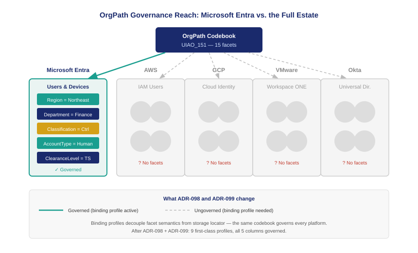

::: {.content-visible when-format="docx"}
::: {.callout-note}
## Reading this document as a standalone bundle

This book uses notation from the UIAO identity governance platform. If you received this document independently — outside the UIAO customer portal — the following conventions apply throughout:

**ADR-NNN** refers to an Architecture Decision Record: UIAO's numbered, binding governance specification. Each ADR governs a specific aspect of the platform. This book cites ADR-035 (OrgPath Codebook), ADR-062 (OrgPath Leaf Naming), ADR-098 (Vendor-Neutral Binding Profiles), and ADR-099 (Multi-Vendor OrgPath). Full titles and one-paragraph descriptions for each cited ADR appear in the **Glossary and References** appendix at the end of this document.

**UIAO_NNN** refers to a UIAO Specification document — an operational schema, field mapping, or scanner interface specification. UIAO_007 (the OrgPath specification) and UIAO_193 (OrgPath Multi-Cloud Binding) are the primary specifications cited in this book.

**Binding Profile** is a YAML document that maps each OrgPath facet to its platform-specific storage location on a given identity or workload target (e.g., Entra extensionAttribute, AWS IAM user attribute, Keycloak custom attribute). It is the mechanism that makes OrgPath governance vendor-neutral.

**DRIFT-CLASS::subtype** is a drift finding code identifying the governance-gap category and specific condition. Examples: `DRIFT-IDENTITY::orgpath-mismatch` (OrgPath facets on two platforms disagree for the same principal) and `DRIFT-BINDING::schema-gap` (required facet has no binding on a target platform). A complete table of drift codes appears in the Glossary.

**OrgPath** is UIAO's organizational placement model — a colon-separated namespace path that anchors every identity object (human, device, or workload) to its position in the federal bureau hierarchy (e.g., `DOD:DISA` for the Defense Information Systems Agency within the Department of Defense). OrgPath is vendor-neutral by definition; binding profiles are how it is expressed on any specific platform.

**SCIM 2.0** (System for Cross-domain Identity Management) is the IETF standard protocol (RFC 7643/7644) used to provision and synchronize identity attributes across platforms. Several binding profiles use SCIM as their write transport.

A complete **Glossary and References** section, including all defined terms, cited federal mandates, NIST controls, and cited ADRs, appears as the final chapter of this bundle.
:::
:::

::: {.callout-note}
OrgPath was designed as a universal organizational placement model, but its first implementation leaned heavily on Microsoft Entra ID's extensionAttribute schema. That was the right practical choice for federal agencies in 2024. It is not the right permanent architecture. Federal agencies and enterprises run identity and workload surfaces on AWS, GCP, VMware, Okta, and open-source directories — and OrgPath cannot be the universal substrate if it can only be stamped on Microsoft objects. This chapter explains the decoupling problem, why it matters for Zero Trust, and what binding profiles solve.
:::

{#fig-book-25-cpt-01-fig1 fig-alt="Architecture diagram showing OrgPath codebook at top center connected by solid governance lines to a Microsoft Entra column on the left, then broken dashed lines pointing toward AWS, GCP, VMware, and Okta columns on the right. The Entra column shows colored facet labels; the other columns show grey unlabeled objects. White background, navy and teal palette." width="100%"}

## The Entra-first build

Books 01 through 24 of this series have assumed, with rare exception, that OrgPath facets live in Microsoft Entra ID. The reasoning was sound. Federal agencies in the United States operate under a Microsoft-heavy baseline — M365 GCC or GCC High for productivity, Entra ID for identity, Intune for device management, and Defender for endpoint protection. The UIAO addressing model (ADR-078) mapped OrgPath's 15 facets to Entra's extensionAttribute1 through extensionAttribute15, and the drift engine (ADR-085) read those attributes to validate organizational placement.

That mapping worked precisely because Entra ID was already the authoritative identity substrate for most UIAO-targeted agencies. Every user object in a GCC tenant has extension attributes. Every device enrolled in Intune inherits them. The governance chain from hire event to OrgPath stamp to conditional access policy was end-to-end within the Microsoft ecosystem. Nothing about that chain required looking outside it.

The problem with a successful first implementation is that it can harden into an assumption. OrgPath's 15-facet model — Region, Department, Division, Role, CostCenter, Classification, HireDate, TermDate, ClearanceLevel, AccountType, and five reserved slots — was never defined as "Entra attributes." It was defined as a semantic model of organizational placement. The extensionAttribute mapping was a storage decision, not a schema decision. But as the implementation matured, those two things blurred together in practice.

## The estate that lives outside Entra

The federal technology estate does not end at the Entra boundary. The agencies and enterprises that UIAO serves run substantial infrastructure on platforms that have no extensionAttribute. AWS GovCloud hosts workloads that query PII databases, process benefits claims, and run the compute infrastructure for agency-wide services. GCP is the platform of choice for several large agencies' analytics and AI workloads. VMware vSphere runs the virtualization layer in data centers that are not yet cloud-migrated. Okta federates identity for inter-agency partnerships and contractor populations. Open-source Keycloak runs in classified environments where commercial SaaS is unavailable.

Every object on each of those platforms is an identity or workload surface that should carry OrgPath placement. An AWS EC2 instance running a benefits processing workload belongs to a bureau, has a CostCenter, carries a Classification, and should be governed with the same drift detection and policy enforcement as an Entra-enrolled device. A Keycloak user account provisioned for a contractor in a classified enclave should carry the same Department and ClearanceLevel that the same person's Entra account carries — and the values should be sourced from the same authoritative codebook.

When OrgPath facets exist only in Entra, none of this is possible. The benefits workload on AWS has no organizational placement in the governance model. The Keycloak contractor account cannot be drift-detected against the codebook because there is no profile telling the drift engine where to look. The governance model has a precise map of the Entra estate and a blank space everywhere else.

## What Zero Trust requires

The CISA Zero Trust Maturity Model makes an implicit demand that the Entra-only architecture cannot satisfy. ZTMM defines policy subjects in terms of organizational attributes: who the user is, what their role is, what classification they carry, what device they are on, and what workload they are accessing. A policy condition like "Department=Finance AND Classification=Privileged" is only enforceable if the attributes are readable at the enforcement point.

Microsoft's Conditional Access reads those attributes from Entra. That works at the Entra enforcement surface. But the finance analyst with that policy condition also accesses an AWS S3 bucket through an IAM role. The Palo Alto firewall protecting the data center enforces segmentation based on security group membership. The NSX microsegmentation layer controls east-west traffic between vSphere VMs. Each of those enforcement surfaces needs to evaluate the same policy subject — and none of them reads Entra extensionAttributes natively.

The result, in most current deployments, is that each enforcement surface defines its own subject attributes in isolation. AWS IAM policies reference IAM tags set by whoever provisioned the role. NSX security groups are maintained manually by the network team. Palo Alto dynamic address groups are populated by firewall admins who may or may not be coordinating with the identity governance team. The policy subject fragments across platforms, and "Department=Finance AND Classification=Privileged" means something slightly different — and is enforced slightly differently — at every surface.

This fragmentation is not a Microsoft failure. It is an architecture gap: the organizational semantics that should travel with the identity subject across every enforcement surface have no vehicle to do so once the subject crosses the Entra boundary.

## The decoupling that binding profiles perform

Binding profiles solve the decoupling problem by separating two questions that the Entra-first implementation conflated. The first question is semantic: what does each OrgPath facet mean? The answer is in the codebook (UIAO_151) and is entirely vendor-neutral. "Department" means the primary organizational unit to which a person or workload is assigned. That definition does not change on AWS.

The second question is structural: where does each facet live on a given platform? The answer is different for every target. On Entra, Department lives in extensionAttribute3. On AWS IAM Identity Center, it lives in a user attribute named Department. On Keycloak, it lives in a custom user attribute with the key orgpath_department. On a VMware NSX object, it lives in a security tag with the key orgpath:department.

A binding profile is the document that answers the second question for a specific target: a locator map from each facet name to the platform-specific attribute name, plus the transport contract for reading and writing the value. The codebook answers what; the binding profile answers where. The drift engine validates whether the stored value matches the codebook — and because the drift engine operates on facet values, not storage locations, it works against any profile that has a valid locator map.

The microsoft-entra profile, defined in ADR-078, becomes the reference example of a binding profile — the first and best-documented instance of the pattern, not the schema itself. Six first-class profiles shipped with ADR-098; three more shipped with ADR-099. The total of nine binding profiles means that OrgPath governance now reaches every major identity and workload surface in the federal and enterprise estate.

## Why this matters now

The multi-cloud mandate is not a future state. Executive Order 14028 and OMB M-22-09 require agencies to adopt Zero Trust architecture by fiscal year 2024. The National Cybersecurity Strategy calls for cloud diversification to reduce single-vendor dependency. Agencies that have followed these mandates are already running mixed estates — AWS for compute, Azure/Entra for identity, GCP for analytics, VMware for on-premises virtualization — and the governance gap created by an Entra-only OrgPath is already present in their environments.

Binding profiles close that gap without requiring a rearchitecture of any platform. The OrgPath codebook does not change. The drift engine does not change. The organizational semantics that already govern the Entra estate are extended to every new target by writing a binding profile — a YAML document of perhaps thirty lines — and wiring the transport. The governance posture that took three years to build for the Entra surface can be extended to a new platform in a sprint.

The chapters that follow show exactly how that extension works: the abstraction that makes facets portable (Chapter 2), the cloud identity profiles for AWS and GCP (Chapter 3), the VMware three-plane profile that proves binding profiles reach beyond identity (Chapter 4), the five IdP-family profiles (Chapter 5), the Zero Trust enforcement model that ties them together (Chapter 6), and the onboarding path for a new profile (Chapter 7).

::: {.callout-tip}
## Continue reading

[Chapter 2 — Facets vs. Locators: The Abstraction That Makes It Work →](Book_25_CPT_02.qmd)
:::
