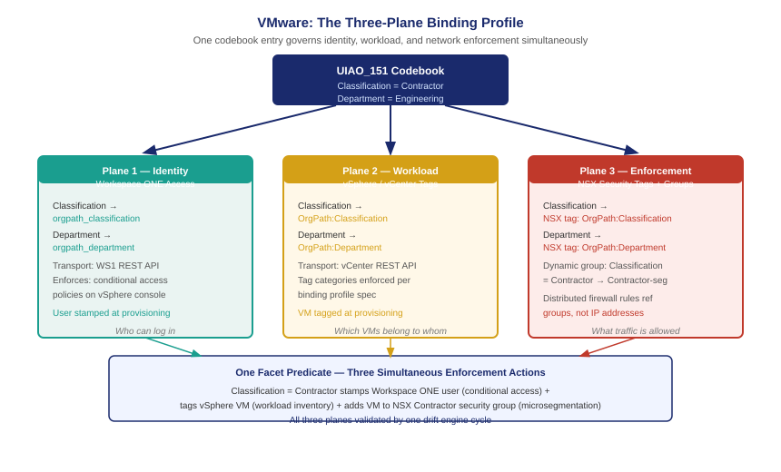

::: {.callout-note}
The vmware binding profile is unlike any other in the OrgPath family. Where AWS and GCP each span identity and workload planes, VMware spans three: Workspace ONE Access for identity, vSphere and vCenter for workloads, and NSX for enforcement. A single facet predicate — Classification=Contractor — stamps the Workspace ONE user, tags the vSphere virtual machine, and governs NSX microsegmentation security group membership. The vmware profile is the clearest proof in the binding-profile family that OrgPath is not an IdP-centric model — it is an organizational governance model that reaches into network enforcement.
:::

{#fig-book-25-cpt-04-fig1 fig-alt="Three-column diagram. Left column labeled Identity Plane shows Workspace ONE Access user object with OrgPath attribute fields. Center column labeled Workload Plane shows vSphere VM object with OrgPath tag categories. Right column labeled Enforcement Plane shows NSX Security Group with facet predicate condition. All three columns connect upward to UIAO_151 Codebook at the top. White background with navy, teal, and amber color coding per plane." width="100%"}

## The vmware estate in the federal context

Federal agencies maintain substantial VMware estates. Data centers that predate the cloud-first mandate run vSphere for server virtualization, vCenter for cluster management, and NSX for software-defined networking and microsegmentation. Many of these environments are not candidates for near-term cloud migration — they host sensitive workloads, run on air-gapped networks, or are sized and operationally managed in ways that make lift-and-shift impractical within current budget cycles.

Workspace ONE Access (formerly VMware Identity Manager) provides identity federation and conditional access for these environments. Users authenticate to Workspace ONE, which federates to vSphere and other VMware-managed services. Workspace ONE supports custom user attributes through its directory integration — either synchronized from Active Directory or Entra, or maintained natively.

The governance gap in a typical federal VMware estate mirrors the gap that the Entra-only OrgPath architecture creates for cloud workloads: the vSphere VMs have no organizational placement in the identity governance model. They are tagged by administrators with ad hoc metadata — project names, ticket numbers, environment labels — that means different things in different data centers and is not validated against any authoritative source. NSX security groups are maintained manually by the network security team and drift from the intended segmentation policy between reviews.

## The identity plane: Workspace ONE Access

The `vmware` binding profile's identity plane places OrgPath facets in Workspace ONE Access user attributes. Workspace ONE supports custom attribute fields that can be mapped to directory attributes from the synchronized source (Active Directory or Entra) or populated directly through the Workspace ONE REST API.

The locator map for the identity plane matches the pattern established by other identity-plane profiles: Department maps to a Workspace ONE custom attribute named orgpath_department, Classification maps to orgpath_classification, and so on for each named facet. If the agency is already synchronizing Entra users into Workspace ONE, the facet values can flow from extensionAttribute3 (Department in Entra) to orgpath_department in Workspace ONE through the directory sync configuration. The binding profile declares this mapping; the sync engine handles the transport.

Workspace ONE conditional access policies can reference these attributes. An access policy that permits vSphere console access only when the user's orgpath_accounttype equals human and orgpath_clearancelevel is set implements OrgPath-derived access control at the VMware identity surface — using the same facet values that Entra Conditional Access uses, because both are sourced from the same codebook.

## The workload plane: vSphere and vCenter tags

vSphere and vCenter support a structured tagging system based on tag categories and tag values. A tag category defines the semantic namespace (for example, a category named OrgPath:Department); a tag value within that category holds the specific value (Finance). Tag categories can be set to require a single value, preventing multi-value ambiguity.

The `vmware` binding profile defines one OrgPath tag category per facet. The categories are named `OrgPath:Region`, `OrgPath:Department`, `OrgPath:Division`, `OrgPath:Role`, `OrgPath:CostCenter`, `OrgPath:Classification`, and the remaining named facets. Every virtual machine managed in the vCenter inventory is expected to carry all ten category tags, with values from the codebook-allowed set.

The transport for the workload plane is the vCenter REST API. OrgPath provisioning writes tag assignments to VMs through the API; the drift engine reads them back through the same endpoint. A VM that has not been tagged (perhaps because it was provisioned outside the standard workflow), or whose tags do not match the expected values from the provisioning source, produces a drift finding scoped to the workload plane.

This is an architectural advance over ad hoc vSphere tagging. The tag categories are defined by the binding profile specification, not by individual administrators. The allowed values in each category are validated against the codebook. A VM tagged with `OrgPath:Department = Finace` (a misspelling) is a drift finding — the codebook's Department enumeration does not include that value, so the drift engine raises it immediately rather than letting it persist until a manual review.

## The enforcement plane: NSX security tags and groups

NSX (VMware's software-defined networking platform) provides microsegmentation through security groups and distributed firewall rules. A security group is a logical container of workloads; distributed firewall rules permit or deny traffic between groups. The NSX enforcement model is powerful precisely because segmentation is enforced at the workload level — at the virtual network adapter of each VM — rather than at a physical network perimeter.

NSX security tags are key-value pairs that can be assigned to VMs and used as membership criteria for dynamic security groups. A dynamic security group with the membership criterion `SecurityTag:OrgPath:Classification EQUALS Contractor` contains all VMs whose NSX security tag `OrgPath:Classification` has the value Contractor. When a new VM is tagged with that classification, it joins the group automatically. When the classification changes, the VM leaves the old group and joins the new one.

The `vmware` binding profile maps OrgPath facets to NSX security tags using the same namespace as the vSphere tag categories: `OrgPath:Classification`, `OrgPath:Department`, and so on. The enforcement plane transport is the NSX Manager REST API. When OrgPath provisioning stamps a VM with Classification=Contractor through the vSphere tags (workload plane), the same provisioning event writes the `OrgPath:Classification = Contractor` NSX security tag through the NSX API. The VM is now a member of every NSX dynamic security group that has a matching predicate.

The distributed firewall rules that govern inter-VM traffic reference these security groups. A rule that denies traffic from the Contractor security group to the Finance security group implements a facet-predicate access control: (Classification=Contractor) → DENY → (Department=Finance). That rule was not written specifically for any named VM or IP address — it was written for an organizational condition, and it applies automatically to every VM whose OrgPath placement meets the condition.

## Why three planes changes the governance model

The significance of the three-plane profile extends beyond VMware-specific capability. It proves that OrgPath binding profiles are not limited to identity surfaces. The aws and gcp profiles extended governance from user objects to compute resources through tags and labels — that was the workload plane. The `vmware` profile extends governance further: from compute resources into the enforcement layer that controls how those resources communicate.

| Profile | Furthest plane | Enforcement mechanism |
|---|---|---|
| `microsoft-entra` | Device | Conditional Access, Intune compliance |
| `aws` | Workload | IAM ABAC condition |
| `gcp` | Workload | GCP IAM condition |
| `okta` | Identity | Application policy |
| `ldap` | Identity | Directory query |
| `vmware` | **Enforcement** | NSX distributed firewall rule |
| `pingone` | Identity | PingFederate claim policy |
| `keycloak` | Identity | Realm policy |
| `auth0` | Identity | Application authorization |

The VMware profile demonstrates that the binding-profile abstraction reaches wherever a platform has a storage surface that can accept facet values — including network enforcement infrastructure that has no concept of "user attributes" in the traditional identity sense. NSX security tags are not attributes on an identity object; they are attributes on a network workload. The OrgPath governance model governs them by the same mechanism: a binding profile, a locator map, a transport, and a drift engine that validates values against the codebook.

The governance posture this enables for a federal data center is substantive. Classification=Contractor is enforced simultaneously in Workspace ONE (conditional access), in vSphere (workload inventory and tagging), and in NSX (network microsegmentation) — all from a single codebook entry, all validated by a single drift engine, all sourced from the same authoritative provisioning event. When a contractor's classification changes, the enforcement update propagates to all three planes in the same provisioning cycle. No manual NSX rule update. No manual security group maintenance. The facet is the policy.

::: {.callout-tip}
## Continue reading

[Chapter 5 — The IdP Landscape: Okta, LDAP, PingOne, Keycloak, Auth0 →](Book_25_CPT_05.qmd)
:::
