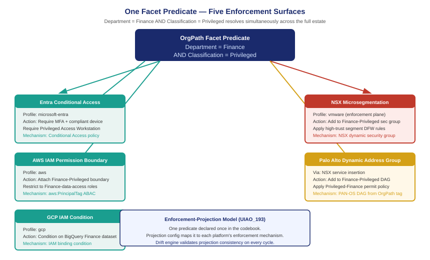

::: {.callout-note}
The binding-profile family exists to make OrgPath facets the stable Zero Trust policy subject across a mixed estate. When an agency operates Entra, AWS, GCP, and VMware simultaneously, a policy condition like "Department=Finance AND Classification=Privileged" should be enforceable on all four platforms from the same codebook entry — not re-expressed four different ways in four different policy languages. The enforcement-projection model (UIAO_193) defines how a facet predicate resolves to enforcement actions on each active binding profile. A single codebook predicate becomes five simultaneous enforcement decisions. This is what vendor-neutral Zero Trust enforcement looks like.
:::

{#fig-book-25-cpt-06-fig1 fig-alt="Fan diagram. Center box labeled OrgPath Predicate: Department=Finance AND Classification=Privileged. Five arrows radiate outward to enforcement surface boxes: Entra Conditional Access (require MFA + compliant device), AWS IAM permission boundary (restrict to Finance-data-access role), GCP IAM condition (binding condition on BigQuery Finance dataset), NSX security group (Privileged-Finance member, high-trust segment), Palo Alto dynamic address group (Finance-Privileged, permit policy). All arrows labeled enforcement projection. White background, navy and teal." width="100%"}

## The policy-subject problem in a multi-vendor estate

Zero Trust policy is written in terms of subjects and conditions. A subject is the entity requesting access: a user, a device, a workload, a service account. A condition is the state that must be true about the subject for access to be permitted. The CISA Zero Trust Maturity Model's pillar structure — Identity, Device, Network, Application, Data — is ultimately a framework for attaching conditions to subjects across different access surfaces.

The problem in a multi-vendor estate is that subjects are represented differently on every platform. A Finance analyst at a federal agency is an Entra user with extensionAttribute3=Finance, an IAM Identity Center user with the Department attribute set to Finance, a GCP Cloud Identity user with OrgPath.Department=Finance, and a Workspace ONE user with orgpath_department=Finance. These are four representations of the same policy subject, stored on four different platforms, in four different schemas.

Without binding profiles, policy must be written independently for each surface. The Entra Conditional Access policy references extensionAttribute3. The AWS IAM permission boundary references `aws:PrincipalTag/Department`. The GCP IAM condition references `principal.attributes["OrgPath.Department"]`. The NSX security group membership criterion references the `OrgPath:Department` security tag. Each expression was authored by a different team, validated against a different schema, and may have drifted from the others if the user's Department changed and one platform was not updated.

With binding profiles in place, all four representations are sourced from the same codebook entry and validated by the same drift engine. The policy subject is stable — Department=Finance means the same thing on every platform because every platform got that value from the same authoritative source through its binding profile. The conditions that reference it can be written once, in terms of codebook facet values, and projected to each enforcement surface through the profile.

## The enforcement-projection model

UIAO_193 defines the enforcement-projection model: the process by which a facet predicate is translated into platform-specific enforcement actions on each active binding profile. Projection is not a runtime lookup — it is a configuration-time declaration. When the governance team writes a policy condition, they write it in terms of OrgPath facets. The enforcement-projection configuration declares how that condition maps to each platform's enforcement mechanism.

A facet predicate is an expression over facet values: `Department=Finance AND Classification=Privileged`. The projection configuration for that predicate on the `microsoft-entra` profile declares: "Apply Conditional Access policy Finance-Privileged-Access, which requires MFA and a compliant device." The projection for the `aws` profile declares: "Attach IAM permission boundary Finance-Privileged to every IAM role assumed by users with this predicate." The projection for `vmware` declares: "Add members of this predicate to NSX security group Finance-Privileged, and apply distributed firewall rule Finance-Privileged-segment."

The drift engine validates the projection by checking, for each active profile, that the enforcement configuration matches the declared projection. If the NSX security group Finance-Privileged does not include a VM whose OrgPath:Classification=Privileged and OrgPath:Department=Finance, that is an enforcement drift finding — not an identity drift finding, but a projection drift finding. The governance model now covers not just whether facet values are correct, but whether the enforcement actions derived from those values have been applied correctly.

## Tracing one predicate across five surfaces

Consider the predicate `Department=Finance AND Classification=Privileged` in an agency running all nine binding profiles. The following table shows how this single predicate resolves to enforcement actions on each relevant surface:

| Surface | Profile | Enforcement action | Policy mechanism |
|---|---|---|---|
| Entra Conditional Access | `microsoft-entra` | Require MFA + compliant device; require Privileged Access Workstation for Finance data | Conditional Access policy with Entra attribute filter |
| AWS IAM | `aws` | Attach Finance-Privileged permission boundary; restrict to Finance-data-access roles in Finance org unit | IAM permission boundary + SCP condition on `aws:PrincipalTag` |
| GCP IAM | `gcp` | Apply Finance-Privileged IAM binding condition on BigQuery Finance dataset and Cloud Storage Finance buckets | IAM conditions on resource bindings using Cloud Identity attributes |
| NSX microsegmentation | `vmware` | Add VMs and users to Finance-Privileged security group; apply high-trust segment rules; deny east-west from lower-trust segments | NSX dynamic security group + distributed firewall |
| Palo Alto dynamic address group | External NGFW | Add to Finance-Privileged DAG; apply Privileged-Finance allow policy on perimeter firewall | PAN-OS dynamic address group populated from OrgPath:Classification tag |

The Palo Alto entry is worth noting: it is not one of the nine first-class binding profiles, but the enforcement-projection model reaches it because vSphere NSX security tags are visible to PAN-OS through VMware service insertion. When a VM is added to the NSX Finance-Privileged security group, PAN-OS can dynamically include that VM's IP address in the Finance-Privileged dynamic address group. OrgPath governs the NSX tag; NSX propagates the enforcement signal to the perimeter firewall. The projection chain extends beyond the binding profile family through the enforcement fabric.

## CISA ZTMM compliance posture

The CISA Zero Trust Maturity Model defines five maturity levels for each pillar: Traditional, Initial, Advanced, and Optimal (with Traditional being the baseline and Optimal being the target). The Identity pillar's Optimal state requires that access decisions be made continuously, based on dynamic policy, using authoritative identity attributes. The Network pillar's Optimal state requires that segmentation be based on application-level attributes, not network perimeter, with continuous validation.

Multi-profile OrgPath governance advances both pillars simultaneously. The Identity pillar advances because facet values are sourced from the HRIT system of record, validated by the drift engine on every drift cycle, and provisioned to every active binding profile — the authoritative-attribute requirement is met across all identity surfaces, not just Entra. The Network pillar advances because NSX microsegmentation (and perimeter firewall policy through the projection chain) is derived from codebook facet predicates that are continuously validated, not maintained manually.

The projection drift finding type is specifically relevant to the Network pillar Optimal state requirement. A network segmentation policy that is no longer consistent with the facet predicates that define it — because a user's Classification changed and the NSX security group membership was not updated — is exactly the continuous-validation gap that Optimal requires be closed. The enforcement-projection drift check closes it.

| ZTMM pillar | Current without multi-profile | With multi-profile binding profiles |
|---|---|---|
| Identity | Advanced (Entra-governed users) | Optimal (all identity surfaces, continuous validation) |
| Device | Advanced (Intune + Arc) | Advanced + (vSphere tagging adds workload scope) |
| Network | Initial–Advanced (manual NSX) | Advanced–Optimal (predicate-derived NSX, projection drift) |
| Application | Initial (per-app policies) | Advanced (facet predicates shared across app policies) |
| Data | Initial (manual classification) | Advanced (Classification facet drives data access controls) |

## The stable policy subject as governance infrastructure

The policy analysis in this chapter rests on a premise that is worth stating explicitly: the value of a stable policy subject is proportional to the number of enforcement surfaces that reference it. If OrgPath facets govern only Entra, they are useful infrastructure for the Entra surface. If they govern all nine binding profiles simultaneously, they are governance infrastructure for the entire estate — the single point of truth that every enforcement surface derives from.

This is the payoff of the abstraction work done in earlier chapters. The codebook defines what facets mean. The binding profiles define where they live. The drift engine validates that they are correct. The enforcement-projection model defines what enforcement actions they imply. The result is a governance architecture where changing a single codebook entry — updating the Classification of a user from Privileged to Standard — propagates correctly to every enforcement surface through its binding profile, is validated by the drift engine, and closes every enforcement gap within the next drift cycle.

No manual NSX group update. No separate IAM tag remediation. No inconsistency between what Entra says about the user and what AWS says about the same user's session. The mixed estate is governed as one.

::: {.callout-tip}
## Continue reading

[Chapter 7 — Adopting Multi-Cloud OrgPath: The Binding Profile Onboarding Path →](Book_25_CPT_07.qmd)
:::
