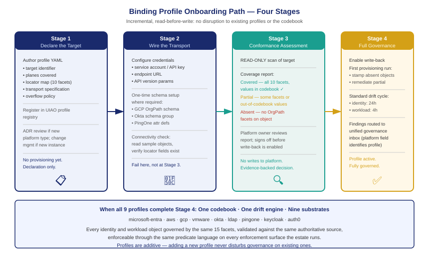

::: {.callout-note}
Adding a new binding profile to an active OrgPath deployment is a deliberate, staged process — not a flag flip. An agency that already governs its Entra estate can extend governance to AWS by declaring the target, writing the profile YAML, wiring the IAM Identity Center SCIM transport, and running the conformance checker. No changes to the codebook, the drift engine, or any existing profile are required. The onboarding path is designed to be incremental: the conformance assessor runs read-only first, before any write-back, so the governance team can validate coverage before committing to provisioning authority. When all nine profiles are active, the governance posture is one codebook, one drift engine, nine substrates.
:::

{#fig-book-25-cpt-07-fig1 fig-alt="Four-stage horizontal flow diagram. Stage 1 labeled Declare Target shows profile YAML being authored. Stage 2 labeled Wire Transport shows transport credential and endpoint configuration. Stage 3 labeled Conformance Assessment shows a read-only scanner producing a coverage report. Stage 4 labeled Full Governance shows write-back enabled and drift engine alerting active. Progress arrows connect each stage. White background, navy and amber color coding for each stage." width="100%"}

## Stage 1: Declare the target

Onboarding begins with authoring the binding profile YAML document for the target platform. The profile is a structured declaration — not a migration plan, not a configuration script — that specifies the locator map, the planes covered, the transport mechanism, and the overflow policy. UIAO_193 defines the schema; the nine first-class profiles ship as reference implementations that can be copied and adapted.

A minimal binding profile for a new AWS environment looks like this in structure: target identifier (`aws`), planes (`identity`, `workload`), identity locator map (ten facet-to-attribute mappings for IAM Identity Center), workload locator map (ten facet-to-tag-key mappings for resource tags), transport specification (IAM Identity Center SCIM endpoint URL and credentials path), and overflow policy (Classification values longer than 256 bytes truncate at word boundary). That is the complete profile — approximately 40 lines of YAML.

The profile is registered in the UIAO profile registry, which maintains the list of active profiles for the governance instance. Registration does not activate any provisioning or drift checking — it declares that this target exists and that the locator map is authoritative. The governance team reviews and approves the profile through the standard ADR review process if the target is a new platform type, or through a change-management workflow if it is a new instance of an existing type (for example, a second AWS organization in a multi-account estate).

The `mission-class` field in the adapter registration is set to `identity` for profiles that govern only the identity plane, or `identity+workload` for profiles that extend to the workload plane. VMware's three-plane profile uses `identity+workload+enforcement`. This classification gates which governance workflows are activated at onboarding completion.

## Stage 2: Wire the transport

Transport wiring connects the UIAO provisioning engine and the drift engine to the target platform's API. For most profiles, this means configuring credentials, endpoint URLs, and API version parameters. The transport specification in the profile YAML declares what is needed; the wiring step provides the actual values.

For IAM Identity Center, transport wiring involves creating a dedicated SCIM service account in the AWS organization's management account, granting it the minimum IAM permissions for SCIM user management, and registering the endpoint URL and access token in the UIAO secrets store. The provisioning engine uses these credentials for all write operations to this profile; the drift engine uses them for all read operations.

For platforms that require schema provisioning before attribute values can be written — GCP Cloud Identity custom schema, Okta custom schema group, PingOne custom attribute definitions — the transport wiring step includes a one-time schema setup. The binding profile specifies the schema definition; the wiring step executes it against the platform API. After schema setup, the attribute storage locations declared in the locator map exist on the platform and are ready to receive values.

The transport wiring step is intentionally separated from Stage 3 to allow the governance team to validate connectivity and credential health before beginning the assessment. A connectivity check runs as part of transport wiring completion: the UIAO platform connector reads a small set of existing users or resources from the target and verifies that the locator map fields are accessible. If the connectivity check fails — because a credential is misconfigured, an endpoint URL is wrong, or a schema has not been provisioned — the failure is reported at this stage rather than discovered during assessment.

## Stage 3: Read-only conformance assessment

The conformance assessor runs before any write-back is enabled. It is a read-only scan of the target platform that answers three questions: which identity and workload objects on the target have OrgPath facet values already populated; which have no values; and for those that have values, do the values fall within the codebook-allowed set?

The assessor produces a coverage report with three categories:

**Covered** — the object has values in all ten named facet fields, and all values are in the codebook. These objects are already governed; the drift engine will validate them on its standard cycle once the profile is fully active.

**Partial** — the object has values in some facet fields but not all, or has values that are not in the codebook. These objects need remediation before full drift alerting is productive; the assessment report identifies the specific gaps.

**Absent** — the object has no OrgPath facet values. These objects will be provisioned with values from the authoritative source when write-back is enabled.

The coverage report gives the governance team a clear picture of the remediation work required before the profile can operate at full governance posture. A new AWS environment that was recently stood up may have zero covered objects — all users in IAM Identity Center will have absent facet values, and all EC2 instances will have absent resource tags. A legacy Okta environment that was in use before OrgPath governance was adopted may have a mix of partial objects from ad hoc attribute population and absent objects that were never touched.

The read-only conformance path also serves a political purpose. Before the UIAO provisioning engine writes facet values to a platform, the platform owner needs confidence that the values being written are correct and will not disrupt existing workflows. The coverage report shows what will change; the platform owner reviews it; write-back is enabled after sign-off. This staged approach has been the consistent onboarding pattern for new profiles because it converts what would otherwise be a leap-of-faith deployment into an evidence-backed decision.

## Stage 4: Full governance — write-back and drift alerting

Write-back activation enables the provisioning engine to stamp OrgPath facet values onto objects in the target platform. The first provisioning run populates all absent objects with values from the authoritative source (HRIT or the provisioning event record). Partial objects are remediated: values that are in the codebook are left in place; values that are absent are filled from the authoritative source; values that are not in the codebook are replaced with the authoritative value and the replacement is logged as a remediation event.

After the first full provisioning run, the target enters the standard governance cycle. New objects (new users in IAM Identity Center, new EC2 instances) are stamped with OrgPath facets at provisioning time through the standard provisioning hook. Existing objects are validated on the drift engine's cycle — by default, every 24 hours for identity-plane profiles and every 4 hours for workload-plane profiles that include cloud compute resources.

Drift findings for the new profile are routed to the same governance inbox as findings from all other active profiles. The finding format is uniform: object identifier, platform, facet name, expected value, observed value, delta type (absent, wrong, codebook-violation). The platform field identifies which binding profile the finding came from; the governance team can filter by platform to manage platform-specific remediation queues without a separate tool.

## What full adoption looks like

When all nine binding profiles are active and have completed Stage 4 onboarding, the governance posture is symmetric across the estate. Every user in every identity surface has OrgPath facets. Every workload in every cloud and on-premises platform has OrgPath tags. Every enforcement surface that is reachable through the projection model has enforcement actions derived from codebook predicates.

The governance team's operational workflow does not multiply by nine when nine profiles are active. The codebook is one document; a facet value change is one provisioning event that the engine fans out to all active profiles. The drift engine is one engine that reads from all active profiles and produces findings in one unified queue. The reporting surface — the compliance dashboard, the FedRAMP evidence bundle, the ZTMM assessment — reads from one drift database that covers all profiles.

| Activity | With 1 profile (Entra only) | With 9 profiles |
|---|---|---|
| Facet update on a mover event | 1 platform write | 9 platform writes (automated fan-out) |
| Drift cycle duration | Minutes | Minutes (parallel per-profile reads) |
| Governance inbox volume | Entra findings only | All-platform findings, filterable by profile |
| ZTMM evidence scope | Entra + Intune surface | Full multi-cloud + VMware surface |
| Policy predicate reuse | Conditional Access only | All nine enforcement surfaces |

The incremental nature of the onboarding path means an agency does not need to activate all nine profiles simultaneously. A typical adoption sequence might be: `microsoft-entra` (already active), then `aws` (as the first cloud extension), then `vmware` (as the on-premises extension), then `okta` (for contractor federation), then the remaining profiles as those platforms come into scope. Each profile adds governance coverage for a new surface without disturbing the coverage already established on others.

The binding-profile architecture is, in its final form, a claim about what organizational governance infrastructure looks like at scale. One codebook. One drift engine. Nine substrates. Every identity and workload object in the estate — human, device, cloud compute, virtualized workload — governed by the same 15 facets, validated against the same authoritative source, and enforceable through the same predicate language on every enforcement surface the estate runs. That is OrgPath beyond Microsoft.

::: {.callout-tip}
## Return to the book index

[← Book_25 Index — OrgPath Beyond Microsoft](Book_25.qmd) | [OrgPath Narrative Index](index.qmd)
:::
