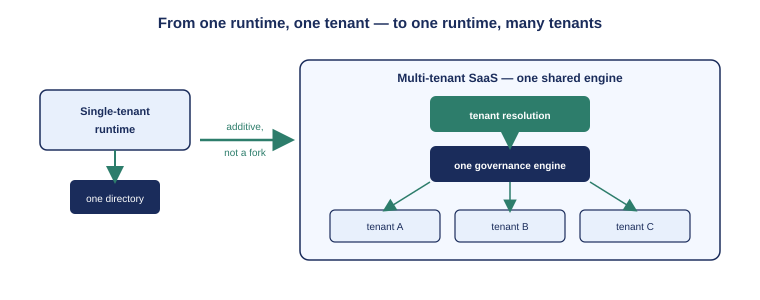

::: {.content-visible when-format="docx"}
::: {.callout-note}
## Reading this document as a standalone bundle

This book uses notation from the UIAO identity governance platform. If you received this document independently — outside the UIAO customer portal — the following conventions apply throughout:

**ADR-NNN** refers to an Architecture Decision Record: UIAO's numbered, binding governance specification. This book cites ADR-096 (Azure SaaS architecture), ADR-115 (SaaS production-readiness), ADR-116 (Azure deployment hardening), and ADR-117 (AWS SaaS surface). Full titles and one-paragraph descriptions appear in the **Glossary and References** appendix at the end of this document.

**Control plane / data plane** is the boundary that runs through this whole book. The *data plane* serves governed traffic — every request that runs a governance pass for a tenant. The *control plane* is the operator surface that onboards, suspends, resumes, and deprovisions tenants. They share one process but have different callers and different authorization.

**Tenant** is one customer's Microsoft Entra directory, identified by its tenant GUID. A registered tenant carries a lifecycle status, a commercial plan, and a **`data_namespace`** — a deterministic isolation handle that scopes the tenant's database rows, object-storage prefix, and secret scope.

**Passwordless** means the application authenticates to its database with a short-lived, automatically-refreshed cloud token presented as the connection password — not a stored secret. On Azure the token comes from Microsoft Entra; on AWS it comes from RDS IAM. Both use the same connection seam.

A complete **Glossary and References** section appears as the final chapter of this bundle.
:::
:::

::: {.callout-note}
UIAO was born single-tenant: one agency, one runtime, one boundary. That shape is honest about a real deployment model — an agency running governance inside its own walls — but it cannot make the claim OrgPath exists to make. This chapter is about the shape change: turning one runtime into a service that governs *many* tenants without forking the governance code, and why "one runtime, many tenants" is the precondition for everything the rest of the book builds.
:::

{#fig-one-substrate fig-alt="Engineering blueprint diagram. On the left, a single box labeled Single-tenant runtime connected to one directory. An arrow labeled additive, not a fork points right to a larger box labeled Multi-tenant SaaS, which contains a tenant-resolution layer feeding one shared governance engine, with three customer directories connected to it. White background, navy and teal palette, no human figures." width="100%"}

## The single-tenant starting point

The original UIAO surface runs the `uiao.api` service behind IIS on Windows Server. One agency operates it inside its own boundary. Inbound callers authenticate with Kerberos; the runtime acquires a single Microsoft Graph application token for one tenant and runs governance passes against that one directory. Everything about it assumes a population of one: one identity provider, one token, one organizational tree.

That model is not wrong. For an agency that wants governance to live entirely inside its own boundary, with no shared service and no external operator, it is exactly right, and it remains supported. But it is a deployment shape, not the architecture's ceiling. The thing OrgPath claims — that an estate spanning many tenants and many cloud boundaries can be reconciled by one runtime — is invisible from inside a single boundary, because there is only ever one tenant to reconcile.

## What "multi-tenant" has to mean here

There is a cheap version of multi-tenancy that does not count: running a separate copy of the runtime per customer. That is just single-tenant, repeated, with a shared invoice. It reconciles nothing across tenants because there is nothing shared to reconcile — each copy has its own engine, its own model, its own idea of what a department is.

The version that counts is **one engine, many tenants**. The same governance code — the same Codebook model, the same drift taxonomy, the same reconciliation logic — runs every tenant's pass. A department renamed in the Codebook is reasoned about identically for every customer. When the architecture says "reconciled by one runtime," it is meant literally: there is one runtime, and it is the same one for everybody.

Achieving that without forking the governance code is the central design constraint. The SaaS surface is **additive**: it composes onto the existing `uiao.api` data plane rather than rewriting it. A single function, `attach_saas()`, augments the existing application with the tenant-resolution middleware and the control-plane routes. The governance code underneath does not know it is running in a multi-tenant service; it reads "whose data is this?" from a request-scoped context and proceeds exactly as it always did.

## The two planes

A multi-tenant governance service has two distinct kinds of caller, and conflating them is how shared platforms get breached. UIAO separates them into two planes that share one process.

The **data plane** is the governed surface. Every non-public request carries a customer's access token. The tenant-resolution middleware verifies it, reads the tenant GUID from the token's `tid` claim, looks up the registered tenant, and — if the tenant is onboarded and active — binds a tenant context for the life of the request. Governance code downstream never threads the tenant through its own signatures; it asks the context "whose data is this?" and gets a definitive answer. A request whose tenant is not registered, or is suspended, is rejected before any governance code runs.

The **control plane** is the operator surface: onboard a tenant, list tenants, suspend, resume, deprovision. These routes live under `/control/v1` and are not for customers at all. They require a token from the *publisher* tenant — the home tenant that operates the service — carrying a specific administrative role. A customer's token, however valid, cannot drive the control plane; an operator's token is checked for both the right home tenant and the right role.

This split is the foundation the rest of the book stands on. Chapter 2 hardens the *data* plane — quotas, rate limits, a standardized error surface — so that one noisy tenant cannot harm the others. The deployment chapters harden the *control* plane and the data tier behind it. But none of that hardening would mean anything if the boundary between the two planes were not drawn first, cleanly, in the one place every request must pass through.

## Why this is the precondition for multi-cloud

It is worth naming, this early, why the multi-tenant shape is what makes the multi-cloud payoff possible at all. A single-tenant runtime carries its cloud assumptions everywhere — one tenant's token, one cloud's endpoints, baked into the request path. A multi-tenant runtime has already been forced to abstract "whose data is this?" away from the request handler and into a resolved context. That same discipline is what later lets the *cloud* be abstracted away from the application: if the governance code already does not know which tenant it is serving until it asks, it is a short step to it not knowing which cloud it is running on until it asks.

The chapters that follow walk that path. The plane is made production-safe (Chapter 2). It is deployed, hardened and passwordless, on Azure (Chapters 3). The identical application is then stood up on AWS (Chapter 4). And the final chapters step back to the claim this one opened with: one substrate, many tenants, many clouds, governed by one runtime — and why the cloud-specific part was small enough to make that true.

::: {.callout-tip}
## Continue reading

[Chapter 2 — Hardening the Plane →](Book_26_CPT_02.qmd)
:::
