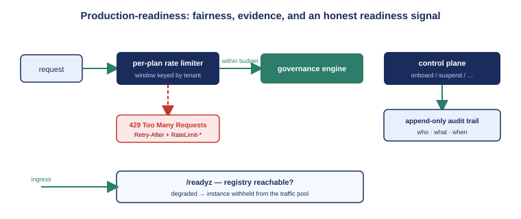

::: {.callout-note}
A multi-tenant plane that resolves each request to its tenant is correct but not yet *safe*. Safe means one tenant cannot starve the others, the operator can prove who changed which tenant and when, and every error a client sees has a shape it can branch on. This chapter is about the production-readiness layer (ADR-115) that turns the correct plane from Chapter 1 into one an operator can run with confidence.
:::

{#fig-hardening fig-alt="Engineering blueprint diagram. An inbound request arrow enters a box labeled per-plan rate limiter, which either passes the request to the governance engine or returns a 429 Too Many Requests response. A separate control-plane box writes to an append-only audit trail box. At the bottom, a readiness probe box labeled /readyz gates an ingress arrow. White background, navy and teal palette, with one red 429 path. No human figures." width="100%"}

## The problem a shared plane creates

The moment many tenants share one data plane, they share its capacity. A tenant that sends a flood of requests — whether from a runaway integration, an aggressive batch job, or outright abuse — consumes worker time, database connections, and memory that the other tenants needed. On a single-tenant runtime this is the customer's own problem to manage. On a shared plane it is everyone's problem, and the operator's most of all.

The same sharing creates a governance gap pointed inward. UIAO is a governance substrate; it spends its days demanding that the systems it governs keep evidence of who changed what. A multi-tenant control plane that could onboard, suspend, and deprovision tenants while keeping *no* such record of its own actions would be holding its customers to a standard it did not meet itself. The substrate owes the same evidence about its own decisions.

And a shared plane multiplies the cost of an inconsistent error surface. When two customers' integrations both hit the same service, "the error you get tells you what went wrong, in a shape you can parse" stops being a nicety and becomes a support-load multiplier. Four gaps, then: fairness, self-evidence, a consistent error shape, and an honest readiness signal. ADR-115 closes all four.

## Quotas and rate limiting: fairness as a plan property

Fairness on the data plane is enforced by tying each tenant's request budget to the commercial plan it pays for. Each plan — trial, standard, enterprise, government — maps to a quota: a sustained requests-per-minute rate plus a burst allowance for the bursty, scheduled nature of governance passes. The defaults are deliberately conservative and monotonic — a trial tenant is capped sharply, an enterprise tenant generously — and an unknown plan falls back to the most restrictive ceiling, so a misconfiguration never accidentally grants unlimited capacity.

A per-tenant limiter enforces the budget over a rolling window. A tenant within budget proceeds and gets headers telling it how much of its allowance remains, so a well-behaved client can pace itself. A tenant over budget gets a `429 Too Many Requests` with a `Retry-After` header telling it exactly how long to wait. The limiter is best-effort per replica — each running instance enforces its own window, which is the standard shape for an application-tier limiter and an honest courtesy-and-abuse guard rather than a hard global ceiling. Where a globally-exact limit is required, the same interface accepts a shared backing store; the architecture names that as a deliberate next step rather than pretending the per-replica limiter is something it is not.

The point is not the mechanism; it is that fairness became a *property of the plan*, declared once and enforced uniformly, rather than something an operator has to police by hand after a tenant has already caused harm.

## The audit trail: the substrate keeps evidence about itself

Every control-plane lifecycle action is recorded as an immutable audit event — onboarding, suspension, resumption, deprovisioning — and crucially, both the successes *and* the rejections. The record carries the action, the tenant it affected, the operator who performed it, the outcome, and a timestamp. It answers, without an investigation, the question a substrate must always be able to answer about itself: who changed which tenant, when, and what happened.

The trail is exposed to operators through a dedicated control-plane endpoint, gated by the same administrative role as the rest of the control plane. The default store keeps the events in memory — enough for a single node and for the tests that exercise the whole lifecycle — and a durable, tamper-evident store is a drop-in behind the same interface. What matters for the doctrine is that the recording happens at all, at the moment of the decision, for every decision. The substrate now holds the same kind of evidence about its own governance actions that it requires of everything it governs.

## One error dialect: problem+json

Before the hardening, the two planes spoke different error dialects — the data plane returned one ad-hoc shape, the control plane another — and neither was a recognized standard. A client integrating against the service had to special-case both. The hardening unifies them on a single standard: every error, on both planes, is a problem-details document with a stable machine-readable code a client can branch on, plus the standard human-readable fields. The standardized envelope carries only what a caller needs — a code, the tenant when one is known — and deliberately never leaks token contents or internal stack detail, so consistency does not become a disclosure vector. The machine codes that existed before the change were preserved, so the standardization tightened the contract without breaking the clients already relying on it.

## Readiness versus liveness: an honest signal

The last gap was a probe that lied. The platform's readiness check pointed at a static liveness endpoint — one that returns healthy as long as the process is running, regardless of whether the process can actually do its job. A running instance that could not reach its tenant registry would report ready and be handed live traffic, which it would then fail to serve.

The hardening separates the two signals. Liveness still answers "is the process up?" Readiness now answers the real question: "can this instance reach the tenant registry?" — by performing a cheap check against the database and returning a degraded status when it cannot. An instance that cannot reach its registry is withheld from the traffic pool until it can. It is a small change with an outsized effect: a broken instance is kept out of rotation instead of serving errors to live tenants.

## What hardening buys

Taken together, these four make the shared plane *operable*. A noisy tenant is contained by its plan's budget. Every control-plane decision leaves evidence. Clients branch on one stable error shape. Broken instances stay out of rotation. None of it changes what governance the plane performs; all of it changes whether an operator can run the plane for many tenants at once and sleep at night. With the data plane made safe, the next two chapters turn to the tier underneath it — the database and the deployment — and remove the last long-lived secret from both clouds.

::: {.callout-tip}
## Continue reading

[Chapter 3 — Passwordless on Azure →](Book_26_CPT_03.qmd)
:::
