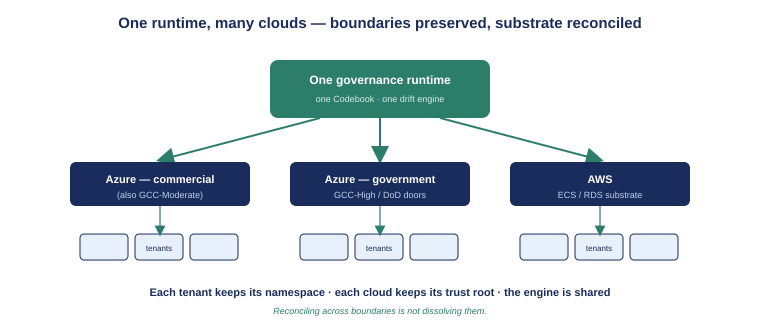

::: {.callout-note}
The previous chapters built a hardened multi-tenant plane and ran it, unchanged, on two clouds. This chapter steps back to ask what that buys — not as an engineering fact but as a governance capability. The answer is the claim OrgPath exists to make: one reconciled organizational substrate across many tenants and many cloud boundaries, governed by one runtime. This chapter shows why the architecture the book just built is the concrete realization of that claim.
:::

{#fig-one-plane fig-alt="Engineering blueprint diagram. A central box labeled One governance runtime — one Codebook, one drift engine connects outward through three labeled doors — Azure commercial, Azure government, AWS — each reaching a cluster of tenant directories. A caption reads reconciled by one runtime; boundaries preserved. White background, navy and teal palette. No human figures." width="100%"}

## The claim, restated

UIAO's differentiated capability — the one a single-boundary product structurally cannot match — is a **single reconciled organizational substrate across many tenants and federal cloud boundaries, governed by one runtime**. It is easy to say and hard to mean. "Reconciled by one runtime" has to be literal: not many runtimes that agree by convention, but one engine that is the same engine for every tenant in every boundary. The multi-tenant, multi-cloud architecture the book just built is what makes the phrase literal, and it rests on three properties, each established in an earlier chapter.

## Property one: one runtime, many tenants

The same governance code runs every tenant's drift pass (Chapter 1). There is one engine, one Codebook model, and one drift taxonomy in force across the whole estate. A department renamed in the Codebook is reasoned about identically for every tenant; a drift class means the same thing everywhere. This is what makes "reconciled by one runtime" more than marketing: there is exactly one runtime, the SaaS surface is additive rather than a fork, and every tenant is governed by it. An estate with one reconciliation engine cannot drift into mutually-inconsistent organizational models the way an estate with one engine *per tenant* inevitably does.

## Property two: boundary-correct, per tenant

The governance principal acquires *per-tenant* tokens, and it acquires them through the correct cloud-specific door (Chapters 3 and 4). The cloud setting selects the login authority, the inbound token issuer to validate against, and the resource audiences the principal requests — for commercial (which also serves the moderate government boundary), for high-government, or for defense. The substrate model never changes across boundaries; only the host and the token audience do, and the runtime selects them per boundary rather than assuming commercial defaults everywhere.

This is the property a single-boundary product cannot replicate. An estate that spans commercial, moderate-government, high-government, and defense boundaries, served by a single-boundary tool, ends up maintaining a separate copy of its organizational structure in each — with nothing keeping the copies in agreement. The multi-cloud plane is the mechanism that keeps them in agreement: one governed Codebook, one typed drift engine, reaching every tenant in every boundary through the right door. The AWS surface from Chapter 4 extends the same logic from Azure boundaries to an AWS-hosted substrate without changing the engine that governs through it.

## Property three: isolation that survives the shared plane

Reconciling across boundaries is not dissolving them. Each tenant's `data_namespace` scopes its database rows, its object-storage prefix, and its secret scope; the tenant-resolution middleware binds a tenant context per request and rejects non-active tenants before any governance code runs (Chapter 1). The per-plan quotas and the audit trail from Chapter 2 enforce fairness and keep evidence without commingling anyone's data. One reconciled *plane* does not mean one commingled *dataset*. The boundaries between tenants — and between clouds — stay intact while the substrate is governed uniformly across them. Each tenant keeps its own namespace; each cloud keeps its own trust root and token audience; what is shared is the substrate model and the engine that governs it.

## Why passwordless matters to the claim

It is worth connecting the data-tier hardening back to the boundary story, because it is not incidental to it. Passwordless authentication (Chapters 3 and 4) means the governance principal — the workload's own identity — is the single thing that authenticates the plane to its database, on either cloud, with no standing secret to leak or to copy between boundaries. A model that depended on a shared database password would have to distribute and rotate that password across every boundary it operated in, creating exactly the kind of cross-boundary secret sprawl the architecture is meant to eliminate. The token-as-password seam, identical on both clouds, means the trust root stays *inside* each boundary: the identity is local, the token is short-lived and local, and nothing long-lived crosses between clouds. Cloud-neutral authentication is part of how the boundaries stay intact.

## The shape of the small cloud-specific surface

The book's recurring observation deserves a name. Across four chapters, the cloud-specific surface area reduced to three things: the infrastructure description (Bicep versus CDK), the database-token source (Entra versus RDS IAM, behind one shared hook), and the per-tenant stamps (Key Vault and Blob versus Secrets Manager and S3, behind one shared safety guard). Everything else — the entire governance application, the control plane, the tenancy model, the production-readiness layer — is shared. That ratio is the engineering substance behind the capability claim. A product whose cloud-specific surface is large cannot credibly promise one reconciled substrate across clouds, because the substrate fractures along the cloud seams. UIAO's is small by design, and the book traced exactly where it lives.

## What this enables, and what comes next

The capability this architecture delivers is the one the rest of the OrgPath story has been building toward: an organization can have its identity substrate reasoned about by one engine, consistently, no matter how many tenants and cloud boundaries it spans — and can prove, per boundary, that the reasoning used the correct trust root and kept the data isolated. The honest edges remain named: private networking and live deploy-validation on both clouds, a globally-exact rate limiter, a durable audit store, and a sovereign AWS boundary are tracked next steps, not silent gaps. But the plane itself is real, hardened, passwordless, and proven on two clouds — and that is the substrate the capability rests on. The glossary that follows collects the terms, codes, and canon this book has cited, so the bundle stands on its own.

::: {.callout-tip}
## Continue reading

[Appendix — Glossary and References →](Book_26_CPT_06.qmd)
:::
