::: {.content-visible when-format="docx"}
::: {.callout-note}
## Reading this document as a standalone bundle

**ADR-NNN** refers to an Architecture Decision Record: UIAO's numbered, binding governance specification. This book cites ADR-059 (SailPoint NERM), ADR-092 (Active Governance), and ADRs 051–056 (HRIT and Customer Identity). Full descriptions appear in the Glossary chapter.

**JML** — Joiner/Mover/Leaver — is the identity lifecycle event model. A joiner is a new employee or contractor entering the environment; a mover is someone whose organizational position changes; a leaver is someone who departs. Each event triggers a distinct set of governance actions.

**OrgPath** is UIAO's fifteen-facet organizational position model. Facets such as Department, Division, Branch, Role, and Tier make approval routing deterministic: given any OrgPath, the system can resolve which authority approves a lifecycle action without a manual lookup.

**HRIT** is the Human Resources Information Technology canonical HR schema (Spec2-D1.1). HRIT records are the authoritative source for employee-of-record data that drives the JML pipeline.
:::
:::

::: {.callout-note}
## In this chapter
Active Directory was an identity store, an authorization substrate, and an implicit organizational map — all three, blended together until they were inseparable. When AD leaves, the identity store is replaced by Entra ID, but the organizational map and the approval routing that ran on top of it do not come along automatically. This chapter names the three specific gaps that appear when AD departs, explains why each is structural rather than a configuration oversight, and states the thesis that the rest of the book argues: HRIT, OrgPath, and the JML pipeline together replace what AD provided implicitly with something that is explicit, auditable, and governed.
:::

{#fig-book27-cpt01 fig-alt="Engineering blueprint diagram on a white background, 16:9 landscape, no human figures. Three vertical columns. Left column, labeled 'AD era (implicit)', contains three stacked navy #1F3A5F boxes: 'Lifecycle authority — AD group membership as de-facto record of who is provisioned', 'Approval routing — manager chain from AD Distinguished Name resolves approvers', 'Service account custody — owner implied by OU placement and naming convention'. A wide red #C0392B arrow labeled 'AD migration' points right between the left and center columns. Center column, labeled 'After migration (gaps)', contains three stacked red-outlined empty boxes with amber #D4A017 text: 'Who approves provisioning? No deterministic answer', 'Approval routing broken — manager chain is Entra, but routing model was never rebuilt', 'Service accounts running under departed owners — no detector'. Right column, labeled 'UIAO closes each gap', contains three stacked teal #1A9E8F boxes: 'HRIT as lifecycle authority — JML pipeline from HR diffs', 'OrgPath routing layer — 15-facet position resolves governing authority', 'Service identity orphan detector — DRIFT-ORPHAN-NHAM on LEAVER events'. Connecting dashed lines show each left-column item flowing to its gap and its UIAO resolution. White background throughout." width="100%"}

## What AD Provided That Nobody Documented

The governance analysis of an AD migration almost always focuses on what moves forward: accounts, group memberships, service principals, Conditional Access policies, device objects. The list is long and the migration tooling is sophisticated. What the analysis rarely captures is the organizational logic that AD hosted without anyone designing it there.

Consider approval routing. In most federal environments, when an IT request requires manager approval, the system that routes it reads the requester's Distinguished Name from AD, walks the manager chain in the directory, and sends the approval to whoever sits at the right level. That logic is not documented in a governance policy document. It is embedded in the ServiceNow connector, the help desk workflow, the provisioning tool configuration. The AD directory is the org chart, and every tool that needed an org chart borrowed it.

Or consider service account custody. In a typical AD environment, service accounts live in a dedicated Organizational Unit. The OU structure implies ownership: accounts in the `svc-finance` sub-OU are understood to belong to the Finance team. When a Finance employee leaves, the institutional knowledge says "check the OU for their accounts." That knowledge is not a formal custody record. It is a convention, and when the team that held the convention turns over, the convention is gone.

> Active Directory was three things at once: an identity store, an authorization substrate, and an implicit organizational map. Migration tooling handles the first two. Nobody ships a tool that migrates the third, because the third was never formally defined.

These are not obscure edge cases. They are the standard operational substrate that most federal agencies built their IT governance on, informally, over decades. The migration surfaces them as gaps because Entra ID does not inherit them automatically.

## The Three Gaps This Book Addresses

The gaps that appear after an AD migration fall into three categories, each of which corresponds to a chapter in this book.

**Lifecycle authority.** In the AD era, provisioning happened when an account was created in the directory. There was no formal lifecycle event — the account's existence was the event. In the Entra world, provisioning is driven by a joiner/mover/leaver model that requires an authoritative HR source and a lifecycle policy. Without a JML pipeline backed by HRIT, provisioning decisions are ad hoc: administrators create accounts when asked, disable them when reminded, and the gap between what HR records say and what the directory contains is unmeasured.

**Approval routing.** AD's manager chain was a complete, navigable organizational graph. Entra ID carries manager relationships too, but the approval routing logic that ran against AD has to be explicitly rebuilt for the Entra world. More importantly, the routing model has to be made deterministic — "who approves this provisioning request" cannot be an answer that varies by who is on call. OrgPath's fifteen-facet position model makes routing deterministic: given a position, there is exactly one governing authority.

**Service account custody.** When a human employee leaves, their personal accounts are disabled and eventually deprovisioned. The service accounts they owned keep running. In the AD era, OU structure implied custody; in the Entra world, a service account's owner is a field in a record that may or may not be populated, and there is no automatic detector that fires when a human leaver owned automation infrastructure.

## Why Each Gap Is Structural

The instinct in a Microsoft-first environment is to solve governance gaps by deepening the Microsoft configuration. Tighter Conditional Access, more aggressive Entra ID Governance access reviews, additional lifecycle workflow rules — these are real tools and they address real surface area. None of them close the three gaps above, because the gaps are not configuration gaps. They are model gaps.

Lifecycle authority requires an authoritative HR source that the IT governance model actually reads. Entra ID Lifecycle Workflows can automate provisioning actions, but they trigger on attributes in the directory — they do not detect that an employee's HR record changed and fire a governance event in response. That detection is what the JML pipeline does.

Approval routing requires a governed organizational model with enough facets to resolve authority without manual lookup. Entra group membership is not that model, because group membership is a derivative of the organizational position, not the position itself. OrgPath is the substrate from which routing is computed, not a configuration of Entra.

Service account custody requires a leaver detector that cross-references service account ownership against human identity lifecycle state. That cross-reference does not exist in Entra natively — it has to be built from the leaver event stream and the service account inventory.

> The three gaps are structural because they require integrating HR data, organizational position, and service account inventory into a single governance pass. None of those three integrations exists in the Microsoft stack out of the box.

## The Thesis of This Book

The argument of this book is that UIAO closes each gap with an explicit, governed mechanism: HRIT as the authoritative HR source, OrgPath as the routing substrate, the JML pipeline as the lifecycle event detector, Entra ID Governance scoped to OrgPath position for workforce entitlements, SailPoint NERM for the non-employee branch, and the service identity orphan detector for the custody problem.

The chapters that follow build each mechanism out in detail. The throughline is a single claim: identity governance in the AD-to-Entra migration era is not a configuration task. It is a model-building task, and the model has to be explicit about what AD was implicit about for thirty years.

::: {.callout-tip}
## Continue reading

[← Book_27](Book_27.qmd) | [Chapter 2 — Entra ID Governance →](Book_27_CPT_02.qmd)
:::
