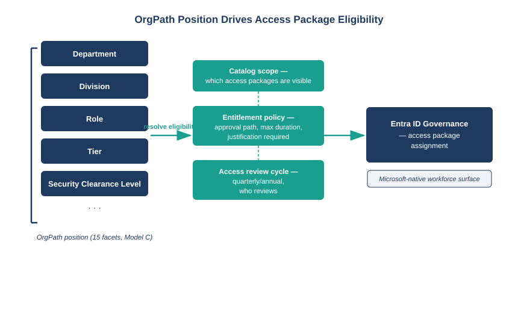

::: {.callout-note}
## In this chapter
Entra ID Governance provides access packages, entitlement management, and access reviews for the Microsoft-native workforce surface. Used without an organizational model, it requires administrators to maintain access policies that duplicate the org chart manually. Used with OrgPath, it becomes position-driven: the fifteen facets of an employee's organizational position determine which access packages they are eligible for, which catalog they see, and which policies govern their access review cycle. This chapter shows how the two systems compose.
:::

{#fig-book27-cpt02 fig-alt="Engineering blueprint diagram on a white background, 16:9 landscape, no human figures. Left side: a vertical stack of five navy #1F3A5F boxes labeled 'Department', 'Division', 'Role', 'Tier', 'Security Clearance Level' with a bracket labeled 'OrgPath position (15 facets, Model C)'. A teal #1A9E8F arrow labeled 'resolve eligibility' points right from the stack to a center column with three boxes. First center box teal: 'Catalog scope — which access packages are visible'. Second center box teal: 'Entitlement policy — approval path, max duration, justification required'. Third center box teal: 'Access review cycle — quarterly/annual, who reviews'. A second teal arrow points right from the center column to a navy box labeled 'Entra ID Governance — access package assignment'. White background, navy and teal palette." width="100%"}

## What Entra ID Governance Does and Where Its Boundary Is

Entra ID Governance is Microsoft's entitlement management platform for the workforce surface. Its central primitives are access packages — bundles of resources (groups, applications, SharePoint sites, roles) that users can request as a unit — and the policies that govern each package: who is eligible, how long access lasts, whether a justification is required, who approves, and when an access review runs to verify that existing access is still appropriate.

The mechanism is well-suited to the federal environment because it externalizes access policy from the resources themselves. A SharePoint site does not need to have its own membership logic; instead, an access package bundles the site with the groups that unlock it, and the policy that governs the package handles eligibility, approval, and review centrally.

Its boundary, however, is the Microsoft ecosystem. Entra ID Governance manages Entra groups, Entra application assignments, SharePoint permissions, and Teams membership. It does not govern non-Microsoft resources, on-premises service accounts, or contractor identity records that live outside the Entra directory. That boundary is where NERM enters the picture, but within the Microsoft surface it is the authoritative entitlement management plane.

## The Problem Without OrgPath: Policy as a Proxy Org Chart

The standard way to configure Entra ID Governance without an organizational model is to create connected organization entries and eligibility policies that enumerate the roles or groups whose members are eligible for a given access package. This works — but it requires administrators to maintain a list of eligible roles, and that list is a proxy org chart: an attempt to express organizational position in Entra group or role terms.

Proxy org charts have a known failure mode. They are accurate at the moment they are configured and drift from that moment forward, because the organizational positions they represent change faster than the configuration is updated. When someone changes roles, they may remain eligible for access packages their old role justified. When a new position is created, it may not be added to any eligibility policy until someone notices a gap.

> An eligibility policy that enumerates Entra groups is a proxy org chart. It is correct at configuration time and drifts from then on. OrgPath is the governed substrate; eligibility derived from OrgPath is correct as long as the position is correct.

OrgPath resolves this by making organizational position the input to eligibility rather than a list of groups or roles. Given the facets of an employee's current OrgPath — their Department, Division, Role, Tier, and Security Clearance Level — the entitlement model computes which catalogs they should see and which packages they should be eligible for. When a mover event updates their OrgPath, the eligibility recomputes. No administrator touches the access package policy; the policy is derived from the position model.

## Access Reviews Scoped to OrgPath Position

Entra access reviews are periodic verifications that existing access assignments are still appropriate. Without an organizational model, access reviews are typically scoped by group membership or package assignment — the reviewer sees a list of users who have access and approves or denies each. This works for small groups and fails at scale because the reviewer has no context for who the users are or why they have access.

OrgPath scoping changes the review surface. When access reviews are scoped to an OrgPath position — "review all access assigned to employees at Tier 3 in Division X" — the reviewer is the governing authority for that position, which the routing layer can compute from the OrgPath facets. The reviewer has organizational context because the review is framed in organizational terms.

More importantly, the access review can detect OrgPath drift: if an employee's assigned access packages were granted when they held a position that has since changed (a mover event), the review flags the packages granted under the old position as candidates for removal. This turns the access review from a periodic audit into a continuous reconciliation against organizational truth.

## The Workforce-Only Scope and What NERM Adds

Entra ID Governance covers workforce identities: full-time employees, part-time employees, and identities provisioned through the Entra directory. It does not cover the contractor and vendor population that in most federal agencies constitutes a significant fraction of the identity estate.

Contractors typically have sponsored Entra accounts — guest identities provisioned through Entra B2B or directly created by a sponsoring employee. These accounts are created when the contract begins and, absent a formal offboarding process, persist after the contract ends. The access packages the contractor was assigned persist with the account. Neither Entra ID Governance nor Entra Lifecycle Workflows has a native mechanism for contractor lifecycle management: there is no concept of a contract end date that drives automatic deprovisioning or access review.

This is the gap SailPoint NERM fills, and it is the subject of the next chapter. The division between the workforce surface (Entra ID Governance, OrgPath-scoped) and the non-employee surface (SailPoint NERM, UIAO_141-anchored) is the structural division that the identity governance model in this book maps to.

::: {.callout-tip}
## Continue reading

[← Chapter 1](Book_27_CPT_01.qmd) | [Chapter 3 — SailPoint NERM →](Book_27_CPT_03.qmd)
:::
