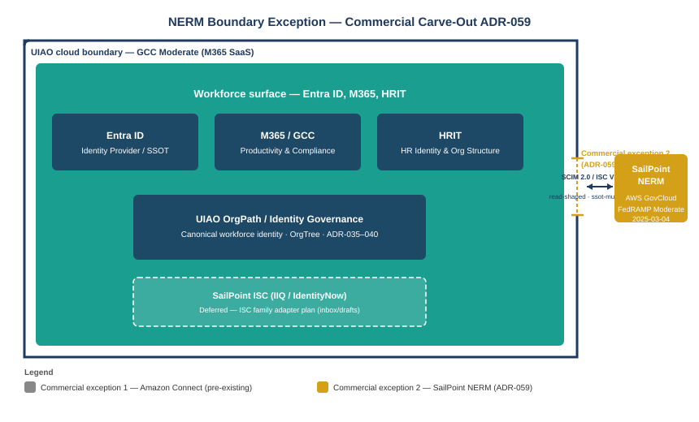

::: {.callout-note}
## In this chapter
SailPoint Non-Employee Risk Management (NERM) is the FedRAMP-Moderate-authorized operational substrate for the non-employee branch of UIAO's Customer Identity Model (UIAO_141). ADR-059 carved it out as UIAO's second Commercial exception — a named boundary carve-out scoped specifically to NERM, justified by its FedRAMP Moderate authorization on AWS GovCloud, its FICAM alignment, and its direct functional fit with the UIAO_141 Customer Identity Record. This chapter explains what NERM is, what the boundary exception means in practice, and how NERM records map to OrgPath position.
:::

{#fig-book27-cpt03 fig-alt="Engineering blueprint diagram on a white background, 16:9 landscape, no human figures. A large outer rectangle labeled 'UIAO cloud boundary — GCC Moderate (M365 SaaS)' in navy #1F3A5F. Inside: a large teal #1A9E8F region labeled 'Workforce surface — Entra ID, M365, HRIT'. At the right edge of the outer rectangle: a small notch cut out of the boundary, labeled 'Commercial exception 2 (ADR-059)'. Outside the notch, a separate box labeled 'SailPoint NERM — AWS GovCloud, FedRAMP Moderate 2025-03-04' in amber #D4A017. A narrow bi-directional arrow between the notch and the NERM box, labeled 'SCIM 2.0 / ISC V3 REST — read-shaped, ssot-mutation: never'. Below the main diagram: a small legend showing 'Commercial exception 1 — Amazon Connect (existing)' and 'Commercial exception 2 — SailPoint NERM (ADR-059)'. White background throughout." width="100%"}

## What NERM Is and Why It Exists

SailPoint Non-Employee Risk Management is a SaaS product in the SailPoint Identity Security Cloud family, purpose-built for the identity lifecycle of non-employees: contractors, vendors, business partners, consultants, and sponsored external identities. Its central function is the non-employee record — a structured identity object that carries the non-employee's organizational affiliation, contract dates, sponsoring official, risk score, and lifecycle state, separate from the workforce directory.

For federal agencies, the non-employee population presents a governance problem that workforce identity management tools do not solve. Contractors can number in the hundreds per agency program office. Their onboarding is sponsored by a government employee, their access is tied to a contract period of performance, and their offboarding should trigger automatically when the contract ends — but in most current implementations it does not, because there is no system of record that tracks contract end dates and drives identity lifecycle from them.

NERM addresses this by making the non-employee record the system of record. Sponsoring officials register contractors in NERM, set the period of performance, specify the access needed, and establish a risk profile. NERM drives the lifecycle from there: it sends renewal reminders before contract expiration, enforces offboarding at contract end, and provides an audit trail of every access decision for the non-employee population.

## The Boundary Exception: What ADR-059 Decided and Why

UIAO's published cloud boundary is GCC-Moderate: Microsoft 365 SaaS only, with one pre-existing exception for Amazon Connect Contact Center. NERM runs on AWS GovCloud — FedRAMP Moderate, but not the M365 GCC-Moderate substrate. Without an explicit carve-out, adopting NERM would expand the cloud boundary without governance.

ADR-059 made that carve-out narrow on purpose. Three justifications support the exception, and all three are bounded to NERM specifically rather than to the broader SailPoint Identity Security Cloud family:

First, NERM holds FedRAMP Moderate authorization (package `FR2001938710A`, authorized 2025-03-04 as an add-on to the ISC parent ATO). The authorization is specific to the NERM product and the AWS GovCloud hosting environment; it is not a blanket SailPoint authorization.

Second, the functional fit with UIAO_141 is direct. UIAO_141 defines the Customer Identity Record for the non-employee branch and requires a FedRAMP-aligned operational substrate to hold those records at scale. NERM's sponsorship model, risk-scoring, and lifecycle-state machine map to the UIAO_141 CIR bindings without adaptation.

Third, the blast radius is minimal. Accepting NERM adds one named enum value to the schema (`commercial-exception-sailpoint-nerm`) and one `reserved` registry slot (`sailpoint-nerm`). The broader ISC family — Identity Security Cloud governance, machine identity security — is explicitly deferred to a follow-on ADR. The carve-out is about non-employee lifecycle records, nothing else.

> ADR-059 established the pattern: each Commercial exception is named after the specific product, not after the underlying cloud. `commercial-exception-sailpoint-nerm` is inspectable, auditable, and scoped to exactly what was decided. Future carve-out requests have to name their own entry and argue their own case.

## How NERM Records Map to OrgPath

A NERM non-employee record is not an OrgPath-bearing record by default — NERM's native schema covers contract metadata, sponsorship, risk, and lifecycle state. The mapping to OrgPath facets is UIAO's contribution to the integration.

NERM's organizational affiliation field carries the program office or division the contractor is assigned to. That affiliation maps to the Department and Division facets of OrgPath. The sponsoring official's organizational position — which is an HRIT-grounded OrgPath — supplies the Branch and Team facets, because a contractor inherits the organizational scope of their sponsor. The contract's access scope supplies the Role facet (the function the contractor performs in the environment) and the Tier facet (the access tier their contract justifies).

This mapping has a practical consequence: once a NERM record carries an OrgPath, the same approval routing layer that governs workforce provisioning can govern non-employee provisioning. The routing layer does not need to know whether the identity is a full-time employee or a contractor; it reads the OrgPath and resolves the governing authority from the position facets. The non-employee branch and the workforce branch share one routing model.

## SSOT and the Conformance-Only Constraint

ADR-059 allocates `sailpoint-nerm` as a conformance adapter with `ssot-mutation: never`. This means NERM reads from UIAO-mediated sources and writes nothing to Entra ID or Active Directory objects under UIAO SSOT. If NERM's native Entra connector were activated without this constraint, it could write to Entra objects that UIAO governs, creating a dual-write conflict.

The conformance-only shape is appropriate for the current stage of integration. UIAO_141 evidence is read-shaped: the governance problem is knowing which non-employee records exist, what state they are in, and whether they match what the directory contains. Writes — provisioning a non-employee account, removing access at contract end — remain UIAO-mediated actions routed through the JML pipeline and ServiceNow. NERM is the warehouse; UIAO is the governance engine that acts on what the warehouse contains.

::: {.callout-tip}
## Continue reading

[← Chapter 2](Book_27_CPT_02.qmd) | [Chapter 4 — The JML Pipeline →](Book_27_CPT_04.qmd)
:::
