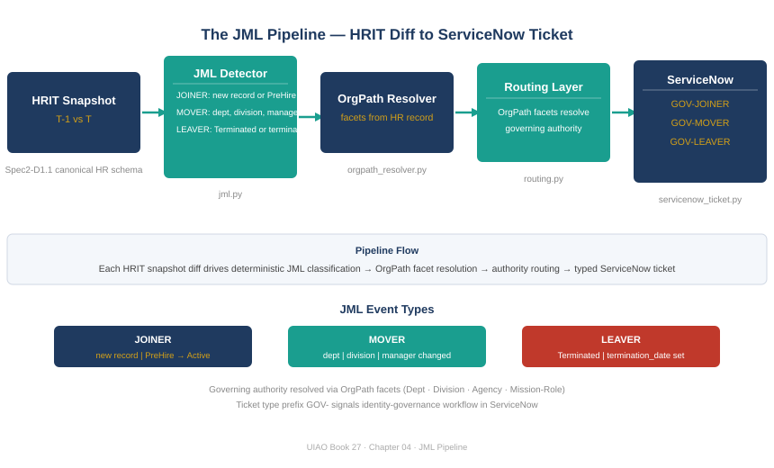

::: {.callout-note}
## In this chapter
The human JML pipeline is the detection engine for joiner, mover, and leaver events in the workforce. It diffs two HRIT snapshots, classifies each changed record as a joiner, mover, or leaver, resolves the OrgPath for the event, looks up the governing authority from the routing layer, and emits structured action lists with the ServiceNow ticket payload pre-populated. This chapter walks the pipeline from HRIT diff to routed ticket, and explains why the routing layer — not a manually maintained approval matrix — is the architectural decision that makes lifecycle governance scale.
:::

{#fig-book27-cpt04 fig-alt="Engineering blueprint diagram on a white background, 16:9 landscape, no human figures. Five boxes connected left to right by teal #1A9E8F arrows. Box 1 navy #1F3A5F: 'HRIT snapshot T-1 vs T' with label 'Spec2-D1.1 canonical HR schema'. Box 2 teal: 'JML detector (jml.py)' with three sub-labels stacked: 'JOINER: new record or PreHire to Active', 'MOVER: department, division, manager changed', 'LEAVER: Terminated or termination_date set'. Box 3 navy: 'OrgPath resolver' with label 'facets from HR record'. Box 4 teal: 'Routing layer (routing.py)' with label 'OrgPath facets resolve governing authority'. Box 5 navy: 'ServiceNow (servicenow_ticket.py)' with label 'GOV-JOINER / GOV-MOVER / GOV-LEAVER ticket'. White background, annotations below each box in small grey text indicating the Python module." width="100%"}

## The HRIT Snapshot Diff

The JML detector's input is a pair of HRIT snapshots: the previous state and the current state of the canonical HR record set (Spec2-D1.1). Each record is anchored by `employee_id`, which is immutable — it does not change when a person moves positions, changes their name, or transfers between divisions. The anchor is what makes the diff deterministic.

The diff logic operates on three event classes. A joiner is a record that appears in the current snapshot but not the previous one, or a record whose `employment_status` transitions from `PreHire` to `Active`. A leaver is a record whose `employment_status` becomes `Terminated`, or a record that carries a `termination_date` without an Active status — the pending-leaver path that allows advance notification before the actual termination. A mover is a record that exists in both snapshots but whose organizational fields have changed: `department`, `division`, `worker_type`, `location_code`, `cost_center`, or `manager_employee_id`.

The choice of mover trigger fields is not arbitrary. Those fields are exactly the ones that drive OrgPath re-resolution and re-routing. If a field change does not affect the OrgPath or the routing result, it is not a mover event from the governance pipeline's perspective — it is a record update that the downstream systems will pick up on their next sync. The pipeline fires on changes that change governance state.

## OrgPath Resolution at Event Time

Every JML event carries a resolved OrgPath at the moment the event fires. This is the key architectural decision: the OrgPath is resolved *at detection time* from the HRIT record that caused the event, not looked up later from a separate system.

For a joiner, the OrgPath is the position the new employee is joining. For a leaver, it is the position they are departing from — relevant for routing the deprovisioning authority. For a mover, both the old OrgPath (the position being vacated) and the new OrgPath (the position being assumed) are carried, because the governance action may involve removing access for the old position as well as granting access for the new one.

Resolving OrgPath at event time means the pipeline produces self-contained events: an event record carries everything a downstream consumer needs to act on it without a second lookup. The routing layer, the ServiceNow ticket creator, and the service identity orphan detector all read from the event record rather than making independent HR queries.

## The Routing Layer

The routing layer (`routing.py`) takes the OrgPath from a JML event and returns the governing authority: the person or role that must approve the governance action. The resolution is deterministic — given the same OrgPath facets, the routing layer always returns the same authority, from the same facet traversal logic.

The facet traversal starts at the most specific facets (Sub-Role, Role) and walks toward the broadest (Division, Department) until it reaches an authority mapping. Most organizations have approval authority at the Division level for provisioning requests and at the Department level for deprovisioning, but the routing layer's configuration encodes the actual policy rather than assuming a fixed traversal depth.

The routing layer is what makes lifecycle governance scale. Without it, the answer to "who approves this joiner ticket" is a manual lookup — check the org chart, find the division director, email them. With it, the approval path is computed from the position facets and pre-populated in the ServiceNow ticket before any human touches it. The approver receives a ticket that already knows who they are and what position they govern.

## ServiceNow Ticket Creation at L3

The ServiceNow writer (`servicenow_ticket.py`) is the L3 boundary in the actuation ladder. When `dry_run=False`, it creates `GOV-JOINER`, `GOV-MOVER`, and `GOV-LEAVER` tickets in ServiceNow with the full event payload: the `employee_id`, the resolved OrgPath, the governing authority, the required actions, and the JML event classification. The ticket is the governance record for the lifecycle event.

The L3 label matters because it marks the boundary between advise and act. The JML detector and the routing layer are L2 (Advise): they produce observations and action lists, but they change nothing. The ServiceNow writer, when not in dry-run mode, creates a record in an external system — that is L3 (Gated action), because it puts a governance artifact into a system that humans and automations act on.

The `requires_confirmation=True` flag on individual actions within a ticket means those actions need human execution. The pipeline surfaces them; a person performs them. This is intentional: the governance model governs provisioning actions; it does not automate them without oversight. What it does eliminate is the gap between the governance event and the record of it — by the time a human sees the ticket, the event has already been detected, routed, and documented.

::: {.callout-tip}
## Continue reading

[← Chapter 3](Book_27_CPT_03.qmd) | [Chapter 5 — Service Identity Orphan Detection →](Book_27_CPT_05.qmd)
:::
