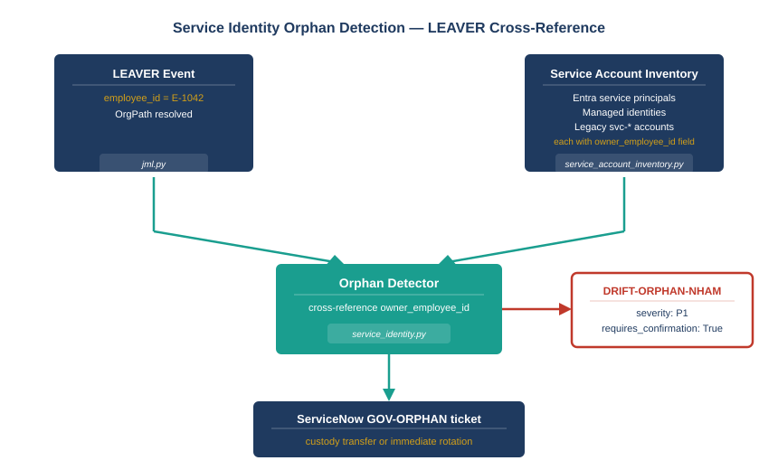

::: {.callout-note}
## In this chapter
When a human employee leaves, the JML pipeline fires a LEAVER event and initiates deprovisioning of their personal accounts. What the pipeline — and most governance models — misses is the automation infrastructure the leaver owned: Entra service principals, managed identities, and legacy service accounts whose `owner_employee_id` matches the departed employee. These accounts continue running, authenticated with valid credentials, under no active custodian. The service identity orphan detector (`service_identity.py`) closes this gap by cross-referencing every LEAVER event against the service account inventory and firing a `DRIFT-ORPHAN-NHAM` P1 finding when it finds a match.
:::

{#fig-book27-cpt05 fig-alt="Engineering blueprint diagram on a white background, 16:9 landscape, no human figures. Two input boxes at the top. Left box navy #1F3A5F: 'LEAVER event (jml.py)' with sub-label 'employee_id = E-1042, OrgPath resolved'. Right box navy: 'Service account inventory' with sub-label 'Entra service principals, managed identities, legacy svc-* accounts, each with owner_employee_id field'. A teal #1A9E8F arrow from each box points down to a center box labeled 'Orphan detector (service_identity.py)'. From the center box: a red #C0392B arrow pointing right to a box labeled 'DRIFT-ORPHAN-NHAM P1 finding' with sub-label 'requires_confirmation=True, severity=CRITICAL'. A second teal arrow from the center box points down to a navy box labeled 'ServiceNow GOV-ORPHAN ticket' with sub-label 'custody transfer or immediate rotation'. White background throughout." width="100%"}

## The Primary Audit Failure Pattern in AD-to-Entra Migrations

The problem the orphan detector solves is the most consistent audit finding in AD-to-Entra migration programs. The pattern is always the same. A human employee leaves. The JML pipeline (or, in environments without a pipeline, the IT help desk) disables and eventually removes the employee's personal accounts. The service accounts the employee created, registered under their employee ID, or informally adopted as custodian continue running. They run under valid credentials. They authenticate successfully. They appear healthy in monitoring dashboards. They are orphaned in the only sense that matters for governance: there is no active human custodian responsible for their rotation, their access scope, or their eventual deprovisioning.

The audit finding surfaces months or years later, typically when a credential rotation is attempted and nobody can authorize it, or when a penetration test reveals that the account has access it should not have because the scope was never reviewed after the custodian left.

> The human account is disabled. The service account keeps running. The human JML was handled correctly; the service governance gap was not a lifecycle event anyone detected.

## What the Detector Does

The service identity orphan detector (`service_identity.py`) operates on a cross-reference between the human leaver event stream from `jml.py` and the service account principal inventory. Its detection logic is straightforward: for every LEAVER event that the human JML pipeline emits, the detector queries the principal inventory for any service account whose `owner_employee_id` matches the leaver's `employee_id`. Any match is an orphaned account.

The finding class is `DRIFT-ORPHAN-NHAM` — an orphaned non-human account with a missing or departed human anchor. The severity is CRITICAL and the posture is `DRIFT`. The finding carries the service account identifier, the departed owner's employee ID and OrgPath, the credential expiry date if available, and the recommended action: either an immediate custody transfer to an active employee with the same or broader OrgPath position, or immediate credential rotation and access review pending a custody determination.

The detector also surfaces `CREDENTIAL_EXPIRY` findings for any service account — orphaned or not — whose `credential_expiry_date` is past or within the configured warning window. Expired credentials on running service accounts are a separate governance failure from orphaned ownership, though they often co-occur in the same estate.

## Why `requires_confirmation=True` Is the Right Default

Every `OR-*` action emitted by the orphan detector carries `requires_confirmation=True`. This is not a limitation of the pipeline — it is a deliberate governance posture. Service accounts that run production workloads cannot be disabled or have their credentials rotated without knowing what they drive. An orphaned account that authenticates a critical batch job is not safe to rotate without verifying what the job does and whether the rotation target is ready.

The detector's job is to make the orphan visible and governable, not to remediate it automatically. The P1 severity ensures that the `DRIFT-ORPHAN-NHAM` finding surfaces at the top of any governance review queue. The `GOV-ORPHAN` ticket in ServiceNow carries all the information a human reviewer needs to make a custody decision. The action the human reviewer takes — custody transfer, rotation, deprovisioning — is governance; the detection is the precondition for governance.

This distinction is central to the L2/L3 actuation model. The detector operates at L2 (Advise): it observes and reports. The ServiceNow ticket at L3 creates a governance artifact that drives human action. The automation ceiling is the ticket creation; everything above that ceiling is human.

## What Was Invisible Before This

The governance gap the orphan detector closes was not invisible because organizations were careless. It was invisible because no single system had the full view required to see it. The HR system knew the employee had left. The IT help desk knew the personal accounts were disabled. The principal inventory knew the service accounts were running. What none of them knew was whether those service accounts were owned by the departed employee, because ownership was tracked informally — in naming conventions, in OU placement, in institutional memory.

The orphan detector's architectural requirement is exactly the one that each previous system failed to provide: a formal `owner_employee_id` field on every service account record, and a pipeline that reads both the human leaver event and the principal inventory in the same pass. The UIAO implementation establishes that field as a governance primitive, not an optional metadata tag. When the field is missing, the detector treats the account as a candidate orphan and fires a lower-severity finding that prompts custodian assignment.

The effect is that the service account inventory becomes a governed surface — not just a list of what is running, but a map of who is responsible, who recently left, and what the gap is between those two facts.

::: {.callout-tip}
## Continue reading

[← Chapter 4](Book_27_CPT_04.qmd) | [Chapter 6 — The Actuation Ladder →](Book_27_CPT_06.qmd)
:::
