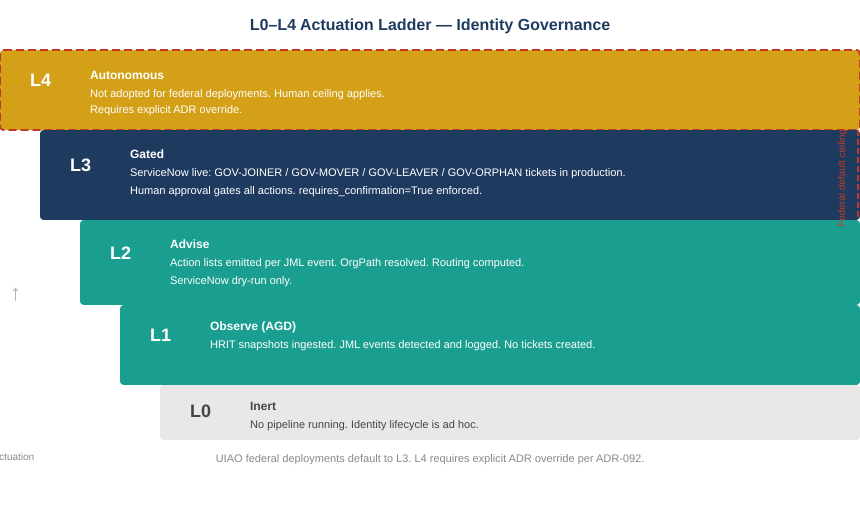

::: {.callout-note}
## In this chapter
The identity governance pipeline described in the preceding chapters is not a single switch to flip — it is a staged activation sequence governed by the L0–L4 actuation ladder from ADR-092. Each tier corresponds to a specific level of autonomy and a specific set of governance gates that must be satisfied before advancing. UIAO_200 encodes the identity governance actuation ladder specifically: what L1, L2, and L3 mean for the JML pipeline, the orphan detector, and the ServiceNow integration. This chapter reads that ladder and explains where each component of the identity governance stack currently sits.
:::

{#fig-book27-cpt06 fig-alt="Engineering blueprint diagram on a white background, vertical orientation, five horizontal bands stacked from bottom to top. Each band is wider than the one below it, suggesting a ladder. Bottom band, thin, light grey: 'L0 — Inert. No pipeline running. Identity lifecycle is ad hoc.' Second band, teal #1A9E8F: 'L1 — Observe (AGD). HRIT snapshots ingested. JML events detected and logged. No tickets created, no action lists emitted.' Third band, teal, slightly wider: 'L2 — Advise. Action lists emitted per JML event. OrgPath resolved. Routing computed. Orphan findings fired. ServiceNow in dry-run mode only.' Fourth band, navy #1F3A5F: 'L3 — Gated. ServiceNow live: GOV-JOINER / GOV-MOVER / GOV-LEAVER / GOV-ORPHAN tickets created in production. Human approval gates all provisioning actions. requires_confirmation=True enforced.' Fifth band, top, amber #D4A017 with a dashed border: 'L4 — Autonomous. Not adopted for federal deployments. Human ceiling applies. Requires explicit ADR override.' A vertical red #C0392B dashed line on the right side of the fourth band labeled 'Federal default ceiling'. White background throughout, labels in matching band colors." width="100%"}

## What the Actuation Ladder Is

The actuation ladder from ADR-092 is the governance model that determines how much autonomy a data plane is permitted to exercise. It runs from L0 (inert — no governance pipeline operating) to L4 (autonomous — the governance engine can act without human approval). The ladder is not a product maturity scale; it is an authorization model. An organization advances up the ladder by satisfying governance gates, not by shipping more code.

For identity governance — the surface this book covers — UIAO_200 encodes the specific ladder positions for each pipeline component. The mapping is straightforward: detection and observation are L1 and L2; creating governance artifacts in external systems is L3; autonomous provisioning and deprovisioning without human gates would be L4 and is explicitly excluded from the federal default posture.

## L1 — Observe (AGD)

At L1, the identity governance pipeline is instrumented but not acting. HRIT snapshots are ingested. The JML detector diffs them and classifies events. The orphan detector cross-references LEAVER events against the service account inventory. All findings are written to the governance drift log (AGD — Automated Governance Detection). No action lists are emitted to external systems. No ServiceNow tickets are created.

L1 is the entry state for any new installation. Its value is establishing the baseline: how many joiner events fire per week, how many mover events are detected that match no corresponding provisioning action, how many orphaned service accounts exist in the estate right now. Without that baseline, the L2 action lists have no calibration point.

An organization at L1 has identity governance observability. What it does not have is identity governance action — it can see the events, but the events have not yet been connected to a governed response.

## L2 — Advise

At L2, the pipeline emits action lists. Each JML event carries a set of required governance actions: for a joiner, the accounts to provision and the access packages to assign; for a mover, the access packages to remove under the old OrgPath and the ones to request under the new; for a leaver, the deprovisioning sequence and the service account custodian notification. Each action is tagged with `requires_confirmation=True` and accompanied by the routing result: the governing authority who must execute it.

The orphan detector at L2 fires `DRIFT-ORPHAN-NHAM` findings with CRITICAL severity and emits the recommended custody action. The finding is visible in the governance dashboard and in any reporting surface connected to the AGD. It has not yet created a ServiceNow ticket; the drift record is the artifact.

ServiceNow is in `dry_run=True` mode at L2. The ticket payloads are constructed and written to the event log — the ticket that would be created is fully specified — but no live tickets are written. This allows the operations team to validate the routing results, the action lists, and the ServiceNow field mappings before going live.

> L2 is where the governance model becomes visible to the people who will operate it. The routing results either match institutional knowledge of who approves what, or they reveal that the OrgPath position model needs calibration. The dry-run period is calibration time.

## L3 — Gated (Current Production Posture)

At L3, ServiceNow is live. `GOV-JOINER`, `GOV-MOVER`, `GOV-LEAVER`, and `GOV-ORPHAN` tickets are created in production for every event the pipeline detects. The ticket is the governance record for the event: it carries the full action list, the routing result, the detected OrgPath, and the `requires_confirmation` flags on every action that requires human execution.

At L3, the pipeline does not provision or deprovision accounts. It detects, routes, and creates the ticket. A human approver — the governing authority resolved by the routing layer — receives the ticket and performs the actions. The pipeline's L3 boundary is creating the governance artifact. The human's authority is acting on it.

This is the federal default ceiling. OMB M-22-09 and NIST 800-207 require that privileged identity lifecycle actions be gated by approval — the pipeline's role is to make those approvals timely, auditable, and correctly routed, not to bypass them.

## L4 Is Not Adopted

L4 — autonomous provisioning and deprovisioning without human approval gates — is explicitly excluded from the federal default posture. The identity governance pipeline will never, without an explicit ADR override for a specific action class, provision or deprovision an account without a human in the approval chain. The `requires_confirmation=True` flag is an architectural constraint, not a configuration option.

The reason is not a limitation of the technology. It is a governance design decision: the pipeline's purpose is to make governance faster and more consistent, not to remove humans from identity lifecycle decisions. An organization that wants to automate specific low-risk joiner actions — assigning a standard access package without approval for a new hire whose role has a pre-authorized entitlement baseline — must make that case in an ADR and accept the audit surface that comes with it.

::: {.callout-tip}
## Continue reading

[← Chapter 5](Book_27_CPT_05.qmd) | [Chapter 7 — Glossary →](Book_27_CPT_07.qmd)
:::
