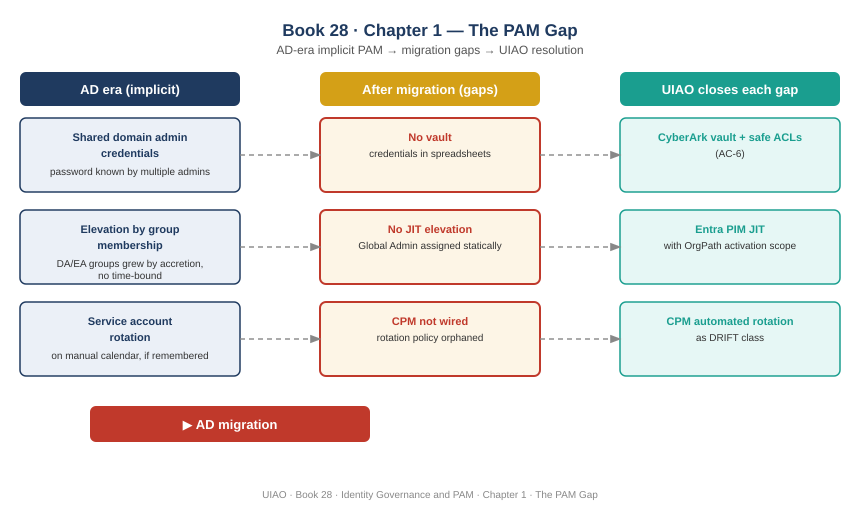

::: {.callout-note}
## In this chapter
Active Directory did not have a privileged access management model. It had three conventions that functioned as one: shared credentials that administrators passed between themselves, group membership that elevated privilege permanently rather than on demand, and manual rotation calendars for service accounts that survived primarily by institutional memory. When AD retires, those conventions retire with it — but the problems they were containing do not. This chapter names the three gaps that open after migration, explains why none of them can be closed by Microsoft configuration alone, and states the thesis that the rest of this book develops: UIAO closes each gap with an explicit, governed mechanism built from CyberArk, Entra PIM scoped to OrgPath, and CPM rotation enforced as drift.
:::

{#fig-book28-cpt01 fig-alt="Engineering blueprint diagram on a white background, 16:9 landscape. Three vertical columns. Left column 'AD era (implicit)': 'Shared domain admin credentials — password known by multiple admins, reset on departure only', 'Elevation by group membership — DA/EA groups grew by accretion, no time-bound', 'Service account rotation — on manual calendar, if remembered'. Center column 'After migration (gaps)': 'No vault — credentials in spreadsheets or shared password managers', 'No JIT elevation — Entra Global Admin assigned statically', 'CPM not wired — rotation policy orphaned in migration'. Right column 'UIAO closes each gap': 'CyberArk vault + safe ACLs (AC-6)', 'Entra PIM JIT with OrgPath activation scope', 'CPM automated rotation as DRIFT class'. White background, navy/teal/amber/red palette." width="100%"}

## What AD Provided for Privileged Access

Active Directory made privileged access feel solved without ever solving it. The mechanism was ambient: a small number of domain administrator accounts existed, the people who needed to do privileged work knew the credentials or were added to the relevant groups, and the environment ran. When that arrangement worked, it worked quietly. When it failed — when a domain admin credential was compromised, when a departed employee's access was not removed — the failure was catastrophic, but the ordinary case was invisible enough that most organizations did not examine it.

The credential sharing pattern was the oldest layer. In practice, a domain administrator account was a shared asset. Multiple engineers knew the password. The rotation policy, if one existed at all, called for a reset when someone with knowledge of the credential left the team. Between departures, the password was stable, which meant it was also predictable, and any account that had ever been used to authenticate was a permanent target for pass-the-hash and pass-the-ticket attacks that the environment could not detect as anomalous because it had no baseline of what a legitimate use looked like.

Group membership was the elevation model. The Domain Admins and Enterprise Admins groups accumulated membership over time in a pattern that IT practitioners call "group sprawl by accretion." An administrator was added to Domain Admins when a task required it, and was rarely removed afterward. There was no time-bound grant. There was no approval workflow attached to the elevation itself. There was no record of which task had justified the membership. The group was a permanent condition, not a session-scoped privilege. An engineer who had needed Domain Admin access three years ago for a server migration still carried it today, because nobody had a reason to go back and remove it.

Service account rotation was managed, when it was managed at all, by calendar. A rotation schedule lived in a spreadsheet or a ticketing system reminder. It called for a password change every ninety days, or every six months, or annually — the interval varied by organization and by whoever had last set the policy. The service account's dependency inventory — which applications, scheduled tasks, and scripts read that credential — was either documented in a runbook or encoded in the memory of the engineer who had originally configured it. Neither form of documentation survived team turnover cleanly.

> Active Directory did not have a PAM model. It had three conventions that contained the problem well enough that no one was forced to replace them with governance. Migration removes the conventions without removing the problem they were containing.

None of these patterns were designed. They were the residue of years of operational decisions made under time pressure, by teams that had no budget for a privileged access solution and no regulatory mandate that forced one. The conventions were not governance; they were the habits that governance would have displaced if governance had ever arrived.

## The Three Gaps After Migration

The migration to an Entra-first environment removes the Active Directory artifacts but does not replace the conventions. Each of the three patterns above leaves behind a specific gap, and each gap is immediately operational rather than theoretical.

The first gap is the absence of a credential vault. When domain administrator accounts are retired in the migration, the credentials that were shared among administrators either move to an Entra account with Global Administrator rights or to a local account on residual on-premises infrastructure. In neither case does a vault appear automatically. The operational pattern that emerges in the absence of one is predictable: credentials end up in a shared password manager, a spreadsheet protected by a SharePoint permission, or a KeePass file on an administrator's workstation. None of those locations provide an audit trail. None of them enforce checkout workflows. None of them rotate automatically. The credential is out of the directory, but it is not in a governed store — it is simply somewhere else.

The second gap is the continuation of static privilege assignment in the cloud. Entra Global Administrator is the functional successor to Domain Admin for cloud operations. The migration often assigns it the same way AD assigned Domain Admin: by adding the people who need it to the role and leaving them there. Entra Privileged Identity Management exists and is capable of providing just-in-time elevation with time-bound activation, approval workflow, and justification capture — but it does not activate itself. An organization that did not have a JIT model in the AD era does not acquire one automatically by migrating. Global Admin remains a standing assignment, the same permanent condition that Domain Admin was, now on cloud infrastructure with a much wider blast radius.

The third gap is orphaned service account rotation. The service accounts that survived migration are now Entra service principals or managed identities, but the rotation policy that governed their predecessor passwords — to whatever extent one existed — was attached to the AD object and the ticketing system that reminded an engineer to act on it. The migration moves the account but does not migrate the rotation policy into an automated enforcement mechanism. CPM, CyberArk's Central Policy Manager, can enforce rotation automatically, but only if it is wired to the account. In most migrations, the wiring does not happen as part of the migration itself. The service account continues running under credentials that have not been rotated since the migration completed, sometimes for years.

> After migration, privileged credentials exist outside any vault, Global Admin is assigned statically rather than on demand, and service account rotation has been orphaned from the mechanism that was supposed to enforce it. All three conditions are invisible until they become incidents.

## Why Each Gap Is Structural

The instinct in a Microsoft-first environment is to reach for the Microsoft configuration surface. Entra PIM can do just-in-time elevation. Conditional Access can require phishing-resistant MFA for privileged roles. Entra ID Protection can flag anomalous sign-in patterns. These are real controls and they address real risk. They do not close the three gaps, because the gaps are not Microsoft configuration gaps. They are integration gaps that require data and mechanisms that the Microsoft stack does not supply on its own.

The vault gap requires an external PAM provider because a credential vault is not a feature of Entra ID. Microsoft Entra does not have a safe model, a checkout workflow, an automatic rotation engine, or an audit trail that satisfies NIST SP 800-53 AC-6 at the level federal environments require. CyberArk provides the vault and the safe-level access control that maps directly to the AC-6 Principle of Least Privilege requirement. That mapping is not achievable through Entra configuration alone, regardless of how tightly the Conditional Access policies are written.

The JIT gap requires organizational scope to be meaningful. Entra PIM can create time-bound role activations, but it does not know which organizational position authorizes which activation request. An engineer in the network team requesting Global Admin for a routing change and an engineer in the payroll applications team requesting the same role for a different task require different approval chains, different justification standards, and potentially different time windows. That differentiation requires OrgPath — a fifteen-facet organizational position model that makes the approval routing deterministic. Without OrgPath, PIM activations route to generic approvers, and the approval becomes a formality rather than a governance act.

The rotation gap requires CPM to be wired to the service account inventory, and the inventory has to be complete enough that orphaned accounts cannot persist undetected. Detecting orphaned rotation — service accounts whose CPM policy has lapsed or was never applied — requires treating the absence of rotation policy as a DRIFT condition: a deviation from the governed state that is surfaced to the drift engine and resolved through the same workflow as any other policy gap. That framing requires the UIAO drift model. It is not a report that any Microsoft tool generates.

> The three gaps are structural because closing them requires integrating a credential vault, an organizational position model, and a drift detection mechanism into a single PAM governance pass. None of those three integrations is native to the Microsoft stack.

## The Thesis of This Book

The argument this book develops is that UIAO closes each gap with a mechanism that is explicit, governed, and verifiable against the same drift engine that governs the rest of the environment.

The vault gap is closed by deploying CyberArk with a safe-per-team ACL model that maps to OrgPath position. Each safe is owned by an organizational unit, access to that safe is granted by OrgPath facet rather than by individual account, and every credential retrieval generates an audit record. The AC-6 requirement is met not by policy statement but by the mechanical fact that no one can retrieve a privileged credential without a checkout event in the CyberArk audit trail.

The JIT gap is closed by Entra PIM scoped to OrgPath activation. A PIM activation request carries the requestor's OrgPath. The approval chain is resolved from the OrgPath facets rather than from a manually configured approver list. The time window is determined by the request category, which is itself derived from the organizational position and the type of work being performed. The approval is not a formality because the approval chain is not arbitrary — it is computed from the same organizational substrate that governs every other entitlement decision in the environment.

The rotation gap is closed by treating unrotated service accounts as a DRIFT class. Every service account in the environment is expected to have an active CPM rotation policy. Any account that does not have one, or whose policy has lapsed, generates a DRIFT-NROTATION event. That event routes to the OrgPath-resolved owner of the account and is tracked through the drift resolution workflow until it is closed. Rotation is not a calendar reminder; it is a governed state that the environment enforces continuously.

The chapters that follow build each mechanism out in detail. The throughline is a single claim: privileged access management in the AD-to-Entra migration era is not a configuration task. It is a model-building task, and the model has to make explicit what AD left implicit — who owns a credential, who is authorized to elevate, and whose rotation policy is in force right now.

::: {.callout-tip}
## Continue reading

[← Book_28](Book_28.qmd) | [Chapter 2 — The CyberArk Vault Model →](Book_28_CPT_02.qmd)
:::
