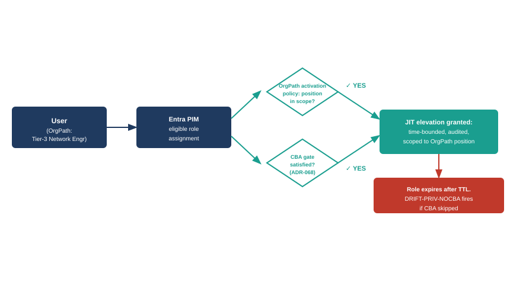

::: {.content-visible when-format="docx"}
::: {.callout-note}
## Reading this document as a standalone bundle

**ADR-068** is the Architecture Decision Record that requires certificate-based authentication (CBA) as a precondition before any PIM-eligible role activation is granted. It is binding across all privileged account elevation workflows.

**Entra PIM** — Privileged Identity Management — is Microsoft's just-in-time elevation service. It distinguishes between *eligible* assignments (a user may request elevation) and *active* assignments (elevation is permanent until revoked). UIAO policy requires the eligible model for all privileged roles.

**OrgPath** is UIAO's fifteen-facet organizational position model. An activation policy scoped to OrgPath means that only users whose position satisfies the policy conditions may request a given elevation — reducing blast radius by limiting who can ask for what based on where they sit in the org.
:::
:::

::: {.callout-note}
## In this chapter
Active Directory's elevation model was permanent: Domain Admins and Enterprise Admins members held privilege until someone remembered to remove them, which often meant they held it indefinitely. Entra PIM offers a fundamentally different model — just-in-time, time-bounded, approval-gated elevation — but it does not activate itself. This chapter explains how UIAO operationalizes PIM: scoping activation policies to OrgPath position, enforcing CBA as a precondition per ADR-068, and treating static active elevation as a drift event rather than an acceptable configuration.
:::

{#fig-book28-cpt02 fig-alt="Flow diagram on white background. Left: User (OrgPath position: Tier-3 Network Engineer) box. Arrow labeled Requests elevation to center: Entra PIM eligible role assignment box (navy). From there two branching checks: top branch OrgPath activation policy: position in scope? (teal check), bottom branch CBA gate: certificate-based authentication satisfied? (ADR-068) (teal check). Both branches converge to JIT elevation granted: time-bounded, audited, scoped to OrgPath position. Final box: Role expires after TTL; DRIFT-PRIV-NOCBA fires if CBA skipped. White background, navy/teal/amber/red palette." width="100%"}

## What Static Elevation Cost the AD Era

The ledger of harm from permanently assigned privileged groups in the AD era is well documented. Domain Admin membership accumulated over years through a combination of legitimate grants that were never revisited and workarounds applied under time pressure. An engineer added to Domain Admins to complete a server migration retained that membership through the Entra migration, through a team reorganization, through a role change, and sometimes through departure — because the off-boarding checklist said "disable the Entra account" and nobody connected that step to a review of standing group memberships that lived in AD.

The practical consequence was not merely a theoretical blast radius. It was a posture in which a significant fraction of the privileged population carried elevation they no longer needed, and in which the organization had no mechanism to determine whether any given elevated account was actively used or passively accumulated. When a domain admin credential was compromised, the response required resetting every account with equivalent or higher access, because there was no record of which accounts had legitimately needed that access recently and which had not.

> The AD era's privileged access ledger was written in permanent ink. Every elevation was an addition; almost nothing was a subtraction. The migration inherited the ledger without inheriting the context behind any individual entry.

Entra audit logs for Global Administrator operations are more complete than their AD predecessors, but audit completeness is not the same as time-bounded grants. An account with permanent Global Administrator assignment can sit unused for six months and then be used for a single operation — the audit log records the operation, but the elapsed time is not itself a governance signal under native Entra configuration. The elevation has to be made time-bounded before dormancy becomes detectable.

## Entra PIM — Eligible, Active, and the JIT Model

Entra Privileged Identity Management distinguishes two assignment types that correspond to fundamentally different security postures. An *active* assignment means the role is permanently held — the user has continuous privilege without any activation step. An *eligible* assignment means the user may request activation; the role is not held until they ask for it, satisfy any configured requirements, and are granted a time-bounded session.

UIAO policy requires the eligible model for all roles that carry privileged access to production infrastructure, authentication infrastructure, or governance systems. Active assignments are permitted only for break-glass emergency accounts that are separately governed under the emergency access process; all routine administrative work must flow through the eligible path.

The activation workflow configured in UIAO-governed tenants requires three elements. First, the user must be in scope for the role according to the OrgPath activation policy attached to the role — a user whose position does not satisfy the policy conditions cannot activate even if they hold an eligible assignment. Second, the user must satisfy the CBA gate mandated by ADR-068: certificate-based authentication must be completed before activation is granted; a password-only session does not qualify. Third, the user must provide a justification that is recorded in the PIM audit trail; the justification is not evaluated automatically but is required for the audit record to be complete.

Upon satisfying all three conditions, the activation grants a time-bounded role session. The default TTL for infrastructure roles is eight hours; it can be extended to a maximum of twenty-four hours by a second approver in the PIM workflow. When the TTL expires, the role lapses and the user returns to unprivileged status without any administrative action required. If they need the role again, they go through the activation workflow again.

> The eligible model turns elevation from a persistent condition into a transient event. The audit trail records not just what was done during the session but the justification for why the session was opened, the authenticator that satisfied the CBA gate, and the exact duration of privilege.

## OrgPath-Scoped Activation Policies

The OrgPath activation policy is the mechanism that prevents lateral scope creep — the pattern in which an eligible assignment granted for a legitimate purpose is activated against a resource outside the original scope because the policy does not constrain which resources the role can be activated against.

An OrgPath-scoped activation policy attaches conditions to a PIM role based on the facets of the requestor's organizational position. A Tier-3 Network Engineer in the Infrastructure Division can activate the Network Infrastructure Admin role because their Department, Division, and Tier facets satisfy the policy conditions attached to that role. The same individual cannot activate the Identity Infrastructure Admin role, because their Tier satisfies the minimum but their Division and Department facets do not match the policy conditions for identity infrastructure access.

The facets most commonly used in activation policies are Department, Division, Branch, Tier, and Role. The policy evaluation is deterministic: given an OrgPath position, the set of eligible roles that can be activated is computable without a manual lookup. This is the same property that makes OrgPath useful for approval routing — it is a substrate from which decisions are computed rather than a list that must be maintained.

The policy evaluation runs at activation time, not at assignment time. An eligible assignment can be granted to a user whose position does not currently satisfy the policy conditions — for example, when a user is being onboarded to a role before their OrgPath record reflects the position fully. The assignment is valid; it simply cannot be activated until the position satisfies the policy. This separation prevents the assignment model from being blocked by HRIT sync delays while still enforcing the policy at the moment privilege is actually granted.

## The Drift Surface for PIM

Three drift classes cover the PIM surface. Each corresponds to a configuration state that the activation model should prevent but that can arise through administrative action, migration residue, or emergency workarounds that were never cleaned up.

**DRIFT-PRIV-NOCBA** fires when a PIM activation is completed without satisfying the CBA gate required by ADR-068. This can occur when a conditional access policy that should enforce CBA for PIM activation is misconfigured, when an emergency break-glass pathway bypasses the CBA requirement outside its intended scope, or when a role is activated from a device without the required certificate enrolled. The drift event is P2 severity; it does not automatically revoke the activation but opens a ServiceNow ticket for review and triggers a PIM access review for the account within twenty-four hours.

**DRIFT-PRIV-STATIC** fires when a role in scope for PIM governance is held as an active assignment rather than through an eligible activation. Migration residue is the most common source: roles that existed as permanent assignments before PIM was deployed were sometimes grandfathered through the migration and never converted to eligible assignments. The drift engine scans active role assignments quarterly and compares them against the list of roles that UIAO policy requires to be eligible-only. Any active assignment on that list that is not a registered break-glass account produces a DRIFT-PRIV-STATIC event.

**DRIFT-PRIV-SCOPE** fires when a PIM activation is granted for a role whose activation policy conditions are not satisfied by the requestor's current OrgPath position. This most commonly occurs when OrgPath position data is stale — when an employee has moved to a new position but the HRIT sync has not yet propagated — or when the activation policy itself has not been updated to reflect a legitimate org change. The drift event triggers both a PIM review and an HRIT sync verification to determine whether the cause is data staleness or a genuine policy violation.

All three drift classes feed the L0–L4 actuation ladder described in Chapter 6. DRIFT-PRIV-STATIC defaults to L2 (ServiceNow ticket, seventy-two hour SLA). DRIFT-PRIV-NOCBA and DRIFT-PRIV-SCOPE default to L2 with automatic escalation to L3 (PIM activation suspended) if the ticket is not resolved within the SLA window.

::: {.callout-tip}
## Continue reading

[← Chapter 1 — The PAM Gap](Book_28_CPT_01.qmd) | [Chapter 3 — CyberArk Privilege Cloud →](Book_28_CPT_03.qmd)
:::
