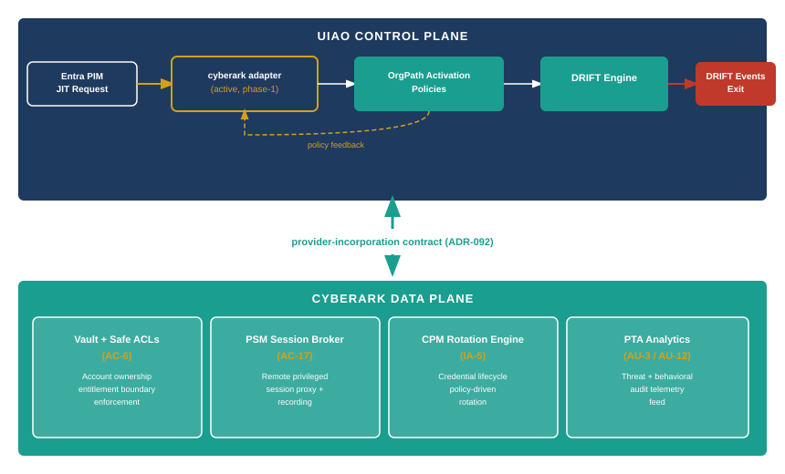

::: {.content-visible when-format="docx"}
::: {.callout-note}
## Reading this document as a standalone bundle

**ADR-092** is the Architecture Decision Record that defines UIAO's active governance posture: UIAO is a control plane that governs and incorporates provider data planes, not a platform that competes with them. This document uses the control-plane/data-plane distinction throughout.

**CyberArk Privilege Cloud** is the SaaS delivery model for CyberArk's Privileged Access Security (PAS) suite. It provides vault storage, session brokering (PSM), credential rotation (CPM), behavioral analytics (PTA), and DevOps secrets (Conjur) as a managed service. UIAO governs it as a data plane.

**Provider-incorporation contract** is the ADR-092 term for the set of capabilities a provider must expose to the UIAO control plane: a configuration audit API, an event stream for DRIFT routing, and a policy enforcement hook. CyberArk's vault configuration export, session recording archive, and PTA SIEM feed are the three surfaces that satisfy this contract.
:::
:::

::: {.callout-note}
## In this chapter
CyberArk Privilege Cloud is not an alternative to UIAO governance — it is the privileged access data plane that UIAO governs. The distinction matters because the failure mode of treating a PAM product as a governance solution in itself is well established: vaults that are configured once and drifted, safes with ACLs that accumulate like AD groups, session recordings that nobody queries until an incident. This chapter explains how UIAO applies the ADR-092 control-plane/data-plane boundary to CyberArk, what the provider-incorporation contract requires of the vault, and how the cyberark adapter (active, phase-1) surfaces vault state into the DRIFT engine.
:::

{#fig-book28-cpt03 fig-alt="Architecture diagram on white background. Top band labeled UIAO control plane (navy) contains cyberark adapter (active, phase-1) box with bidirectional arrows to OrgPath activation policies and DRIFT engine. Bottom band labeled CyberArk data plane (teal) contains four boxes in a row: Vault + Safe ACLs (AC-6), PSM session broker (AC-17), CPM rotation engine (IA-5), PTA analytics (AU-3/AU-12). Double-headed arrows between the two bands labeled provider-incorporation contract (ADR-092). Left side: Entra PIM JIT request arrow enters the control plane. Right side: DRIFT-CPM-STALE / DRIFT-PRIV-NOCBA events exit from control plane. White background." width="100%"}

## The Control-Plane / Data-Plane Boundary

ADR-092 defines UIAO's posture precisely: UIAO is an active reconciliation control plane that governs and incorporates provider data planes. It does not replicate what providers do. It does not run a parallel vault alongside CyberArk's vault. It does not build its own session recording pipeline. What it does is enforce that the vault's configuration matches the policy that UIAO holds, that sessions are being recorded at the coverage level the policy requires, and that credential rotation is occurring on the cadence that CPM is supposed to enforce.

The failure mode that the control-plane/data-plane model prevents is the fully distributed configuration problem. A vault that is governed entirely through CyberArk's native administrative interface is configured through a combination of safe policies, platform policies, system-level settings, and workflow configurations — all of which can drift independently, all of which require a CyberArk-knowledgeable administrator to audit, and none of which produce a canonical record that a governance reviewer can read without deep product expertise. The provider-incorporation contract solves this by requiring the vault to expose a machine-readable configuration snapshot that the UIAO control plane can compare against the governed policy baseline.

The cyberark adapter in UIAO is currently active at phase-1, which means it reads from CyberArk but does not write back to it. The adapter consumes the Vault Configuration Export API endpoint, the session recording archive availability data, and the PTA SIEM feed. Phase-2 write-back — the ability to push policy changes from the UIAO control plane into the vault's platform configurations — is deferred and will require a separate ADR when the governance model for bidirectional provider control is mature enough to specify safely.

> The control-plane/data-plane boundary is not an organizational compromise between teams that own different tools. It is an architectural principle: governance enforces policy; providers execute it. Conflating the two collapses the boundary and leaves enforcement contingent on whoever last touched the provider's native admin console.

## What the Vault Provides

CyberArk's vault organizes credentials into safes, each of which carries an access control list (ACL) that governs who can retrieve passwords, initiate sessions, manage accounts, and audit records. Safe ACLs are the vault's primary least-privilege enforcement mechanism, mapped to NIST AC-6. The UIAO governance model requires that safe ACLs be derived from OrgPath-based role assignments rather than configured directly in the vault's native interface — a restriction that prevents safe ACL drift from accumulating through ad hoc grants the same way AD group membership did.

Vault authentication requires multi-factor authentication configured for the vault credential itself, independent of the Entra session the user may already hold. This dual-authentication requirement corresponds to NIST IA-2 and is surfaced in the UIAO governance baseline as a required vault platform setting. The cyberark adapter reads the vault's authentication configuration and produces a drift event if MFA enforcement on vault credentials falls below the required setting.

All privileged remote sessions — RDP, SSH, and database connections — must be initiated through PSM, the Privileged Session Manager, which brokers the connection rather than revealing the credential to the user. The user authenticates to PSM; PSM retrieves the credential from the vault and establishes the session without the credential ever appearing in the user's clipboard or terminal. The NIST mapping is AC-17: remote access is controlled and brokered. DRIFT-PSM-BYPASS fires when a privileged session to a governed target bypasses PSM and connects directly with a known credential.

## PSM, PTA, and the Audit Chain

PSM does two things in parallel for every session it brokers. It records the session — keystrokes, screen video, and metadata including the account used, the target connected to, and the duration — in an archive that is tamper-resistant by virtue of being stored in the vault rather than on the target system. The session recording is the implementation artifact for NIST AU-3: the audit record contains the content of the privileged actions taken, not merely the fact that a connection was made.

PTA, the Privileged Threat Analytics engine, runs behavioral analysis against the session stream. It maintains baselines of normal privileged behavior — which accounts connect to which targets, at what hours, from which endpoints — and flags deviations. Lateral movement, credential theft indicators, session activity patterns inconsistent with the declared justification, and unusual post-activation activity relative to the account's history are all detection surfaces. The NIST mapping is AU-12: audit record generation in response to detected anomalies. PTA alerts are routed through the SIEM feed (Splunk or Microsoft Sentinel in the standard configuration) and ingested by the UIAO DRIFT engine as DRIFT-PTA-ALERT events.

The DRIFT-CPM-STALE signal also surfaces through the audit chain: CPM logs every rotation attempt and outcome, and the vault's platform audit exposes rotation failures and cadence violations. The cyberark adapter reads rotation audit data and fires DRIFT-CPM-STALE when an account in scope for CPM rotation has not been rotated within the policy cadence. This makes rotation failure observable as a governance event rather than a silent configuration gap.

> The audit chain from session initiation to DRIFT event is unbroken only if PSM is in the path. A session that bypasses PSM produces no recording, no PTA analysis, and no attribution in the vault audit log. DRIFT-PSM-BYPASS is P0 because bypassing PSM severs the entire audit chain, not just one link in it.

## Provider-Incorporation Contract

ADR-092's provider-incorporation contract specifies three capability classes that a provider must expose for UIAO to govern it as an active data plane rather than a passively trusted product. CyberArk Privilege Cloud satisfies all three through existing product features.

The first capability class is configuration audit. The vault must expose a machine-readable snapshot of its platform settings, safe policies, and account configurations at a level of detail sufficient for the UIAO governance baseline to evaluate compliance. CyberArk's Vault Configuration Export API provides this surface. The adapter queries it on a scheduled basis and diffs the result against the governance baseline; any delta produces a DRIFT event.

The second capability class is event stream. The vault must produce a real-time or near-real-time stream of governance-relevant events — failed authentications, policy changes, rotation failures, session anomalies — in a format that the DRIFT engine can ingest. CyberArk's integration with SIEM products via the PTA feed satisfies this requirement. The adapter configures the SIEM feed as the event stream source.

The third capability class is policy enforcement hook. In phase-1 (current), this is read-only: the adapter reads policy violations from the vault but does not push corrective configurations back. In phase-2 (deferred), the adapter will use the vault's REST API to push platform policy settings, safe ACL corrections, and CPM policy updates back to the vault under UIAO governance control. The phase-2 transition requires a separate ADR because write-back to a production credential vault is an actuation surface with consequences that require explicit governance sign-off beyond the phase-1 adapter activation.

::: {.callout-tip}
## Continue reading

[← Chapter 2 — Entra PIM](Book_28_CPT_02.qmd) | [Chapter 4 — Credential Rotation and Secrets Management →](Book_28_CPT_04.qmd)
:::
