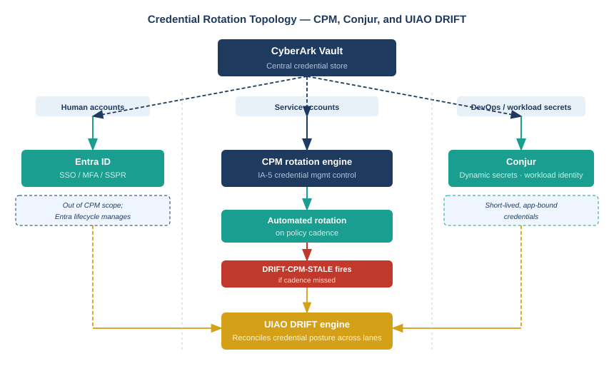

::: {.content-visible when-format="docx"}
::: {.callout-note}
## Reading this document as a standalone bundle

**CPM** — Central Policy Manager — is the CyberArk component that automates credential rotation. It manages rotation cadence, safe-level rotation policies, and dependency verification. The NIST mapping is IA-5: authenticator management.

**Conjur** is CyberArk's DevOps secrets management product. It provides short-lived dynamic secrets and workload identity for application-to-application and CI/CD pipeline authentication. It addresses the anti-pattern of baked-in static credentials in deployment pipelines and application configurations.

**DRIFT-CPM-STALE** fires when a service account credential governed by CPM has not been rotated within the policy cadence. **DRIFT-CONJUR-STATIC** fires when a Conjur secret that should be short-lived has been in place beyond its configured TTL. Both are P2 severity and route through the ServiceNow ticket workflow.
:::
:::

::: {.callout-note}
## In this chapter
Active Directory's credential rotation story for service accounts was a spreadsheet and a calendar reminder. When the reminder fired, someone looked up which applications and scripts depended on the account, coordinated the change, updated the dependencies, and closed the ticket. When the reminder did not fire — or fired while the responsible engineer was on leave — the account ran on a credential that had not been rotated in six months, or a year, or since it was created. This chapter maps the three credential tiers that UIAO governs separately, explains how CPM enforces rotation as an automated policy rather than a manual process, introduces Conjur as the governed answer for DevOps and workload secrets, and defines the drift surface that catches what neither mechanism can enforce on its own.
:::

{#fig-book28-cpt04 fig-alt="Topology diagram on white background. Center: CyberArk Vault (navy box). Three lanes branch from it. Left lane: Human accounts — arrow to Entra ID (SSO/MFA, SSPR) — labeled Out of CPM scope; managed by Entra lifecycle. Center lane: Service accounts — arrow through CPM rotation engine (IA-5) — labeled Automated rotation on policy cadence; below CPM: DRIFT-CPM-STALE fires if cadence missed. Right lane: DevOps/workload secrets — arrow through Conjur (dynamic secrets, workload identity) — labeled Short-lived, app-bound credentials. All three lanes terminate at UIAO DRIFT engine at the bottom. White background, navy/teal/amber/red palette." width="100%"}

## The Three Credential Tiers

The AD era's implicit credential model treated all account types identically from a rotation perspective: there was one rotation policy, one rotation mechanism (a manual password change), and one tracking system (whoever remembered to look at the spreadsheet). The consequence was that the tier with the highest operational risk — service accounts — was governed with the same mechanism as user accounts and suffered the same failure mode: rotation happened when someone made it happen, and it did not happen when they did not.

UIAO's governance model divides credentials into three tiers, each with a distinct management surface and a distinct failure mode.

Human credentials are managed by Entra ID. Entra's self-service password reset (SSPR), conditional access, and passwordless authentication options provide the rotation and authentication surfaces for user accounts. Human credentials are out of CPM scope; routing them through the vault's rotation engine would create a redundant management layer with no governance benefit. The Entra lifecycle events — Joiner, Mover, Leaver — handle the provisioning and deprovisioning of human credentials through the JML pipeline described in Book_27.

Service account credentials — accounts that run scheduled tasks, application pools, service connections, and integration workflows — are managed by CPM. These accounts cannot use human-facing authentication mechanisms like MFA prompts or SSPR. Their credentials must be managed programmatically, rotated automatically, and their dependencies must be kept in sync with each rotation. CPM provides all three capabilities: it knows which accounts it governs, it enforces a rotation policy at the safe level, and it can push the rotated credential to dependent applications if the dependency map is maintained.

DevOps and workload secrets are managed by Conjur. These are not traditional service account passwords — they are API keys, database connection strings, signing certificates, and inter-service authentication tokens used by application code and CI/CD pipelines. The governance model for this tier is fundamentally different from CPM's: rather than rotating a long-lived secret on a schedule, Conjur issues short-lived dynamic secrets bound to the requesting workload's identity. The secret expires when the session ends or when the TTL lapses, and the next request gets a different secret. There is no long-lived credential to rotate because there is no long-lived credential.

> The three-tier model exists because the same rotation mechanism cannot serve all three use cases without compromising one. Human accounts require authentication UX that automation cannot replicate. Service accounts require dependency-aware rotation that human credential management tools do not provide. Workload secrets require identity-bound dynamic issuance that neither of the other two mechanisms produces.

## CPM and the Rotation Policy

CPM manages service account credentials through a combination of safe-level rotation policies and account-level configuration. A rotation policy specifies the cadence — ninety days is the common federal baseline, thirty days for credentials used in privileged contexts — the rotation method (CPM generates the new credential and pushes it to dependent targets, or CPM generates it and an administrator applies it manually), and the notification recipients when rotation fails.

The dependency map is the operationally critical input. CPM can rotate a credential successfully and break a dependent application if the application's connection configuration is not updated in step. Maintaining the dependency map is a governance task that requires the service account owner to document which applications, scripts, and connectors use the credential when the account is onboarded to CPM. The UIAO governance model requires this documentation as a condition of safe creation for any service account — an account whose dependency map is empty or undocumented is flagged by the cyberark adapter as a DRIFT-CPM-NODEP event (P3 severity), which creates a documentation task rather than an operational incident.

DRIFT-CPM-STALE fires when an account governed by CPM has not been rotated within the cadence specified in its safe policy. The most common causes are CPM connectivity failures (CPM cannot reach the target system to push the new credential), dependency failures (CPM rotated the credential but a dependent application's credential update failed, causing CPM to roll back the rotation), and safe policy mismatches (the account was moved to a safe with a different policy after it was onboarded). All three causes produce the same DRIFT-CPM-STALE event; the resolution path differs by root cause and is documented in the associated ServiceNow ticket.

## Conjur and DevOps Secrets

The AD-era anti-pattern for application authentication was the embedded credential: a service account password stored in a configuration file, an environment variable, a deployment script, or a code repository. The embedded credential was convenient — it required no runtime infrastructure to retrieve — and it was a persistent governance liability: it did not rotate, it was often committed to version control, and when it needed to change, every deployment that referenced it had to be updated in coordination.

Conjur addresses this by inverting the model. Instead of embedding a credential in the application, the application is given a Conjur workload identity — a machine identity scoped to the application's deployment context — and authenticates to Conjur to retrieve a short-lived secret at runtime. The secret is valid for a TTL that matches the operational window (minutes for a CI/CD job, hours for a long-running service). When the TTL expires, the application must re-authenticate and retrieve a fresh secret. The old secret is automatically invalidated.

The governance model for Conjur requires that every application secret be associated with a Conjur policy that specifies the permitted consumers (workload identities), the secret's TTL, and the rotation source (typically CPM for the underlying credential that Conjur wraps). The cyberark adapter reads Conjur policy state and fires DRIFT-CONJUR-STATIC when a secret that should be short-lived has a TTL configured above the policy maximum, or when a secret with a finite TTL has not been refreshed within the expected window — which typically indicates that the consuming application has stopped requesting it (a service that has gone dark) rather than a security incident, but which requires verification either way.

> The shift from embedded credentials to Conjur-issued dynamic secrets does not eliminate the credential management problem — it moves the problem to a place where it can be governed. Conjur policies are in version control, auditable, and machine-readable. Embedded credentials in application configuration are none of those things.

## The Rotation Drift Surface

The rotation drift surface has two primary signals and one structural condition that produces both.

DRIFT-CPM-STALE is the operational signal: a specific service account credential has not been rotated on schedule. It fires at P2 severity, opens a ServiceNow ticket, and requires resolution (either a successful rotation or an explained exception) within seventy-two hours. Repeated DRIFT-CPM-STALE events on the same account escalate to P1 after three consecutive cycles, triggering a review of whether the account should remain in the vault or be deprovisioned.

DRIFT-CONJUR-STATIC is the configuration signal: a Conjur secret is configured with a TTL or refresh policy that violates the governance baseline. Unlike DRIFT-CPM-STALE, which indicates a runtime failure, DRIFT-CONJUR-STATIC indicates a policy misconfiguration that allows a static credential to exist where a dynamic one should. It fires at P2 severity and requires either a policy correction or an approved exception.

The structural condition that produces both signals is the dependency inventory gap: service accounts and application secrets that exist in the vault but are not associated with a CPM or Conjur policy. An account in a safe without a rotation policy is invisible to both drift signals until the policy is attached. The cyberark adapter's configuration audit scans safe memberships quarterly and flags accounts that are in governance-required safes but have no CPM or Conjur policy association, routing them as DRIFT-CPM-NOPOLICY at P3 severity to ensure the inventory gap is closed before it becomes a stale-credential incident.

::: {.callout-tip}
## Continue reading

[← Chapter 3 — CyberArk Privilege Cloud](Book_28_CPT_03.qmd) | [Chapter 5 — Privileged Session Management and the Audit Chain →](Book_28_CPT_05.qmd)
:::
