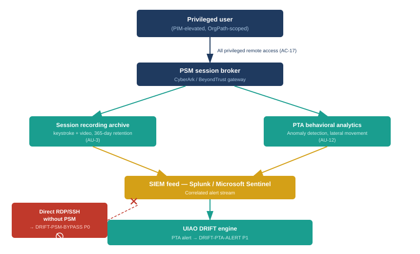

::: {.content-visible when-format="docx"}
::: {.callout-note}
## Reading this document as a standalone bundle

**PSM** — Privileged Session Manager — is the CyberArk component that brokers all privileged remote sessions. The user authenticates to PSM; PSM retrieves the credential and establishes the target connection without revealing the credential to the user. PSM records every session. The NIST mapping is AC-17 (remote access) and AU-3 (audit record content).

**PTA** — Privileged Threat Analytics — is the CyberArk behavioral analysis engine. It monitors session streams for lateral movement, unusual authentication patterns, and credential theft indicators. The NIST mapping is AU-12 (audit record generation). PTA alerts flow to the SIEM feed and enter the UIAO DRIFT engine as DRIFT-PTA-ALERT events.

**DRIFT-PSM-BYPASS** fires when a privileged session to a governed target is established without routing through PSM. This is a P0 event because bypassing PSM severs the entire audit chain — no recording, no PTA analysis, no attribution in the vault audit log.
:::
:::

::: {.callout-note}
## In this chapter
The AD era's audit trail for privileged sessions was Windows Event Log — a log that the same elevated account running the session could read, modify, or clear. Privileged sessions were typically direct RDP or SSH connections with no intermediary, which meant there was no independent recording of what happened during the session and no behavioral analysis of whether what happened was consistent with the stated purpose of the access. This chapter explains how PSM closes both gaps as a mandatory session broker, how PTA builds an auditable behavioral baseline against which session anomalies are detected, and how the complete audit chain from PIM activation to DRIFT routing makes the privileged access surface legible for the first time.
:::

{#fig-book28-cpt05 fig-alt="Audit chain diagram on white background. Top: Privileged user (PIM-elevated, OrgPath-scoped) box. Arrow labeled All privileged remote access (AC-17) to center: PSM session broker (navy box). Two outputs from PSM: left arrow to Session recording archive (keystroke + video, 365-day retention, AU-3) teal box. Right arrow to PTA behavioral analytics (teal box) with label Anomaly detection, lateral movement indicators (AU-12). Both boxes have arrows down to SIEM feed (Splunk / Sentinel) amber box, which has arrow to UIAO DRIFT engine — PTA alert becomes DRIFT-PTA-ALERT P1. At bottom: Direct RDP/SSH without PSM → DRIFT-PSM-BYPASS P0 (red box). White background." width="100%"}

## The AD Era Audit Trail Problem

Windows Event Log records authentication events, process creation, privilege use, and a range of other security-relevant activity. It is the primary audit source for most federal environments that have not deployed additional logging infrastructure, and it is deeply inadequate for privileged session governance for one reason that is structural rather than configurable: the account performing the privileged session has, by definition, the access level required to read and modify the logs that record its own activity.

A domain administrator can clear the Security Event Log on any system in the domain. A local administrator can clear the local Security log. The clearing action itself generates an event — Event ID 1102 — but an attacker who knows to clear the log knows to clear the event that records the clearing. The audit trail that Windows Event Log provides for privileged sessions is contingent on the cooperation of the privileged account: it is present when the account's holder does not tamper with it and absent when they do. That is not an audit trail. It is a convention that functions as one in normal operations.

The second structural problem was the absence of session recording. Windows Event Log records that an RDP session was initiated and terminated. It does not record what happened during the session — which files were accessed, which commands were run, which configurations were changed. Reconstructing what a privileged administrator did during a session required correlating file access logs, process execution logs, registry change logs, and PowerShell transcript logs — assuming all of those logging sources were enabled and centralized, which they often were not. In practice, forensic reconstruction of a privileged session from native Windows logs required more effort than most organizations could sustain outside an active incident response.

> The AD era's privileged session audit was probabilistic: it was likely that sufficient logs existed to reconstruct what happened, and occasionally the probability was zero because someone had cleared the log or the relevant sources were not enabled. That probabilistic posture is inconsistent with federal continuous monitoring requirements.

## PSM as Session Broker

PSM addresses both structural problems by inserting itself as a mandatory intermediary between the privileged user and the target system. The session architecture changes: instead of the user opening an RDP client to the target, the user initiates a session request through PSM, which authenticates the user, retrieves the credential from the vault without exposing it, and opens the connection to the target on the user's behalf. The user sees a brokered desktop session; the target system sees a connection from PSM, not from the user's workstation.

The first consequence of this architecture is session isolation. The user does not hold the target credential — PSM does, for the duration of the session. The user cannot exfiltrate the password because they never received it. When the session ends, the credential can be rotated immediately without coordination with the user, because the user's access was session-scoped rather than credential-scoped.

The second consequence is tamper-resistant recording. PSM writes the session recording to the CyberArk vault, not to the target system. An administrator with elevated rights on the target cannot reach the recording to modify it — the recording is stored in a location governed by the vault's ACLs, which are managed by the UIAO governance baseline and audited by the cyberark adapter. The recording captures keystrokes and screen video at a level of detail that satisfies NIST AU-3's requirement for audit record content: the recording is the record of what happened, not a summary of that record.

The mandatory nature of PSM in the UIAO governance model means that any privileged session to a governed target that does not route through PSM is a governance violation regardless of whether the session itself was legitimate. DRIFT-PSM-BYPASS is P0 because the bypass does not merely degrade the audit trail — it eliminates it. A P0 event escalates immediately to L3 on the actuation ladder: the account used for the bypass is suspended pending review, and the target system is flagged for a configuration audit to determine how the direct connection was possible.

## PTA and Behavioral Analytics

The session recording addresses what happened during a session. PTA addresses whether what happened was consistent with the expected behavior of the account and the declared purpose of the access.

PTA maintains a behavioral baseline for each privileged account: typical connection targets, typical hours of operation, typical command patterns, typical session durations. Deviations from the baseline are scored and flagged. Lateral movement — an account that normally administers a specific subnet suddenly connecting to systems across multiple subnets in a short time window — is a high-confidence indicator. Unusual post-activation activity relative to a declared justification — a session declared as "routine maintenance" that accesses authentication infrastructure — is a lower-confidence indicator that escalates if it continues.

PTA alerts flow to the SIEM feed, which routes them to the UIAO DRIFT engine. The drift event is DRIFT-PTA-ALERT, at P1 severity for medium-to-high confidence indicators. P1 severity means a ServiceNow incident is opened automatically and the account is placed in an enhanced monitoring state — every subsequent session from that account is flagged for expedited review — until the incident is closed. Closure requires either a determination that the alert was a false positive (in which case the baseline is updated to prevent recurrence) or a confirmed finding that triggers the appropriate incident response workflow.

The SIEM integration supports both Splunk and Microsoft Sentinel in the standard UIAO configuration. The cyberark adapter configures the PTA feed destination as part of its initial deployment and monitors feed health — a SIEM feed that has stopped receiving PTA events for more than four hours produces a DRIFT-PTA-SILENT event, at P2 severity, because a silent PTA feed is indistinguishable from a PTA feed that is running but producing no alerts due to the absence of anomalies.

## The Audit Chain from Elevation to Closure

The complete audit chain for a privileged access event in the UIAO governance model has five stages, each of which produces a distinct artifact that is independently auditable.

The first stage is PIM activation: the user requests elevation, satisfies the OrgPath policy and CBA gate, provides a justification, and receives a time-bounded role. The PIM audit log records the requestor, the role, the justification, the authentication method used to satisfy the CBA gate, the approval workflow outcome (if required), and the activation timestamp. This stage is governed by Chapter 2.

The second stage is session initiation through PSM: the user initiates a session request for a target within the scope of their activated role. PSM verifies that the role grants access to the requested target, retrieves the credential from the vault, opens the connection, and begins recording. The vault audit log records the session initiation, the account used, the target connected to, and the PSM node that brokered the session.

The third stage is session execution: the session proceeds under PSM's recording. The recording archive captures all activity. PTA monitors the session stream in real time and scores behavioral indicators.

The fourth stage is session termination: the session ends, PSM writes the final recording to the vault archive, PTA produces a session-level behavioral summary, and CPM optionally rotates the credential used for the session if the safe policy calls for post-session rotation.

The fifth stage is role expiration: the PIM TTL lapses, the role is removed from the user's active assignments, and the PIM audit log records the expiration timestamp. The user returns to unprivileged status. Any subsequent access requires a new activation workflow from the beginning.

> The chain is unbroken when every stage produces its artifact. Stage two is the only stage that can silently fail: a PSM bypass eliminates the recording (stage three), the PTA analysis (stage three), the vault session record (stage two), and the CPM rotation signal (stage four), while leaving the PIM activation record (stage one) and role expiration record (stage five) intact. The audit log looks like an activation with no session, which is why DRIFT-PSM-BYPASS is P0 rather than a lower severity.

::: {.callout-tip}
## Continue reading

[← Chapter 4 — Credential Rotation and Secrets Management](Book_28_CPT_04.qmd) | [Chapter 6 — The DRIFT Surface for PAM →](Book_28_CPT_06.qmd)
:::
