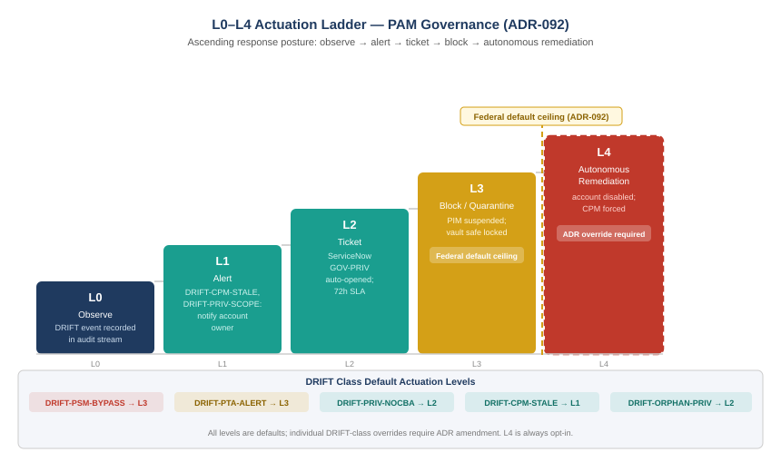

::: {.content-visible when-format="docx"}
::: {.callout-note}
## Reading this document as a standalone bundle

**DRIFT** is UIAO's term for a detected deviation between the governed policy baseline and the observed state of a governed system. Drift events are classified by type and severity, routed to a remediation workflow, and tracked until closure. The PAM surface has seven DRIFT classes described in this chapter.

**ADR-092** defines the L0–L4 actuation ladder: the five-level response escalation model that governs how UIAO responds to drift events. L0 observes, L1 alerts, L2 opens a ticket, L3 blocks or quarantines, and L4 remediates autonomously. L3 is the federal default ceiling; L4 requires an explicit ADR override because autonomous remediation of production infrastructure carries consequences that require governance sign-off.

**ADR-068** is the Architecture Decision Record requiring certificate-based authentication before PIM elevation. DRIFT-PRIV-NOCBA fires when this requirement is not satisfied at activation.

**JML** — Joiner/Mover/Leaver — is the identity lifecycle event model from Book_27. The PAM drift surface has a dedicated signal (DRIFT-ORPHAN-PRIV) that fires in response to Leaver events detected by the JML pipeline, connecting the two books.
:::
:::

::: {.callout-note}
## In this chapter
PAM governance is not complete when the vault is configured, PIM is enabled, and CPM is running. It is complete when deviations from the governed configuration are detected, routed, and resolved. This chapter assembles the full DRIFT taxonomy for the PAM surface — seven signals covering PIM, CPM, PSM, PTA, and the leaver cross-reference — maps each to the L0–L4 actuation ladder, and explains what closing the loop actually requires: not just detecting drift but confirming that the underlying condition is resolved and that the resolution does not introduce a new deviation.
:::

{#fig-book28-cpt06 fig-alt="Staircase diagram on white background, ascending left to right. Five steps labeled L0 through L4. L0 (navy): Observe — DRIFT event recorded in audit stream. L1 (teal): Alert — DRIFT-CPM-STALE, DRIFT-PRIV-SCOPE: notification to account owner. L2 (teal): Ticket — ServiceNow GOV-PRIV ticket auto-opened; 72-hour SLA. L3 (amber): Block/Quarantine — PIM activation suspended; vault safe locked; federal default ceiling. L4 (red, dashed border): Autonomous remediation — account disabled, CPM rotation forced; ADR override required. Left of L3: bracket labeled Federal default ceiling (ADR-092). Right of L3: amber text L4 requires explicit ADR override. Below staircase: horizontal band showing DRIFT classes and their default actuation level: DRIFT-PSM-BYPASS=L3, DRIFT-PTA-ALERT=L3, DRIFT-PRIV-NOCBA=L2, DRIFT-CPM-STALE=L1, DRIFT-ORPHAN-PRIV=L2. White background." width="100%"}

## The PAM DRIFT Taxonomy

Seven DRIFT classes cover the PAM surface. Each is described here with its default severity, its default actuation level, and the most common root causes that produce it.

**DRIFT-PRIV-NOCBA** (P2, L2). A PIM-eligible role activation was completed without satisfying the CBA gate required by ADR-068. Root causes: conditional access policy misconfiguration, break-glass pathway used outside its governance scope, device without the required certificate enrolled. Resolution: review the activation, determine whether the access was legitimate, correct the configuration that allowed the bypass, and trigger a PIM access review for the account. Escalates to L3 (PIM activation suspended) if the ticket is not resolved within seventy-two hours.

**DRIFT-PRIV-STATIC** (P2, L2). A role in scope for PIM governance is held as a permanent active assignment rather than through eligible activation. Root causes: migration residue from pre-PIM deployments, break-glass account registered without the required governance documentation, administrative workaround applied under time pressure. Resolution: convert the assignment to eligible, or register the account as an approved break-glass exception. Quarterly scan; resolved exceptions are documented and reviewed annually.

**DRIFT-PRIV-SCOPE** (P2, L2). A PIM activation was granted for a role whose OrgPath activation policy conditions are not satisfied by the requestor's current position. Root causes: HRIT sync delay producing stale OrgPath data, activation policy not updated after a legitimate org change, policy misconfiguration. Resolution: verify whether the cause is data staleness or a policy violation; correct accordingly.

**DRIFT-CPM-STALE** (P2, L1 escalating to L2). A service account credential governed by CPM has not been rotated within the safe's rotation policy cadence. Root causes: CPM connectivity failure, dependency map verification failure (CPM rotated but a dependent application's credential update failed and CPM rolled back), safe policy mismatch after a safe migration. Resolution: investigate root cause via CPM rotation logs; resolve connectivity or dependency issue; trigger manual rotation if automated rotation cannot be recovered within twenty-four hours.

**DRIFT-CPM-NOPOLICY** (P3, L1). A service account in a governance-required safe has no CPM rotation policy attached. Root cause: account onboarded to the vault without completing the dependency documentation and policy configuration step. Resolution: document the dependency map and attach a CPM policy within the ticket SLA. Lower severity because the account exists in the vault (which provides safe ACL protection) but is not actively rotated.

**DRIFT-PSM-BYPASS** (P0, L3). A privileged session to a governed target was established without routing through PSM. Root causes: direct RDP/SSH connection using a known credential, break-glass access to a target not configured in PSM, PSM configuration gap on a newly-added target. Resolution: suspend the account used for the bypass, audit the session through available system logs, investigate how the direct connection was possible, and close the configuration gap. P0 severity because bypassing PSM severs the entire audit chain.

**DRIFT-PTA-ALERT** (P1, L3). PTA detected a behavioral anomaly in a privileged session. Root causes: lateral movement indicators, unusual authentication time or source, session activity inconsistent with declared justification, credential theft indicators. Resolution: incident workflow; determine whether the alert is a false positive or a confirmed finding; close with a determination. False positives result in a baseline update; confirmed findings result in account suspension and escalation per the incident response process.

## The Leaver Cross-Reference

When the JML pipeline in Book_27 detects a Leaver event — an HRIT record indicating that an employee or contractor has separated from the organization — the PAM surface requires a dedicated cross-check. The JML pipeline fires DRIFT-ORPHAN-NHAM when it finds a non-human account (a service account or application account) owned by the departing identity. DRIFT-ORPHAN-PRIV is the PAM-specific companion: it fires when a Leaver event is detected and the departing identity held any of the following in the vault — safe ACL membership, privileged account ownership, a CPM platform account record, or a CyberArk vault user account.

The two signals are related but distinct. DRIFT-ORPHAN-NHAM can fire without a vault component — a service account in Entra that was never enrolled in CyberArk produces DRIFT-ORPHAN-NHAM but not DRIFT-ORPHAN-PRIV. DRIFT-ORPHAN-PRIV fires when the vault specifically is implicated. Both signals must be resolved before the Leaver event is considered closed in the UIAO governance model; a Leaver event that closes with an open DRIFT-ORPHAN-PRIV is a governance exception that requires explicit documentation.

The cross-check is performed by the cyberark adapter at Leaver event time. The adapter queries vault membership against the departing identity's HRIT record and vault user account, producing a list of all vault surfaces the identity touches. The output is attached to the Leaver event's ServiceNow workflow as a task checklist: each vault surface must be disposed of explicitly — safe ACL membership removed, owned accounts transferred to a new owner or scheduled for deprovisioning, vault user account deactivated.

> The leaver cross-reference is where identity governance (Book_27) and privileged access management (this book) connect operationally. A Leaver event that does not complete the PAM cross-check leaves a credential vault with ghost ownership: accounts in the vault that are nobody's formal responsibility, running under a governance model that has lost its human anchor.

## The L0–L4 Actuation Ladder for PAM

ADR-092's L0–L4 actuation ladder defines five response levels, each escalating the intervention from observation to autonomous remediation. The PAM surface applies the ladder with specific examples at each level.

**L0 — Observe.** The DRIFT event is recorded in the UIAO audit stream. No automated action beyond logging. This level applies to DRIFT-CPM-NOPOLICY during its initial detection window, before the notification delay expires.

**L1 — Alert.** Notification is sent to the account owner and governance contact. For DRIFT-CPM-STALE, L1 fires at initial detection: the account owner is notified that rotation is overdue and given twenty-four hours to investigate before a ServiceNow ticket is auto-opened. For DRIFT-CPM-NOPOLICY, L1 is the default level unless the ticket SLA is exceeded.

**L2 — Ticket.** A ServiceNow GOV-PRIV ticket is opened automatically. A seventy-two hour SLA applies for P2 events. DRIFT-PRIV-NOCBA, DRIFT-PRIV-STATIC, DRIFT-PRIV-SCOPE, and DRIFT-ORPHAN-PRIV all default to L2. Unresolved L2 tickets escalate to L3 at SLA expiration.

**L3 — Block / Quarantine.** Active intervention: PIM activation is suspended for the affected account, vault safe access is locked, or the target system's PSM configuration is flagged for mandatory review. L3 is the federal default ceiling for autonomous intervention under ADR-092. DRIFT-PSM-BYPASS and DRIFT-PTA-ALERT both default to L3 because the severity of their failure modes warrants immediate action without requiring manual escalation. Accounts in L3 status require manual governance review and explicit sign-off to return to normal operation.

**L4 — Autonomous Remediation.** Accounts are disabled, CPM rotation is forced, or safe memberships are automatically corrected. L4 requires an explicit ADR override because autonomous remediation of production credential infrastructure carries consequences — a forced CPM rotation can break a dependent application; disabling a privileged account can halt a running service — that require governance sign-off before they can be automated. No PAM DRIFT class defaults to L4; escalation to L4 requires a finding that the L3 intervention has failed to produce resolution and that the risk of continued access exceeds the risk of service disruption.

## Closing the Loop

Detecting drift is necessary but not sufficient. The governance model is closed only when the resolution cycle is complete: the DRIFT event is detected, a ticket is opened, the root cause is investigated, a corrective action is applied, and the corrective action is verified to have actually resolved the drift condition without introducing a new one.

The verification step is the one most often skipped under operational pressure. An administrator who resolves DRIFT-CPM-STALE by triggering a manual rotation has fixed the symptom. If the root cause was a CPM connectivity failure that has not been resolved, the next rotation cycle will produce the same DRIFT-CPM-STALE event. If the root cause was a safe policy mismatch, the account may be in the wrong safe and will drift again after the next safe audit. The ServiceNow ticket for a PAM DRIFT event requires a root cause field and a corrective action field, both of which must be populated before the ticket can be closed. The cyberark adapter verifies the vault state after ticket closure and re-opens the ticket if the condition recurs within thirty days.

The final check on any PAM-related ticket is a CPM rotation verification: after any DRIFT event involving a service account, the adapter confirms that the account's credential was rotated within the resolution window. This prevents the pattern in which an account's drift condition is administratively cleared without the underlying credential being refreshed — a closed ticket on a credential that has not rotated is a false close, and the governance model treats it as one.

::: {.callout-tip}
## Continue reading

[← Chapter 5 — Privileged Session Management](Book_28_CPT_05.qmd) | [Chapter 7 — Glossary and References →](Book_28_CPT_07.qmd)
:::
