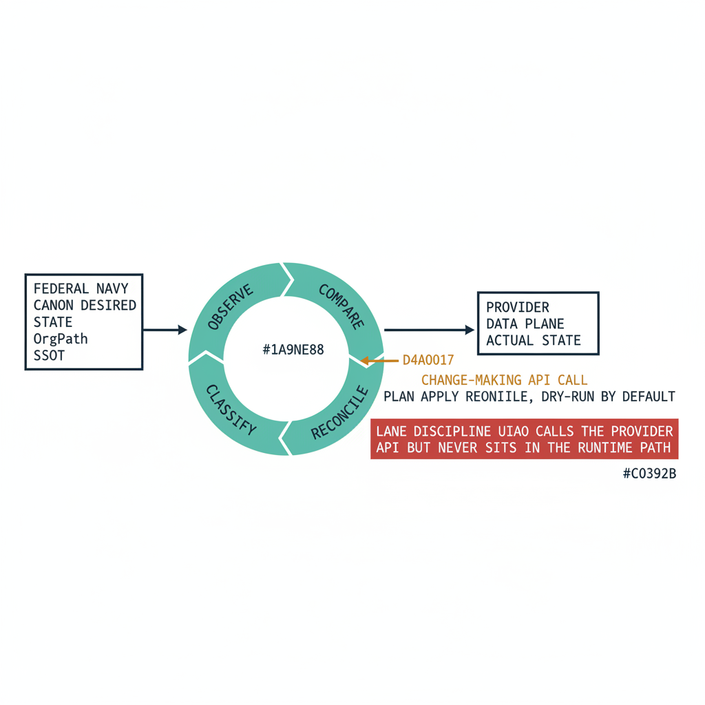
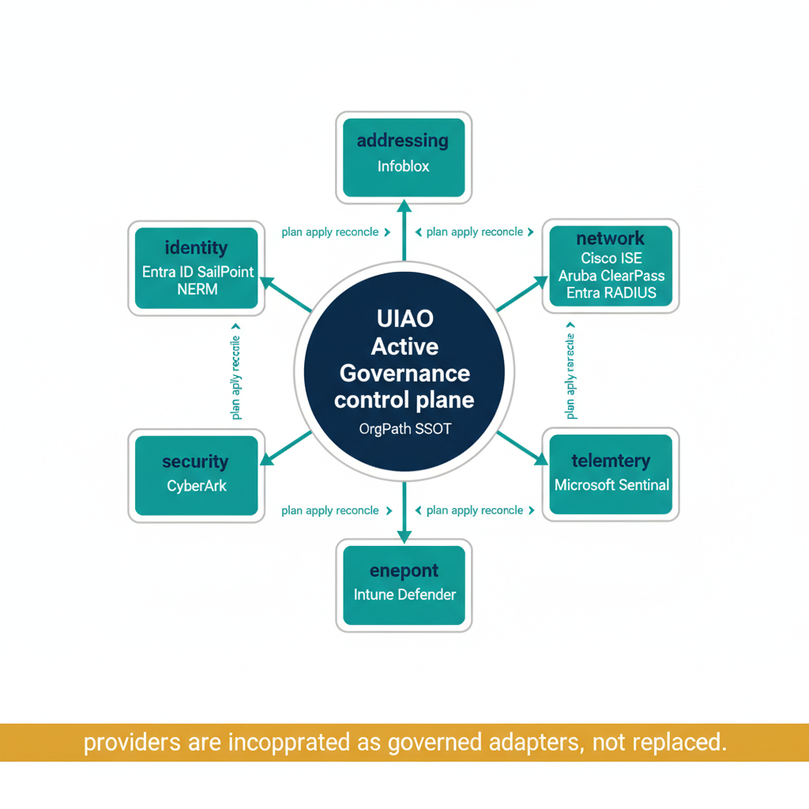

# Active Governance {.unnumbered}

::: {.callout-note}
This page is the reader-facing articulation of **Active Governance** — UIAO's posture as an *active reconciliation control plane* that governs the providers running your estate without replacing them. The normative source is [ADR-092](../../../src/uiao/canon/adr/adr-092-active-governance.md); the platform machinery it describes is canon in [UIAO_101](../../../src/uiao/canon/specs/Platform-Overview.md) and [UIAO_102](../../../src/uiao/canon/specs/Platform-Services-Layer.md). The [Platform Server Build](./platform-server-build.qmd) pages describe the *substrate this runs on*; this page describes what runs on it.
:::

When Active Directory is retired, what is lost is not a directory — it is the *closed loop*. AD governed because it sat in the path: it authenticated the logon, evaluated the group, pushed the policy, and truth and enforcement were the same act. The cloud era deliberately tore that apart. Identity lives in one provider, devices in another, network admission in a third, privileged access in a fourth, and each keeps its own copy of the truth. A registry that merely records intended state and reports divergence can see the gap; it cannot close it. Governance without a closed loop is a spreadsheet that judges you.

Active Governance closes the loop — but it does so as a **control plane**, never by climbing back into the runtime path the way AD did.

## UIAO is the control plane; your providers are the data plane

The line that makes this safe is the boundary between **governing** and **executing**. UIAO holds desired state, observes actual state, classifies divergence, and reconciles toward intent. The provider authenticates, authorizes, routes, resolves, or stores at runtime. UIAO *may* call a provider's management API to correct drift — the way it already calls Microsoft Graph to fix an Entra group — but it never becomes the runtime component: it does not sit inline in the authentication path, terminate a session or tunnel, route a packet, or issue the production credential.

{#fig-active-governance-image-01 fig-alt="Engineering blueprint diagram on a white background showing a closed reconciliation loop. On the left a federal navy #1F3A5F box labeled canon desired state OrgPath SSOT. An arrow leads to a teal #1A9E8F ring of four stages labeled observe, compare, classify, reconcile. From the compare stage a navy input arrow comes from a box on the right labeled provider data plane actual state. From the reconcile stage an amber #D4A017 arrow labeled change-making API call points to the provider box, annotated plan apply reconcile, dry-run by default. A red #C0392B band beneath the provider box reads lane discipline UIAO calls the provider API but never sits in the runtime path. Monospace labels, no human figures, 16:9 landscape." width="85%"}

This is the same separation of concerns that lets a Kubernetes control plane govern a cluster without standing in the data path of a single packet. It is also what keeps UIAO from being a competitor that an incumbent provider would crush: UIAO rides on top of Entra, Intune, Arc, Cisco ISE, Infoblox, and the rest — it does not fight them for their runtime seat.

## Don't compete — incorporate

A provider is brought under governance as an **adapter** bound to one control-plane slot, through the Platform Services Layer ([UIAO_102](../../../src/uiao/canon/specs/Platform-Services-Layer.md)). UIAO does not reimplement what the provider does; it reconciles the provider's state against canon and emits evidence. To be incorporated, an adapter must:

- **bind to one control-plane slot** — identity, addressing, network, telemetry, endpoint, or security;
- **expose `plan / apply / reconcile`** — compute the change-set with no writes, execute it (dry-run by default), or both;
- **carry OrgPath** — every governed object expresses its organizational position, so the provider's state is addressable in the same terms as every other plane;
- **advertise governance metadata** — `controls_supported`, `side_effects`, `blast_radius`, `rollback_capable`;
- **declare a governance mode** — its rung on the maturity ladder below.

> The provider keeps its job. UIAO gives that job a single organizational truth to answer to, a continuous check that it still matches, and an audit trail proving it.

## The six control-plane slots

The estate decomposes into six provider-neutral control planes ([`control-planes.yml`](../../../src/uiao/canon/data/control-planes.yml)). Each is a *seat* a real provider fills — and UIAO governs the seat, not the vendor.

| Control-plane slot | What it governs | Example incorporated provider(s) | Governing canon |
|---|---|---|---|
| **Identity** | Identity provider, ICAM, joiner/mover/leaver, PIM | Entra ID; SailPoint NERM (non-employee) | ADR-055, ADR-059 |
| **Addressing** | IPAM, DNS, DHCP authority | Infoblox NIOS / BloxOne | Book_14 |
| **Network** | Admission (802.1X / NAC), SD-WAN segmentation | Cisco ISE, Aruba ClearPass, Entra RADIUS; SD-WAN fabric | Book_17, ADR-073, ADR-066 |
| **Telemetry** | SIEM, monitoring, evidence correlation | Microsoft Sentinel; cloud monitoring | UIAO_101 §1 |
| **Endpoint** | Device compliance, configuration, EDR | Microsoft Intune, Microsoft Defender | ADR-071 |
| **Security** | Zero-Trust enforcement, privileged access | CyberArk (PAM); Defender | control-planes.yml §security |

{#fig-active-governance-image-02 fig-alt="Engineering blueprint diagram on a white background. A central federal navy #1F3A5F hub labeled UIAO Active Governance control plane, with a monospace tag OrgPath SSOT. Six teal #1A9E8F slot boxes arranged around it, each labeled with a slot name and an example provider in monospace beneath. The boxes read identity Entra ID SailPoint NERM, addressing Infoblox, network Cisco ISE Aruba ClearPass Entra RADIUS, telemetry Microsoft Sentinel, endpoint Intune Defender, security CyberArk. Each slot connects to the hub with a teal line tagged plan apply reconcile. An amber #D4A017 band along the bottom reads providers are incorporated as governed adapters, not replaced. Monospace labels, no human figures, 16:9 landscape." width="85%"}

## The actuation maturity ladder

How far the loop closes is a declared property of each operation class — not a single switch. The ladder runs from recording intent to closing the loop autonomously:

| Rung | Name | Behavior |
|---|---|---|
| **L0** | Record | Desired state recorded in canon only. |
| **L1** | Observe | Actual state collected; drift detected. Read-only. |
| **L2** | Advise | The specific corrective change-set is generated and shown; no writes. |
| **L3** | Gated actuation | A human approves; UIAO then executes the change through the provider API. |
| **L4** | Autonomous reconciliation | The loop closes without a human in each cycle, within declared guardrails. |

This matters for accreditation: you can tell an authorizing official "this operation class is at L2 today, with a roadmap to L3," and that is a sentence they can sign. **The default production ceiling is L3 — human-approved actuation.** Autonomous (L4) reconciliation is permitted only for an explicitly enumerated, low-blast-radius, rollback-capable operation class with a clean advisory record, and only while stop-the-line `halt_on_critical` remains in force. High-blast-radius operations — a tenant-wide role assignment, a VLAN change touching thousands of devices — are capped at L3 permanently and always route to human review.

And when reality and canon disagree, reconciliation is not always "force canon onto reality." Sometimes a legitimate change happened and *canon* is stale. Every finding can be **promoted** (update canon to match reality), **forced** (correct the drift), or **quarantined** (held for review) — and only the *force* path is ever allowed to run autonomously.

## Worked example: network admission

Book_17 — [OrgPath at the Network Edge](../orgpath-narrative/Book_17.qmd) — is the first end-to-end instance of this model. Network admission (802.1X / RADIUS / NAC) is governed by incorporating Cisco ISE, Aruba ClearPass, and the Entra RADIUS Proxy as adapters in the **network** slot, through the `OrgTreePolicyTargetingAdapter` (ADR-073). The adapter plans, applies, and reconciles VLAN, dACL, posture, and SGT assignments against canon — dry-run by default — while the AAA server keeps doing the authentication. Routine create/update operations auto-remediate; the high-blast-radius operations (a policy that doesn't exist, an assignment canon never declared) are gated to human review. That is Active Governance in one plane: the provider is governed, continuously reconciled, fully audited — and never replaced.

The same shape now generalizes to every slot. Each forthcoming product surface — Identity Governance with SailPoint NERM, privileged access with CyberArk, addressing with Infoblox — is the same contract applied to a different seat.

## Worked example: identity — sync moves the attribute, OrgPath governs it

The **identity** slot is where the control-plane/data-plane line is easiest to mistake, because Microsoft already ships something that looks adjacent: Entra Connect Sync and Cloud Sync. It is worth being precise about what those tools are and are not, because the answer is exactly the line this whole page draws.

Microsoft's sync tools are a **transport**. They move an attribute value from on-premises Active Directory into an Entra ID `onPremisesExtensionAttribute` slot, reliably and on a schedule. That is genuinely valuable — and it is *all* they do. They do not constrain what the value may be, notice when it stops matching the org chart, or compose it into policy. Whatever is in AD — including a typo, a stale department, or a free-form string no rule can parse — is what lands in Entra.

Active Governance sits one layer up. The sync tool occupies the **data plane** (it executes the move at runtime); UIAO occupies the **control plane** (it holds the desired state, validates what arrived, and reconciles divergence). The two are complementary, not competing: **Microsoft's sync gets the OrgPath value into Entra; UIAO makes that value canonical, validated, drift-resistant, and policy-bearing.**

| Concern | Microsoft sync alone (data plane) | + Active OrgPath (control plane) | Where it lives |
|---|---|---|---|
| What arrives | whatever attribute you mapped | the same slots, now **validated per facet** against an enumeration | [`Codebook`](../../../src/uiao/modernization/orgtree/codebook.py) (UIAO_151) |
| Data quality | whatever AD holds — free-form, possibly messy | rejected at the gate if a facet value isn't in its codebook enum | `DriftEngine._classify_principal` |
| Drift | invisible until an audit | a classified, per-facet `DRIFT-SCHEMA` / `DRIFT-SEMANTIC` finding with a severity | [`drift_engine.py`](../../../src/uiao/governance/drift_engine.py) |
| Policy targeting | manual dynamic groups / CA, hand-maintained | facet predicates compiled into membership and CA rules | `DynamicGroupPlanner`, `OrgTreePolicyTargetingAdapter` |
| Reconciliation | none | `plan / apply / reconcile`, dry-run by default, on the L0–L4 ladder | [`uiao orgtree govern`](../../../src/uiao/governance/orgpath_runtime.py) |

### Model C, not a hyphenated string

One correction worth stating plainly, because older material still circulates: OrgPath is **not** a single composite path like `ORG-FIN-AP-EAST` that policies text-parse with `-startsWith`. That Model A schema was retired by [ADR-078](../../../src/uiao/canon/adr/adr-078-orgpath-attribute-schema-15-facet.md). Under **Model C**, organizational identity is **10 named facets across `extensionAttribute1`–`extensionAttribute10`** (Region, Department, Division, Role, CostCenter, Classification, HireDate, TermDate, ClearanceLevel, AccountType — plus five reserved slots), each validated independently. Policy composes *boolean facet predicates*, never string fragments:

```text
# Plain sync, free-form — fragile, unvalidated, text-parsed:
extensionAttribute1 = "ORG-FIN-AP-EAST"
rule:  (user.extensionAttribute1 -startsWith "ORG-FIN")

# Active OrgPath, Model C — each facet in its canonical slot, enum-validated:
extensionAttribute2 = "Finance"     # Department
extensionAttribute3 = "AP"          # Division
rule:  (user.extensionAttribute2 -eq "Finance") and (user.extensionAttribute3 -eq "AP")
```

The same facets drive Conditional Access — "privileged Finance users get phishing-resistant MFA" becomes `(user.extensionAttribute2 -eq "Finance") and (user.extensionAttribute10 -eq "Privileged")` — so one validated coordinate system targets dynamic groups, Administrative Units, CA, Intune, and lifecycle workflows alike. See the [OrgPath Codebook](../../../src/uiao/canon/UIAO_151_OrgPath_Codebook.md) for the slot-to-facet map, the [Dynamic Group Library](../reference-architecture/dynamic-groups.qmd) for the composition pattern, and the [OrgPath FAQ](../reference-architecture/orgpath-faq.qmd) for the operator-level "how is this different from syncing an attribute?" answer.

### What the closed loop adds

Because the facet values flow through the control plane, the same L0–L4 ladder applies as in the network slot. `uiao orgtree govern` snapshots the tenant, classifies per-facet drift, and **plans** the corrective `membershipRule` change-set — emitting UIAO_174 governance telemetry (`SnapshotCreated`, `DriftDetected`, `DriftRemediated`) — all **dry-run by default**, with no transport until one is injected. Routine facet corrections can promote to gated actuation (L3); a finding that canon never declared, or a codebook-integrity (P1) violation, halts the line for human review. That is the difference the table above is really naming: not *whether* the attribute moves, but whether anything is **watching, validating, and closing the loop** after it lands.

---

For the binding doctrine — the control-plane/data-plane boundary, the incorporation contract, the L0–L4 ladder, and the federal L3 ceiling — see [ADR-092: Active Governance](../../../src/uiao/canon/adr/adr-092-active-governance.md).
