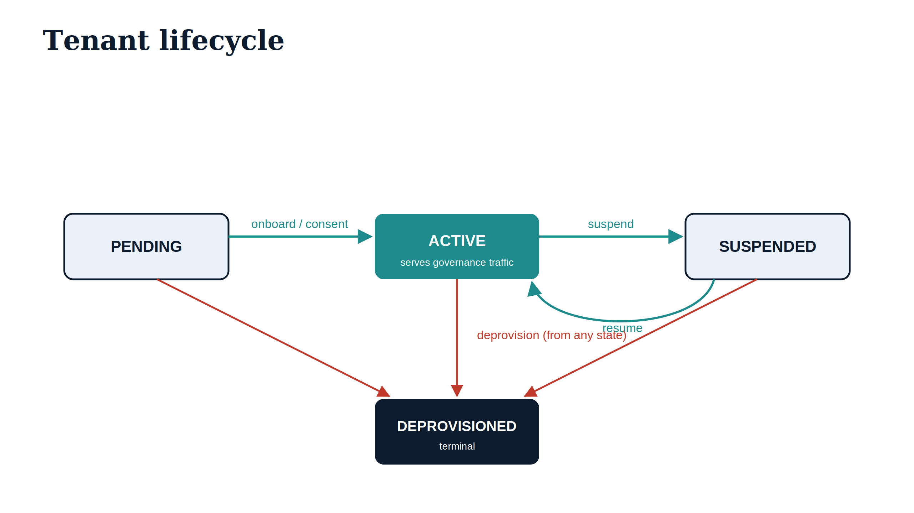

# UIAO Azure SaaS {.unnumbered}

::: {.callout-note}
This page is the operator-facing articulation of the **UIAO Azure SaaS**
deployment — the multi-tenant governance plane that lets one operated
service govern many customer Entra tenants. The normative source is
[ADR-096](../../adr/adr-096-azure-saas-architecture.qmd); the implementation
lives in the `uiao.saas` package and `deploy/azure/`. The in-repo companion
to this page is
[`deploy/azure/README.md`](https://github.com/WhalerMike/uiao/blob/main/deploy/azure/README.md).
:::

::: {.callout-note}
## Where this fits — the cross-boundary plane
This multi-tenant plane is how OrgPath delivers the fifth differentiated
capability in [Book 18 — OrgPath and the IGA Market](../orgpath-narrative/Book_18.qmd):
a **single reconciled organizational substrate across many tenants and federal
cloud boundaries**, governed by one runtime. One operated service governs many
customer Entra tenants, acquiring per-tenant Graph/ARM tokens with the correct
boundary endpoints and audiences — the "one plane" claim Book 18 §6 argues no
single-boundary product can make. The per-deployment operator path is the
[OrgPath Implementation Guides](../operational-guides/orgpath-implementation/index.qmd);
the runtime it scales is the [OrgPath Runtime](./orgpath-runtime.qmd).
:::

::: {.callout-important}
**Status — shipped but dormant.** The code is merged and tested; the deploy
workflow (`.github/workflows/azure-saas-deploy.yml`) is **manual-dispatch
only** and nothing is deployed until an operator explicitly triggers it.
A concrete `AzureStampExecutor` now provisions the per-tenant resources
(Postgres schema, Blob container, Key Vault secret scope), but stamping stays
**dry-run by default**: it only executes when `UIAO_SAAS_STAMP_EXECUTION_ENABLED`
is set. Treat this page as the target operating model.
:::

## 1. What this is

UIAO ships in two deployment shapes that share one codebase:

- **Single-tenant (Windows/IIS)** — the original surface in
  `deploy/windows-server/`. One agency runs UIAO inside its own boundary,
  with Kerberos inbound auth and a single Microsoft Graph application token.
  Unchanged by the SaaS work.
- **Multi-tenant SaaS (Azure Container Apps)** — the surface described here.
  One operated service governs **many** customer Entra tenants. Each customer
  grants admin consent to the UIAO multi-tenant app registration; UIAO then
  acquires **per-tenant** Microsoft Graph and Azure Resource Manager tokens
  to run governance passes on their behalf.

The SaaS surface is **additive** — it composes onto the existing `uiao.api`
data plane via `uiao.saas.attach_saas()` rather than forking it.

## 2. Why Azure Container Apps

The SaaS plane is the "behind-the-scenes" governance runtime. Container Apps
is the chosen compute target because:

- **Managed identity is the governance principal.** Each revision runs under
  a user-assigned managed identity — exactly the identity the existing
  `EntraTokenProvider`, `GraphTransport`, and `ArmTransport` expect for
  acquiring Graph / ARM tokens. No client secrets on disk.
- **Scale-to-zero + KEDA** suits bursty, scheduled governance passes.
- **Managed ingress, TLS, and revisions** give blue/green for free.
- It is lighter to operate than AKS and more elastic than App Service.

## 3. Architecture

{#fig-saas-architecture fig-alt="Engineering blueprint diagram on a white background. Three ice-blue navy-bordered boxes at top labeled Customer tenant A, B, C under the caption Entra ID customer tenants admin-consented. A teal arrow labeled inbound JWT tid claim points down into a large ice-blue box labeled Azure Container App uiao.saas.asgi:app, which contains two navy boxes — Data plane with TenantResolutionMiddleware plus uiao.api governance routes, and Control plane /control/v1 with onboard suspend resume deprovision — above a teal pill reading Managed identity to per-tenant Microsoft Graph / ARM tokens. Three teal arrows descend to three navy boxes labeled PostgreSQL tenant registry plus state, Key Vault per-tenant secrets, and Blob Storage evidence bundles. No human figures, 16:9 landscape." width="90%"}

The two planes share one process and one `/healthz` liveness endpoint:

- **Data plane.** Every non-public request must carry an Entra access token.
  `TenantResolutionMiddleware` verifies it, resolves the `tid` claim to a
  registered tenant, rejects non-onboarded or non-active tenants with `403`,
  and binds a `TenantContext` for the life of the request. Any governance
  code downstream reads `uiao.saas.require_current_tenant()` to learn whose
  data it is operating on — without threading the tenant through every call.
- **Control plane.** `POST /control/v1/tenants` and the lifecycle routes are
  the operator surface. They require a **publisher-tenant** token carrying
  the `UIAO.SaaS.Admin` app role.

## 4. Tenancy and data isolation

Each onboarded customer is a `Tenant` (`uiao.saas.tenant`): identified by its
Entra directory GUID, carrying a lifecycle status, a plan, and a
**`data_namespace`** derived deterministically from the GUID. That namespace
is the isolation handle — the Postgres row/schema scope, the Blob prefix, and
the Key Vault secret scope all hang off it.

The model is **per-request tenancy on a shared, elastically-scaled data
plane** (strong namespace isolation enforced in code) **plus a control-plane
stamp pattern** for customers whose compliance posture requires dedicated
resources. The lifecycle state machine is:

{#fig-saas-lifecycle fig-alt="Engineering blueprint state diagram on a white background. An ice-blue PENDING box has a teal arrow labeled onboard / consent to a teal ACTIVE box annotated serves governance traffic, which has a teal arrow labeled suspend to an ice-blue SUSPENDED box, and a curved teal return arrow labeled resume. Red arrows from all three states converge downward, labeled deprovision from any state, into a navy DEPROVISIONED box annotated terminal. No human figures, 16:9 landscape." width="85%"}

Only `ACTIVE` tenants receive governance traffic; the middleware rejects all
others.

## 5. Prerequisites

Before the first deploy, an operator needs:

1. An Azure subscription and a target **resource group**.
2. A **multi-tenant app registration** (the UIAO app customers consent to),
   with the Microsoft Graph / ARM application permissions the governance
   passes require, and an Application ID URI (e.g. `api://uiao`).
3. An app role `UIAO.SaaS.Admin` defined on that registration, assigned to
   the operators who will drive the control plane.
4. A federated (OIDC) deployer identity for the GitHub Actions workflow, with
   `Contributor` on the resource group. See the secrets listed in
   `.github/workflows/azure-saas-deploy.yml`.

## 6. Configuration

The container reads `UIAO_SAAS_*` environment variables (see
`uiao.saas.settings.SaasSettings`). The Bicep wires these from module outputs
and secrets:

| Variable | Meaning | Source |
|---|---|---|
| `UIAO_SAAS_DATABASE_URL` | SQLAlchemy async DSN (password embedded) | Container Apps secret |
| `UIAO_SAAS_APP_CLIENT_ID` | UIAO multi-tenant app client ID | App registration |
| `UIAO_SAAS_PUBLISHER_TENANT_ID` | Home tenant that owns the control plane | Operator |
| `UIAO_SAAS_API_AUDIENCE` | Audience inbound tokens must carry | App registration |
| `UIAO_SAAS_CLOUD` | `commercial` (also GCC-Moderate), `gcc-high`, `dod` | Operator |
| `UIAO_SAAS_KEY_VAULT_URI` | Per-tenant secret store | Key Vault module |
| `UIAO_SAAS_STORAGE_ACCOUNT_URL` | Evidence-bundle storage | Storage module |
| `UIAO_SAAS_STAMP_EXECUTION_ENABLED` | Execute (not just plan) per-tenant resource stamps | Operator (default off) |
| `AZURE_CLIENT_ID` | Managed-identity client ID for Graph/ARM tokens | Identity module |

Without `UIAO_SAAS_DATABASE_URL` the runtime falls back to an **in-memory**
tenant registry — useful for local dev, never durable.

## 7. Deploy

The CI workflow `.github/workflows/azure-saas-deploy.yml` is **manual-
dispatch only**. To deploy by hand with the Azure CLI:

```bash
# 1. Stamp infrastructure (ACR, Postgres, Key Vault, Storage, Container App…)
az deployment group create -g <rg> \
  -f deploy/azure/bicep/main.bicep \
  -p deploy/azure/bicep/main.bicepparam \
  -p pgAdminPassword="$PG_PWD"

# 2. Build and push the image
az acr build --registry <acr> --image uiao-saas:latest \
  --file deploy/azure/Dockerfile .

# 3. Re-deploy pointing at the pushed image
az deployment group create -g <rg> \
  -f deploy/azure/bicep/main.bicep \
  -p deploy/azure/bicep/main.bicepparam \
  -p containerImage="<acr>.azurecr.io/uiao-saas:latest" \
  -p pgAdminPassword="$PG_PWD"
```

The Bicep modules under `deploy/azure/bicep/modules/` provision Log Analytics
+ App Insights, the managed identity, ACR (with `AcrPull`), Key Vault (RBAC,
with `Key Vault Secrets User`), PostgreSQL Flexible Server, a Storage account
(with `Storage Blob Data Contributor`), the Container Apps environment, and
the SaaS Container App itself.

## 8. Onboarding a tenant

```bash
# Operator (publisher-tenant token with the UIAO.SaaS.Admin role):
curl -X POST https://<app-fqdn>/control/v1/tenants \
  -H "Authorization: Bearer $ADMIN_TOKEN" \
  -H "Content-Type: application/json" \
  -d '{"tenant_id": "<customer-tenant-guid>", "display_name": "Acme", "plan": "standard"}'
```

The response includes an **admin-consent URL**. The customer's Global
Administrator visits it once to grant the UIAO app the Graph / ARM
permissions. The control plane records the tenant (`pending → active`) and
returns the per-tenant stamp steps. With `UIAO_SAAS_STAMP_EXECUTION_ENABLED`
set, the `AzureStampExecutor` actually provisions those resources — it creates
the tenant's Postgres schema, its Blob container, and a Key Vault secret-scope
marker, each named after the tenant's `data_namespace`; without the flag the
same steps are planned but not executed. From that point, requests bearing that
tenant's tokens are resolved automatically by the data plane.

## 9. Lifecycle operations

| Action | Call |
|---|---|
| List tenants | `GET /control/v1/tenants` |
| Inspect one | `GET /control/v1/tenants/{id}` |
| Suspend (blocks data plane) | `POST /control/v1/tenants/{id}/suspend` |
| Resume | `POST /control/v1/tenants/{id}/resume` |
| Deprovision (terminal) | `DELETE /control/v1/tenants/{id}` |

Suspension is immediate: the next data-plane request for a suspended tenant
returns `403 tenant_not_active`. Deprovisioning plans the un-stamp (archive
schema, retain evidence per policy, revoke secrets) and moves the tenant to
the terminal `DEPROVISIONED` state.

## 10. Security model

- **Inbound.** Tokens are signature-verified against the issuing tenant's
  JWKS (RS256) in production. The dev-only `insecure_allow_unsigned` switch
  (claims still validated) defaults **off**.
- **Authorization.** The data plane rejects non-onboarded and non-active
  tenants. The control plane requires a publisher-tenant token with the
  `UIAO.SaaS.Admin` app role.
- **Secrets.** The DB DSN and per-tenant client secrets live in Key Vault /
  Container Apps secrets, never in the image or in git. Outbound Graph / ARM
  access uses the managed identity, not stored credentials.

## 11. Local development

```bash
pip install -e ".[saas]"
export UIAO_SAAS_INSECURE_ALLOW_UNSIGNED_TOKENS=true   # dev ONLY
export UIAO_SAAS_API_AUDIENCE=api://uiao
export UIAO_SAAS_PUBLISHER_TENANT_ID=<your-tenant-guid>
uvicorn uiao.saas.asgi:app --reload
```

`tests/test_saas_app.py` exercises the full onboarding → lifecycle flow
against the in-memory registry, so it is the fastest way to see the control
plane and tenant resolution behave end to end.

## 12. Sovereign clouds

`UIAO_SAAS_CLOUD` selects `commercial` (which also serves GCC-Moderate per
[ADR-033](../../adr/adr-033-gcc-boundary-drift-class.qmd)), `gcc-high`, or
`dod`. It drives the Entra login authority, the issuer template inbound
tokens are validated against, and the Graph / ARM audiences the managed
identity requests — consistent with the adapter cloud-resolution convention.
A sovereign-cloud SaaS *offering* is a future decision and a listed ADR-096
review trigger; no sovereign SaaS is stood up today.

## 13. Verticals: SQL Server transformation (same plane, adjacent execution)

A governed vertical does **not** mean its every operation runs inside the
multi-tenant container. The SQL Server Identity Transformation
([ADR-097](../../adr/adr-097-sql-server-saas-placement.qmd)) is the worked
example of the placement rule: its **governance** is the *same* SaaS, its
**host-level execution** is *adjacent*, in the customer's boundary.

{#fig-sql-saas-placement fig-alt="Engineering blueprint diagram. Left: an ice-blue box titled UIAO Azure SaaS control and evidence plane containing four stacked boxes — Tenant onboarding plus data_namespace isolation; Identity mapping SQL logins to Entra principals; Evidence fabric auth audit KSI CCM-BIR; and a teal ARM plus managed-identity orchestration plan apply reconcile dry-run default. Right: a dashed-border box titled Customer boundary Arc-connected containing a navy Arc-connected host plus managed identity, a teal Execution runner UIAOSqlServerMigration PowerShell, and a navy SQL Server engine sysadmin credential stays in-boundary, connected top to bottom with login migration. Two teal arrows cross the gap: orchestrate from SaaS to runner, signed evidence from runner to SaaS. A red dashed line with an X along the bottom reads UIAO never opens a direct connection to the customer's SQL engine, ADR-092 lane discipline. No human figures, 16:9 landscape." width="95%"}

- **Same SaaS** — tenant onboarding + `data_namespace` isolation, the
  SQL-logins-→-Entra identity model, the evidence fabric (auth audit · KSI ·
  CCM-BIR), and ARM/managed-identity orchestration. SQL is the **server
  (Arc/ARM) case** of the endpoint plane, incorporated like Intune and Arc.
- **Adjacent execution** — the authentication audit, Arc enrollment, and login
  migration run on the **Arc-connected host** via an execution runner
  (`UIAOSqlServerMigration`, PowerShell). The control plane orchestrates
  (`plan`/`apply`/`reconcile`, dry-run default) and ingests **signed
  evidence**; sysadmin credentials and engine access never leave the customer
  boundary, and the SaaS never connects to the engine directly (ADR-092 lane
  discipline).

This is encoded in canon: `sql-server` is registered in the modernization
adapter registry with `runner-class: on-prem-self-hosted`.

## The cross-boundary "one plane" — Book 18 capability #5, in depth

The "Where this fits" callout at the top names this plane as the fifth
differentiated capability in
[Book 18 — OrgPath and the IGA Market](../orgpath-narrative/Book_18.qmd). This
section is the substance behind that pointer: *why* a multi-tenant SaaS, built
the way this page describes, is the concrete realization of the claim Book 18 §6
argues no single-boundary product can make — a **single reconciled
organizational substrate across many tenants and federal cloud boundaries**.

The claim rests on three properties this architecture already has, each
described operationally above:

- **One runtime, many tenants.** The same `uiao.api` governance code runs every
  tenant's drift pass; the SaaS surface is additive (`attach_saas()`), not a
  fork (§1). There is one engine, one Codebook model, and one drift taxonomy in
  force across the whole estate — so "reconciled by one runtime" is literal, not
  aspirational. A department renamed in the Codebook is reasoned about
  identically for every tenant.
- **Per-tenant tokens, boundary-correct.** The managed identity acquires
  **per-tenant** Microsoft Graph and ARM tokens (§1–§3), and `UIAO_SAAS_CLOUD`
  selects the Entra login authority, the inbound issuer template, and the Graph
  / ARM audiences for `commercial` (also GCC-Moderate), `gcc-high`, or `dod`
  (§12). This is exactly Book 18 §6's point: the substrate model never changes
  across boundaries, only the host and token audience do — and the SaaS selects
  them per boundary rather than assuming the commercial defaults.
- **Isolation that survives the shared plane.** Each tenant's
  `data_namespace` (§4) scopes its Postgres rows, Blob prefix, and Key Vault
  secrets; `TenantResolutionMiddleware` binds a `TenantContext` per request and
  rejects non-active tenants. One reconciled *plane* does not mean one
  commingled *dataset* — the boundaries between tenants (and between clouds)
  stay intact while the substrate is governed uniformly across them.

Set against the IGA market Book 18 surveys, this is the capability with the
sharpest edge. The convergent IGA platforms — and Microsoft's own primitives —
are overwhelmingly single-boundary: an estate that spans Commercial,
GCC-Moderate, GCC-High, and DoD ends up maintaining a separate copy of its
organizational structure in each, with nothing keeping them in agreement. This
plane is the mechanism that keeps them in agreement: one governed Codebook, one
typed drift engine, one runtime, reaching every tenant in every boundary
through the correct cloud-specific door.

> Reconciling across boundaries is not dissolving them. Each tenant keeps its
> own namespace and each cloud its own trust root and token audience; what is
> shared is the substrate model and the engine that governs it. That is the
> "one plane" Book 18 §6 defends — and the SQL Server vertical above (§13) is
> the first worked consumer of it.

## Provenance

- Decision record: [ADR-096](../../adr/adr-096-azure-saas-architecture.qmd).
- Implementation: `uiao.saas` (package) and `deploy/azure/` (container +
  Bicep + deploy workflow).
- In-repo operator companion:
  [`deploy/azure/README.md`](https://github.com/WhalerMike/uiao/blob/main/deploy/azure/README.md).
- Control-plane API reference:
  [CLI Reference §5](../../docs/cli-reference.qmd).

