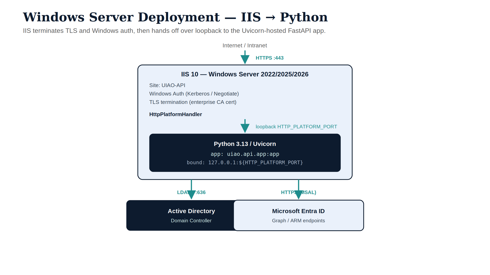

# UIAO API — Windows Server Deployment Guide {.unnumbered}

::: {.callout-tip title="Download the runnable kit"}
The scripts, web.config variants, PowerShell module, and health-check from this guide are bundled in the **Windows Server Deployment Kit** — one zip, ready to copy to a server with no internet access at install time.
[Download kit →](../../../download/index.qmd#windows-server-deployment)
:::

::: {.callout-note title="What this page covers"}
This page is the operator-facing deployment guide for the **UIAO governance
API** on Windows Server / IIS. The UIAO governance API is a FastAPI service
(`uiao.api.app`) hosted via IIS HttpPlatformHandler, providing the OrgPath
web console, AD assessment endpoints, and drift reporting for the
single-tenant on-premises deployment surface.

This is a **separate service** from the Gitea platform server (see
[Platform Server Build Guide](./platform-server-build.qmd)). Both may run on
the same host or on dedicated servers depending on your environment.

Three scripts ship with the repo and are the authoritative deployment
mechanism:

| Script | Where to run | Purpose |
|---|---|---|
| `Install-UIAOServer.ps1` | Target server (Admin) | IIS features, Python, dependencies |
| `Register-ServiceAccount.ps1` | Domain Controller or RSAT host | Service account + SPNs |
| `Register-UIAOAPI.ps1` | Target server (Admin) | App pool, IIS site, TLS binding |
:::

---

## Architecture

The UIAO governance API runs as a Python/Uvicorn process managed by IIS
HttpPlatformHandler. IIS handles all external TLS termination and Windows
Authentication (Kerberos). The Python process binds to a loopback port
assigned by IIS at startup.

{#fig-windows-server-deployment fig-alt="A vertical stack. Internet/Intranet sends a teal HTTPS port 443 arrow to an ice IIS 10 box (UIAO-API site, Windows Auth Kerberos/Negotiate, TLS termination with enterprise CA, HttpPlatformHandler), which hands off over a teal loopback arrow to a navy Python 3.13 / Uvicorn box (app uiao.api.app, bound 127.0.0.1). Two downstream teal arrows lead to a navy Active Directory domain controller (LDAPS 636) and an ice Microsoft Entra ID box (HTTPS MSAL, Graph and ARM endpoints)." width="100%"}

{#fig-arch-overview width="100%"}

Authentication flows:

- **Inbound** — Windows Authentication (Kerberos preferred, NTLM fallback).
  IIS validates the Kerberos ticket and forwards the Windows token to the
  Python process via `forwardWindowsAuthToken="true"`.
- **Outbound** — MSAL client-credentials flow acquires Entra ID tokens for
  Microsoft Graph and ARM calls. Credentials are stored as machine-level
  environment variables, never in `web.config`.

---

## Prerequisites

### Host and OS

| Item | Required | Verification |
|---|---|---|
| OS | Windows Server 2022, 2025, or 2026 (Desktop Experience) | `Get-ComputerInfo \| Select OsName` |
| IIS | Version 10 (ships with Server 2016+) | `Get-Service W3SVC` |
| .NET | .NET Framework 4.8 (IIS dependency) | `Get-WindowsFeature NET-Framework-45-Core` |
| Python | 3.12 or 3.13 (64-bit) | Installed by `Install-UIAOServer.ps1` |
| Disk | 10 GB free on C:\ (Python + packages + logs) | `Get-PSDrive C` |
| CPU/RAM | 2 vCPU / 4 GB minimum; 4 / 8 recommended | Task Manager |
| Network | Outbound HTTPS to `login.microsoftonline.com`, `graph.microsoft.com` | See egress table below |

### Required IIS extensions

These are installed automatically by `Install-UIAOServer.ps1`:

| Extension | Purpose |
|---|---|
| HttpPlatformHandler 2.0 | Hosts the Python/Uvicorn process under IIS |
| URL Rewrite Module | HTTP → HTTPS redirect rule in `web.config` |
| Windows Authentication feature | Kerberos/Negotiate auth for inbound requests |

### Network ports

Open these on the Windows Firewall (domain profile) before deployment:

| Direction | Port | Protocol | Purpose |
|---|---|---|---|
| Inbound | 443 | TCP | HTTPS from clients |
| Outbound | 636 | TCP | LDAPS to domain controller(s) |
| Outbound | 389 | TCP | LDAP fallback (non-prod only) |
| Outbound | 88 | TCP/UDP | Kerberos KDC |
| Outbound | 53 | UDP/TCP | DNS |
| Outbound | 443 | TCP | Entra ID / Graph / ARM (MSAL) |
| Outbound | 3268/3269 | TCP | Global Catalog (LDAP/LDAPS) — multi-domain queries |

::: {.callout-tip}
For GCC-High or DoD tenants, the Entra/Graph/ARM endpoints differ from
commercial. UIAO resolves these via `UIAO_SAAS_CLOUD` / `cloud` config —
see [Environment Variables](#environment-variables) below.
:::

---

## Active Directory Requirements

This section covers what UIAO needs from your AD environment. It assumes AD
DS exists — it is not a guide to standing up a domain.

### Domain controller requirements

| Item | Minimum | Recommended |
|---|---|---|
| Domain functional level | Windows Server 2016 | Windows Server 2019+ |
| Forest functional level | Windows Server 2016 | Windows Server 2019+ |
| DC OS | Windows Server 2016 | Windows Server 2019/2022 |
| LDAPS | Required (port 636) | Required |
| RODC (Read-Only DC) | **Not supported** | — |
| Global Catalog | Required for multi-domain forests | Collocate on at least one DC |

::: {.callout-warning title="RODCs are not supported"}
Read-Only Domain Controllers cache only a subset of attributes and do not
support write operations. The UIAO OrgPath assessment and potential
`extensionAttribute` write-back require a writable DC. Point `UIAO_AD_DEFAULT_SERVER`
at a writable DC — not an RODC.
:::

UIAO communicates with AD over **LDAPS (port 636)**. The DC must present a
certificate trusted by the UIAO server (enterprise CA is standard). To verify
LDAPS is working from the target server before deployment:

```powershell
# Verify LDAPS connectivity to your DC
$dc = "dc01.corp.contoso.com"
$conn = [System.DirectoryServices.Protocols.LdapConnection]::new("${dc}:636")
$conn.SessionOptions.SecureSocketLayer = $true
$conn.Bind()
Write-Host "LDAPS OK: connected to $dc"
```

### Forest and trust topology

{#fig-ad-topology width="100%"}

**Single forest (standard):** UIAO connects to the forest root domain. All
child domains are reachable via Global Catalog queries. No additional
configuration is required beyond pointing `UIAO_AD_DEFAULT_SERVER` at a
writable DC in the root or the domain of interest.

**Multi-forest:** UIAO supports multi-forest via explicit adapter
configuration. Each forest requires its own bind credentials stored
separately. Requires two-way forest trust OR per-forest service accounts:

| Trust type | Support | Notes |
|---|---|---|
| Two-way forest trust | ✅ Supported | Single service account can traverse; GC query resolves cross-forest |
| One-way trust (outbound) | ⚠️ Limited | UIAO can read the trusted forest but cannot authenticate users from it |
| One-way trust (inbound) | ✅ Supported | Normal — UIAO authenticates users in the trusting forest |
| No trust (isolated) | ✅ Supported | Run separate UIAO instances per forest; each with its own service account |
| Child domain | ✅ Supported | Point at root forest DC or child DC — GC resolves both |

**Naming contexts:** UIAO discovers the default naming context automatically
via a rootDSE query. You do not need to configure the DN manually unless you
are targeting a specific non-default partition.

### Service account

The UIAO API runs under a dedicated AD service account (`SVC-UIAO-API`).
`Register-ServiceAccount.ps1` creates this account and registers its SPNs.

**Service account permissions — minimum required:**

| Permission | Scope | Why |
|---|---|---|
| Read all user attributes | Domain | OrgPath facet resolution reads `department`, `company`, `extensionAttribute1–15`, `userPrincipalName`, `distinguishedName`, `memberOf` |
| Read all group attributes | Domain | Group membership enumeration for dynamic group planning |
| Read all computer attributes | Domain | Device inventory and OrgPath encoding for Entra/Arc writeback planning |
| Read all OU attributes | Domain | OU hierarchy traversal for organizational encoding |
| Logon as a service | Local policy on UIAO server | IIS app pool must log on as this account |

**Service account permissions — write-back (if enabled):**

Write-back is disabled by default (`--dry-run` is the default for `uiao
orgtree govern` and `uiao orgtree assess`). If you enable `--no-dry-run`,
the account additionally needs:

| Permission | Scope | Why |
|---|---|---|
| Write `extensionAttribute1` | All computer objects | OrgPath encoding on AD computer objects |
| Write `extensionAttribute1` | All user objects | OrgPath encoding on user objects (if user tagging is in scope) |

Assign write-back permissions via AD Delegation Wizard on the domain root
or target OU, not via direct ACL edits:

```powershell
# Verify the account has the correct attribute read access
# Run from an RSAT-enabled machine or DC
Import-Module ActiveDirectory
$acl = Get-Acl "AD:\DC=corp,DC=contoso,DC=com"
$acl.Access | Where-Object {
    $_.IdentityReference -like "*SVC-UIAO-API*"
} | Select-Object ActiveDirectoryRights, ObjectType, InheritanceType
```

### SPN registration

`Register-ServiceAccount.ps1` registers two SPNs for Kerberos:

```
HTTP/uiao-api.corp.contoso.com
HTTP/UIAO-API01
```

Verify after running the script:

```powershell
setspn -L SVC-UIAO-API
# Expected output:
#   Registered ServicePrincipalNames for CN=SVC-UIAO-API,...:
#           HTTP/uiao-api.corp.contoso.com
#           HTTP/UIAO-API01
```

Duplicate SPNs will break Kerberos. If the server was previously enrolled
with a different account, clean up stale SPNs first:

```powershell
setspn -D "HTTP/uiao-api.corp.contoso.com" <OLD-ACCOUNT>
```

---

## Environment Variables

UIAO reads configuration from machine-level environment variables. **Never
put secrets in `web.config`** — the `<environmentVariables>` block in
`web.config` is for non-secret values only.

### Non-secret (set in web.config or machine env)

| Variable | Example | Description |
|---|---|---|
| `UIAO_WORKSPACE_ROOT` | `C:\srv\uiao` | Root of the UIAO installation |
| `UIAO_API_PORT` | `%HTTP_PLATFORM_PORT%` | Port Uvicorn binds to (set by IIS; do not override) |
| `UIAO_LOG_LEVEL` | `INFO` | Log verbosity: `DEBUG`, `INFO`, `WARNING`, `ERROR` |
| `UIAO_AD_DEFAULT_SERVER` | `dc01.corp.contoso.com` | Writable DC for LDAPS health check and default queries |
| `UIAO_API_ALLOWED_HOSTS` | `uiao-api.corp.contoso.com,localhost` | Comma-separated allowed `Host` header values |

### Secrets (machine-level env vars only — never in web.config)

Set these via `[System.Environment]::SetEnvironmentVariable(..., "Machine")`
or Group Policy Preferences. Do not paste them into `web.config`.

| Variable | Description |
|---|---|
| `UIAO_ENTRA_TENANT_ID` | Your Entra ID tenant GUID |
| `UIAO_ENTRA_CLIENT_ID` | App registration client ID for outbound Graph/ARM calls |
| `UIAO_ENTRA_CLIENT_SECRET` | App registration client secret (rotate per your org policy) |

Set machine-level variables on the server:

```powershell
# Run as Administrator on the UIAO API server
[System.Environment]::SetEnvironmentVariable(
    "UIAO_ENTRA_TENANT_ID", "<your-tenant-id>", "Machine")
[System.Environment]::SetEnvironmentVariable(
    "UIAO_ENTRA_CLIENT_ID", "<your-client-id>", "Machine")
[System.Environment]::SetEnvironmentVariable(
    "UIAO_ENTRA_CLIENT_SECRET", "<your-client-secret>", "Machine")
```

Restart the IIS app pool after setting machine-level variables:

```powershell
Restart-WebAppPool -Name "UIAO-API-Pool"
```

### Entra app registration

The `UIAO_ENTRA_CLIENT_ID` must correspond to an Entra app registration with
the following API permissions (application permissions, admin consent
required):

| API | Permission | Why |
|---|---|---|
| Microsoft Graph | `Directory.Read.All` | Read users, groups, devices, OUs |
| Microsoft Graph | `Device.Read.All` | Device inventory for OrgPath encoding |
| Azure Resource Management | `user_impersonation` | Arc resource tagging (if Arc writeback enabled) |

Register the app and grant admin consent from the [Entra admin center](https://entra.microsoft.com)
under **App registrations → New registration**. Add a client secret under
**Certificates & secrets** and copy the value immediately — it is not shown
again.

---

## Deployment

![UIAO Windows Server five-step deployment sequence. Step 1: Install-UIAOServer.ps1 run as Local Admin installs IIS features, Python 3.13, and the uiao package. Step 2: Register-ServiceAccount.ps1 run on a DC or RSAT host creates the svc-uiao service account and registers SPNs. Step 3: Register-UIAOAPI.ps1 run as Local Admin creates the IIS site, app pool, web.config, and TLS binding. Step 4: smoke test via Test-UIAOHealth.ps1 exits 1 if any check fails. Step 5: register in change control with cert expiry date and log path.](images/windows-server-deployment-diagram-03-deployment-sequence.png){#fig-deploy-seq width="100%"}

Deployment runs three scripts in sequence. The first two can run in parallel
(on different machines) but `Register-UIAOAPI.ps1` depends on the service
account created by `Register-ServiceAccount.ps1`.

### Step 1 — Install server dependencies

Run on the **target Windows Server** as Administrator:

```powershell
# Clone the repo (or copy deploy/ and scripts/ from your artifact store)
git clone https://github.com/WhalerMike/uiao.git C:\srv\uiao

# Run the installer (installs IIS features, Python 3.13, Git, URL Rewrite)
# ~15 minutes; idempotent — safe to rerun
.\C:\srv\uiao\scripts\deploy\deploy-scripts.ps1
# The script is named Install-UIAOServer.ps1 in its header — it is embedded
# in deploy-scripts.ps1; extract and save as Install-UIAOServer.ps1 if needed
```

After the script completes, install the UIAO Python package:

```powershell
# Install the API surface (FastAPI + Uvicorn + MSAL + httpx)
C:\Python313\python.exe -m pip install -e "C:\srv\uiao[api]"

# Verify
C:\Python313\python.exe -c "from uiao.api.app import app; print('OK')"
```

### Step 2 — Create the service account (run on DC or RSAT host)

Run on a **Domain Controller** or a machine with RSAT AD tools installed:

```powershell
# Extract Register-ServiceAccount.ps1 from deploy-scripts.ps1
# (or run the embedded section directly)
# Adjust parameters for your domain

$params = @{
    AccountName   = "SVC-UIAO-API"
    AccountOU     = "OU=Service Accounts,DC=corp,DC=contoso,DC=com"
    ServerDNS     = "uiao-api.corp.contoso.com"
    Domain        = "corp.contoso.com"
}
.\Register-ServiceAccount.ps1 @params
```

::: {.callout-warning title="Save the generated password immediately"}
The script generates a 32-character random password and prints it once.
Store it in your password vault (CyberArk, Azure Key Vault, etc.) before
closing the terminal. It cannot be recovered.
:::

### Step 3 — Configure IIS site and app pool

Run on the **target Windows Server** as Administrator. Have ready:
- The service account password from Step 2
- The TLS certificate thumbprint from your enterprise CA

```powershell
$secure = Read-Host "SVC-UIAO-API password" -AsSecureString

$params = @{
    SiteName        = "UIAO-API"
    AppPoolName     = "UIAO-API-Pool"
    AppPoolIdentity = "CORP\SVC-UIAO-API"
    AppPoolPassword = $secure
    PhysicalPath    = "C:\inetpub\uiao-api"
    BindingPort     = 443
    CertThumbprint  = "<paste-thumbprint-from-enterprise-CA>"
    LogPath         = "C:\Logs\uiao-api"
}
.\Register-UIAOAPI.ps1 @params
```

The script:

1. Creates `C:\inetpub\uiao-api\` and copies `web.config` and `run.py`
2. Creates app pool `UIAO-API-Pool` with no managed runtime (Python)
3. Sets the app pool identity to `CORP\SVC-UIAO-API`
4. Disables idle timeout (keeps Python warm between requests)
5. Creates the IIS site bound to port 443 with the provided certificate
6. Enables Windows Authentication (kernel mode) and disables anonymous auth
7. Sets log directory ACLs for the service account
8. Runs `iisreset`

### Step 4 — Set machine-level environment variables

```powershell
[System.Environment]::SetEnvironmentVariable("UIAO_ENTRA_TENANT_ID",   "<tenant-id>",   "Machine")
[System.Environment]::SetEnvironmentVariable("UIAO_ENTRA_CLIENT_ID",   "<client-id>",   "Machine")
[System.Environment]::SetEnvironmentVariable("UIAO_ENTRA_CLIENT_SECRET","<secret>",      "Machine")

# Restart the app pool to pick up machine-level vars
Restart-WebAppPool -Name "UIAO-API-Pool"
```

### Step 5 — Post-deployment verification

```powershell
$base = "https://uiao-api.corp.contoso.com"

# 1. Health endpoint (Windows Auth — use -UseDefaultCredentials)
$r = Invoke-WebRequest -Uri "$base/health" -UseDefaultCredentials
if ($r.StatusCode -eq 200) { Write-Host "OK: /health" -ForegroundColor Green }
else { Write-Host "FAIL: /health returned $($r.StatusCode)" -ForegroundColor Red }

# 2. OrgPath web console loads
$r2 = Invoke-WebRequest -Uri "$base/orgpath" -UseDefaultCredentials
if ($r2.StatusCode -eq 200) { Write-Host "OK: /orgpath" -ForegroundColor Green }
else { Write-Host "FAIL: /orgpath returned $($r2.StatusCode)" -ForegroundColor Red }

# 3. Entra token acquisition (tests MSAL client-credentials)
$r3 = Invoke-WebRequest -Uri "$base/api/v1/entra/token-check" -UseDefaultCredentials
Write-Host "Token check: $($r3.StatusCode)"
```

If the health check fails, see [Troubleshooting](#troubleshooting).

### TLS certificate

The UIAO API requires a valid TLS certificate bound to the IIS site. Options:

| Source | Recommended for |
|---|---|
| Internal enterprise CA (AD CS) | Air-gapped or proxy-restricted environments |
| DigiCert / Entrust (public CA) | Internet-facing or partner-accessible deployments |
| Let's Encrypt (via win-acme) | Dev/test only; not for FedRAMP-scoped production |

To request from an internal AD CS CA:

```powershell
# Request a certificate using the WebServerV2 template
$san = @("uiao-api.corp.contoso.com", $env:COMPUTERNAME)
$cert = Get-Certificate `
    -Template "WebServerV2" `
    -SubjectName "CN=uiao-api.corp.contoso.com" `
    -DnsName $san `
    -CertStoreLocation "Cert:\LocalMachine\My"

Write-Host "Certificate thumbprint: $($cert.Certificate.Thumbprint)"
```

Use the printed thumbprint as the `CertThumbprint` parameter in Step 3.

---

## Day-2 Operations

### Daily health check

Run `Test-UIAOHealth.ps1` (see [Windows Health Check Script](./windows-server-ops.qmd)
— or paste the inline version below) to verify the deployment is healthy:

```powershell
$base = "https://uiao-api.corp.contoso.com"
$checks = @()

# IIS site running
$site = Get-Website -Name "UIAO-API" -ErrorAction SilentlyContinue
$checks += [PSCustomObject]@{
    Check  = "IIS site UIAO-API"
    Status = if ($site -and $site.State -eq "Started") { "PASS" } else { "FAIL" }
}

# App pool running
$pool = Get-WebAppPoolState -Name "UIAO-API-Pool" -ErrorAction SilentlyContinue
$checks += [PSCustomObject]@{
    Check  = "App pool UIAO-API-Pool"
    Status = if ($pool.Value -eq "Started") { "PASS" } else { "FAIL" }
}

# Python process alive
$py = Get-Process python -ErrorAction SilentlyContinue
$checks += [PSCustomObject]@{
    Check  = "Python process"
    Status = if ($py) { "PASS" } else { "FAIL" }
}

# /health endpoint reachable
try {
    $r = Invoke-WebRequest -Uri "$base/health" -UseDefaultCredentials -TimeoutSec 10
    $checks += [PSCustomObject]@{ Check = "/health endpoint"; Status = "PASS" }
} catch {
    $checks += [PSCustomObject]@{ Check = "/health endpoint"; Status = "FAIL: $_" }
}

# TLS cert expiry
$cert = Get-ChildItem Cert:\LocalMachine\My |
    Where-Object { $_.Subject -like "*uiao-api*" } |
    Sort-Object NotAfter | Select-Object -First 1
$daysLeft = ($cert.NotAfter - (Get-Date)).Days
$checks += [PSCustomObject]@{
    Check  = "TLS cert expiry ($daysLeft days)"
    Status = if ($daysLeft -gt 30) { "PASS" } elseif ($daysLeft -gt 7) { "WARN" } else { "FAIL" }
}

$checks | Format-Table -AutoSize
```

### Log locations

| Log | Path | Purpose |
|---|---|---|
| Uvicorn application log | `C:\Logs\uiao-api\python-<datetime>.log` | Python exceptions, startup errors |
| IIS W3C access log | `%SystemDrive%\inetpub\logs\LogFiles\W3SVC<n>\` | HTTP requests, auth results, response codes |
| Windows Event Log | Application / System | App pool crashes, service account errors |

Tail the Uvicorn log during troubleshooting:

```powershell
Get-Content "C:\Logs\uiao-api\python-*.log" -Wait -Tail 50
```

Check IIS logs for authentication failures (HTTP 401):

```powershell
# Find recent 401s in today's IIS log
$log = Get-ChildItem "$env:SystemDrive\inetpub\logs\LogFiles\W3SVC*\*.log" |
    Sort-Object LastWriteTime -Descending | Select-Object -First 1
Select-String -Path $log.FullName -Pattern " 401 "
```

### Certificate renewal

Monitor cert expiry with the daily health check above. When the cert is
within 30 days of expiry:

```powershell
# Request a renewal from AD CS (same template, same SAN)
$old = Get-ChildItem Cert:\LocalMachine\My | Where-Object { $_.Subject -like "*uiao-api*" }
$new = Get-Certificate -Template "WebServerV2" `
    -SubjectName "CN=uiao-api.corp.contoso.com" `
    -DnsName "uiao-api.corp.contoso.com", $env:COMPUTERNAME `
    -CertStoreLocation "Cert:\LocalMachine\My"

# Rebind the new cert to the IIS site
$binding = Get-WebBinding -Name "UIAO-API" -Port 443 -Protocol "https"
$binding.AddSslCertificate($new.Certificate.Thumbprint, "My")

# Remove the old cert (optional — after confirming the new one works)
# Remove-Item $old.PSPath
Write-Host "New cert thumbprint: $($new.Certificate.Thumbprint)"
```

### App pool crash recovery

If the Python process crashes, IIS will attempt to restart it up to 5 times
per minute (`rapidFailsPerMinute="5"` in `web.config`). After 5 rapid
failures, IIS stops the app pool to prevent a crash loop.

To diagnose and restart after a crash:

```powershell
# 1. Check app pool state
Get-WebAppPoolState -Name "UIAO-API-Pool"

# 2. Read the last Uvicorn log for the exception
$log = Get-ChildItem "C:\Logs\uiao-api\python-*.log" | Sort-Object LastWriteTime -Descending | Select-Object -First 1
Get-Content $log.FullName -Tail 100

# 3. Fix the root cause, then restart
Start-WebAppPool -Name "UIAO-API-Pool"
```

---

## Troubleshooting

### HTTP 401 — Unauthorized

**Symptom:** Browser or PowerShell receives `401 Unauthorized`.

**Causes and fixes:**

| Cause | Fix |
|---|---|
| Client is not domain-joined or not authenticated to the domain | Verify the client has a valid Kerberos ticket: `klist` |
| SPN not registered or registered to wrong account | Run `setspn -L SVC-UIAO-API`; re-run `Register-ServiceAccount.ps1` if missing |
| NTLM blocked by policy but Kerberos failing | Check DC connectivity on port 88; verify time sync (Kerberos requires ±5 min) |
| App pool not running as `SVC-UIAO-API` | `Get-ItemProperty IIS:\AppPools\UIAO-API-Pool processModel` — verify userName |

### HTTP 502 — Bad Gateway

**Symptom:** IIS returns `502 Bad Gateway`.

**Cause:** Python/Uvicorn process is not running or failed to start.

```powershell
# Check if Python started
Get-Process python
# If no process: check the startup log
Get-ChildItem "C:\Logs\uiao-api\python-*.log" | Sort-Object LastWriteTime -Descending |
    Select-Object -First 1 | Get-Content -Tail 50
```

Common startup failure causes: `uiao[api]` not installed in the venv path
configured in `web.config`, or a missing machine-level env var that the app
requires at startup.

### Entra token acquisition failure

**Symptom:** `/api/v1/entra/token-check` returns non-200, or Graph calls
fail with `401`.

```powershell
# Verify env vars are set at machine level (not just session level)
[System.Environment]::GetEnvironmentVariable("UIAO_ENTRA_TENANT_ID", "Machine")
[System.Environment]::GetEnvironmentVariable("UIAO_ENTRA_CLIENT_ID",  "Machine")
# Secret — check it's non-null but don't print the value
[System.Environment]::GetEnvironmentVariable("UIAO_ENTRA_CLIENT_SECRET", "Machine") -ne $null
```

If any return `$null`, re-run Step 4 of deployment and restart the app pool.

If variables are set but token acquisition still fails, verify the Entra app
registration has admin consent for `Directory.Read.All` and that the client
secret has not expired in the [Entra admin center](https://entra.microsoft.com).

### LDAPS connection failure

**Symptom:** `uiao orgtree assess` fails with an LDAP connection error.

```powershell
# Test LDAPS from the server
$dc = $env:UIAO_AD_DEFAULT_SERVER   # or set manually
$conn = [System.DirectoryServices.Protocols.LdapConnection]::new("${dc}:636")
$conn.SessionOptions.SecureSocketLayer = $true
try { $conn.Bind(); Write-Host "LDAPS OK" -ForegroundColor Green }
catch { Write-Host "LDAPS FAIL: $_" -ForegroundColor Red }
```

If LDAPS fails: verify the DC has an LDAPS certificate, the certificate's
CA is trusted by the UIAO server, and port 636 is open in the firewall
between the server and the DC.

---

## Canonical references

| Resource | Location |
|---|---|
| IIS configuration | [`deploy/windows-server/web.config`](https://github.com/WhalerMike/uiao/blob/main/deploy/windows-server/web.config) |
| Uvicorn entrypoint | [`deploy/windows-server/run.py`](https://github.com/WhalerMike/uiao/blob/main/deploy/windows-server/run.py) |
| Deployment scripts | [`scripts/deploy/deploy-scripts.ps1`](https://github.com/WhalerMike/uiao/blob/main/scripts/deploy/deploy-scripts.ps1) |
| FastAPI application | `src/uiao/api/app.py` |
| Package extras | `pyproject.toml` — `[api]` extra |
| Platform Server Build Guide | [`platform-server-build.qmd`](./platform-server-build.qmd) — Gitea/IIS platform server |
| Azure SaaS Deployment | [`azure-saas.qmd`](./azure-saas.qmd) — multi-tenant cloud surface |
| ADR-032 | Single-package consolidation — why `pip install uiao[api]` is the install path |
