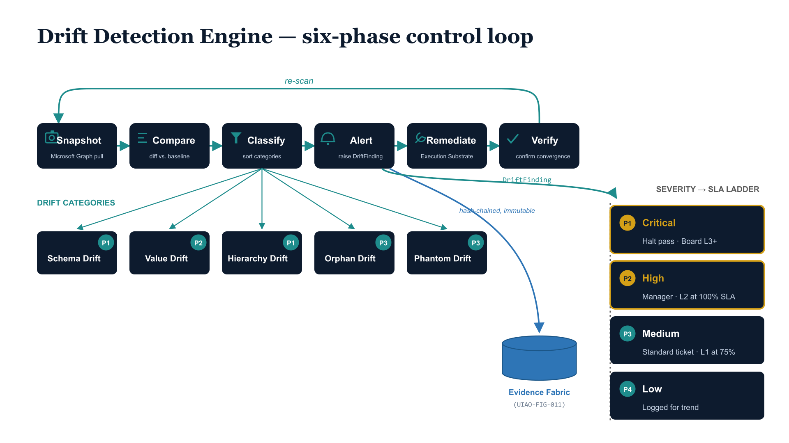



> **Model C — per-facet drift over 15 attribute slots (per [ADR-078](../../adr/adr-078-orgpath-attribute-schema-15-facet.qmd)).** Examples below use the per-facet model: each slot (`extensionAttribute1`–`15`) validates independently against its facet's enumeration or typed pattern. See [OrgPath Codebook](codebook.qmd) for the facet/slot definitions.

::: {.callout-note}
## Companion to the storage explainer

If you have not yet read [Where OrgTree & OrgPath Data Lives](where-data-lives.qmd), start there. This page picks up from that mental model and answers the next question: *once the storage layers exist, how does the governance engine catch when they disagree?* The authoritative spec is [UIAO_163 (Drift Detection Engine)](https://github.com/WhalerMike/uiao/blob/main/src/uiao/canon/UIAO_163_Drift_Detection_Engine_Specification.md); this page is the prose tour.
:::

{#fig-drift-engine-loop fig-alt="UIAO Drift Detection Engine six-phase control loop: Snapshot → Compare → Classify → Alert → Remediate → Verify, with a feedback re-scan arrow closing the loop back to Snapshot. Five drift categories fan out from the Classify stage. A severity-to-SLA ladder (P1 through P4) hangs off the Alert stage. Handoff arrow from Alert to the Evidence Fabric for immutable, hash-chained recording. 16:9 pipeline-flow diagram, navy and teal palette." width="100%"}

## The job of the drift engine

Every governance pipeline rests on the assumption that three things agree: the HR system's view of who works where, the Entra ID directory's 10 named `extensionAttribute*` slot values for every principal, and the codebook's per-facet enumerations of valid values. The drift engine's job is to *not believe that assumption*. It re-checks, on a schedule, that the three layers still line up — per facet, per principal — and when they don't, it emits a structured finding that names the disagreement precisely enough for a human to fix it (or, in some cases, fixes it automatically).

The engine runs a six-phase loop:

```
Snapshot ──▶ Compare ──▶ Classify ──▶ Alert ──▶ Remediate ──▶ Verify
   │                                                              │
   └──────────────────────── re-scan ◀────────────────────────────┘
```

1. **Snapshot.** Pull current tenant state via Microsoft Graph — users, groups, AUs, role assignments, device records. The OrgPath portion is the 10 `extensionAttribute*` slot values per principal.
2. **Compare.** Diff each principal's 10 facet values against the codebook (per-facet enumeration membership; typed-facet pattern match).
3. **Classify.** Map each per-facet diff to one of the five categories below, with severity (P1–P4) and an auto-fix policy.
4. **Alert.** Emit `DriftFinding` objects into the Evidence Fabric for immutable, hash-chained recording.
5. **Remediate.** If `dry_run=false` and the finding is auto-remediable, apply the fix via the Execution Substrate. Governance-review ops (phantom deletions, AU cascades) are never auto-applied.
6. **Verify.** Re-snapshot to confirm. In v1 this is operator-triggered; future versions close the loop automatically.

## The five drift categories (per-facet)

| Category | What broke | Severity | Auto-fix? |
|---|---|---|---|
| **Format** | A typed facet's value fails its `value_pattern` regex | P1 | No |
| **Value** | An enumerated facet's value is not in the facet's enumeration | P2 | Sometimes |
| **Slot** | A facet's `attribute:` was remapped (or two facets bind the same slot) without ADR | P1 | No |
| **Orphan** | A facet enumeration value has zero matching principals | P3 | Flag only |
| **Phantom** | A principal carries a value that's been deprecated in the codebook | P3 | Reassign (when `replaced_by` set) |

### Format Drift — "the typed facet rejects this shape"

A typed facet (HireDate, TermDate) has a `value_pattern` regex. Any value that fails the pattern is Format Drift on that slot.

**Concrete example.** A bulk-import script writes US-style dates into `extensionAttribute7` (HireDate, ISO date typed). After the next run, `user.extensionAttribute7` on `alice@contoso.com` reads `01/15/2024` instead of `2024-01-15`.

```json
{
  "phase": "facet-validate",
  "op": "facet-value-validate",
  "target": "user|alice@contoso.com",
  "facet": "hire_date",
  "attribute": "extensionAttribute7",
  "reason": "extensionAttribute7 '01/15/2024' fails hire_date value_pattern '^\\d{4}-\\d{2}-\\d{2}$' (ISO 8601 date required)",
  "drift_class": "DRIFT-SCHEMA",
  "severity": "P1",
  "auto_remediate": false
}
```

**Why no auto-fix?** Auto-reformatting would hide the upstream script bug. P1 forces a human to look at *why* the malformed value got written, not just patch the symptom.

### Value Drift — "this enumeration doesn't include that value"

An enumerated facet's value passes type but doesn't appear in the facet's `enumeration` list.

**Concrete example.** A device-provisioning script populates `extensionAttribute2` (Department) with `IT-Sec` for a security analyst's laptop. The Department facet's enumeration includes `IT` (broader) but not the sub-string `IT-Sec`.

```json
{
  "phase": "facet-validate",
  "op": "facet-value-validate",
  "target": "device|LAPTOP-0421",
  "facet": "department",
  "attribute": "extensionAttribute2",
  "reason": "extensionAttribute2 'IT-Sec' not in department enumeration. Did you mean 'IT' (Department) + 'CyberOps' (Division at extensionAttribute3)?",
  "drift_class": "DRIFT-SEMANTIC",
  "severity": "P2",
  "auto_remediate": false
}
```

**Sometimes auto-fixed.** When the HR source is trusted as authoritative (the default), Value Drift on principals can be remediated by writing the HR value back. For device records and other non-HR-driven principals, the finding flags for human review.

The Model A common case "user has `ORG-FIN-TAX` but no such code exists" decomposes in Model C into a per-facet finding: the Department facet (extensionAttribute2) has an unknown value `Tax`, and (separately) the Division facet (extensionAttribute3) may also be misaligned. Each slot reports independently.

### Slot Drift — "two facets are fighting over one slot"

A codebook PR remapped a facet to a different `extensionAttribute` slot without a superseding ADR — OR two facets are declared binding the same slot. This is a codebook integrity violation, not a per-principal data finding.

**Concrete example.** A PR proposes moving `region` from `extensionAttribute1` to `extensionAttribute3` because the tenant's internal taxonomy prefers Region nearer the Division stratum. The PR slips through code review but the codebook loader's `_validate_integrity` step catches it because no superseding ADR was filed.

```json
{
  "phase": "codebook-validate",
  "op": "slot-uniqueness-check",
  "target": "codebook|region",
  "facet": "region",
  "attribute": "extensionAttribute3",
  "reason": "Facet 'region' binds 'extensionAttribute3' but 'division' also claims that slot. Per ADR-078, slot assignments are canonical; remapping requires a superseding ADR.",
  "drift_class": "DRIFT-SCHEMA",
  "severity": "P1",
  "auto_remediate": false
}
```

**Why P1?** Cross-facet slot collision means downstream dynamic groups, AU rules, and CA policies become ambiguous. Halts the entire remediation pass.

### Orphan Drift — "no one is home"

A facet enumeration value has zero matching principals. The value is canonical and well-formed but no user, device, or AU points at it.

**Concrete example.** `Region = "LATAM"` was added to the codebook six months ago in anticipation of a Latin America expansion. The expansion was delayed indefinitely. Nobody has a `LATAM` Region.

```json
{
  "phase": "facet-coverage-validate",
  "op": "enumeration-orphan-scan",
  "target": "codebook|region|LATAM",
  "facet": "region",
  "value": "LATAM",
  "reason": "region enumeration value 'LATAM' has zero matching extensionAttribute1 values across all principals",
  "drift_class": "DRIFT-SEMANTIC",
  "severity": "P3",
  "auto_remediate": false
}
```

**Flag-only.** Auto-deleting empty enumeration values would erase audit-relevant history (the value's authoring PR is part of the audit trail). The engine flags for governance review; an operator either deprecates the value, populates it via HR provisioning, or accepts the orphan as expected.

### Phantom Drift — "the ghost still walks"

A principal carries a value that has been deprecated in the codebook. The codebook's `deprecated:` section says it's gone (with a `replaced_by` successor); the directory says it's still there.

**Concrete example.** The `Department = "ITSecurity"` value was deprecated last quarter in favor of `Department = "IT"` + `Division = "CyberOps"` (per the Model C 2-facet decomposition pattern). Five tombstoned contractor accounts who left before offboarding completed still carry `ITSecurity`.

```json
{
  "phase": "facet-validate",
  "op": "facet-value-reassign",
  "target": "user|alex.contractor@contoso.com",
  "facet": "department",
  "attribute": "extensionAttribute2",
  "reason": "extensionAttribute2 'ITSecurity' is deprecated; codebook recommends replaced_by 'IT' (combined with extensionAttribute3 'CyberOps')",
  "drift_class": "DRIFT-PROVENANCE",
  "severity": "P3",
  "auto_remediate": true
}
```

**Reassign.** When the deprecation entry has a `replaced_by` successor, the engine writes the successor into the affected slot and records the substitution in the Evidence Fabric. For multi-facet decompositions (one Model A composite split into two Model C facets), the operator authors the cross-facet remediation script per case.

## What the engine emits

Every classified diff becomes a `DriftFinding` with this shape (the Model C consumer rebuild per ADR-078 Phase 5 will land the per-facet fields shown below; the v1 Model A drift engine emitted a less structured form):

```python
@dataclass
class DriftFinding:
    phase: str              # which governance phase fired
    op: str                 # the planned operation
    target: str             # object id (user UPN, device, group, AU, codebook entry)
    facet: str | None       # which facet (None for non-facet findings like Slot)
    attribute: str | None   # extensionAttribute slot (None for non-slot findings)
    reason: str             # human-readable explanation
    drift_class: str        # DRIFT-SCHEMA | DRIFT-IDENTITY | DRIFT-AUTHZ | DRIFT-SEMANTIC | DRIFT-PROVENANCE | DRIFT-BOUNDARY
    severity: str           # P1 | P2 | P3 | P4
    auto_remediate: bool    # True if remediation is automatic
```

A complete `DriftScanReport` bundles the findings, a `dry_run` flag, and a `halted` boundary — if any P1 finding fires with `halt_on_critical` set, the entire remediation pass aborts before any other change lands.

## What happens after the finding fires

| Severity | SLA Behavior (per UIAO_167) |
|---|---|
| **P1 Critical** | Halt remediation pass; escalate to Governance Board (Level 3+) immediately |
| **P2 High** | Standard ticket; escalate to Level 2 (manager) at 100% SLA |
| **P3 Medium** | Standard ticket; Level 1 warning at 75% SLA |
| **P4 Low** | Logged for trend analysis; no individual escalation |

Findings are written into the Evidence Fabric's Active tier with cryptographic hash-chain anchoring. The three operational fabrics — Truth, Drift, and Evidence — are required to operate orthogonally: drift detection cannot suppress evidence emission, and evidence storage cannot influence drift classification. Operators reading the Evidence Fabric query interface see the full immutable trail.

## How to think about the categories

A useful shortcut for figuring out which category a per-facet anomaly belongs to:

| Question | If yes → |
|---|---|
| Does the value violate a typed facet's `value_pattern` regex? | **Format** |
| Does an enumerated facet's value not appear in the enumeration? | **Value** |
| Are two facets fighting over the same slot, or did a slot remap happen without ADR? | **Slot** |
| Does an enumeration value have zero matching principals? | **Orphan** |
| Does a principal carry a deprecated value? | **Phantom** |

Format and Slot are P1 because they break governance *structure* — typed-facet validation and slot uniqueness are codebook invariants. Value is P2 because the structure is intact but a single principal's data is wrong. Orphan and Phantom are P3 because the structure is intact and the data is internally consistent — there's just a stale reference at one end or the other.

## Related

- [Where OrgTree & OrgPath Data Lives](where-data-lives.qmd) — the three-layer storage model this walk-through assumes
- [OrgPath Codebook (UIAO_151)](codebook.qmd) — the canonical per-facet enumeration the engine validates against
- [OrgTree A-Z Suite](orgtree.qmd) — the full 27-artifact governance stack
- [UIAO_163 Drift Detection Engine Specification](https://github.com/WhalerMike/uiao/blob/main/src/uiao/canon/UIAO_163_Drift_Detection_Engine_Specification.md) — the canon (per-facet rewrite scheduled for ADR-078 Phase 6)
- [UIAO_167 SLA Escalation Playbooks](https://github.com/WhalerMike/uiao/blob/main/src/uiao/canon/UIAO_167_SLA_Escalation_Playbooks.md) — the severity-to-escalation ladder
- [UIAO_173 Canonical Error Taxonomy](https://github.com/WhalerMike/uiao/blob/main/src/uiao/canon/UIAO_173_Canonical_Error_Taxonomy.md) — the full `DRIFT-*` error code dictionary
