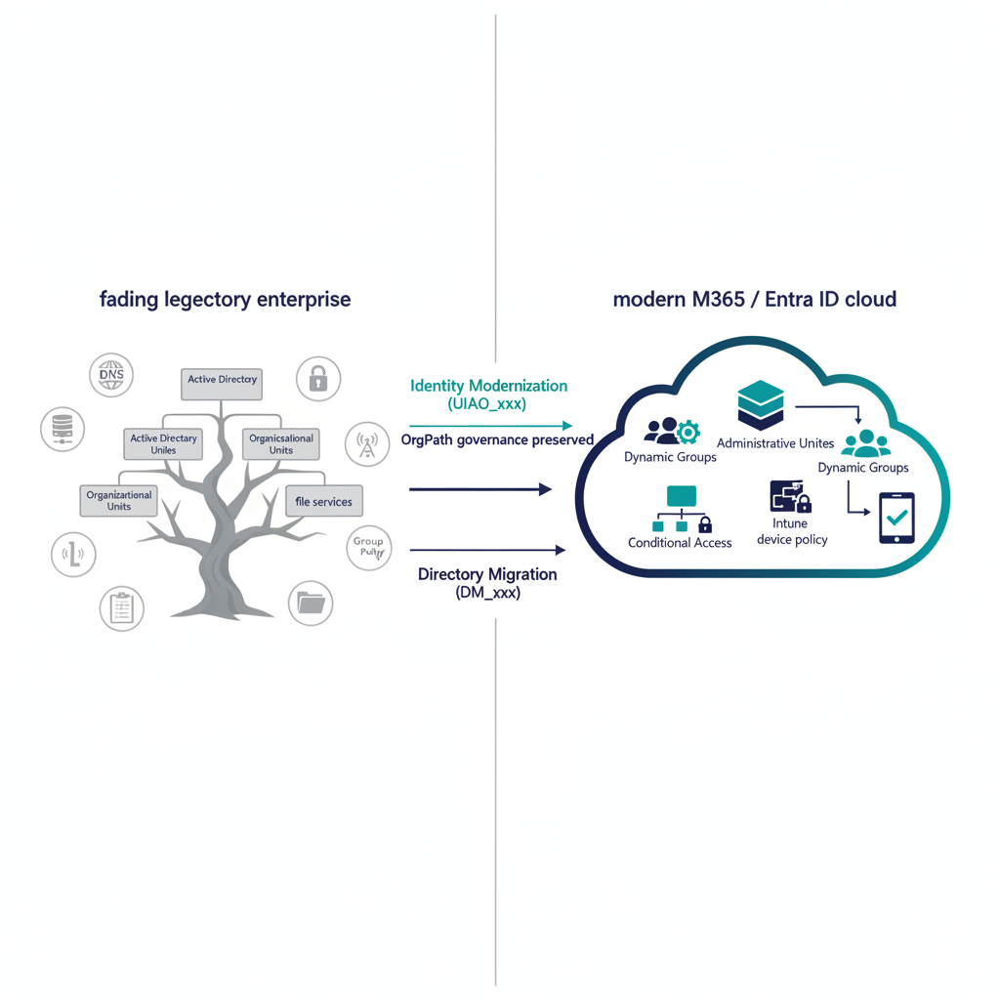
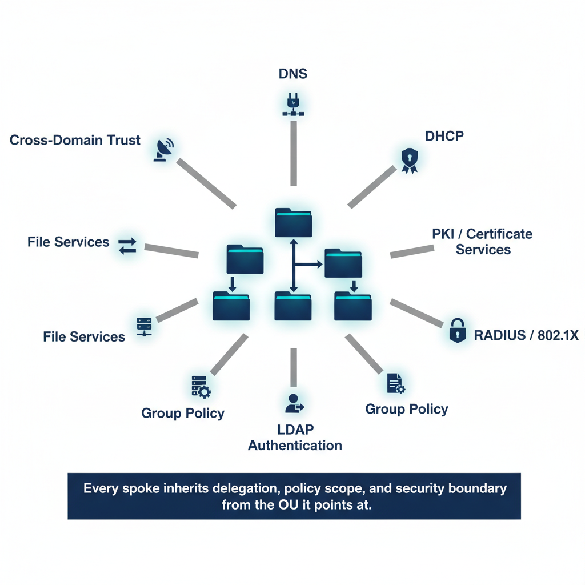
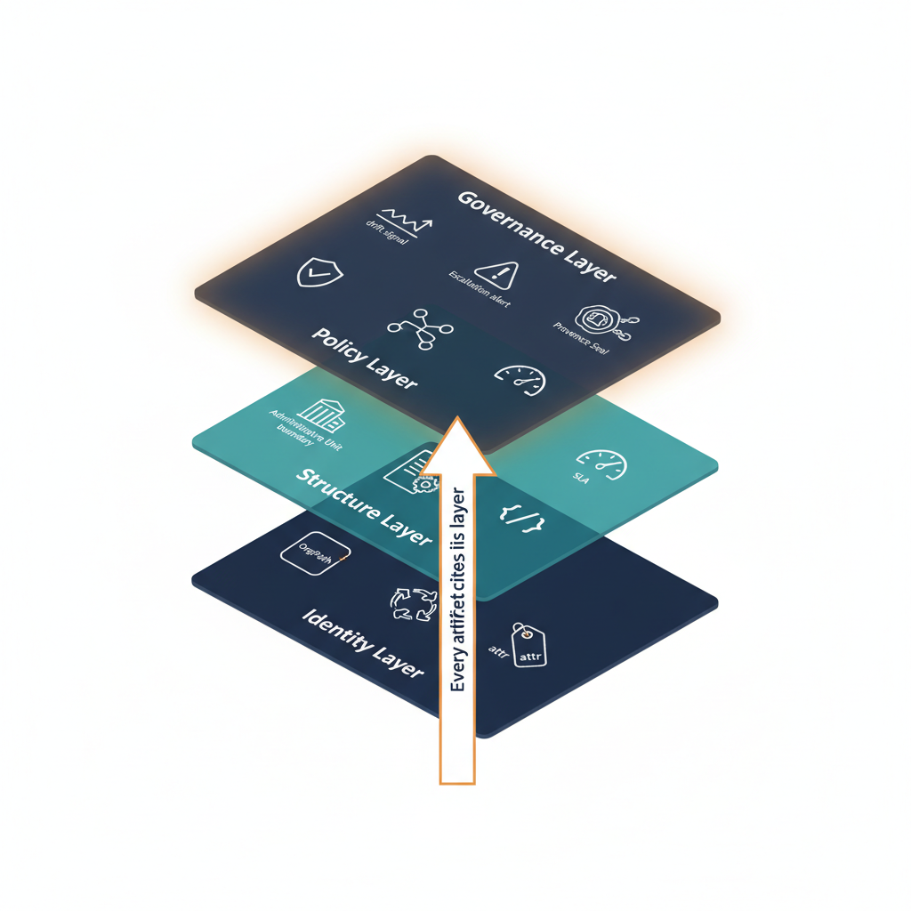


{#fig-index-image-01 fig-alt="LEFT: a fading legacy enterprise — an Active Directory forest tree with Organizational Units, surrounded by satellite icons for DNS, DHCP, PKI, RADIUS, LDAP, Group Policy, and file services, all rendered in muted gray to signal end-of-life. RIGHT: a modern M365 / Entra ID cloud boundary containing Administrative Units, Dynamic Groups, Conditional Access, and Intune device policy, rendered in clean navy and teal. A single horizontal arrow runs left-to-right labeled \"OrgPath governance preserved.\" Above the arrow, a thin parallel arrow labeled \"Identity Modernization (UIAO_xxx)\"; below it, a parallel arrow labeled \"Directory Migration (DM_xxx).\" Style: editorial flat vector, white background, McKinsey/Deloitte whitepaper feel. No people, no baked text other than the labels described. Palette: navy #0D1B2E, teal #1E8C8C, steel gray #5A5A5A, white." width="85%"}

## The Problem

Federal agencies — and most enterprises — are frozen in 2003.

Active Directory was never just an identity store. It was the *implicit governance model*
for every network service in the enterprise: DNS, DHCP, PKI, RADIUS, LDAP authentication,
GPO-based device policy, file services, and cross-domain trust relationships. When an
administrator created an OU, they were not just organizing users — they were defining
delegation boundaries, security policy scope, group policy inheritance, and operational
accountability. The OU tree *was* the governance model.

Microsoft is now deprecating the entire Client/Server stack. Entra ID replaces Active
Directory. Intune replaces Group Policy. Conditional Access replaces network-perimeter
enforcement. But Microsoft gave agencies the *tools* — nobody gave them the *framework*
for what decisions to make with those tools.

The result: agencies migrate users into Entra ID's flat directory and lose every governance
relationship that the OU hierarchy encoded. Delegation boundaries vanish. Policy inheritance
breaks. Group membership becomes a manual spreadsheet exercise. Security groups proliferate
without governance. And the infrastructure services that depended on AD — DNS, PKI, RADIUS,
LDAP — lose their governance anchor entirely.

{#fig-index-image-02 fig-alt="CENTER: a stylized OU tree rendered as a hierarchical folder structure, glowing faintly. RADIATING OUTWARD as labeled spokes: \"DNS\", \"DHCP\", \"PKI / Certificate Services\", \"RADIUS / 802.1X\", \"LDAP Authentication\", \"Group Policy\", \"File Services\", \"Cross-Domain Trust\". Each spoke ends in a small service icon. A thin caption band along the bottom reads \"Every spoke inherits delegation, policy scope, and security boundary from the OU it points at.\" Style: clean technical illustration, navy and steel gray with one teal accent on the central tree, white background. No people. No stock icons — abstract geometric service glyphs. Palette: navy #0D1B2E, teal #1E8C8C, steel gray #5A5A5A, white." width="85%"}

## The Solution

The UIAO Modernization Canon is that missing framework.

It provides the complete, deterministic, drift-resistant architecture for governing the
AD-to-Entra ID transition — not just user migration, but the full governance surface
that Active Directory was silently holding together. Two complementary canons cover the
entire migration surface:

| Domain | Namespace | Scope | Documents |
|--------|-----------|-------|-----------|
| **Identity Modernization** | UIAO_xxx (formerly MOD_xxx; retired by [ADR-060](https://github.com/WhalerMike/uiao/blob/main/src/uiao/canon/adr/adr-060-mod-namespace-flatten-into-uiao-canon.md)) | User hierarchy, OrgPath attributes, dynamic groups, AUs, HR-driven lifecycle, delegation, Conditional Access | 27 files (UIAO_150 + the A–Z series UIAO_151–UIAO_176) |
| **Directory Migration** | DM_xxx | DNS, DHCP, PKI, RADIUS, LDAP, sync engines, device management, NTP, DFS | 12 files (DM_000–DM_090): 8 adapter interfaces + 4 framework docs |

Both canons share a universal design principle:

::: {.callout-important}
## Canon Rule
uiao-gos is a universal enterprise product. It is NOT government-specific. Federal
compliance (FedRAMP, OSCAL, KSI) is one vertical adapter on top of the universal core.
Never frame the core engine as federal-only.
:::

## Architecture: The Four-Layer Governance Stack

The OrgTree architecture is a four-layer governance stack. Each layer has a defined
responsibility, explicit dependency relationships, and canonical artifacts.

| Layer | Responsibility | Key Artifacts |
|-------|---------------|---------------|
| **Governance Layer** | Drift detection, telemetry, escalation, boundary impact, provenance, error taxonomy | UIAO_163 (Drift Engine); UIAO_167 (SLA Escalation Playbooks); UIAO_174 (Telemetry) |
| **Policy Layer** | Validation cmdlets, enforcement test suite, decision trees, SLA tracking | UIAO_159 (PowerShell Validation); UIAO_161 (Decision Trees); UIAO_162 (SLA Heatmap) |
| **Structure Layer** | Administrative-Unit delegation, workflow catalog, migration runbook, schemas | UIAO_154 (Delegation Matrix); UIAO_156 (Migration Runbook); UIAO_158 (OrgPath JSON Schema) |
| **Identity Layer** | OrgPath assignment, dynamic-group library, attribute mapping, extension attributes | UIAO_150 (Executive Summary); UIAO_151 (OrgPath Codebook); UIAO_152 (Dynamic Groups); UIAO_153 (Attribute Mapping) |

{#fig-index-image-03 fig-alt="Four horizontal translucent layers stacked like glass shelves, bottom-to-top: (1) \"Identity Layer\" — widest, navy — small icons for OrgPath code, dynamic group, attribute. (2) \"Structure Layer\" — teal — small icons for an Administrative Unit boundary, a runbook page, a JSON schema. (3) \"Policy Layer\" — steel gray — small icons for a validation cmdlet, a decision tree, an SLA gauge. (4) \"Governance Layer\" — narrowest, top, dark navy with a soft glow — small icons for a drift signal, an escalation alert, a provenance seal. A vertical arrow runs through all four layers labeled \"Every artifact cites its layer.\" White background. No people. No baked text other than the four layer names and the vertical arrow label. Style: clean isometric/flat hybrid, modern government whitepaper feel. Palette: navy #0D1B2E, teal #1E8C8C, steel gray #5A5A5A, accent amber #D4A017, white." width="85%"}

## Governance Principles — 3 Universal + 3 Tier-Specific

Per [ADR-079](https://github.com/WhalerMike/uiao/blob/main/src/uiao/canon/adr/adr-079-governance-principle-reconciliation.md), UIAO ships **6 governance principles in two scopes**, declared canonically in [`src/uiao/canon/substrate-manifest.yaml`](https://github.com/WhalerMike/uiao/blob/main/src/uiao/canon/substrate-manifest.yaml) (UIAO_200). The substrate manifest is the code SSOT for principles; the descriptions below mirror it verbatim.

### 3 Universal Substrate Principles

These apply at all 5 conformance tiers per [ADR-076](https://github.com/WhalerMike/uiao/blob/main/src/uiao/canon/adr/adr-076-tier-conformance-model.md). Every UIAO deployment honors all three.

1. **Single Source of Truth (SSOT).** Canonical governance artifacts under `src/uiao/canon/` define structure, policy intent, and registry authority exactly once. Downstream systems consume those artifacts via `importlib.resources` rather than duplicating policy logic.

2. **Canon-Anchored Evidence.** Every artifact the substrate produces — SSP, POA&M, KSI dashboards, component definitions — cites the canon document ID and version it derives from. Reviewers trace findings back to requirements deterministically.

3. **Drift Is Explicit.** Five-class taxonomy (`DRIFT-SCHEMA`, `DRIFT-SEMANTIC`, `DRIFT-PROVENANCE`, `DRIFT-AUTHZ`, `DRIFT-IDENTITY`) surfaces structural and provenance mismatch as first-class findings, not exception reports.

### 3 Tier-Specific Principles

These become operational only at the named ADR-076 tier (inclusive — apply at that tier and above):

| Principle | Applies at tier | Rationale for tier scope |
|---|---|---|
| **Two-Brain Execution** — Copilot governs (canonical review, policy enforcement, validation); Execution Substrate executes (PowerShell, Graph API, tenant provisioning); governance logic and execution logic never co-mingle | **Tier 3+** (Active Substrate) | At Tiers 1–2 there is no active runtime to split between governance and execution. The principle becomes operational only when UIAO writes agency state. |
| **Boundary Enforcement** — No governance artifact may extend beyond the M365 GCC-Moderate SaaS boundary. Out-of-scope references are non-canonical and rejected at validation | **Tier 4+** (Active Services / Platform Server) | At Tiers 1–3, boundary is a documented scope; at Tier 4 it becomes an enforced runtime contract on agency-deployed UIAO services. |
| **Tenant Agnosticism** — All artifacts are portable across any M365 GCC-Moderate tenant. No tenant-specific identifiers, UPNs, or GUIDs. All environment values are injected at deployment time | **Tier 5** (Embedded Libraries) | At Tiers 1–4, UIAO runs agency-side and may carry tenant-local context. At Tier 5, code shipped to third parties (PyPI, NuGet, adapter SDK) MUST be portable. |

### Historical names ("Seven Non-Negotiable Principles")

Earlier framings of this canon listed seven principles. Per ADR-079, four of those names were partial expressions of the universal three and have been collapsed into them:

| Retired narrative name | Collapses into universal principle |
|---|---|
| Deterministic State | SSOT (single canonical state per object) |
| Schema Fixity | SSOT (canon defines structure once) |
| Provenance Traceability | Canon-Anchored Evidence (same property, different label) |
| Drift Resistance | Drift Is Explicit (same property; the 5-class taxonomy is the canonical drift surface) |

The other three names (Boundary Enforcement, Two-Brain Execution, Tenant Agnosticism) remain canonical, now scoped to the tiers where they bind. The "seven principles" phrasing should not be cited in new material; refer to the 3 + 3 split above or to the substrate manifest directly. "Assessment Before Action" (sometimes quoted from the OrgPath Narrative) is treated as an operational discipline — a corollary of Drift Is Explicit and Canon-Anchored Evidence — not a first-class substrate principle.

## Who This Is For

| Audience | What They Get |
|----------|--------------|
| **Federal CISOs and CIOs** | A governed framework for AD retirement that does not create compliance gaps |
| **IT Modernization Program Managers** | Step-by-step runbooks with deterministic outcomes, not "it depends" guidance |
| **Identity Architects** | OrgPath codebook, dynamic group library, AU delegation matrix |
| **Network and Infrastructure Engineers** | Adapter interfaces for every AD-dependent service |
| **Compliance Officers** | Provenance-tracked, drift-resistant artifacts that satisfy FedRAMP continuous monitoring |
| **Enterprise Architects (non-federal)** | Universal framework — federal compliance is a vertical adapter, not the core |

## Navigation

### Canon entry points

| Section | What is There |
|---------|-------------|
| [Identity Modernization (OrgTree)](orgtree.html) | The A-Z Suite: 27 canonical artifacts (UIAO_150 + UIAO_151–UIAO_176) governing user hierarchy, dynamic groups, delegation, migration, drift detection, and operational governance |
| [Directory Migration](directory-migration.html) | 8 adapter interfaces for every infrastructure service AD was holding together: IPAM, PKI, RADIUS, LDAP, sync engines, devices, NTP, DFS |

### Explainers and walk-throughs

| Page | Who it's for |
|------|--------------|
| [OrgPath Codebook](codebook.qmd) | Architects defining the OrgPath vocabulary (codes, hierarchy, regex, lifecycle) |
| [Where Data Lives — OrgPath](where-data-lives.qmd) | Operators asking *"is this in Git, Entra, or HR?"* — the three-layer answer |
| [Where Data Lives — Devices & Azure](where-data-lives-devices-and-azure.qmd) | Extending the storage-topology model to devices and Azure resources |
| [Dynamic Groups](dynamic-groups.qmd) | Engineers building the rules library for membership automation |
| [Delegation Matrix](delegation.qmd) | Identity admins mapping Administrative Units to operator roles |
| [Drift Walk-through](drift-walkthrough.qmd) | Anyone tracing how the Drift Engine classifies and remediates a single event |
| [Intune-First Asset Onboarding](intune-first.qmd) | Procurement + endpoint teams governing **net-new** devices from day zero (per ADR-080; for existing-fleet GPO replacement see [GPO Sunset Program](../customer-documents/modernization/target-surface/intune-policy-templates.qmd)) |
| [Directory Migration — Adapters](adapters.qmd) | Network/infrastructure engineers wiring DNS/DHCP/PKI/RADIUS through canonical adapters |
| [OrgPath FAQ](orgpath-faq.qmd) | First-time readers — short answers to the questions that always come up |

## Source Files

All canonical source files are maintained in the monorepo:

- **Identity Modernization:** `src/uiao/modernization/orgtree/`
- **Directory Migration:** `src/uiao/modernization/directory-migration/`
