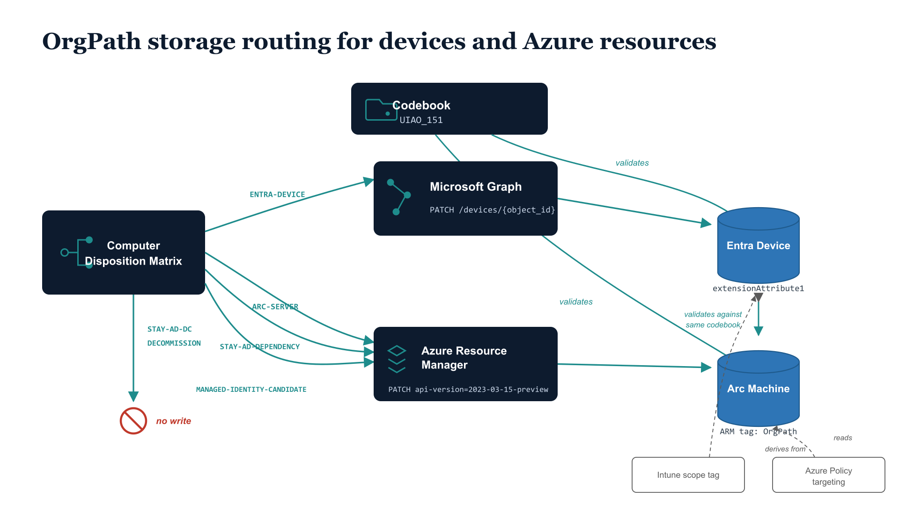



> **Model C — 15-facet multi-attribute (per [ADR-078](../../adr/adr-078-orgpath-attribute-schema-15-facet.qmd)).** Each device or Azure resource carries the 10 named facet values across `extensionAttribute1`–`10` (for Entra devices and service principals) or the equivalent 10 ARM tags (for Arc machines and other Azure resources). The dual-transport routing (Microsoft Graph for Entra devices, Azure Resource Manager for Arc machines) and the Codebook-as-shared-validator pattern are unchanged from earlier models; what changed is that *each transport writes 10 facet values per device* rather than one composite. The runtime adapter that performs the dispatch was retired by ADR-078 Phase 1 and will be rebuilt per-facet in Phase 5.

::: {.callout-note}
## Companion to the user-side explainer

This page picks up from [Where OrgTree & OrgPath Data Lives](where-data-lives.qmd),
which covered the user case (HR → 10 `extensionAttribute*` slots on the
Entra user object ← per-facet codebook validation). Computers and
Azure resources decompose across more planes than users do, so the
storage story extends slightly — but the codebook and authority
layers are unchanged. Read the user-side page first.
:::

{#fig-orgpath-device-azure-routing fig-alt="Model C OrgPath storage routing for devices and Azure resources. LEFT: a disposition decision selects between two write transports. MIDDLE: Microsoft Graph (for Entra devices) and Azure Resource Manager (for Arc machines). RIGHT: two resulting storage surfaces — 10 extensionAttribute slots on the Entra device, and the equivalent 10 ARM tags on the Arc machine. ABOVE: the Codebook as shared per-facet validator for both surfaces. 16:9 layered-architecture diagram, navy and teal palette." width="85%"}

## Why this needs its own page

A user has exactly one OrgPath storage *surface*: the 10 named
`extensionAttribute*` slots on `user.onPremisesExtensionAttributes`.
A computer doesn't. Per [ADR-034](https://github.com/WhalerMike/uiao/blob/main/src/uiao/canon/adr/adr-034-three-plane-device-model.md),
a computer object decomposes across three planes:

| Plane | Object type | OrgPath storage (Model C) | Targeting |
|-------|-------------|---------------------------|-----------|
| **Identity** (clients) | Entra Device | 10 `extensionAttribute*` slots on the device's `onPremisesExtensionAttributes` | Dynamic Entra group composing facet predicates |
| **Management** (clients) | Intune enrollment | *Inherited* from the Entra device's 10 facet slots | Intune scope tag derived from facet values |
| **Management** (servers) | Azure Arc machine | 10 ARM tags, one per facet, on the `Microsoft.HybridCompute/machines` resource | Azure Policy assignment scoped by tag predicates |
| **Workload** | Service Principal / Managed Identity | 10 `extensionAttribute*` slots on the SP (per ADR-063, when in scope) | App role / API permission scoped by SP facet values |

The two storage *surfaces* that actually carry OrgPath facet values are
the Entra `onPremisesExtensionAttributes` collection (10 slots per
device) and the equivalent 10 ARM tags on Azure Resource Manager
resources. The other two rows *inherit* from those — Intune reads from
the Entra device's facet slots, workload-identity governance derives
from the SP's facet slots.

## The two device storage surfaces

These two writes are governed by the canonical per-facet device-plane
binding declared in canon (the prior `device-planes.yaml` and its
adapter were retired by [ADR-078](../../adr/adr-078-orgpath-attribute-schema-15-facet.qmd)
Phase 1; per-facet replacements are scheduled in Phase 5). The
dispatch logic — which transport handles which disposition — moved
from a single composite-string adapter to per-facet writers under
Model C. Graph and ARM endpoint strings live in canon, not in code
(unchanged from ADR-038).

### Surface 1: 10 `extensionAttribute*` slots on the Entra device

| Field | Value |
|-------|-------|
| Transport | Microsoft Graph |
| Target | `directoryObject/device` |
| Method | `PATCH /devices/{object_id}` |
| Body | `onPremisesExtensionAttributes.extensionAttribute1`–`10` (one PATCH carrying all 10 facet values) |
| Used when disposition is | `ENTRA-DEVICE` |

This is the client side — workstations, laptops, Entra-joined or
hybrid-joined endpoints. Same surface Entra Connect syncs into for
user-side `extensionAttribute*` writes (ADR-035 Phase 1).

### Surface 2: 10 ARM tags on the Azure Arc machine

| Field | Value |
|-------|-------|
| Transport | Azure Resource Manager |
| Target | `Microsoft.HybridCompute/machines` |
| Method | `PATCH {arm_resource_id}?api-version=2023-03-15-preview` |
| Body | `tags.Region`, `tags.Department`, `tags.Division`, …, `tags.AccountType` (one PATCH carrying all 10 facet tags) |
| Used when disposition is | `ARC-SERVER`, `STAY-AD-DEPENDENCY`, `MANAGED-IDENTITY-CANDIDATE` |

This is the server side — anything Arc-enrolled, including
Arc-visible AD-dependency boxes and workload-identity-candidate
servers during the migration window. Each named facet writes to a
correspondingly-named ARM tag; the slot-uniqueness invariant
(per facet, one tag) carries over from the Entra
`extensionAttribute*` discipline.

### Skipped surfaces

| Disposition | Why no write |
|-------------|--------------|
| `STAY-AD-DC` | Domain controllers don't migrate; OrgPath facet values are not written |
| `DECOMMISSION` | End-of-life; no write attempted |

## The per-facet agreement rule

Both surfaces validate against the *exact same* per-facet codebook:

- **Same per-facet enumerations / patterns:** Region, Department,
  Division, Role, CostCenter, Classification, ClearanceLevel,
  AccountType (enumerated) and HireDate, TermDate (typed) — each
  facet validates independently
- **Same codebook:** [`codebook.yaml`](https://github.com/WhalerMike/uiao/blob/main/src/uiao/canon/data/orgpath/codebook.yaml)
  (`schema_version: 2.0.0`)
- **Same authority:** the workload registration in the disposition
  matrix for servers, the assigned user's HR record for workstations
  (Autopilot enrollment passes those facet values through to the
  device)
- **Same drift semantics:** Format, Value, Slot, Orphan, and
  Phantom — applied per-facet — see [Drift Detection Walk-through](drift-walkthrough.qmd).
  Devices do not get their own drift categories.

A device that is *both* Entra-joined and Arc-enrolled (rare but
possible — e.g., dev VMs) is canonically required to carry the same
10 facet values across both surfaces — the two surfaces validate
against the same codebook and the canon treats per-facet equality
between them as a required invariant.

::: {.callout-warning title="Runtime enforcement of cross-surface equality is deferred"}
As of UIAO_163 v1, the drift engine validates the Graph surface's 10
`extensionAttribute*` slots per facet but does *not* perform a
cross-surface per-facet equality check against the ARM-tag surface.
Today's enforcement is **adapter-side** in the per-facet writer
(scheduled rebuild in ADR-078 Phase 5; the prior single-string
`EntraDeviceOrgPathAdapter` was retired in Phase 1). A future ADR
(companion to the `DRIFT-SCHEMA::slot-occupied` sub-class deferred in
ADR-063) will introduce per-facet cross-surface equality checks;
until then, cross-surface disagreement is detected on the next
codebook-driven re-write rather than as a runtime drift event.
:::

## What is *not* in this story

- **Intune scope tags** derive from the Entra device's 10 facet
  slots. The scope-tag value is a function of one or more facet
  values, not an independent storage location. See
  [Customer narrative ch. 5 — OrgPath and Intune](../orgpath-narrative/05-orgpath-and-intune.qmd)
  for the device-lifecycle treatment.
- **Azure Policy enforcement on non-Arc resources** uses the same
  10-tag pattern, but the tags are written by template defaults or
  `Modify` policies, not by the per-facet device-plane writer. See
  [Customer narrative ch. 9 — OrgPath and Azure Policy / Guest
  Config](../orgpath-narrative/09-orgpath-and-azure-policy-guest-config.qmd)
  and
  [ch. 12 — OrgPath in Infrastructure Services](../orgpath-narrative/12-orgpath-in-infrastructure-services.qmd)
  for the Azure resource tagging pattern (private DNS zones, key
  vaults, storage accounts, etc.).
- **Service Principal / Managed Identity OrgPath** is canonically
  in-scope (ADR-063) with the same 10-facet pattern, but currently
  consumed only by app-registration reviews; the runtime drift
  engine v1 reads the user and device surfaces only.

## Quick reference

| Question | Answer |
|----------|--------|
| Where is a workstation's Region? | `device.extensionAttribute1` on the Entra device |
| Where is a workstation's full OrgPath? | Across `device.extensionAttribute1`–`10` (10 facets) |
| Where is an Arc server's Region? | ARM tag `Region` on the `Microsoft.HybridCompute/machines` resource |
| Where is an Arc server's full OrgPath? | Across 10 facet-named ARM tags on the resource |
| Where is an Azure VM's OrgPath? | The 10 facet-named ARM tags on the resource; *plus* the 10 Entra `extensionAttribute*` slots if the VM is also Entra-joined |
| Where is a domain controller's OrgPath? | Not written. `STAY-AD-DC` is a defined skip disposition — the canon's rule for DCs is explicitly "no write" |
| Where is a Managed Identity's OrgPath? | The 10 `servicePrincipal.extensionAttribute*` slots (per ADR-063); declared in-scope but not consumed by drift v1 |
| What enforces the binding? | Per-facet device-plane writer (Phase 5 rebuild) + drift engine (UIAO_163) |
| Who decides which surface? | `ComputerDisposition.orgpath_plane`, computed from the disposition matrix |
| How is per-facet equality verified across surfaces? | Today: by the codebook-driven re-write. Deferred: a runtime cross-surface check (future ADR) |

## Related

- [Where OrgTree & OrgPath Data Lives](where-data-lives.qmd) — the
  user-side story this page extends
- [Drift Detection Walk-through](drift-walkthrough.qmd) — the
  shared per-facet drift semantics
- [OrgPath Codebook (UIAO_151)](codebook.qmd) — the per-facet canonical
  enumeration both surfaces validate against
- [ADR-034 Three-Plane Device Model](https://github.com/WhalerMike/uiao/blob/main/src/uiao/canon/adr/adr-034-three-plane-device-model.md) —
  the architectural decomposition
- [ADR-038 Device-Plane OrgPath](https://github.com/WhalerMike/uiao/blob/main/src/uiao/canon/adr/adr-038-device-plane-orgpath.md) —
  the dual-transport pattern (now per-facet)
- [ADR-063 extensionAttribute Storage Slot Binding](https://github.com/WhalerMike/uiao/blob/main/src/uiao/canon/adr/adr-063-orgpath-storage-slot-binding.md) —
  the slot ratification covering users, devices, SPs, and ARM tags
- [ADR-078 15-Facet Multi-Attribute Schema](../../adr/adr-078-orgpath-attribute-schema-15-facet.qmd) —
  the Model C decision record (retired the prior composite-string adapters; Phase 5 rebuilds the per-facet device-plane writer)
- [Customer narrative ch. 5 — OrgPath and Intune](../orgpath-narrative/05-orgpath-and-intune.qmd)
- [Customer narrative ch. 9 — OrgPath and Azure Policy / Guest Config](../orgpath-narrative/09-orgpath-and-azure-policy-guest-config.qmd)
- [Customer narrative ch. 12 — OrgPath in Infrastructure Services](../orgpath-narrative/12-orgpath-in-infrastructure-services.qmd)
