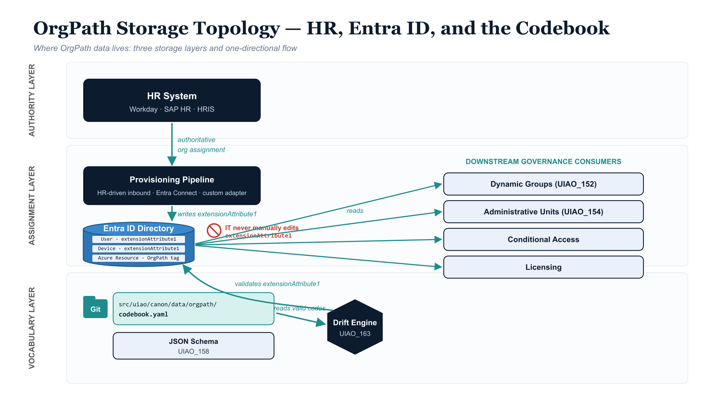



> **Model C — 15-facet multi-attribute (per [ADR-078](../../adr/adr-078-orgpath-attribute-schema-15-facet.qmd)).** OrgPath data is decomposed into 10 named facets stored across `extensionAttribute1`–`extensionAttribute10` on each Entra principal (plus 5 reserved slots for tenant-declared facets). The three-layer storage architecture — Git codebook / Entra ID values / HR authority — is unchanged from earlier models; what changed is that the *Entra layer* now holds 10 discrete facet values per principal rather than one composite string. See [OrgPath Codebook](codebook.qmd) for the slot-by-slot facet definitions.

::: {.callout-note}
## A clarifying explainer

A recurring question from operators reading the OrgTree canon for the first
time is "where is this data actually stored?" — is it in a registry checked
into the repo, in Entra ID extension attributes, in HR, or somewhere else?
This page answers that question in one place. The authoritative specs are
[UIAO_151 (Codebook)](codebook.qmd) v4.0 and the executable
[`codebook.yaml`](https://github.com/WhalerMike/uiao/blob/main/src/uiao/canon/data/orgpath/codebook.yaml)
(`schema_version: 2.0.0`).
:::

{#fig-orgpath-storage-topology fig-alt="Three-layer storage architecture for Model C OrgPath data. LEFT: HR system as authority, feeding a provisioning pipeline. MIDDLE: 10 extensionAttribute slots on every Entra ID principal — the per-facet assignment layer. RIGHT: Git-versioned Codebook declaring per-facet enumerations and typed validation. The Drift Engine validates each principal's 10 slot values against its facet's enumeration independently. Downstream consumers — Dynamic Groups, Administrative Units, Conditional Access, Licensing — compose boolean predicates over facet slots. 16:9 layered-architecture diagram, navy and teal palette." width="85%"}

## The short answer

There is no single "OrgPath registry." OrgPath data lives in **three places
at once**, each with a distinct role:

| Layer | Where it lives | What it holds | Role |
|-------|---------------|---------------|------|
| **Vocabulary** | `src/uiao/canon/data/orgpath/codebook.yaml` (Git) | The 10 named facets and (for each) a per-facet enumeration or typed pattern | Defines the language |
| **Assignment** | `extensionAttribute1`–`extensionAttribute10` on each user / device in **Entra ID** | The actual 10 facet values carried by every principal | Carries the runtime data |
| **Authority** | The **HR system** (Workday, SAP HR, agency HRIS, etc.) | The ground-truth org structure that drives values | Source of truth |

If the three disagree, the resolution order is **HR → Entra → Codebook
per-facet validation → Drift event**. IT never edits any of the 10
`extensionAttribute*` slots by hand.

## Layer 1 — The vocabulary lives in Git

The Codebook is a YAML file checked into the monorepo. It is not a database
and not a registry service — it is a versioned, PR-reviewed document. Under
Model C the codebook declares each of the 10 named facets independently,
with that facet's slot binding, kind (enumerated / typed), and either an
enumeration or a typed validation pattern.

- **File:** [`src/uiao/canon/data/orgpath/codebook.yaml`](https://github.com/WhalerMike/uiao/blob/main/src/uiao/canon/data/orgpath/codebook.yaml)
  (`schema_version: 2.0.0`)
- **Schema:** [`src/uiao/schemas/orgpath/codebook.schema.json`](https://github.com/WhalerMike/uiao/blob/main/src/uiao/schemas/orgpath/codebook.schema.json)
  (JSON Schema draft 2020-12)
- **Python loader:** [`uiao.modernization.orgtree.codebook`](https://github.com/WhalerMike/uiao/blob/main/src/uiao/modernization/orgtree/codebook.py)
  — enforces the slot-uniqueness invariant after schema validation
- **Canon narrative:** [`UIAO_151_OrgPath_Codebook.md`](https://github.com/WhalerMike/uiao/blob/main/src/uiao/canon/UIAO_151_OrgPath_Codebook.md)
  v4.0

Each entry in the codebook is a **Facet** declaration. Three facet kinds
are supported:

| Field | Type | Notes |
|-------|------|-------|
| `name` | string | Stable identifier (e.g., `region`, `department`, `hire_date`) |
| `attribute` | string | The `extensionAttribute*` slot the facet binds to (must be unique across facets) |
| `kind` | enum | `enumerated` · `typed` · `reserved` |
| `enumeration` | list | (enumerated only) The closed set of valid values, each with `value`, `description`, optional `status`/`replaced_by` |
| `value_type` / `value_pattern` / `allow_empty` | string / regex / bool | (typed only) The validation contract for the value |
| `status` | enum | Per-facet lifecycle: `active` · `deprecated` · `pending` |
| `owner` | string | Responsible role for the facet's vocabulary |

Codebook changes follow the canonical Contributor Workflow
([UIAO_172](https://github.com/WhalerMike/uiao/blob/main/src/uiao/canon/UIAO_172_Canonical_Contributor_Workflow.md))
— PR, CI validation (JSON Schema + slot-uniqueness loader check), review,
merge, provenance chain.

## Layer 2 — The values live in Entra ID — across 10 slots per principal

Under Model C each principal carries **10 facet values** simultaneously,
one per slot, on the Entra ID directory object itself:

| Principal type | Storage surface | Slots in use |
|----------------|-----------------|--------------|
| **User** | `user.onPremisesExtensionAttributes.extensionAttribute1`–`10` | 10 named facets |
| **Device (Entra-joined)** | `device.onPremisesExtensionAttributes.extensionAttribute1`–`10` | 10 named facets |
| **Azure resource (ARM)** | The equivalent 10 ARM tags on the resource | 10 named facets |
| **Service principal** | `servicePrincipal.extensionAttribute1`–`10` (per ADR-063, when in scope) | 10 named facets |

The canonical assignment per ADR-078 (full table in [codebook](codebook.qmd)):

| Slot | Facet | Kind |
|---|---|---|
| `extensionAttribute1` | Region | enumerated |
| `extensionAttribute2` | Department | enumerated |
| `extensionAttribute3` | Division | enumerated |
| `extensionAttribute4` | Role | enumerated |
| `extensionAttribute5` | CostCenter | enumerated |
| `extensionAttribute6` | Classification | enumerated |
| `extensionAttribute7` | HireDate | typed (ISO 8601 date) |
| `extensionAttribute8` | TermDate | typed (ISO 8601 date, allow_empty) |
| `extensionAttribute9` | ClearanceLevel | enumerated |
| `extensionAttribute10` | AccountType | enumerated |
| `extensionAttribute11`–`15` | Reserved | tenant-declared via governed PR |

### Are these attributes pre-defined or assessment-defined?

**The 15 *slots* are pre-defined. The *facet semantics* and the
*per-facet values* are assessment-defined.**

- `extensionAttribute1` through `extensionAttribute15` are **standard,
  tenant-wide extensibility attributes** that exist on every Entra ID
  tenant out of the box. UIAO does not create them.
- What UIAO **does** define is the *per-slot contract*: each named slot
  carries a specific facet, validated against that facet's enumeration
  or typed pattern. Per-facet validation means a finding on one slot
  (e.g., an unknown `Region` value in `extensionAttribute1`) is
  independent of the other 9 slots.
- The *values* themselves are populated during migration (Runbook
  [UIAO_156](https://github.com/WhalerMike/uiao/blob/main/src/uiao/canon/UIAO_156_Migration_Runbook_OU_to_Entra.md))
  and maintained continuously by HR-driven inbound provisioning.

### Rebinding a facet to a different slot

The slot-to-facet mapping is canonical, not a per-tenant configuration
knob. A tenant that already uses, say, `extensionAttribute1` for a
non-OrgPath purpose follows the rebind procedure in
[ADR-063 §3](https://github.com/WhalerMike/uiao/blob/main/src/uiao/canon/adr/adr-063-orgpath-storage-slot-binding.md):
relocate the inherited use to a slot UIAO does not claim, verify cutover,
*then* enable OrgPath writes. Changing a facet's slot binding across the
canon requires a superseding ADR — never a tenant-local override.

### The slot-uniqueness invariant

Each `extensionAttribute*` slot is claimed by **exactly one** facet.
Two facets binding the same slot is a codebook integrity error caught by
the Python loader's `_validate_integrity` step after JSON Schema
validation passes. The invariant cannot be expressed in JSON Schema
itself (no cross-property uniqueness construct), so the loader is the
enforcement point. A violation surfaces as **Slot Drift** (P1).

## Layer 3 — The authority lives in HR

Entra ID is the *system of record* for identity. The HR system is the
*system of truth* for organizational placement — and under Model C it
populates **all 10 named facet slots**, not a single composite string.

```
HR system (Workday / SAP HR / HRIS)
        │  authoritative org assignment — 10 facet values per user
        ▼
Provisioning pipeline (HR-driven inbound provisioning, Entra Connect, or custom adapter)
        │  writes 10 onPremisesExtensionAttributes per principal
        ▼
Entra ID user object (extensionAttribute1..10 populated)
        │  read per-facet by dynamic-group / AU / CA / drift engines
        ▼
Downstream governance (Dynamic Groups · AUs · CA · Licensing · Drift)
```

Operating rule (from UIAO_151 v4.0): **"HR system is the authoritative
source — IT never manually edits any of the 10 OrgPath facet values."**
Any IT-originated write to `extensionAttribute1`–`10` is itself a drift
event under the provenance rules in
[UIAO_163 (Drift Engine)](https://github.com/WhalerMike/uiao/blob/main/src/uiao/canon/UIAO_163_Drift_Detection_Engine_Specification.md).

## What about the `registry/` directory?

The repo's top-level [`registry/`](https://github.com/WhalerMike/uiao/tree/main/registry)
directory is a common point of confusion. It is **not** the OrgPath store.
It contains Governance OS adapter and pipeline manifests:

| File | Purpose |
|------|---------|
| `manifest.json` · `adapter-manifest.json` | Adapter registration metadata |
| `modernization.json` | Pipeline sequencing for the modernization canon |
| `provenance.json` | Audit-trail schema |
| `boundaries.json` | GCC-Moderate scope definitions |

OrgPath facet data is **never** stored here.

## Quick reference

| Question | Answer |
|----------|--------|
| Where is the list of valid Region values? | `facets.region.enumeration` in `codebook.yaml` |
| Where is the list of valid Department values? | `facets.department.enumeration` in `codebook.yaml` |
| Where is a specific user's Region? | `user.extensionAttribute1` in Entra ID |
| Where is a specific user's Department? | `user.extensionAttribute2` in Entra ID |
| Where is a specific user's full OrgPath? | Across all 10 slots — `extensionAttribute1`–`10` per principal |
| Who decides what values go into the 10 slots? | The HR system, via inbound provisioning |
| Are the 10 Entra slots UIAO-defined? | No — Microsoft provides them; UIAO claims 10 of the 15 slots per ADR-078 |
| Is there a database? | No — Git for per-facet vocabulary, Entra ID for per-principal values |
| What enforces the per-facet binding? | Drift engine (UIAO_163, rebuilt per-facet in ADR-078 Phase 5) against the codebook |
| What enforces slot uniqueness? | The Python loader's `_validate_integrity` check — Slot Drift findings on violation |

## Related

- [OrgPath FAQ](orgpath-faq.qmd) — plain-language answers to the
  questions operators actually ask
- [Where Data Lives — Devices and Azure](where-data-lives-devices-and-azure.qmd) —
  the same three-layer model for devices and Azure resources
  (two storage surfaces: Entra `extensionAttribute1`–`10` per device, and the
  equivalent 10 ARM tags per Azure resource)
- [Drift Detection Walk-through](drift-walkthrough.qmd) — what the
  per-facet engine catches when the three storage layers disagree
- [OrgPath Codebook (UIAO_151)](codebook.qmd) — the per-facet canonical
  encoding
- [Dynamic Groups](dynamic-groups.qmd) — how facet predicates compose
  group membership
- [Delegation Matrix](delegation.qmd) — how facet tuples scope AUs
- [ADR-078 — 15-facet schema](../../adr/adr-078-orgpath-attribute-schema-15-facet.qmd) —
  the Model C decision record
