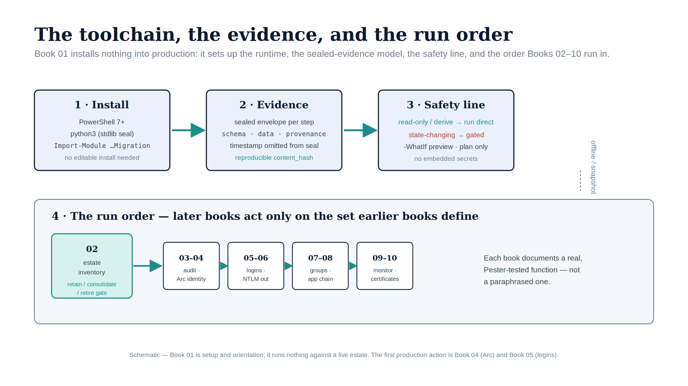

::: {.content-visible when-format="docx"}
# Implementation Book 01 — Prerequisites & Using This Companion
:::

{#fig-impl-book01 fig-alt="A schematic on a white background. A top row of three stages flows left to right under teal arrows: '1 · Install' (PowerShell 7+, python3 stdlib seal, Import-Module …Migration), '2 · Evidence' (sealed envelope per step: schema · data · provenance; reproducible content_hash), and '3 · Safety line' (read-only / derive run direct in teal; state-changing gated in red; -WhatIf preview). Below, a panel titled '4 · The run order' shows a teal 'estate inventory — retain / consolidate / retire gate' box (Book 02) feeding a chain of boxes labelled 03–04, 05–06, 07–08, 09–10. Federal navy, teal, ice-blue and red palette; no photographs." width="90%"}

::: {.callout-tip}
## Download this book
**[Book_01.docx](Book_01.docx)** — this entire book as a single Word document, images included. Regenerated on every site deploy.
:::

::: {.callout-note}
Companion to **narrative Book 01**. The narrative opens with *the inheritance* — why a twenty-year Windows-authentication estate exists and why it must change. This book is the executable counterpart: not *why*, but *what you install, how the evidence is shaped, what is safe to run, and in what order*. Everything in this book is **read-only or setup**; it provisions nothing and changes no production state. (UIAO_135 Transformation #7; ADR-091, ADR-068)
:::

## What this companion automates

The narrative stays conceptual; this companion is the executable layer. Each later book documents the **real** script behind its step — not a paraphrase. The automation lives in two places: the read-only discovery **Spec family** under [`tools/discovery/`](https://github.com/WhalerMike/uiao/tree/main/tools/discovery), and the derivation/validation **PowerShell modules** under [`tools/powershell/`](https://github.com/WhalerMike/uiao/tree/main/tools/powershell). The roster, by book:

| Book | Shipped automation | Tier |
|---|---|---|
| 02 — Estate discovery | `Spec3-D1.8` / `Spec1-D1.5` / `Find-DbaInstance`, fused by **`New-UIAOEstateInventory`** | read-only |
| 03 — Authentication audit | `Spec3-D1.8-Get-SQLServerAuthAudit` (+ the `Spec*-D1.*` family) | read-only |
| 04 — Arc & managed identity | `Test-UIAOArcAgentStatus` / `…ManagedIdentityToken` / `…SqlExtension`, `Invoke-UIAOArcOnboarding` | validate read-only; onboard review-required |
| 05 — Login migration | `New-UIAOEntraLoginMapping`, `New-UIAOEntraLoginScript`, `Test-UIAOLoginParallelRun` | derive / dry-run |
| 06 — NTLM remediation | `Spec3-D1.7` / `Spec1-D1.5`, `New-UIAOSpnRemediationPlan`, `Get-UIAONtlmGpoReport` | audit-first |
| 07 — Groups & AUs | `Export-UIAOEntraGroups`, **`New-UIAOEntraGroupClassification`**, **`New-UIAOGroupLoginScript`** | derive / dry-run |
| 08 — Application chain | `Spec3-D1.9`, **`New-UIAOAppConnectionPlan`** | derive (conn-string change in-config) |
| 09 — Continuous monitoring | `Spec3-D1.8` (scheduled), **`New-UIAOClosureRecord`**, **`Compare-UIAOClosureRun`** | read-only |
| 10 — Certificates | `Spec3-D1.10`, **`New-UIAOSqlCertificatePlan`**, `New-UIAOPKIMigrationPlan` | read-only / analytical |

There is no Book 01 *script*: the conceptual opening has no executable layer of its own. This book is the setup and orientation the executable books assume.

## Step 1 — Install the toolchain

- **PowerShell 7+** is the runtime the modules target (the `tools/powershell` Pester CI pins PowerShell 7).
- **A stdlib Python interpreter** (`python3` on PATH) is the one external dependency: it computes the canonical integrity seal (`json` + `hashlib`), byte-identical to `uiao.ir.models.core.canonical_hash`. The `uiao` package is **not** imported, so no editable install is needed to produce sealed evidence.
- **The discovery Specs** are pure PowerShell under `tools/discovery/`; run them directly.
- **The modules** are imported from the repo:

```powershell
Import-Module ./tools/powershell/UIAOSqlServerMigration     # Books 02, 04, 05, 06, 07, 08, 09, 10
Import-Module ./tools/powershell/UIAOIdentityAssessment     # Book 07 group / Conditional Access export
Import-Module ./tools/powershell/UIAOPlanGenerators         # Book 10 PKI sequencing
```

Live Azure/Graph operations (Arc onboarding, Graph/ARM writes) additionally require the relevant CLIs (`azcmagent`, `az`) or the `[api]` extra, and are reachable only behind an explicit opt-in switch — every function is fully exercisable **offline** without them.

## Step 2 — The evidence model

Every derivation and validation function emits a **provenance-sealed envelope**, not loose output:

- `schema` + `artifact_type` name the artifact; `data.records` holds the rows; `data` also carries per-artifact summary counts.
- `provenance` records the producing module + version, a UTC `timestamp`, and a `content_hash`.
- The **sealed data omits the timestamp**, so identical inputs yield an identical `content_hash` — artifacts are reproducible, and a broken or unattributed envelope is a `DRIFT-PROVENANCE` finding by definition.

Write each step's envelope under a dated output directory and keep it under version control; that is what makes Book 09's scheduled runs diffable and the whole chain auditable.

## Step 3 — The safety model

The companion draws one bright line, enforced in code:

- **Read-only / derivation functions run directly** — discovery, audits, classifications, plans, closure records, diffs. They read captured or live-read inputs and change nothing.
- **State-changing functions are gated.** They either declare `SupportsShouldProcess` and default to a `-WhatIf`-style preview (e.g. `Invoke-UIAOArcOnboarding`), or they generate a reviewable script/plan and execute nothing (e.g. `New-UIAOEntraLoginScript`, `New-UIAOGroupLoginScript`). The login/group emitters have **no `-Server` or `-Execute` surface at all** — they never open a SQL connection.
- **No secrets are embedded.** Tenant, subscription, cloud, endpoints, and credentials are all parameters; sovereign clouds (GCC-Moderate / Azure Government) resolve the cloud-correct audience and fail closed on an unknown cloud.

::: {.callout-warning}
## Production safety (GCC-Moderate / FedRAMP)
Anything that touches **service accounts, SQL logins, SPNs, GPOs, or the domain** changes a production security posture. Run discovery/audit first (it is safe), generate the plan or script, capture it, and route it through change control and security review before any enforcement. The discovery scripts are read-only; the remediation steps are not.
:::

## Step 4 — The offline / snapshot pattern

Every function accepts captured input — a JSON/CSV snapshot of a live read — so the entire chain is exercisable and testable without touching a live estate. Capture once (the `Spec*` audits, `Export-UIAO*` exports, `azcmagent show -j`, an IMDS token), then run the derivations against the captured files. This is also how the Pester suite validates the module fully offline.

## Step 5 — The run order

The books chain; later books operate on the surviving set the earlier ones define:

1. **Book 02** establishes the denominator and the retain / consolidate / retire **gate** — only retain instances and consolidation targets proceed.
2. **Book 03** audits the surviving set's authentication posture.
3. **Book 04** gives each retain host an Arc managed identity; **Book 05** migrates its logins to Entra with a parallel-run window.
4. **Book 06** eliminates the NTLM-generating patterns; **Book 07** transforms the group/access layer and the Conditional Access perimeter.
5. **Book 08** removes the stored credential in the application chain — the last mile.
6. **Book 09** proves and keeps the posture continuously; **Book 10** discovers and sequences the certificate/ADCS dependencies that must not be decommissioned out from under SQL.

## Provenance

This companion introduces no new doctrine — it is the operational rendering of decisions already recorded in canon ([UIAO_135](https://github.com/WhalerMike/uiao/blob/main/src/uiao/canon/UIAO_135_identity-directory-transformation-inventory.md) Transformation #7; [ADR-091](../../adr/adr-091-sql-server-authentication-transformation.qmd), [ADR-068](../../adr/adr-068-kerberos-ntlm-elimination.qmd), ADR-067, ADR-069). Each book traces to its canon source and to the specific `Spec`/function it documents.

## Safety

This book installs and orients; it runs nothing against a live estate. The first action against production identity is in Book 04 (Arc) and Book 05 (logins), and only on the retain / target set Book 02 defines.

---

*Companion to [narrative Book 01](../sql-server-narrative/Book_01.qmd). Orientation for the toolchain in `tools/discovery/` and `tools/powershell/` (`UIAOSqlServerMigration`, `UIAOIdentityAssessment`, `UIAOPlanGenerators`). Canon: UIAO_135 Transformation #7; ADR-091, ADR-068, ADR-067, ADR-069.*
