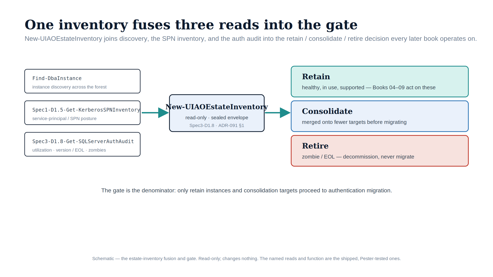

::: {.content-visible when-format="docx"}
# Implementation Book 02 — Estate Discovery & the Consolidation Gate
:::

{#fig-impl-book02 fig-alt="A schematic on a white background. On the left, three monospace source-read boxes — Find-DbaInstance, Spec1-D1.5-Get-KerberosSPNInventory, and Spec3-D1.8-Get-SQLServerAuthAudit — feed a teal arrow into a central ice-blue box labelled New-UIAOEstateInventory (read-only, sealed envelope). A second teal arrow points to three stacked decision panels on the right: a teal 'Retain' band, a blue 'Consolidate' band, and a red 'Retire' band. Federal navy, teal, blue and red palette; no photographs." width="100%"}

::: {.callout-tip}
## Download this book
**[Book_02.docx](Book_02.docx)** — this entire book as a single Word document, images included. Regenerated on every site deploy.
:::

::: {.callout-note}
Companion to **narrative Book 02**. The narrative explains *why* you assess and consolidate before you migrate; this book is the discovery-and-rationalization runbook. Discovery is **read-only and run-first**; the consolidation *execution* it leads to — database moves, instance retirement — is review-required and lives in the program's migration plan, not here. (ADR-091 §1, UIAO_135 §3.2)
:::

::: {.callout-note}
## The Phase-0 instrument
Narrative Book 02 Chapter 2 named the ADR-091 §1 **Phase 0** denominator as a gap: the authentication audit (`Spec3-D1.8`, Book 03) enumerates instances that are already known and measures their *auth posture*, but estate discovery runs earlier and casts wider to establish the **denominator**. That gap is now closed by **`New-UIAOEstateInventory`** (`tools/powershell/UIAOSqlServerMigration/`), which fuses the shipped discovery outputs into one deduplicated inventory and applies the retain / consolidate / retire gate. The individual instruments below remain the sources it consumes.
:::

## Why this book runs before everything else

Effort is finite and the 2027-04-01 backstop (Book 06, Book 09) does not move. Migrating the logins of an instance only to retire it three months later is wasted work measured against a fixed date. ADR-091 §1 makes the sequencing normative: classify every instance **retain**, **consolidate-into-target**, or **retire** *before* any login is touched. Only **retain** instances and the **consolidation targets** enter the authentication migration that Books 03–10 describe.

The deliverable of this book is one row per instance with that classification, defensibly justified by three rationalization lenses. Everything downstream operates on the surviving set.

## Step 1 — Build the estate inventory (read-only)

The defining property of a twenty-year estate is that the inventory does not already exist in complete form. The instances that matter most are the ones nobody is managing, so they must be *discovered*, not retrieved from a list. No single instrument finds every instance — combine three, each blind to what the others surface.

### 1a — What the shipped scripts already give you

Two pieces of the sweep are backed by real scripts in [`tools/discovery/`](https://github.com/WhalerMike/uiao/tree/main/tools/discovery):

- **`Spec3-D1.8-Get-SQLServerAuthAudit.ps1`** discovers instances via remote registry / AD and (with `-TargetServers`) an explicit list, emitting `ServerName`, `InstanceName`, `Port`, `SQLVersion` / `SQLVersionMajor` / `SQLEdition`, `ServiceAccountName`, and `AuthenticationMode`. Run it in its **discovery-only** form here (no `-QueryInstances`) purely to seed the inventory — Book 03 is where you run its deep audit on the *surviving* set.
- **`Spec1-D1.5-Get-KerberosSPNInventory.ps1`** gives the forest-wide `MSSQLSvc` SPN trail: every instance ever configured for Kerberos, including hosts otherwise off the radar. Its `SPNs[]` / `Orphans[]` arrays surface SPNs pointing at decommissioned hosts and instances generating Kerberos traffic with no SPN — both consolidation-relevant findings.

```powershell
# Read-only inventory seed from the shipped audit + SPN trail
./Spec3-D1.8-Get-SQLServerAuthAudit.ps1 -OutputPath .\output            # instances (no -QueryInstances)
./Spec1-D1.5-Get-KerberosSPNInventory.ps1 -OutputPath .\output          # MSSQLSvc SPN trail
```

### 1b — The broader sweep (the wider denominator)

The shipped scripts find Kerberos-configured and registry-enumerable instances. They do **not** find a SQL Express instance an application installer dropped on an app server. Cast wider with the general-purpose instruments narrative Book 02 Chapter 2 names:

```powershell
# Network + directory sweep — surfaces instances no inventory records
#   (dbatools is the open-source PowerShell module; SQL Browser UDP 1434, TCP 1433/dynamic, AD)
Find-DbaInstance -ComputerName (Get-Content .\hosts.txt) |
    Export-Csv .\output\estate-find-dbainstance.csv -NoTypeInformation

# Forest-wide SPN trail (independent signal; cross-check against Spec1-D1.5 output)
setspn -T * -Q MSSQLSvc/* > .\output\estate-spn-trail.txt
```

Microsoft's migration-assessment tooling (Azure Migrate dependency analysis, the MAP Toolkit, the Data Migration Assistant) is the third instrument: it captures workload, dependency, and version-compatibility data the first two cannot, and it is useful here for what it reveals about the estate regardless of any decision to land on Azure.

### 1c — Fuse the sources into one inventory: `New-UIAOEstateInventory`

No single instrument finds every instance, and run side by side they double-count the ones they all see. **`New-UIAOEstateInventory`** (`tools/powershell/UIAOSqlServerMigration/`) is the Phase-0 instrument that fuses them: it reads the shipped `Spec3-D1.8` discovery output and, optionally, the `Spec1-D1.5` SPN trail and a `Find-DbaInstance` export, keys every instance on host\instance so the same instance seen by multiple instruments deduplicates, and records a `discovered_by` set so coverage is auditable. It then applies the gate (Step 3) to each instance and emits a sealed, reproducible inventory envelope — the **denominator** the rest of the series operates on.

```powershell
Import-Module ./tools/powershell/UIAOSqlServerMigration

# Fuse the discovery outputs; classify; emit the sealed estate inventory.
New-UIAOEstateInventory `
    -AuthAuditPath    .\output\sqlserver-auth-audit.json `
    -SpnInventoryPath .\output\kerberos-spn-inventory.json `
    -FindInstancePath .\output\estate-find-dbainstance.csv `
    -OutputPath       .\output\estate-inventory.json
```

The function is **pure derivation over the read-only discovery output** — it reads no live host or directory and changes nothing. Its `classification` counts (retain / consolidate / retire / review) and `denominator` are the gate's headline numbers; every instance whose signal is insufficient lands in `review` rather than being silently defaulted to retain.

### What the inventory must capture

For every instance found: version / edition / build (support + licensing posture), host OS (Arc + upgrade envelope), domain-join state and owning domain (forest-entanglement picture), and the service-account identity and its source domain. For every database: size, **last-access timestamp**, recovery model, and owning application (the utilization + zombie picture). Like the audit it precedes, the inventory is **re-run, not snapshotted** — instances appear and disappear across a multi-month assessment.

## Step 2 — Apply the three rationalization lenses (read-only)

An inventory establishes what exists; rationalization establishes what each item is worth keeping. Apply three lenses to every instance and database, and combine — no single lens decides.

### Lens 1 — Utilization and zombie detection

Capture sustained/peak CPU, memory, storage, and connection counts per instance; per database, the last-access timestamp, recent query workload, and backup-restore history. A database with **no connections in 400+ days**, no restores consumed, and a retired owning application is a **zombie** — the cleanest retirement candidate, and the fastest way to shrink the migration surface (every login it carries, including long-forgotten SQL-auth service accounts with valid passwords, leaves the pipeline before it enters it). Utilization also rightsizes survivors: an instance at 4% of a 16-core Enterprise license is a consolidation source, not a retain.

```sql
-- Per-database last-access signal (combine with backup history + app portfolio before judging)
SELECT  DB_NAME(database_id)                                   AS database_name,
        MAX(last_user_seek)                                    AS last_seek,
        MAX(last_user_scan)                                    AS last_scan,
        MAX(last_user_lookup)                                  AS last_lookup,
        MAX(last_user_update)                                  AS last_update
FROM    sys.dm_db_index_usage_stats
GROUP BY database_id
ORDER BY database_name;
```

### Lens 2 — Version and end-of-life posture

The `FROM EXTERNAL PROVIDER` login syntax the whole transformation depends on requires **SQL Server 2022 (v16+)**. Any earlier engine cannot accept Entra ID logins regardless of any other change — Book 03 formalizes this as Category 3. Read it straight off the Book 03 audit fields: `SQLVersionMajor` and the computed `MigrationTarget` already say "upgrade to SQL 2022 + Arc" for pre-2022 instances. For most aged instances the right answer is not "upgrade in place" but "consolidate the surviving workload onto a modern target and retire the old engine," which also reclaims core licenses.

### Lens 3 — Dependency mapping

The lens that most often overturns a naive plan. An instance idle by connection count may be the silent target of a linked-server chain, replication, an SSIS package, or a quarterly cross-database query. Map these *before* moving anything:

```sql
-- Linked-server web (often cross-domain) — the forest-entanglement signal
SELECT  s.name AS linked_server, s.data_source, s.product, ll.uses_self_credential,
        ll.remote_name
FROM    sys.servers AS s
LEFT JOIN sys.linked_logins AS ll ON ll.server_id = s.server_id
WHERE   s.is_linked = 1;
```

Cross-reference the `LinkedServers` array from the Book 03 D1.8 audit, the SQL Agent job inventory, replication config, and the SSIS/SSRS/SSAS footprint. Azure Migrate dependency analysis and DMA compatibility findings supplement the in-engine views. This lens is also the bridge to Book 08: the upstream LDAP-bound applications it surfaces are exactly what `Spec3-D1.9` inventories there.

## Step 3 — The retain / consolidate / retire decision (the gate)

The three lenses resolve to one classification per instance. ADR-091 §1 makes it the normative prerequisite — engine-layer auth migration runs only on **retain** instances and on the **consolidation targets** that absorb consolidated workloads:

| Classification | Meaning | Enters auth migration? |
|---|---|---|
| **retain** | Load-bearing; supported version or clear path to SQL 2022; no dependency argues for collapse | **Yes** — proceeds to Book 03 audit + Arc-eligibility |
| **consolidate-into-target (source)** | Workload migrates to a modern target, then the source is retired | No — the *target* is migrated, not the source |
| **retire** | Zombie / decommissioned owning app | **No** — no login ever enters the pipeline |

Target-state options for absorbing consolidated workloads: SQL Server 2022 on an Arc-enabled host (the Category-1 starting position Book 03 audits and Book 05 migrates), Azure SQL Managed Instance (natively Entra-integrated), or Azure SQL Database / elastic pools. Choose the target *during* the assessment so authentication is migrated **once, in final shape** — on the target, not twice.

Record the constraints honestly: collation conflicts, version-locked vendor apps, compliance-isolation requirements, and indivisible cross-instance dependency clusters each convert an apparent consolidate candidate into either constrained-consolidation (dedicated, not shared, target) or retain-in-place. Recording the constraint is what makes the plan executable rather than aspirational.

::: {.callout-warning}
## Consolidation execution is review-required
Discovery and rationalization above are read-only. The execution they justify — moving databases, retiring instances, collapsing cross-domain identity into Entra-backed identity at the target — changes production. Sequence it through the program's migration plan and change control; this book stops at the classified inventory that gates that work.
:::

## Feeding the rest of the series

The classified inventory is the surface Books 03–10 operate on. The forest-spanning identity sprawl — cross-domain logins, orphaned SPNs in collapsing domains, shared service accounts — is resolved once, at the target, rather than re-pointed instance by instance. That is precisely why ADR-091 §1 makes this decision the gate: the authentication transformation is spent only on the estate that survives.

## Safety

Every script and query in this book is **read-only** discovery against live instances and AD. The shipped `Spec3-D1.8` (discovery-only) and `Spec1-D1.5` change nothing; `Find-DbaInstance`, `setspn -Q`, and the DMV queries are inventory reads; and `New-UIAOEstateInventory` derives over their captured output without touching anything live. Nothing here alters a production security posture — that begins in Book 04 (Arc) and Book 05 (logins), and only on the **retain** / **target** set this book defines.

---

*Companion to [narrative Book 02](../sql-server-narrative/Book_02.qmd) and ADR-091 §1. Script-backed: `tools/discovery/Spec3-D1.8` (discovery-only), `Spec1-D1.5`, and the fused Phase-0 instrument `New-UIAOEstateInventory` (`tools/powershell/UIAOSqlServerMigration/`). Canon: ADR-091 §1, UIAO_135 §3.2.*
