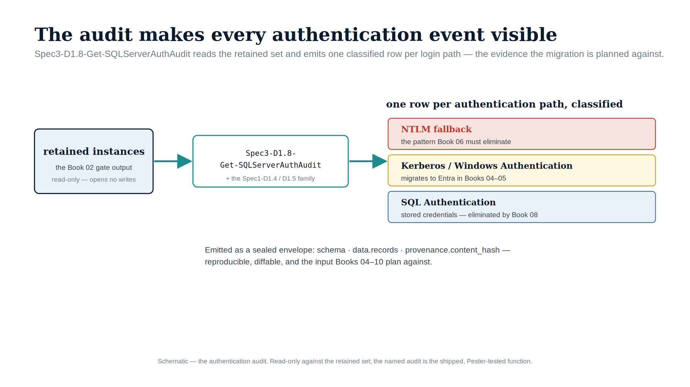

::: {.content-visible when-format="docx"}
# Implementation Book 03 — The Authentication Audit
:::

{#fig-impl-book03 fig-alt="A schematic on a white background. A navy 'retained instances' box (the Book 02 gate output) flows by teal arrow into a box labelled Spec3-D1.8-Get-SQLServerAuthAudit, which flows by teal arrow to three stacked output rows on the right: a red 'NTLM fallback' row, an amber 'Kerberos / Windows Authentication' row, and a blue 'SQL Authentication' row. A caption notes the output is a sealed envelope (schema · data.records · provenance.content_hash). Federal navy, teal, red, amber and blue palette; no photographs." width="90%"}

::: {.callout-tip}
## Download this book
**[Book_03.docx](Book_03.docx)** — this entire book as a single Word document, images included. Regenerated on every site deploy.
:::

::: {.callout-note}
This is the implementation companion to **narrative Book 03**. The narrative explains *why* you audit before you migrate; this book is *how* — the actual scripts, their parameters, and their output. Everything here is **read-only**: the audit changes nothing, so it is safe to run first and run often. (UIAO_135 §3.2, ADR-091, ADR-068)
:::

## Start here: the audit is the foundation

Every later step — consolidation, Arc enablement, login migration, NTLM elimination — depends on knowing what you actually have. The audit produces that inventory. Run it first, keep its output under version control, and re-run it after every change to measure progress.

The scripts live in [`tools/discovery/`](https://github.com/WhalerMike/uiao/tree/main/tools/discovery) as the `Spec*-D1.*` family (provenance: UIAO_136 Spec 1 and Spec 3, Phase 1; aligned to ADR-004). They are pure PowerShell, emit JSON + CSV, and require no write access to anything.

## The primary script — `Spec3-D1.8-Get-SQLServerAuthAudit.ps1`

Discovers SQL Server instances and audits their authentication configuration for Entra ID migration readiness.

### Prerequisites

- **ActiveDirectory** PowerShell module (RSAT) — for `MSSQLSvc` SPN discovery.
- **SqlServer** PowerShell module — *optional*, required only for the deep per-instance audit (`-QueryInstances`).
- Remote registry access for instance enumeration.
- SQL Server permissions on each instance **only if** `-QueryInstances` is set (login/config inventory).

### Parameters

| Parameter | Type | Default | Purpose |
|---|---|---|---|
| `-OutputPath` | string | `.\output` | Directory for JSON + CSV output |
| `-D5InputFile` | string | — | Path to the **Spec1-D1.5** SPN-inventory JSON, to extract `MSSQLSvc` SPNs |
| `-D1InputFile` | string | — | Path to the Spec3-D1.1 service-account scan JSON, for cross-reference |
| `-TargetServers` | string[] | — | Explicit server list to audit (otherwise auto-discovers) |
| `-DomainController` | string | — | Target a specific DC; auto-discovery if omitted |
| `-SearchBase` | string | — | Optional AD search base (DN) |
| `-TestConnectivity` | switch | off | Attempt a TCP connection to each discovered instance |
| `-QueryInstances` | switch | off | Connect to each instance via SqlClient to audit logins + config (**requires SQL permissions**) |

### Usage

```powershell
# 1. Discovery-only (SPN + service-account, no SQL connection) — safest first pass
./Spec3-D1.8-Get-SQLServerAuthAudit.ps1 -OutputPath .\output

# 2. Cross-referenced with the SPN inventory (run Spec1-D1.5 first)
./Spec3-D1.8-Get-SQLServerAuthAudit.ps1 `
    -D5InputFile .\output\Spec1-D1.5-KerberosSPNInventory.json `
    -OutputPath .\output

# 3. Deep audit — connects to each instance for login + config inventory
./Spec3-D1.8-Get-SQLServerAuthAudit.ps1 -QueryInstances -TestConnectivity -OutputPath .\output
```

### Output schema

Three artifacts under `-OutputPath`:

- **`*_SQLServerAuthAudit.json`** — `{ Metadata, Summary, InstanceAudits[] }`. Each `InstanceAudits` entry carries: `ServerName`, `InstanceName`, `Port`, `DiscoveryMethod`, `SPNRegistration`, `ServiceAccountName`, the `SQL*Account` service identities, `AuthenticationMode`, `SQLVersion`/`SQLVersionMajor`/`SQLEdition`, `TCPReachable`, **`EntraIDReady`**, **`EntraIDBlockers[]`**, `MigrationTarget`, `MigrationComplexity`, and the `SQLLogins` / `WindowsLogins` / `OrphanedLogins` / `LinkedServers` arrays.
- **`*_instances.csv`** — flattened per-instance inventory (auth mode, service accounts, login counts, orphaned logins, linked servers, readiness).
- **`*_logins.csv`** — per-login detail: `LoginName`, `Type`, `Disabled`, the `sa` flag, `PasswordLastSet`.

### Reading the result: migration readiness

The script computes `MigrationTarget` and `EntraIDBlockers` for you:

- **SQL 2022+ (v16+)** → *"Enable Entra ID auth via Azure Arc (ADR-004)"* — ready once Arc-enrolled (Book 04).
- **SQL 2019 and earlier** → *"Upgrade to SQL 2022 + Arc, then Entra ID auth"* — version is the gate (narrative Book 03 Category 3).
- **Blockers** flagged in `EntraIDBlockers`: mixed-mode authentication, an **enabled `sa` account**, orphaned logins, and linked servers. Each is a remediation item before cutover (logins → Book 05).

## The supporting discovery family

`Get-SQLServerAuthAudit` is most useful when fed by, and cross-referenced against, the rest of the Spec family. These are the ones that matter for SQL:

| Script | Spec | What it gives you | Used by |
|---|---|---|---|
| `Spec1-D1.5-Get-KerberosSPNInventory.ps1` | D1.5 | Every `MSSQLSvc` SPN, duplicates, orphans, per-service-class migration target | feeds D1.8 (`-D5InputFile`) and Book 06 |
| `Spec3-D1.7-Get-SPNCollisionReport.ps1` | D1.7 | SPN collisions that break Kerberos (→ NTLM fallback) | Book 06 |
| `Spec1-D1.4-Get-AuthenticationProtocolAudit.ps1` | D1.4 | Delegation (unconstrained/KCD/RBCD) + NTLM dependency indicators | Book 06 |
| `Spec3-D1.10-Get-CertBasedAuthAudit.ps1` | D1.10 | Certificate-mapped logins / smart-card auth touching SQL (narrative Book 10) | Book 10 |
| `Spec3-D1.12-New-ServiceAccountOwnerMatrix.ps1` | D1.12 | Owner-to-service-account matrix + migration waves (capstone) | program planning |

Run order for the SQL slice: **D1.5 → D1.7 → D1.8** (pass the D1.5 JSON into both D1.7 and D1.8 via `-D5InputFile`), then `D1.12` to assign owners and waves across everything.

## Failure modes

The script degrades rather than crashing — know what each state means:

- **ActiveDirectory module absent** → SPN discovery is skipped (instances still found via registry/`-TargetServers`); install RSAT for full coverage.
- **DC unreachable** → SPN cross-reference is empty; pass `-DomainController` to target a reachable one.
- **SQL connection fails** under `-QueryInstances` → that instance is recorded as **"Query Failed"** (login inventory blank) rather than aborting the run; check SQL permissions and firewall.
- **TCP timeout** under `-TestConnectivity` → `TCPReachable` is `Timeout` (3-second budget) vs `Yes`/`No`.

## Feeding CCM-BIR closure

The audit JSON is the raw input for the continuous-monitoring evidence the narrative's Book 09 describes: re-running it on a schedule turns "did we eliminate NTLM / mixed mode / the `sa` account" into a live, diffable artifact rather than a one-time claim. Wire the JSON into your CCM-BIR ingestion the same way the discovery pipeline feeds D2.1/D2.3.

## Safety

This entire book is read-only. The discovery-only invocation (example 1) touches no SQL instance at all; `-QueryInstances` opens read-only inventory queries. Nothing here changes a production security posture — that begins in Book 04 (Arc) and Book 05 (logins).

---

*Companion to [narrative Book 03](../sql-server-narrative/Book_03.qmd). Scripts: `tools/discovery/Spec3-D1.8`, `Spec1-D1.4/1.5`, `Spec3-D1.7/1.10/1.12`. Canon: UIAO_135 §3.2, UIAO_136 Spec 1/3, ADR-004, ADR-091.*
