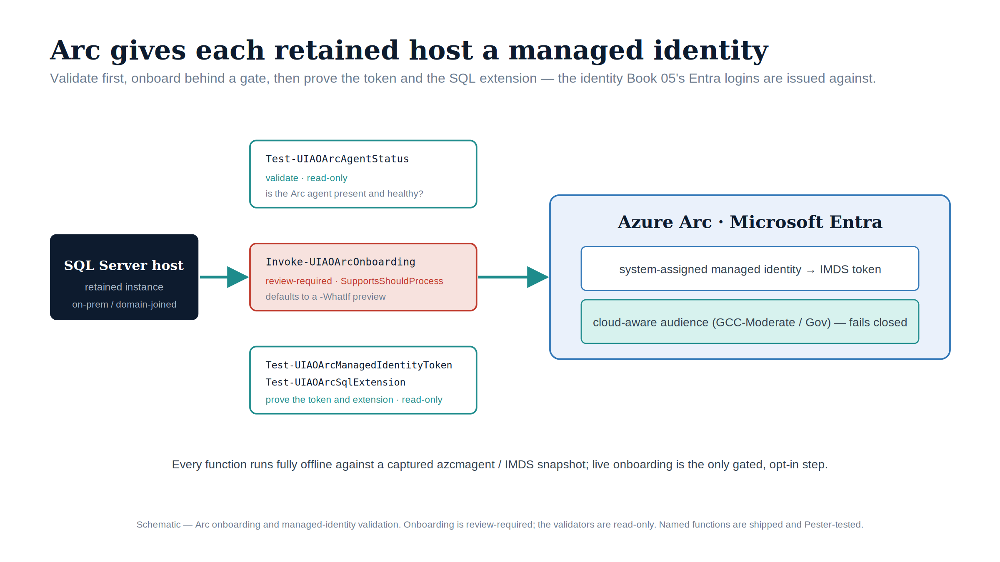

::: {.content-visible when-format="docx"}
# Implementation Book 04 — Arc Deployment & the Managed Identity
:::

{#fig-impl-book04 fig-alt="A schematic on a white background. A navy 'SQL Server host' box on the left connects by teal arrow to three stacked stages: Test-UIAOArcAgentStatus (validate, read-only), a red-bordered Invoke-UIAOArcOnboarding (review-required, SupportsShouldProcess, -WhatIf preview), and Test-UIAOArcManagedIdentityToken / Test-UIAOArcSqlExtension (prove, read-only). A teal arrow leads to an ice-blue 'Azure Arc · Microsoft Entra' panel containing 'system-assigned managed identity → IMDS token' and 'cloud-aware audience (GCC-Moderate / Gov) — fails closed'. Federal navy, teal, ice-blue and red palette; no photographs." width="90%"}

::: {.callout-tip}
## Download this book
**[Book_04.docx](Book_04.docx)** — this entire book as a single Word document, images included. Regenerated on every site deploy.
:::

::: {.callout-note}
Companion to **narrative Book 04**. The narrative explains why the Arc Connected Machine agent's system-assigned managed identity is the credential-free replacement for AD-anchored service accounts; this book is the deployment runbook. (ADR-002, ADR-004, UIAO_135 Transformation #7)
:::

::: {.callout-important}
## Automation status — shipped, review-required for the mutating step
The Arc onboarding and validation helpers are now **shipped** in the `UIAOSqlServerMigration` module (`tools/powershell/UIAOSqlServerMigration/`). The validation helpers are read-only and run directly; the onboarding wrapper is idempotent and **review-required** — it defaults to planning the `azcmagent connect` command (`-WhatIf`) and executes only on explicit confirmation in a change window. The exact commands, validation steps, and rollback below remain the verified pattern; each step now also points to the function that automates it.
:::

## Why Arc comes before login migration

An on-prem SQL host has no cloud identity of its own. The Arc Connected Machine agent gives it a **system-assigned managed identity** — an identity in the tenant with no stored secret — which is the credential the engine uses to validate Entra ID tokens. No Arc, no managed identity; no managed identity, no Entra login (Book 05). Arc is therefore a prerequisite, not an enhancement.

## Prerequisites (GCC-Moderate)

- A supported Windows Server host running the SQL Server instance(s) from the Book 03 audit (`MigrationTarget` = SQL 2022+; older versions upgrade first).
- Outbound egress to the **Azure Government** Arc service endpoints, via the environment's proxy. In GCC-Moderate this is brokered through the program's egress proxy rather than open internet.
- Onboarding rights in the target Azure Government subscription/resource group (a service principal or onboarding token).
- Resolver and clock: working DNS to the government cloud endpoints and tight time sync (token validation is time-sensitive).

## Step 1 — Enroll the host

```powershell
# Connect the host to Azure Arc in the Government cloud, through the egress proxy.
azcmagent connect `
    --resource-group "rg-sql-arc" `
    --tenant-id "<tenant-guid>" `
    --location "usgovvirginia" `
    --subscription-id "<subscription-guid>" `
    --cloud "AzureUSGovernment" `
    --proxy-url $env:HTTPS_PROXY   # the program's configured egress proxy

azcmagent show   # expect: Agent Status = Connected
```

**Available** — `Invoke-UIAOArcOnboarding` (`tools/powershell/UIAOSqlServerMigration/`) wraps this idempotently: it skips when the agent already reports `Connected`, composes the exact `azcmagent connect` command from its parameters (no embedded secrets), and emits a sealed onboarding-plan evidence record. It defaults to planning only; mutating action requires `-Execute` plus the `SupportsShouldProcess` confirmation, so `-WhatIf` produces the reviewable command without touching the host. The idempotency check is `Test-UIAOArcAgentStatus`, which validates `azcmagent show` against the expected Government-cloud and returns a sealed pass/fail record. (Canon: UIAO_135 Transformation #7; ADR-002, ADR-004.)

## Step 2 — Validate the managed-identity token (IMDS)

The agent exposes a local Instance Metadata Service. Confirm the host can mint a managed-identity token **and that its audience is correct** — this is the single most common failure point.

```powershell
$imds = "http://169.254.169.254/metadata/identity/oauth2/token?api-version=2020-06-01"
# Request a token for the resource you will authenticate to (the SQL/Graph audience), not a generic one.
$resp = Invoke-RestMethod -Uri "$imds&resource=https://database.usgovcloudapi.net/" `
    -Headers @{ Metadata = "true" }
# Decode the JWT payload and check 'aud' matches the intended resource.
$payload = $resp.access_token.Split('.')[1]
$payload += '=' * ((4 - $payload.Length % 4) % 4)
[Text.Encoding]::UTF8.GetString([Convert]::FromBase64String($payload)) | ConvertFrom-Json |
    Select-Object aud, iss, exp
```

A token minted for the wrong audience is rejected at use time — the management-plane and data-plane audiences are distinct, and a token for one is refused by the other. (This mirrors the Graph-vs-ARM audience split documented in `AGENTS.md`.)

**Available** — `Test-UIAOArcManagedIdentityToken` (`tools/powershell/UIAOSqlServerMigration/`) automates exactly this check: it decodes the token (claims-inspection only, no signature trust), asserts `aud` matches the cloud-correct SQL data-plane audience and `exp` is in the future, and returns a sealed pass/fail record. Read-only — it accepts a captured IMDS response or queries the local Arc IMDS live.

## Step 3 — Install the Azure extension for SQL Server

The Azure extension for SQL Server on the Arc-enabled host is what surfaces the instance to the identity plane and enables Entra ID authentication on SQL 2022+.

```powershell
# Install the SQL Server extension onto the Arc-enabled machine (Government cloud).
az connectedmachine extension create `
    --machine-name $env:COMPUTERNAME `
    --resource-group "rg-sql-arc" `
    --name "WindowsAgent.SqlServer" `
    --type "WindowsAgent.SqlServer" `
    --publisher "Microsoft.AzureData"
```

**Available** — `Test-UIAOArcSqlExtension` (`tools/powershell/UIAOSqlServerMigration/`) confirms the `WindowsAgent.SqlServer` extension provisioning state is `Succeeded` and surfaces the Entra-auth-capable signal, returning a sealed pass/fail record. Read-only — it validates either a captured extension document or a live `az connectedmachine extension show`. The companion `Test-UIAOArcManagedIdentityToken` validates the IMDS token's `aud`/`exp` against the data-plane audience (Step 2). (Canon: UIAO_135 Transformation #7; ADR-002, ADR-004.)

## Verification checklist

- `azcmagent show` → **Connected**, with a resource ID in the expected Government-cloud subscription.
- IMDS returns a token whose `aud` equals the intended data-plane resource and whose `exp` is in the future.
- The SQL Server extension shows **Succeeded** provisioning state.
- A test Entra principal can authenticate to the instance (the smoke test for Book 05).

## Failure modes

- **Egress blocked** → `azcmagent connect` hangs or fails at the registration endpoint; confirm the proxy allows the Government-cloud Arc endpoints.
- **Audience mismatch** → token mints fine but SQL refuses it; re-request with the correct data-plane `resource`.
- **Clock skew** → token `exp`/`nbf` validation fails; fix time sync first.
- **Extension stuck provisioning** → check the agent log; a half-installed extension should be removed and reinstalled, not edited in place.

## Rollback

Arc enrollment is reversible: `azcmagent disconnect` removes the machine resource and the managed identity. Because nothing in SQL depends on the managed identity until Book 05 creates Entra logins, disconnecting here has no effect on existing Windows-authenticated connections.

---

*Companion to [narrative Book 04](../sql-server-narrative/Book_04.qmd). Shipped automation: `tools/powershell/UIAOSqlServerMigration/` (`Test-UIAOArcAgentStatus`, `Test-UIAOArcManagedIdentityToken`, `Test-UIAOArcSqlExtension`, `Invoke-UIAOArcOnboarding`) — validation read-only; onboarding review-required (`-WhatIf` by default). Canon: ADR-002, ADR-004, UIAO_135 Transformation #7.*
