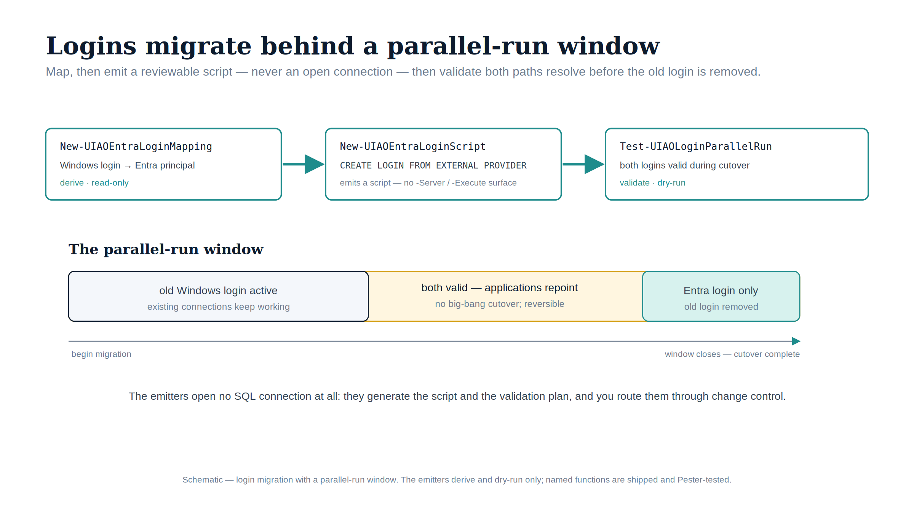

::: {.content-visible when-format="docx"}
# Implementation Book 05 — Login Migration & Parallel-Run Validation
:::

{#fig-impl-book05 fig-alt="A schematic on a white background. Three stages flow left to right under teal arrows: New-UIAOEntraLoginMapping (derive, read-only), New-UIAOEntraLoginScript (emits a CREATE LOGIN FROM EXTERNAL PROVIDER script, no -Server/-Execute surface), and Test-UIAOLoginParallelRun (validate, dry-run). Below, a horizontal timeline labelled 'The parallel-run window' shows three segments: 'old Windows login active', an amber 'both valid — applications repoint' overlap, and a teal 'Entra login only — old login removed'. Federal navy, teal and amber palette; no photographs." width="100%"}

::: {.callout-tip}
## Download this book
**[Book_05.docx](Book_05.docx)** — this entire book as a single Word document, images included. Regenerated on every site deploy.
:::

::: {.callout-note}
Companion to **narrative Book 05** and **ADR-091 §1** (parallel-run, consolidation-gated). The narrative explains why migration is parallel-run rather than big-bang; this book is the T-SQL and the validation harness that make it safe. (ADR-091, UIAO_135 §3.2)
:::

::: {.callout-important}
## Automation status + production safety
The login-mapping and script-generation steps are now **shipped** in the `UIAOSqlServerMigration` module (`tools/powershell/UIAOSqlServerMigration/`), and they are deliberately **non-executing**: `New-UIAOEntraLoginMapping` derives the mapping and `New-UIAOEntraLoginScript` writes a reviewable `.sql` file — neither opens a SQL connection. Because the generated T-SQL runs `CREATE LOGIN` / `ALTER` against production instances, every step remains **review-required**: generate statements in dry-run, review them, execute in a change window, and **never drop a Windows login until the Entra login is validated in parallel** (which `Test-UIAOLoginParallelRun` evaluates against the ADR-091 §1 exit criteria).
:::

## Preconditions

Do not start until, per the earlier books:

1. The instance is **SQL 2022+**, **Arc-enrolled**, with the Azure extension installed and a validated managed-identity token (Book 04).
2. The estate has been **consolidated** — you are migrating only instances that survive (narrative Book 02; ADR-091 §1 consolidation gate).
3. You have the Book 03 `*_logins.csv` for the instance: the `WindowsLogins` you must reproduce as Entra logins, plus the `OrphanedLogins` and the `sa` state to remediate.

## Step 1 — Generate the login statements (dry-run first)

Map each Windows login (or, preferably, the Entra **group** that should replace a set of them) to an external-provider login. Group-based logins are the target — they remove per-user churn:

```sql
-- Per-group (preferred): one Entra group login replaces many individual logins
IF NOT EXISTS (SELECT 1 FROM sys.server_principals WHERE name = N'sql-app-readers')
    CREATE LOGIN [sql-app-readers] FROM EXTERNAL PROVIDER;

-- Per-user (only where a group is not appropriate)
IF NOT EXISTS (SELECT 1 FROM sys.server_principals WHERE name = N'jdoe@contoso.gov')
    CREATE LOGIN [jdoe@contoso.gov] FROM EXTERNAL PROVIDER;
```

Generate these idempotently from the audit CSV rather than by hand:

```powershell
# Dry-run: emit reviewable T-SQL from the Book 03 login inventory. Writes a .sql file; executes nothing.
Import-Csv .\output\*_logins.csv |
    Where-Object { $_.Type -eq 'WINDOWS_LOGIN' -and $_.Disabled -eq 'False' } |
    ForEach-Object {
        $name = $_.EntraPrincipal   # mapped Entra UPN/group for the Windows login
        "IF NOT EXISTS (SELECT 1 FROM sys.server_principals WHERE name = N'$name')`n" +
        "    CREATE LOGIN [$name] FROM EXTERNAL PROVIDER;`nGO"
    } | Set-Content .\output\create-entra-logins.sql
```

**Available** — the Windows-login → Entra-principal mapping (the `EntraPrincipal` column) is the one piece of real judgment here, and `New-UIAOEntraLoginMapping` (`tools/powershell/UIAOSqlServerMigration/`) codifies it from the `UIAOIdentityAssessment` reconciliation (UIAO_181) rather than from a hand-built spreadsheet: it joins the Book 03 login audit to the `IdentityReconciliation` envelope, maps only cleanly **matched** principals automatically, prefers a supplied Entra **group** map (group-based logins are the target), and flags every unresolved login for review instead of silently dropping it. `New-UIAOEntraLoginScript` then turns that mapping into the idempotent `CREATE LOGIN ... FROM EXTERNAL PROVIDER` `.sql` file shown above — dry-run only, no SQL connection, with unresolved entries emitted as commented-out TODOs. (Canon: ADR-091, UIAO_181, UIAO_135 §3.2.)

## Step 2 — Map database users to the new logins

After the server-login exists, repoint each database user, preserving permissions:

```sql
USE [AppDb];
ALTER USER [jdoe] WITH LOGIN = [jdoe@contoso.gov];   -- re-link existing user to the Entra login
-- or, for a new group-based user:
-- CREATE USER [sql-app-readers] FOR LOGIN [sql-app-readers];
```

## Step 3 — Parallel-run (the heart of it)

**Keep the Windows logins enabled** alongside the new Entra logins. Both work; nothing is removed. This is the parallel-run window ADR-091 §1 requires — it makes cutover reversible.

Observe which authentication scheme connections actually use, over a **30-day** window:

```sql
-- Live: how are sessions authenticating right now?
SELECT  s.login_name,
        c.auth_scheme,                       -- KERBEROS | NTLM | SQL | AAD
        COUNT(*) AS sessions
FROM    sys.dm_exec_connections AS c
JOIN    sys.dm_exec_sessions    AS s ON s.session_id = c.session_id
GROUP BY s.login_name, c.auth_scheme
ORDER BY sessions DESC;
```

Stand up an Extended Events session (or SQL Audit) to capture `login` events for the duration so you have a durable 30-day record, not just a point-in-time snapshot. The exit criteria for the window:

- Every application and job that connected via a Windows login now also appears connecting via its Entra login (`auth_scheme = AAD`).
- **No** `NTLM` rows remain for the instance (cross-check Book 06).
- No connection is *still* arriving only on the legacy Windows login.

**Available** — `Test-UIAOLoginParallelRun` (`tools/powershell/UIAOSqlServerMigration/`) evaluates a captured set of these observations against the three exit criteria and returns a sealed `cutover_ready` verdict (per login: which auth schemes were seen, whether AAD is among them, whether the login still arrives only on a legacy scheme). It is read-only — it reports readiness; it never disables or drops a login.

## Step 4 — Cutover

Only after the observation window's exit criteria are met:

```sql
-- Disable (do NOT drop) the superseded Windows login
ALTER LOGIN [CONTOSO\jdoe] DISABLE;
```

Disable, observe for a further short tail, then — and only then — consider dropping. The narrative's "the date is a backstop, the migration must already be complete" applies here: the 2027-04-01 NTLM block (Book 06) assumes this cutover is finished well before it.

## Rollback

Because the Windows logins are **disabled, not dropped**, rollback is immediate:

```sql
ALTER LOGIN [CONTOSO\jdoe] ENABLE;
```

This is why nothing is dropped during migration — the cost of keeping a disabled login is trivial against the value of an instant rollback path.

## The `sa` account

If Book 03 flagged `sa` as enabled (`EntraIDBlockers`), it is remediated here, independently of user migration: disable it, and rename if your standard requires it. It is never a migration target — it is a finding to close.

```sql
ALTER LOGIN [sa] DISABLE;
```

---

*Companion to [narrative Book 05](../sql-server-narrative/Book_05.qmd) and ADR-091 §1. Shipped automation: `tools/powershell/UIAOSqlServerMigration/` (`New-UIAOEntraLoginMapping` codifies the mapping from UIAO_181, `New-UIAOEntraLoginScript` generates dry-run T-SQL, `Test-UIAOLoginParallelRun` evaluates the cutover exit criteria) — review-required; the generated T-SQL executes nothing on generation. Canon: ADR-091, UIAO_181, UIAO_135 §3.2.*
